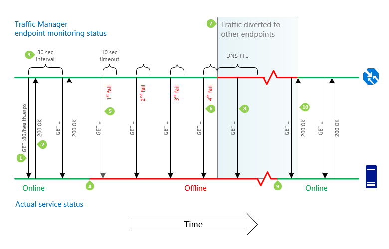

# 流量管理器终结点监视

Azure 流量管理器包括内置的终结点监视和终结点自动故障转移功能。 此功能可以让你更好地交付高可用性应用程序，以便应对终结点故障（包括 Azure 区域故障）。

## 配置终结点监视

若要配置终结点监视，必须在流量管理器配置文件中指定以下设置：

* **协议**。 选择 HTTP、HTTPS 或 TCP 作为协议，流量管理器在探测终结点以检查其运行状况时，将使用该协议。 HTTPS 监视并不验证 SSL 证书是否有效，它只检查是否有证书。
* **端口**。 选择用于请求的端口。
* **路径**。 此配置设置仅对 HTTP 和 HTTPS 协议有效，使用这些协议时，需要指定路径。 为 TCP 监视协议提供此设置会导致出错。 对于 HTTP 和 HTTPS 协议，指定监视功能要访问的网页或文件的相对路径和名称。 正斜杠 (/) 是相对路径的有效条目。 此值表示文件位于根目录中（默认设置）。
* **自定义标头设置**：此配置设置用于将特定的 HTTP 标头添加到运行状况检查，以便流量管理器将该检查发送到配置文件中的终结点。 自定义标头可以在配置文件级别指定，使之适用于该配置文件中的所有终结点，以及/或者在终结点级别指定，使之仅适用于该终结点。 可以使用自定义标头进行运行状况检查，通过指定主机标头，将多租户环境中的终结点正确路由到目标。 也可使用此设置来添加唯一标头，以便标识源自流量管理器的 HTTP(S) 请求并对其进行不同的处理。 最多可以指定八个标头/值对（用逗号分隔）。 例如，“header1:value1,header2:value2”。 
* **预期的状态代码范围**：可以通过此设置以 200-299、301-301 格式指定多个成功代码范围。 如果这些状态代码是在启动运行状况检查时作为响应从终结点接收的，则流量管理器会将这些终结点标记为正常。 最多可以指定 8 个状态代码范围。 此设置仅适用于 HTTP 和 HTTPS 协议以及所有终结点。 此设置位于流量管理器配置文件级别。默认情况下，将值 200 定义为成功状态代码。
* **探测间隔**。 此值指定在流量管理器探测代理中检查终结点运行状况的频率。 可以在此处指定两个值：30 秒（正常探测）和 10 秒（快速探测）。 如果未提供任何值，配置文件将设置为默认值 30 秒。 请访问[流量管理器定价](https://www.azure.cn/pricing/details/traffic-manager/)页，了解有关快速探测定价的详细信息。
* **容许的失败次数**。 此值指定在将终结点标记为不正常之前，流量管理器探测代理容许的失败次数。 其值的范围为 0 到 9。 0 值表示发生监视失败一次就可能会导致将该终结点标记为不正常。 如果未指定任何值，则使用默认值 3。
* **探测超时**。 此属性指定在将运行状况检查探测数据发送到终结点时，将该项检查视为失败之前，流量管理器探测代理应该等待的时间。 如果探测间隔设置为 30 秒，则可将超时值设置为 5 - 10 秒。 如果未指定任何值，将使用默认值 10 秒。 如果探测间隔设置为 10 秒，则可将超时值设置为 5 - 9 秒。 如果未指定任何超时值，使用默认值 9 秒。

    

    **图 3：流量管理器终结点监视**

## 终结点监视功能的工作原理

如果监视协议设置为 HTTP 或 HTTPS，流量管理器探测代理将使用指定的协议、端口和相对路径向终结点发出 GET 请求。 如果收到返回的 200-OK 响应，或者在“预期的状态代码 \*范围”  中配置的任何响应，则认为该终结点正常。 如果响应是一个不同的值，或者在指定的超时期限内未收到的任何响应，则流量管理器探测代理会根据“容许的失败次数”设置重试（如果此设置为 0，则不执行重试）。 如果连续失败次数超过“容许的失败次数”设置，则将该终结点标记为不正常。 

如果监视协议为 TCP，流量管理器探测代理将使用指定的端口发起 TCP 连接请求。 如果终结点响应了请求并提供了用于建立连接的响应，则将该运行状况检查标记为成功，并且流量管理器探测代理会重置 TCP 连接。 如果响应是一个不同的值，或者在指定的超时期限内未收到的任何响应，则流量管理器探测代理会根据“容许的失败次数”设置重试（如果此设置为 0，则不执行重试）。 如果连续失败次数超过“容许的失败次数”设置，则将该终结点标记为不正常。

在上述所有情况下，流量管理器都会从多个位置探测，并且每个区域将执行连续失败判定。 这也意味着，终结点将以高于“探测间隔”设置的频率从流量管理器接收运行状况探测数据。

>[!NOTE]
>对于 HTTP 或 HTTPS 监视协议，在终结点端上采取的一种常见做法是在应用程序中实施一个自定义页 - 例如 /health.aspx。 为监视使用此路径可以执行应用程序特定的检查，例如，检查性能计数器或者验证数据库可用性。 页面根据这些自定义检查返回相应的 HTTP 状态代码。

流量管理器配置文件中的所有终结点共享监视设置。 如果需要对不同的终结点使用不同的监视设置，可以创建[嵌套式流量管理器配置文件](traffic-manager-nested-profiles.md#example-5-per-endpoint-monitoring-settings)。

## 终结点和配置文件状态

可以启用和禁用流量管理器配置文件和终结点。 不过，也可以通过流量管理器的自动设置和过程来更改终结点状态。

### 终结点状态

可以启用或禁用特定的终结点。 可能仍处于正常状态的基础服务不受影响。 更改终结点状态可以控制流量管理器配置文件中终结点的可用性。 当某个终结点的状态为已禁用时，流量管理器不会检查其运行状况，该终结点不会包括在 DNS 响应中。

### 配置文件状态

使用配置文件状态设置可以启用或禁用特定的配置文件。 终结点状态影响单个终结点，而配置文件状态会影响整个配置文件（包括所有终结点）。 禁用某个配置文件时，不会检查终结点的运行状况，并且不会在 DNS 响应中包括任何终结点。 会针对 DNS 查询返回 [NXDOMAIN](https://tools.ietf.org/html/rfc2308) 响应代码。

### 终结点监视器状态

终结点监视器状态是流量管理器生成的值，显示终结点的状态。 不能手动更改此设置。 终结点监视状态是终结点监视结果与所配置端点状态的组合。 下表显示了终结点监视状态的可能值：

| 配置文件状态 | 终结点状态 | 终结点监视器状态 | 注释 |
| --- | --- | --- | --- |
| 已禁用 |Enabled |非活动 |配置文件已禁用。 尽管终结点状态为“已启用”，但配置文件状态（“已禁用”）优先。 不会监视已禁用配置文件中的终结点。 会针对 DNS 查询返回 NXDOMAIN 响应代码。 |
| &lt;任意&gt; |已禁用 |已禁用 |终结点已禁用。 不会监视已禁用的终结点。 该终结点不会包括在 DNS 响应中，因此也不会接收流量。 |
| Enabled |Enabled |联机 |终结点受到监视，处于正常状态。 该终结点会包括在 DNS 响应中，并且可以接收流量。 |
| Enabled |Enabled |已降级 |监视运行状况检查的终结点将要发生故障。 该终结点不会包括在 DNS 响应中，也不会接收流量。  一种例外的情况是，如果所有终结点已降级，则这些终结点全部被视为在查询响应中返回。 |
| Enabled |Enabled |正在检查终结点 |终结点受监视，但是，尚未收到首个探测的结果。 “正在检查终结点”是一种临时状态，在配置文件中添加或启用终结点后，通常会立即出现这种状态。 处于此状态的终结点会包括在 DNS 响应中，并且可以接收流量。 |
| Enabled |Enabled |已停止 |终结点指向的 Web 应用未运行。 检查 Web 应用设置。 如果终结点的类型为嵌套终结点，并且子配置文件已禁用或处于非活动状态，则也可能会发生这种情况。  不会监视“已停止”状态的终结点。 该终结点不会包括在 DNS 响应中，也不会接收流量。 一种例外的情况是，如果所有终结点已降级，则这些终结点全部被视为在查询响应中返回。 |

有关如何为嵌套式终结点计算终结点监视状态的详细信息，请参阅[嵌套式流量管理器配置文件](traffic-manager-nested-profiles.md)。

>[!NOTE]
> 如果 Web 应用并非在标准层或更高层中运行，应用服务上的监视器状态可能会变为“停止的终结点”。 有关详细信息，请参阅[流量管理器与应用服务集成](/app-service/web-sites-traffic-manager)。

### 配置文件监视器状态

配置文件监视状态是配置的配置文件状态与所有终结点的终结点监视状态值的组合。 下表描述了可能的值：

| 配置文件状态（根据配置） | 终结点监视器状态 | 配置文件监视器状态 | 注释 |
| --- | --- | --- | --- |
| 已禁用 |&lt;任意&gt; 或包含未定义终结点的配置文件。 |已禁用 |配置文件已禁用。 |
| Enabled |至少一个终结点的状态为“已降级”。 |已降级 |查看各终结点状态值，确定哪些终结点需要进一步的关注。 |
| Enabled |至少一个终结点的状态为“联机”。 没有任何终结点的状态为“已降级”。 |联机 |服务正在接受流量。 无需进一步执行操作。 |
| Enabled |至少一个终结点的状态为“正在检查终结点”。 没有任何终结点为“联机”或“已降级”状态。 |正在检查终结点 |创建或启用配置文件时，将出现这种过渡状态。 正在首次检查终结点的运行状况。 |
| Enabled |配置文件中所有终结点的状态为“已禁用”或“已停止”，或者配置文件中没有定义终结点。 |非活动 |没有任何终结点处于活动状态，但是配置文件的状态仍旧是“已启用”。 |

## 终结点故障转移和恢复

流量管理器定期检查每个终结点（包括不正常的终结点）的运行状况。 当终结点恢复正常时，流量管理器可以检测到这种状态，并将其重新加入轮转列表。

发生以下任一事件时，终结点会变得不正常：

- 如果监视协议为 HTTP 或 HTTPS：
    - 收到非 200 响应，或者收到的响应不包括在“预期的状态代码范围”设置中指定的状态范围（包括其他 2xx 代码，或者 301/302 重定向）。 
- 如果监视协议为 TCP： 
    - 收到非 ACK 或 SYN-ACK 响应，以响应流量管理器发送的用于尝试建立连接的 SYN 请求。
- 超时。 
- 导致无法访问终结点的其他任何连接问题。

有关针对失败的检查进行故障排除的详细信息，请参阅[排查 Azure 流量管理器中的降级状态](traffic-manager-troubleshooting-degraded.md)。 

下图中的时间线详细描述了流量管理器终结点的监视过程，该终结点具有以下设置：监视协议为 HTTP，探测间隔为 30 秒，容许的失败次数为 3，超时值为 10 秒，DNS TTL 为 30 秒。

**图：流量管理器终结点故障转移和恢复顺序**

1. **GET**。 对于每个终结点，流量管理器监视系统将对监视设置中指定的路径执行 GET 请求。
2. **“200 正常”或由流量管理器配置文件监视设置指定的自定义代码范围**。 监视系统预期一条“‘200 正常’或由流量管理器配置文件监视设置指定的自定义代码范围”消息会在 10 秒钟内返回。 如果收到该响应，该系统会认为云服务可用。
3. **每隔 30 秒检查**。 终结点运行状况检查每隔 30 秒重复一次。
4. **服务不可用**。 该服务变得不可用。 在下次执行运行状况检查前，流量管理器不会知道该服务是否可用。
5. **尝试访问监视路径**。 监视系统执行了 GET 请求，但没有在 10 秒的超时期间内收到响应（也可能收到的是非 200 响应）。 然后又尝试了三次，每隔 30 秒一次。 如果其中一次尝试成功，尝试次数就会重置。
6. **状态设置为“已降级”** 。 第四次连续失败后，监视系统将不可用终结点的状态标记为“已降级”。
7. **流量转移到其他终结点**。 流量管理器 DNS 名称服务器进行更新，流量管理器不再返回终结点来响应 DNS 查询。 新连接将定向到其他可用终结点。 不过，包含此终结点的 DNS 响应可能仍由递归 DNS 服务器和 DNS 客户端缓存。 在 DNS 缓存过期之前，客户端一直使用该终结点。 DNS 缓存过期后，客户端将发出新的 DNS 查询并定向到其他终结点。 缓存持续时间由流量管理器配置文件中的 TTL 设置控制，例如，可以将其设置为 30 秒。
8. **继续进行运行状况检查**。 在终结点的状态为“已降级”后，流量管理器会继续检查该终结点的运行状况。 当终结点恢复正常时，流量管理器可检测到这种状态。
9. **服务重新联机**。 该服务变得可用。 终结点会在流量管理器中始终保持“已降级”状态，直至监视系统执行下一次运行状况检查。
10. **继续将流量定向到服务**。 流量管理器发送 GET 请求，并收到“200 正常”状态响应。 服务已恢复正常状态。 流量管理器名称服务器进行更新，并开始在 DNS 响应中分发服务的 DNS 名称。 当缓存的 DNS 响应（返回其他终结点）到期时，以及现有的到其他终结点的连接终止时，流量返回到该终结点。

    > [!NOTE]
    > 由于流量管理器是在 DNS 级别工作的，因此不可能影响任何终结点的现有连接。 在终结点之间引导流量时（不管是通过更改配置文件设置来进行，还是在故障转移或故障回复期间进行），流量管理器都会将新连接引导到可用的终结点。 不过，其他终结点可能仍会通过现有连接继续接收流量，直至相关会话被终止。 若要耗尽现有连接的流量，应通过应用程序来限制适用于每个终结点的会话持续时间。

## 流量路由方法

当某个终结点处于“已降级”状态时，不再会在 DNS 查询的响应中返回该终结点。 而是选择一个替代终结点并将其返回。 配置文件中配置的流量路由方法确定如何选择替代的终结点。

* **优先级**。 终结点构成一个采用优先级的列表。 将始终返回列表中第一个可用的终结点。 如果终结点状态为“已降级”，则返回下一个可用的终结点。
* **加权**。 根据分配的权重以及其他可用终结点的权重随机选择任何可用的终结点。
* **性能**。 返回最靠近最终用户的终结点。 如果终结点不可用，流量管理器会将流量转移给下一个最靠近 Azure 区域的终结点。 可以使用[嵌套式流量管理器配置文件](traffic-manager-nested-profiles.md#example-4-controlling-performance-traffic-routing-between-multiple-endpoints-in-the-same-region)针对性能流量路由来配置替代故障转移计划。
* **地理**。 返回基于查询请求 IP 映射的、为地理位置提供服务的终结点。 如果该终结点不可用，则不会选择另一个要故障转移到的终结点，因为一个地理位置只能映射到配置文件中的一个终结点（[常见问题解答](traffic-manager-FAQs.md#traffic-manager-geographic-traffic-routing-method)中提供了更多详细信息）。 我们建议客户在使用地理路由时，使用包含多个终结点的嵌套式流量管理器配置文件作为配置文件的终结点，这是一种最佳做法。
* **MultiValue**：返回多个映射到 IPv4/IPv6 地址的终结点。 收到此配置文件的查询时，系统会根据指定的“响应中的最大记录数”值返回正常终结点。  响应的默认数量为两个终结点。
* **子网**：返回映射到一组 IP 地址范围的终结点。 从该 IP 地址收到请求时，返回的终结点是针对该 IP 地址映射的终结点。 

有关详细信息，请参阅[流量管理器流量路由方法](traffic-manager-routing-methods.md)。

> [!NOTE]
> 当所有符合条件的终结点处于降级状态时，正常的流量路由行为会发生一种例外情况。 流量管理器“尽最大努力”尝试， *其响应就好像所有处于“已降级”状态的终结点实际上处于联机状态一样*。 这种行为要优于替代方法，后者不会在 DNS 响应中返回任何终结点。 已禁用或已停止的终结点不受监视，因此，认为它们不符合接收流量的条件。
>
> 这种状态通常是服务配置不当造成的，例如：
>
> * 某个访问控制列表 (ACL) 正在阻止流量管理器运行状况检查。
> * 流量管理器配置文件中的监视端口或协议配置不当。
>
> 此行为的一个结果是，即使流量管理器运行状况检查没有正确进行配置，但从流量路由的角度来看，流量管理器似乎也运行正常。  但在这种情况下，不能发生会影响应用程序总体可用性的终结点故障转移。 必须检查配置文件是否显示“联机”状态而不是“已降级”状态。 状态为“联机”表示流量管理器运行状况检查按预期进行。

有关针对失败的运行状况检查进行故障排除的详细信息，请参阅 [Azure 流量管理器上的降级状态故障排除](traffic-manager-troubleshooting-degraded.md)。

## 常见问题

* [流量管理器能否灵活应对 Azure 区域故障？](/traffic-manager/traffic-manager-faqs#is-traffic-manager-resilient-to-azure-region-failures)

* [选择资源组位置会如何影响流量管理器？](/traffic-manager/traffic-manager-faqs#how-does-the-choice-of-resource-group-location-affect-traffic-manager)

* [如何确定每个终结点的当前运行状况？](/traffic-manager/traffic-manager-faqs#how-do-i-determine-the-current-health-of-each-endpoint)

* [能否监视 HTTPS 终结点？](/traffic-manager/traffic-manager-faqs#can-i-monitor-https-endpoints)

* [添加终结点时是使用 IP 地址还是 DNS 名称？](/traffic-manager/traffic-manager-faqs#do-i-use-an-ip-address-or-a-dns-name-when-adding-an-endpoint)

* [添加终结点时可以使用哪些类型的 IP 地址？](/traffic-manager/traffic-manager-faqs#what-types-of-ip-addresses-can-i-use-when-adding-an-endpoint)

* [可以在单个配置文件中使用不同的终结点寻址类型吗？](/traffic-manager/traffic-manager-faqs#can-i-use-different-endpoint-addressing-types-within-a-single-profile)

* [当传入查询的记录类型不同于与终结点寻址类型关联的记录类型时，会出现什么情况？](/traffic-manager/traffic-manager-faqs#what-happens-when-an-incoming-querys-record-type-is-different-from-the-record-type-associated-with-the-addressing-type-of-the-endpoints)

* [可以在嵌套配置文件中使用终结点采用 IPv4/IPv6 地址的配置文件吗？](/traffic-manager/traffic-manager-faqs#can-i-use-a-profile-with-ipv4--ipv6-addressed-endpoints-in-a-nested-profile)

* [我在流量管理器配置文件中停止了 Web 应用程序终结点，但即使重启后，也未收到任何流量。如何解决此问题？](/traffic-manager/traffic-manager-faqs#i-stopped-an-web-application-endpoint-in-my-traffic-manager-profile-but-i-am-not-receiving-any-traffic-even-after-i-restarted-it-how-can-i-fix-this)

* [是否即使应用程序不支持 HTTP 或 HTTPS，我也可以使用流量管理器？](/traffic-manager/traffic-manager-faqs#can-i-use-traffic-manager-even-if-my-application-does-not-have-support-for-http-or-https)

* [使用 TCP 监视时，需要终结点发出的哪些特定响应？](/traffic-manager/traffic-manager-faqs#what-specific-responses-are-required-from-the-endpoint-when-using-tcp-monitoring)

* [流量管理器将用户从运行不正常的终结点中移出的速度有多快？](/traffic-manager/traffic-manager-faqs#how-fast-does-traffic-manager-move-my-users-away-from-an-unhealthy-endpoint)

* [如何在配置文件中为不同的终结点指定不同的监视设置？](/traffic-manager/traffic-manager-faqs#how-can-i-specify-different-monitoring-settings-for-different-endpoints-in-a-profile)

* [如何将 HTTP 标头分配给终结点的流量管理器运行状况检查？](/traffic-manager/traffic-manager-faqs#how-can-i-assign-http-headers-to-the-traffic-manager-health-checks-to-my-endpoints)

* [终结点运行状况检查使用什么主机头？](/traffic-manager/traffic-manager-faqs#what-host-header-do-endpoint-health-checks-use)

* [运行状况检查从哪些 IP 地址发起？](/traffic-manager/traffic-manager-faqs#what-are-the-ip-addresses-from-which-the-health-checks-originate)

* [流量管理器预期会对终结点执行多少次运行状况检查？](/traffic-manager/traffic-manager-faqs#how-many-health-checks-to-my-endpoint-can-i-expect-from-traffic-manager)

* [如果我的某个终结点发生故障，我如何得到通知？](/traffic-manager/traffic-manager-faqs#how-can-i-get-notified-if-one-of-my-endpoints-goes-down)

## 后续步骤

了解[流量管理器的工作原理](traffic-manager-how-it-works.md)

详细了解流量管理器支持的[流量路由方法](traffic-manager-routing-methods.md)

了解如何[创建流量管理器配置文件](traffic-manager-manage-profiles.md)

在流量管理器终结点上[排查降级状态](traffic-manager-troubleshooting-degraded.md)

<!--Update_Description: update meta properties, wording update -->