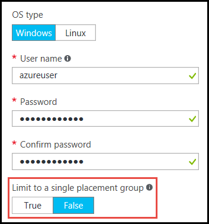

# <a name="working-with-large-virtual-machine-scale-sets"></a>使用大型的虚拟机规模集
用户现在可以创建容量高达 1,000 台 VM 的 Azure [虚拟机规模集](/virtual-machine-scale-sets/)。 在本文档中， _大型虚拟机规模集_ 定义为能够扩展到超过 100 个 VM 的规模集。 此功能通过规模集属性 (_singlePlacementGroup=False_) 设置。 

大型规模集的某些方面，例如负载均衡和容错域的行为与标准规模集不同。 本文档说明大型规模集的特征，并介绍要在应用程序中成功使用它们所需要知道的知识。 

部署大型的云基础结构的常用方法是创建一组 _缩放单位_，例如跨多个 VNET 和存储帐户创建多个 VM 规模集。 此方法和单个 VM 相比可以提供更简单的管理，并且多个缩放单位对于许多应用程序很有益处，尤其是那些需要其他堆叠组件（如多个虚拟网络和终结点）的应用程序。 但是，如果应用程序需要单个大型群集，那么部署一个多达 1,000 个 VM 的规模集会更加简单。 示例方案包括集中式的大数据部署，或需要简单管理大型工作节点池的计算网格。 用户可以将大型规模集与虚拟机规模集[附加数据磁盘](virtual-machine-scale-sets-attached-disks.md)结合使用，通过单次操作部署包含数千 vCPU 和千万亿字节存储的可缩放基础结构。

## <a name="placement-groups"></a>放置组 
_大型_规模集之所以特别，不是因为 VM 数，而是因为其包含的_放置组_数。 放置组是类似于 Azure 可用性集的构造，具有自己的容错域和升级域。 默认情况下，规模集由一个最大大小为 100 个 VM 的放置组组成。 如果将名为 _singlePlacementGroup_ 的规模集属性设置为 _false_，则该规模集可以由多个放置组组成，其范围为 0-1,000 台 VM。 如果设为默认值 _true_，那么规模集由一个放置组组成，VM 数的范围为 0-100。

## <a name="checklist-for-using-large-scale-sets"></a>使用大型规模集的检查清单
要确定应用程序是否可以有效地利用大型规模集，请考虑以下要求：

- 大型规模集需要 Azure 托管磁盘。 不通过托管磁盘创建的规模集需要多个存储帐户（每 20 台 VM 需要一个）。 根据设计，大型规模集专用于托管磁盘，其目的是减少存储管理开销，避免遇到存储帐户订阅限制的风险。 如果不使用托管磁盘，规模集的 VM 数限制为 100 个。
- 使用 Azure 应用商店映像创建的规模集最多可扩展到 1,000 个 VM。
- 从自定义映像（用户自己创建和上传的 VM 映射）创建的规模集目前的最大规模可以是 300 台 VM。
- 对于由多个放置组组成的规模集，在进行第 4 层负载均衡时需要 Azure 负载均衡器标准 SKU。 负载均衡器标准 SKU 还有其他优势，例如能够在多个规模集之间进行负载均衡。 标准 SKU 还要求规模集有与之关联的网络安全组，否则 NAT 池无法正常使用。 若需使用 Azure 负载均衡器基本 SKU，请确保将规模集配置为使用单个放置组，这是默认设置。
- 所有规模集都支持使用 Azure 应用程序网关的第 7 层负载均衡。
- 为规模集定义了一个子网 - 请确保子网的地址空间足够大，能容纳所需的所有 VM。 默认情况下，规模集会进行过度预配（在部署或横向扩展时创建额外的 VM，免费），目的是提高部署可靠性和性能。 请考虑地址空间比计划要增加到的 VM 数大 20%。
- 如果计划部署多个 VM，可能需要提高计算 vCPU 配额限制。
- 容错域和升级域仅在同一个放置组中是一致的。 此体系结构不会更改规模集的整体可用性，因为 VM 在不同的物理硬件中均匀分布，但是这意味着，如果需要保证两个 VM 位于不同的硬件，请确保它们位于相同放置组中的不同容错域。 容错域和放置组 ID 在规模集 VM 的 _实例视图_ 中显示。


## <a name="creating-a-large-scale-set"></a>创建大型规模集
在 Azure 门户中创建规模集时，可以在“基本设置”边栏选项卡中将“限制为单个放置组”选项设置为 _False_，允许规模集扩展到多个放置组。 将该选项设置为 _False_ 以后，即可指定“实例计数”值（最高为 1,000）。



可以使用 [Azure CLI](https://github.com/Azure/azure-cli) 的 _az vmss create_ 命令创建大型虚拟机规模集。 此命令根据 _instance-count_ 参数设置智能默认值，例如子网大小：

```bash
az group create -l chinanorth -n biginfra
az vmss create -g biginfra -n bigvmss --image ubuntults --instance-count 1000
```
_vmss create_ 命令会对某些配置值进行默认设置（如果用户未指定这些值）。 若要查看可以重写的可用选项，请尝试：
```bash
az vmss create --help
```

若要通过编写 Azure 资源管理器模板来创建大型规模集，请确保该模板基于 Azure 托管磁盘创建规模集。 可以在 _Microsoft.Compute/virtualMAchineScaleSets_ 资源的 _properties_ 节将 _singlePlacementGroup_ 属性设置为 _false_。 以下 JSON 片段显示规模集模板的开始部分，包括 1,000 个 VM 的容量和 _"singlePlacementGroup": false_ 设置：
```json
{
  "type": "Microsoft.Compute/virtualMachineScaleSets",
  "location": "chinanorth",
  "name": "bigvmss",
  "sku": {
    "name": "Standard_DS1_v2",
    "tier": "Standard",
    "capacity": 1000
  },
  "properties": {
    "singlePlacementGroup": false,
    "upgradePolicy": {
      "mode": "Automatic"
    }
```
对于大型规模集模板的完整示例，请参阅 [https://github.com/gbowerman/azure-myriad/blob/master/bigtest/bigbottle.json](https://github.com/gbowerman/azure-myriad/blob/master/bigtest/bigbottle.json)。

## <a name="converting-an-existing-scale-set-to-span-multiple-placement-groups"></a>转换现有的规模集以跨多个放置组
若要使现有的虚拟机规模集能够扩展到 100 台以上的 VM，需在规模集模型中将 _singplePlacementGroup_ 属性更改为 _false_。 找到现有的规模集，选择“编辑”，然后更改 _singlePlacementGroup_ 属性。 如果看不到该属性，则可能是在使用旧版 Microsoft.Compute API 查看规模集。

>[!NOTE] 
可以将规模集从仅支持单个放置组（默认行为）更改为支持多个放置组，但不能反过来进行转换。 因此，请确保在转换之前了解大型规模集的属性。

<!--Update_Description: wording update-->

