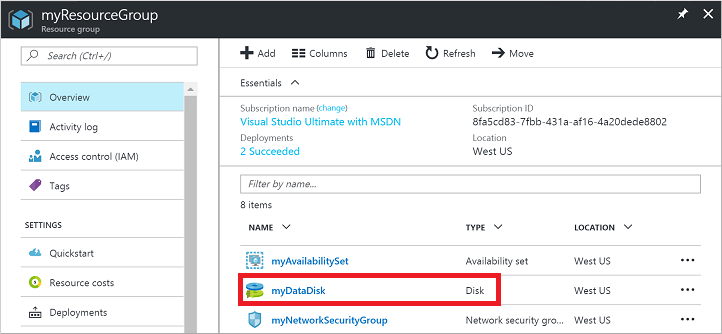

# <a name="use-the-portal-to-attach-a-data-disk-to-a-linux-vm"></a>使用门户将数据磁盘附加到 Linux VM 
本文介绍如何通过 Azure 门户将新磁盘和现有磁盘附加到 Linux 虚拟机。 也可以[在 Azure 门户中将数据磁盘附加到 Windows VM](../windows/attach-managed-disk-portal.md?toc=%2fvirtual-machines%2fwindows%2ftoc.json)。 

将磁盘附加到 VM 前，请查看以下提示：

* 虚拟机的大小决定了可以附加多少个磁盘。 有关详细信息，请参阅[虚拟机大小](sizes.md?toc=%2fvirtual-machines%2flinux%2ftoc.json)。
* 附加到虚拟机的磁盘实际上是存储在 Azure 中的 .vhd 文件。 有关详细信息，请查看[托管磁盘简介](managed-disks-overview.md?toc=%2fvirtual-machines%2flinux%2ftoc.json)。
* 附加磁盘后，需要[连接到 Linux VM 以装载新磁盘](#connect-to-the-linux-vm-to-mount-the-new-disk)。

## <a name="find-the-virtual-machine"></a>查找虚拟机
1. 若要查找 VM，请转到 [Azure 门户](https://portal.azure.cn/)。 搜索并选择“虚拟机”。 
2. 从列表中选择 VM。
3. 在“虚拟机”页面边栏的“设置”下，选择“磁盘”  。  

    

## <a name="attach-a-new-disk"></a>附加新磁盘

1. 在“磁盘”窗格上，单击“+ 添加数据磁盘”   。
2. 单击“名称”  的下拉列表菜单，并选择“创建磁盘”  ：

    

3. 输入托管磁盘的名称。 查看默认设置，根据需要更新，并单击“创建”  。

    

4. 单击“保存”  以创建托管磁盘并更新 VM 配置：

    

5. 在 Azure 创建磁盘并将磁盘附加到虚拟机之后，新磁盘将出现在“数据磁盘”下的虚拟机磁盘设置中。  托管磁盘是顶级资源，因此磁盘会显示在资源组的根部：

    

## <a name="attach-an-existing-disk"></a>附加现有磁盘
1. 在“磁盘”窗格上，单击“+ 添加数据磁盘”   。
2. 单击“名称”  的下拉列表菜单，查看 Azure 订阅可访问的现有托管磁盘列表。 选择要附加的托管磁盘：

    

3. 单击“保存”  以附加现有托管磁盘并更新 VM 配置：

    

4. 在 Azure 将磁盘附加到虚拟机之后，磁盘将出现在“数据磁盘”下的虚拟机磁盘设置中。 

    <!-- Verify successfully on  The Connect to the Linux VM to mount the new disk-->

## <a name="connect-to-the-linux-vm-to-mount-the-new-disk"></a>连接到 Linux VM 以装入新磁盘
若要对新磁盘进行分区、格式化和装载，以便 Linux VM 可以使用它，请通过 SSH 登录到 VM。 有关详细信息，请参阅[如何在 Azure 中将 SSH 用于 Linux](mac-create-ssh-keys.md)。 以下示例使用公共 DNS 条目 *mypublicdns.chinanorth.cloudapp.chinacloudapi.cn* 和用户名 *azureuser* 连接到一个 VM： 

```bash
ssh azureuser@mypublicdns.chinanorth.cloudapp.chinacloudapi.cn
```

连接到 VM 后就可以附加磁盘了。 首先，使用 `dmesg` 来查找磁盘（用于发现新磁盘的方法可能各不相同）。 以下示例使用 dmesg 来筛选 *SCSI* 磁盘：

```bash
dmesg | grep SCSI
```

输出类似于以下示例：

```bash
[    0.294784] SCSI subsystem initialized
[    0.573458] Block layer SCSI generic (bsg) driver version 0.4 loaded (major 252)
[    7.110271] sd 2:0:0:0: [sda] Attached SCSI disk
[    8.079653] sd 3:0:1:0: [sdb] Attached SCSI disk
[ 1828.162306] sd 5:0:0:0: [sdc] Attached SCSI disk
```

此处，*sdc* 是我们需要的磁盘。 

### <a name="partition-a-new-disk"></a>对新磁盘进行分区
如果使用包含数据的现有磁盘，请跳到装载磁盘。 如果附加新磁盘，需要对磁盘进行分区。

> [!NOTE]
> 建议你使用适用于你的发行版的最新版 fdisk 或 parted。

使用 `fdisk` 对磁盘进行分区。 如果磁盘大小为 2 太字节 (TiB) 或更大，则必须使用 GPT 分区；可以使用 `parted` 来执行 GPT 分区。 如果磁盘大小在 2 TiB 以下，则可以使用 MBR 或 GPT 分区。 将其设置为分区 1 中的主磁盘，并接受其他默认值。 以下示例在 `fdisk`/dev/sdc*上启动* 进程：

```bash
sudo fdisk /dev/sdc
```

使用 `n` 命令添加新分区。 在此示例中，我们还选择主分区的 `p` 并接受其余默认值。 输出将类似于以下示例：

```bash
Device contains neither a valid DOS partition table, nor Sun, SGI or OSF disklabel
Building a new DOS disklabel with disk identifier 0x2a59b123.
Changes will remain in memory only, until you decide to write them.
After that, of course, the previous content won't be recoverable.

Warning: invalid flag 0x0000 of partition table 4 will be corrected by w(rite)

Command (m for help): n
Partition type:
   p   primary (0 primary, 0 extended, 4 free)
   e   extended
Select (default p): p
Partition number (1-4, default 1): 1
First sector (2048-10485759, default 2048):
Using default value 2048
Last sector, +sectors or +size{K,M,G} (2048-10485759, default 10485759):
Using default value 10485759
```

通过键入 `p` 打印分区表并使用 `w` 将该表写入磁盘，然后退出。 输出应类似于以下示例：

```bash
Command (m for help): p

Disk /dev/sdc: 5368 MB, 5368709120 bytes
255 heads, 63 sectors/track, 652 cylinders, total 10485760 sectors
Units = sectors of 1 * 512 = 512 bytes
Sector size (logical/physical): 512 bytes / 512 bytes
I/O size (minimum/optimal): 512 bytes / 512 bytes
Disk identifier: 0x2a59b123

   Device Boot      Start         End      Blocks   Id  System
/dev/sdc1            2048    10485759     5241856   83  Linux

Command (m for help): w
The partition table has been altered!

Calling ioctl() to re-read partition table.
Syncing disks.
```

现在，使用 `mkfs` 命令将文件系统写入到该分区。 指定文件系统类型和设备名称。 以下示例在通过前面的步骤创建的 */dev/sdc1* 分区中创建 *ext4* 文件系统：

```bash
sudo mkfs -t ext4 /dev/sdc1
```

输出类似于以下示例：

```bash
mke2fs 1.42.9 (4-Feb-2014)
Discarding device blocks: done
Filesystem label=
OS type: Linux
Block size=4096 (log=2)
Fragment size=4096 (log=2)
Stride=0 blocks, Stripe width=0 blocks
327680 inodes, 1310464 blocks
65523 blocks (5.00%) reserved for the super user
First data block=0
Maximum filesystem blocks=1342177280
40 block groups
32768 blocks per group, 32768 fragments per group
8192 inodes per group
Superblock backups stored on blocks:
    32768, 98304, 163840, 229376, 294912, 819200, 884736
Allocating group tables: done
Writing inode tables: done
Creating journal (32768 blocks): done
Writing superblocks and filesystem accounting information: done
```

#### <a name="alternate-method-using-parted"></a>使用 parted 的替代方法
fdisk 实用程序需要交互式输入，因此不适合在自动化脚本中使用。 不过，[parted](https://www.gnu.org/software/parted/) 实用程序可以编写脚本，因此在自动化方案中更适合。 parted 实用程序可用于对数据磁盘进行分区和格式化。 在下面的演练中，我们将使用新的数据磁盘 /dev/sdc，并使用 [XFS](https://xfs.wiki.kernel.org/) 文件系统将其格式化。
```bash
sudo parted /dev/sdc --script mklabel gpt mkpart xfspart xfs 0% 100%
partprobe /dev/sdc1
```
如上所示，我们使用 [partprobe](https://linux.die.net/man/8/partprobe) 实用程序来确保内核即时了解新的分区和文件系统。 无法使用 partprobe 可能导致 blkid 或 lslbk 命令不即时返回新文件系统的 UUID。

### <a name="mount-the-disk"></a>装载磁盘
使用 `mkdir` 创建一个目录来装载文件系统。 以下示例在 */datadrive* 处创建一个目录：

```bash
sudo mkdir /datadrive
```

然后，使用 `mount` 来装载文件系统。 以下示例将 */dev/sdc1* 分区装载到 */datadrive* 装入点：

```bash
sudo mount /dev/sdc1 /datadrive
```

若要确保在重新引导后自动重新装载驱动器，必须将其添加到 */etc/fstab* 文件。 此外，强烈建议在 */etc/fstab* 中使用 UUID（全局唯一标识符）来引用驱动器而不是只使用设备名称（例如 */dev/sdc1*）。 如果 OS 在启动过程中检测到磁盘错误，使用 UUID 可以避免将错误的磁盘装载到给定位置。 然后，为剩余的数据磁盘分配这些设备 ID。 若要查找新驱动器的 UUID，请使用 `blkid` 实用工具：

```bash
sudo -i blkid
```

输出与以下示例类似：

```bash
/dev/sda1: UUID="11111111-1b1b-1c1c-1d1d-1e1e1e1e1e1e" TYPE="ext4"
/dev/sdb1: UUID="22222222-2b2b-2c2c-2d2d-2e2e2e2e2e2e" TYPE="ext4"
/dev/sdc1: UUID="33333333-3b3b-3c3c-3d3d-3e3e3e3e3e3e" TYPE="ext4"
```

> [!NOTE]
> 错误地编辑 **/etc/fstab** 文件可能会导致系统无法引导。 如果没有把握，请参考分发的文档来获取有关如何正确编辑该文件的信息。 另外，建议在编辑之前创建 /etc/fstab 文件的备份。

接下来，在文本编辑器中打开 */etc/fstab* 文件，如下所示：

```bash
sudo vi /etc/fstab
```

在此示例中，使用在之前的步骤中创建的 /dev/sdc1  设备的 UUID 值并使用装入点 /datadrive  。 将以下行添加到 */etc/fstab* 文件的末尾：

```bash
UUID=33333333-3b3b-3c3c-3d3d-3e3e3e3e3e3e   /datadrive   ext4   defaults,nofail   1   2
```

完成后，保存 /etc/fstab  文件并重新启动系统。

> [!NOTE]
> 之后，在不编辑 fstab 的情况下删除数据磁盘可能会导致 VM 无法启动。 大多数分发版都提供 *nofail* 和/或 *nobootwait* fstab 选项。 这些选项使系统在磁盘无法装载的情况下也能启动。 有关这些参数的详细信息，请查阅分发文档。
> 
> 即使文件系统已损坏或磁盘在引导时不存在，*nofail* 选项也能确保 VM 启动。 如果不使用此选项，可能会遇到 [Cannot SSH to Linux VM due to FSTAB errors](https://blogs.msdn.microsoft.com/linuxonazure/2016/07/21/cannot-ssh-to-linux-vm-after-adding-data-disk-to-etcfstab-and-rebooting/)（由于 FSTAB 错误而无法通过 SSH 连接到 Linux VM）中所述的行为

### <a name="trimunmap-support-for-linux-in-azure"></a>Azure 中对 Linux 的 TRIM/UNMAP 支持
某些 Linux 内核支持 TRIM/UNMAP 操作以放弃磁盘上未使用的块。 此功能主要用于标准存储中，如果你创建大型文件后又将其删除，则该功能将通知 Azure 已删除的页不再有效并且可以丢弃，可以节省成本。

在 Linux VM 中有两种方法可以启用 TRIM 支持。 与往常一样，有关建议的方法，请参阅分发：

* 在 `discard`/etc/fstab*中使用* 装载选项，例如：

    ```bash
    UUID=33333333-3b3b-3c3c-3d3d-3e3e3e3e3e3e   /datadrive   ext4   defaults,discard   1   2
    ```
* 在某些情况下，`discard` 选项可能会影响性能。 此处，还可以从命令行手动运行 `fstrim` 命令，或将其添加到 crontab 以定期运行：

    **Ubuntu**

    ```bash
    sudo apt-get install util-linux
    sudo fstrim /datadrive
    ```

    **RHEL/CentOS**

    ```bash
    sudo yum install util-linux
    sudo fstrim /datadrive
    ```

## <a name="next-steps"></a>后续步骤
还可使用 Azure CLI [附加数据磁盘](add-disk.md)。

<!--Update_Description: update meta properties, wording update -->
