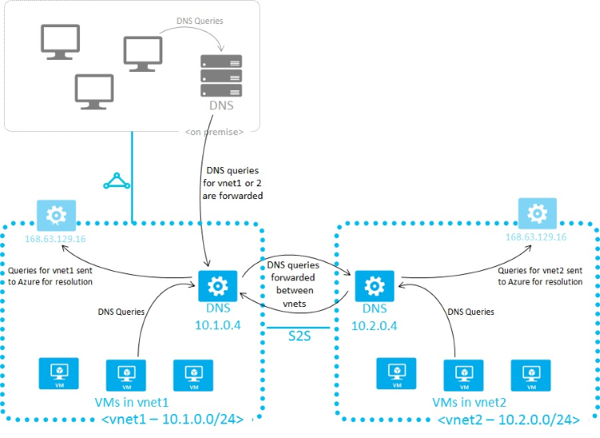

# Azure 中 Linux 虚拟机的 DNS 名称解析选项
Azure 默认提供单个虚拟网络内的所有虚拟机的 DNS 名称解析。 在 Azure 托管的虚拟机上配置自己的 DNS 服务，即可实现自己的 DNS 名称解析解决方案。 以下方案可帮助你选择适合你情况的解决方案。

* [Azure 提供的名称解析](#name-resolution-that-azure-provides)
* [使用自己的 DNS 服务器的名称解析](#name-resolution-using-your-own-dns-server)

使用的名称解析类型取决于虚拟机和角色实例需要彼此进行通信的方式。

下表说明了方案和相应的名称解析解决方案：

| **方案** | **解决方案** | **后缀** |
| --- | --- | --- |
| 同一虚拟网络中的角色实例或虚拟机之间的名称解析 |Azure 提供的名称解析 |主机名或完全限定域名 (FQDN) |
| 不同虚拟网络中的角色实例或虚拟机之间的名称解析 |客户托管的 DNS 服务器，在虚拟网络之间转发可供 Azure（DNS 代理）解析的查询。 请参阅[使用自己的 DNS 服务器进行名称解析](#name-resolution-using-your-own-dns-server)。 |仅 FQDN |
| 通过 Azure 中的角色实例或虚拟机解析本地计算机和服务的名称 |客户托管的 DNS 服务器（例如，本地域控制器、本地只读域控制器或使用区域传送同步的 DNS 辅助服务器）。 请参阅[使用自己的 DNS 服务器进行名称解析](#name-resolution-using-your-own-dns-server)。 |仅 FQDN |
| 解析本地计算机中的 Azure 主机名 |将查询转发到相应虚拟网络中客户托管的 DNS 代理服务器。 代理服务器将查询转发到 Azure 进行解析。 请参阅[使用自己的 DNS 服务器进行名称解析](#name-resolution-using-your-own-dns-server)。 |仅 FQDN |
| 针对内部 IP 的反向 DNS |[使用自己的 DNS 服务器的名称解析](#name-resolution-using-your-own-dns-server) |不适用 |

## Azure 提供的名称解析
除公共 DNS 名称解析之外，Azure 还为位于相同虚拟网络中的虚拟机和角色实例提供内部名称解析。 在基于 Azure Resource Manager 的虚拟网络中，DNS 后缀在整个虚拟网络中都是一致的；不需要 FQDN。 可以将 DNS 名称分配给网络接口卡 (NIC) 和虚拟机。 虽然 Azure 提供的名称解析不需要任何配置，但并不适合所有部署方案，如上表所示。

### 功能和注意事项
**功能：**

* 不需要配置就能使用 Azure 提供的名称解析。
* Azure 提供的名称解析服务可用性高。 无需创建和管理你自己的 DNS 服务器的群集。
* 可以将 Azure 提供的名称解析服务与你自己的 DNS 服务器一起使用，以便解析本地主机名和 Azure 主机名。
* 无需 FQDN 即可在虚拟网络中的虚拟机之间提供名称解析。
* 可以使用最能描述部署的主机名，而不必使用自动生成的名称。

**注意事项：**

* 不能修改 Azure 创建的 DNS 后缀。
* 不能手动注册自己的记录。
* 不支持 WINS 和 NetBIOS。
* 主机名必须兼容 DNS。
    名称只能使用 0-9、a-z 和“-”，并且不能以“-”开头或结尾。 请参见 RFC 3696 第 2 节。
* DNS 查询流量按照虚拟机进行限制。 限制不应影响大部分应用程序。  如果遵循请求限制，请确保启用客户端缓存。  有关详细信息，请参阅[充分利用 Azure 提供的名称解析](#getting-the-most-from-name-resolution-that-azure-provides)。

### 充分利用 Azure 提供的名称解析
**客户端缓存：**

某些 DNS 查询不通过网络发送。 通过解析本地缓存中的重复性 DNS 查询，客户端缓存有助于减少延迟和提高网络在出现不一致情况下的恢复能力。 DNS 记录包含生存时间 (TTL)，这允许缓存尽可能长时间存储记录，而不影响记录刷新。 因此，客户端缓存适用于大多数情况。

默认情况下，某些 Linux 发行版不包括缓存。 建议你在确定没有本地缓存后，向每个 Linux 虚拟机添加缓存。

可以使用多个不同的 DNS 缓存包，例如 dnsmasq。 以下是在最常见的发行版上安装 dnsmasq 的步骤：

 Ubuntu（使用 resolvconf）
  * 安装 dnsmasq 包 (�sudo apt-get install dnsmasq�)。

**SUSE（使用 netconf）** ：
1. 安装 dnsmasq 包（“sudo zypper install dnsmasq”）。
2. 启用 dnsmasq 服务（“systemctl enable dnsmasq.service”）。
3. 启动 dnsmasq 服务（“systemctl start dnsmasq.service”）。
4. 编辑“/etc/sysconfig/network/config”，并将 NETCONFIG_DNS_FORWARDER="" 更改为“dnsmasq”。
5. 更新 resolv.conf（“netconfig update”），将缓存设置为本地 DNS 解析程序。

Rogue Wave Software 的 CentOS（之前为 OpenLogic；使用 NetworkManager） 
1. 安装 dnsmasq 包（“sudo yum install dnsmasq”）。
2. 启用 dnsmasq 服务（“systemctl enable dnsmasq.service”）。
3. 启动 dnsmasq 服务（“systemctl start dnsmasq.service”）。
4. 将“prepend domain-name-servers 127.0.0.1;”添加到“/etc/dhclient-eth0.conf”。
5. 重启网络服务（“service network restart”），将缓存设置为本地 DNS 解析程序

> [!NOTE]
> 解码的字符：“dnsmasq”包只是适用于 Linux 的众多 DNS 缓存中的一个。 在使用之前，请检查其是否适合需求，并且确认没有安装其他缓存。
>
>

**客户端重试**

DNS 主要是一个 UDP 协议。 因为 UDP 协议无法保证消息传递，所以 DNS 协议本身会处理重试逻辑。 每个 DNS 客户端（操作系统）可能会表现出不同的重试逻辑，具体取决于创建者偏好：

* Windows 操作系统在 1 秒后重试，然后再在 2 秒后、 4 秒后和另一个 4 秒后重试。
* 默认 Linux 设置在 5 秒后重试。  应将此设置更改为重试 5 次，每次间隔 1 秒。  

若要检查 Linux 虚拟机上的当前设置，请执行“cat /etc/resolv.conf”并查看“options”行，例如：

    options timeout:1 attempts:5

resolv.conf 文件是自动生成的，不应进行编辑。 添加“options”行的具体步骤因发行版而异：

**Ubuntu**（使用 resolvconf）
1. 将 options 行添加到“/etc/resolvconf/resolv.conf.d/head”。
2. 通过运行“resolvconf -u”进行更新。

**SUSE**（使用 netconf）
1. 将“timeout:1 attempts:5”添加到“/etc/sysconfig/network/config”中的 NETCONFIG_DNS_RESOLVER_OPTIONS="" 参数。
2. 通过运行“netconfig update”进行更新。

Rogue Wave Software 的 CentOS（之前为 OpenLogic）（使用 NetworkManager） 
1. 将“RES_OPTIONS="timeout:1 attempts:5"”添加到“/etc/sysconfig/network”。
2. 通过运行“service network restart”进行更新。

## 使用自己的 DNS 服务器的名称解析
你的名称解析需求可能会超出 Azure 所提供的功能的范畴。 例如，你可能需要在虚拟网络之间进行 DNS 解析。 为了涵盖这种情况，你可以使用自己的 DNS 服务器。  

虚拟网络中的 DNS 服务器可以将 DNS 查询转发到 Azure 的递归解析程序，以便解析同一虚拟网络中的主机名。 例如，在 Azure 中运行的 DNS 服务器可以响应其自身 DNS 区域文件的 DNS 查询，而将所有其他查询转发到 Azure。 虚拟机可以利用此功能查看你在区域文件中的条目，以及 Azure 提供的主机名（通过转发器）。 可以通过虚拟 IP 168.63.129.16 访问 Azure 的递归解析程序。

DNS 转发还可用于在虚拟网络之间进行 DNS 解析，并允许本地机解析 Azure 提供的主机名。 若要解析虚拟机的主机名，DNS 服务器虚拟机必须驻留在同一虚拟网络中，并且必须配置为将主机名查询转发到 Azure。 由于 DNS 后缀在每个虚拟网络中是不同的，因此可使用条件性转发规则将 DNS 查询发送到正确的虚拟网络进行解析。 下图显示了两个虚拟网络，此外还有一个本地网络在使用此方法在虚拟网络之间进行 DNS 解析：

使用 Azure 提供的名称解析时，会通过 DHCP 为每个虚拟机提供内部 DNS 后缀。 使用你自己的名称解析解决方案时，不会向虚拟机提供该后缀，因为该后缀会干扰其他 DNS 体系结构。 若要通过 FQDN 来引用计算机，或者要在虚拟机上配置后缀，可通过 PowerShell 或 API 来确定该后缀：

* 对于 Azure Resource Manager 托管的虚拟网络，可以通过[网络接口卡](https://msdn.microsoft.com/library/azure/mt163668.aspx)资源来使用该后缀。 也可通过运行 `azure network public-ip show <resource group> <pip name>` 命令来显示公共 IP 的详细信息，该 IP 中包括 NIC 的 FQDN。

如果不想将查询转发到 Azure，则需提供自己的 DNS 解决方案。  DNS 解决方案需要：

* 提供合适的主机名解析方式（例如通过 [DDNS](../../virtual-network/virtual-networks-name-resolution-ddns.md) 进行解析）。 如果使用 DDNS，可能需要禁用 DNS 记录清理。 Azure 的 DHCP 租用时间很长，清理时可能会过早删除 DNS 记录。
* 提供适当的递归式解析来解析外部域名。
* 可以从其所服务的客户端进行访问（在端口 53 上启用 TCP 和 UDP），并可访问 Internet。
* 禁止从 Internet 进行访问，减少外部代理带来的威胁。

> [!NOTE]
> 为了获得最佳性能，在 Azure DNS 服务器中使用虚拟机时，请禁用 IPv6 并为每个 DNS 服务器虚拟机分配[实例级公共 IP](../../virtual-network/virtual-networks-instance-level-public-ip.md)。  
>
>

<!-- Update_Description: wording update -->