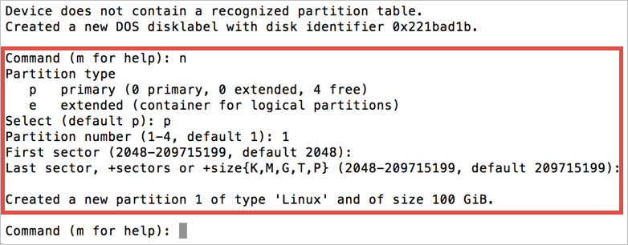
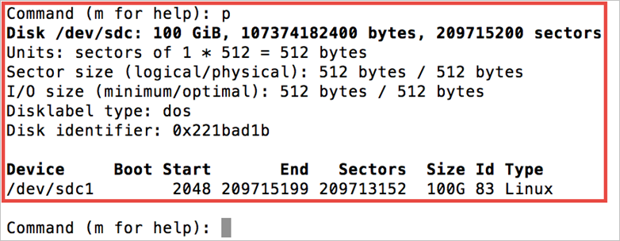
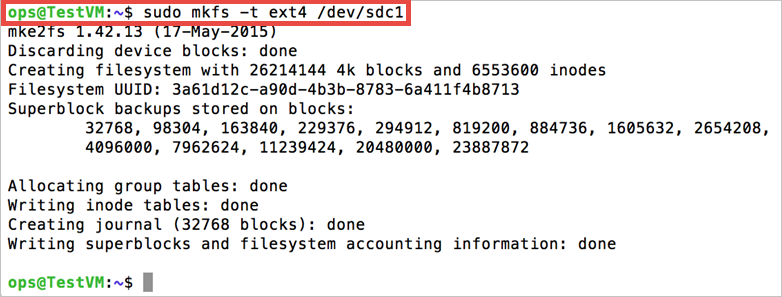

# <a name="how-to-attach-a-data-disk-to-a-linux-virtual-machine"></a>如何将数据磁盘附加到 Linux 虚拟机
> [!IMPORTANT] 
> Azure 具有用于创建和处理资源的两个不同的部署模型：[资源管理器部署模型和经典部署模型](../../../resource-manager-deployment-model.md)。 本文介绍如何使用经典部署模型。 Azure 建议大多数新部署使用 Resource Manager 模型。 请参阅如何[使用 Resource Manager 部署模型附加数据磁盘](../add-disk.md?toc=%2fvirtual-machines%2flinux%2ftoc.json)。

可以将空磁盘和包含数据的磁盘附加到 Azure VM。 这两种类型的磁盘是驻留在 Azure 存储帐户中的 .vhd 文件。 与将任何磁盘添加到 Linux 计算机一样，附加磁盘之后需要将它初始化和格式化才可供使用。 本文详细说明如何附加空磁盘和附加包含数据的磁盘到 VM，以及初始化和格式化新磁盘的方法。

> [!NOTE]
> 最佳做法是使用一个或多个不同的磁盘来存储虚拟机的数据。 在创建 Azure 虚拟机时，该虚拟机有一个操作系统磁盘和一个临时磁盘。 **不要使用临时磁盘来存储持久性数据。** 顾名思义，它仅提供临时存储。 它不提供冗余或备份，因为它不驻留在 Azure 存储中。
> 临时磁盘通常由 Azure Linux 代理管理并且自动装载到 **/mnt/resource**（或 Ubuntu 映像上的 **/mnt**）。 另一方面，数据磁盘可以由 Linux 内核命名为 `/dev/sdc`这样的形式，而用户则需对该资源进行分区、格式化和安装。 有关详细信息，请参阅 [Azure Linux 代理用户指南][Agent] 。
> 
> 

[!INCLUDE [howto-attach-disk-windows-linux](../../../../includes/howto-attach-disk-linux.md)]

## <a name="initialize-a-new-data-disk-in-linux"></a>在 Linux 中初始化新的数据磁盘
1. 通过 SSH 连接到 VM。 有关详细信息，请参阅 [如何登录到运行 Linux 的虚拟机][Logon]。
2. 接下来，需要查找可供数据磁盘初始化的设备标识符。 可通过两种方法进行查找：

    a) 获取 SCSI 设备中的日志，例如，使用以下命令：

    ```bash
    sudo grep SCSI /var/log/messages
    ```

    如果是最近的 Ubuntu 发行版，你可能需要使用 `sudo grep SCSI /var/log/syslog`，因为默认情况下可能已禁止登录到 `/var/log/messages`。

    可以在所示消息中找到最后添加的数据磁盘的标识符。

    

    OR

    b) 使用 `lsscsi` 命令找出设备 ID。`lsscsi` 的安装可以通过 `yum install lsscsi`（在基于 Red Hat 的分发版上）或 `apt-get install lsscsi`（在基于 Debian 的分发版上）来进行。 可以通过磁盘的 *lun* （即 **逻辑单元号**）找到所需磁盘。 例如，所附加磁盘的 *lun* 可以轻松地通过 `azure vm disk list <virtual-machine>` 来查看，如下所示：

    ```azurecli
    azure vm disk list myVM
    ```

    输出与下面类似：

    ```azurecli
    info:    Executing command vm disk list
    + Fetching disk images
    + Getting virtual machines
    + Getting VM disks
    data:    Lun  Size(GB)  Blob-Name                         OS
    data:    ---  --------  --------------------------------  -----
    data:         30        myVM-2645b8030676c8f8.vhd  Linux
    data:    0    100       myVM-76f7ee1ef0f6dddc.vhd
    info:    vm disk list command OK
    ```

    将此数据与同一示例性虚拟机的 `lsscsi` 的输出进行比较：

    ```bash
    [1:0:0:0]    cd/dvd  Msft     Virtual CD/ROM   1.0   /dev/sr0
    [2:0:0:0]    disk    Msft     Virtual Disk     1.0   /dev/sda
    [3:0:1:0]    disk    Msft     Virtual Disk     1.0   /dev/sdb
    [5:0:0:0]    disk    Msft     Virtual Disk     1.0   /dev/sdc
    ```

    每一行的元组中的最后一个数字就是 *lun*。 有关详细信息，请参阅 `man lsscsi` 。
3. 在提示符下，键入以下命令以创建设备：

    ```bash
    sudo fdisk /dev/sdc
    ```

4. 出现提示时，请键入 **n** 创建分区。

    

5. 出现提示时，键入 **p** 以将分区设置为主分区。 键入 **1** 将其设置为第一分区，然后键入 Enter 接受柱面的默认值。 在某些系统上，它可以显示第一个和最后一个扇区（而不是柱面）的默认值。 可以选择接受这些默认值。

    

6. 键入 **p** 查看有关分区磁盘的详细信息。

    

7. 键入“w”  以写入磁盘的设置。

    

8. 现在，可以在新分区上创建文件系统。 在设备 ID 后面追加磁盘分区号（在以下示例中为 `/dev/sdc1`）。 以下示例在 /dev/sdc1 上创建 ext4 磁盘分区：

    ```bash
    sudo mkfs -t ext4 /dev/sdc1
    ```

    

   > [!NOTE]
   > 对于 ext4 文件系统，SuSE Linux Enterprise 11 系统仅支持只读访问。 对于这些系统，建议将新文件系统格式化为 ext3 而非 ext4。

9. 创建一个目录来装载新的文件系统，如下所示：

    ```bash
    sudo mkdir /datadrive
    ```

10. 最后可以装载驱动器，如下所示：

    ```bash
    sudo mount /dev/sdc1 /datadrive
    ```

    数据磁盘现在可以作为 **/datadrive**使用。

    

11. 将新驱动器添加到 /etc/fstab：

    要确保在重新引导后自动重新装载驱动器，必须将其添加到 /etc/fstab 文件。 此外，强烈建议在 /etc/fstab 中使用 UUID（全局唯一标识符）来引用驱动器而不是只使用设备名称（即 /dev/sdc1）。 如果 OS 在启动过程中检测到磁盘错误，使用 UUID 可以避免将错误的磁盘装载到给定位置，然后为剩余的数据磁盘分配这些设备 ID。 若要查找新驱动器的 UUID，可以使用 **blkid** 实用程序：

    ```bash
    sudo -i blkid
    ```

    输出与以下示例类似：

    ```bash
    /dev/sda1: UUID="11111111-1b1b-1c1c-1d1d-1e1e1e1e1e1e" TYPE="ext4"
    /dev/sdb1: UUID="22222222-2b2b-2c2c-2d2d-2e2e2e2e2e2e" TYPE="ext4"
    /dev/sdc1: UUID="33333333-3b3b-3c3c-3d3d-3e3e3e3e3e3e" TYPE="ext4"
    ```

    > [!NOTE]
    > 错误地编辑 **/etc/fstab** 文件可能会导致系统无法引导。 如果没有把握，请参考分发的文档来获取有关如何正确编辑该文件的信息。 另外，建议在编辑之前创建 /etc/fstab 文件的备份。

    接下来，请在文本编辑器中打开 **/etc/fstab** 文件。

    ```bash
    sudo vi /etc/fstab
    ```

    此示例使用在之前的步骤中创建的新 **/dev/sdc1** 设备的 UUID 值并使用装载点 **/datadrive**。 将以下行添加到 **/etc/fstab** 文件的末尾：

    ```sh
    UUID=33333333-3b3b-3c3c-3d3d-3e3e3e3e3e3e   /datadrive   ext4   defaults,nofail   1   2
    ```

    另外，在基于 SuSE Linux 的系统上，可能需要使用稍微不同的格式：

    ```sh
    /dev/disk/by-uuid/33333333-3b3b-3c3c-3d3d-3e3e3e3e3e3e   /datadrive   ext3   defaults,nofail   1   2
    ```

    > [!NOTE]
    > 即使文件系统已损坏或磁盘在引导时不存在，`nofail` 选项也能确保 VM 启动。 如果不使用此选项，可能会遇到 [Cannot SSH to Linux VM due to FSTAB errors](https://blogs.msdn.microsoft.com/linuxonazure/2016/07/21/cannot-ssh-to-linux-vm-after-adding-data-disk-to-etcfstab-and-rebooting/)（由于 FSTAB 错误而无法通过 SSH 连接到 Linux VM）中所述的行为。

    现在，可以通过卸载并重新装载文件系统（即使用在之前的步骤中创建的示例装载点 `/datadrive`）来测试文件系统是否已正确装载：

    ```bash
    sudo umount /datadrive
    sudo mount /datadrive
    ```

    如果 `mount` 命令产生错误，请检查 /etc/fstab 文件的语法是否正确。 如果还创建了其他数据驱动器或分区，同样也需要分别将其输入到 /etc/fstab 中。

    需要使用以下命令将驱动器设为可写：

    ```bash
    sudo chmod go+w /datadrive
    ```

    > [!NOTE]
    > 之后，在不编辑 fstab 的情况下删除数据磁盘可能会导致 VM 无法引导。 如果这是一种常见情况，则请注意，大多数发行版都提供了 `nofail` 和/或 `nobootwait` fstab 选项，这些选项使系统在磁盘无法装载的情况下也能引导。 有关这些参数的详细信息，请查阅相应发行版的文档。

### <a name="trimunmap-support-for-linux-in-azure"></a>Azure 中对 Linux 的 TRIM/UNMAP 支持
某些 Linux 内核支持 TRIM/UNMAP 操作以放弃磁盘上未使用的块。 这些操作主要适用于标准存储，以通知 Azure 已删除的页不再有效可以丢弃。 如果创建了较大的文件，并将其删除，则放弃页可以节省成本。

在 Linux VM 中有两种方法可以启用 TRIM 支持。 与往常一样，有关建议的方法，请参阅分发：

* 在 `/etc/fstab` 中使用 `discard` 装载选项，例如：

    ```sh
    UUID=33333333-3b3b-3c3c-3d3d-3e3e3e3e3e3e   /datadrive   ext4   defaults,discard   1   2
    ```

* 在某些情况下，`discard` 选项可能会影响性能。 此处，还可以从命令行手动运行 `fstrim` 命令，或将其添加到 crontab 以定期运行：

    **Ubuntu**

    ```bash
    sudo apt-get install util-linux
    sudo fstrim /datadrive
    ```

    **CentOS**

    ```bash
    sudo yum install util-linux
    sudo fstrim /datadrive
    ```
<!-- Not Available on RHEL on Line 212 -->

## <a name="troubleshooting"></a>故障排除
[!INCLUDE [virtual-machines-linux-lunzero](../../../../includes/virtual-machines-linux-lunzero.md)]

## <a name="next-steps"></a>后续步骤
可以阅读下列文章，进一步了解如何使用 Linux VM：

* [如何登录到运行 Linux 的虚拟机][Logon]
* [如何从 Linux 虚拟机分离磁盘](detach-disk-classic.md)
* [将 Azuer CLI 与经典部署模型搭配使用](https://docs.azure.cn/zh-cn/cli/get-started-with-az-cli2?view=azure-cli-latest)
* [在 Azure 中的 Linux VM 上配置 RAID](../configure-raid.md)
* [在 Azure 中的 Linux VM 上配置 LVM](../configure-lvm.md)

<!--Link references-->
[Agent]:../../extensions/agent-linux.md
[Logon]:../mac-create-ssh-keys.md

<!-- Update_Description: update meta properties -->

