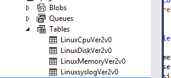

# <a name="use-the-linux-diagnostic-extension-to-monitor-the-performance-and-diagnostic-data-of-a-linux-vm"></a>使用 Linux 诊断扩展监视 Linux VM 的性能和诊断数据

本文档介绍 Linux 诊断扩展 2.3 版。

> [!IMPORTANT]
> 此版本已弃用，2018 年 6 月 30 日以后随时有可能取消发布该版本。
<!-- Not Available on  [documentation for version 3.0 of the Linux Diagnostic Extension](../diagnostic-extension.md) -->

## <a name="introduction"></a>简介

（注意：Linux 诊断扩展在 [GitHub](https://github.com/Azure/azure-linux-extensions/tree/master/Diagnostic) 上处于开源状态，其中首次发布有关该扩展的最新信息。 建议先查看 [GitHub 页](https://github.com/Azure/azure-linux-extensions/tree/master/Diagnostic)。）

Linux 诊断扩展可帮助用户监视 Azure 上运行的 Linux VM。 它具有以下功能：

* 从 Linux VM 收集系统性能信息并上传到用户的存储表，包括诊断和 syslog 信息。
* 让用户能够自定义将要收集并上传的数据指标。
* 让用户能够将指定日志文件上传到指定的存储表。

在最新 2.3 版中，数据包括：

* 所有 Linux Rsyslog 日志，包括系统、安全和应用程序日志。
* 在 [System Center 跨平台解决方案站点](https://scx.codeplex.com/wikipage?title=xplatproviders)上指定的所有系统数据。
* 用户指定的日志文件。

此扩展可搭配经典和 Resource Manager 部署模型使用。

### <a name="current-version-of-the-extension-and-deprecation-of-old-versions"></a>此扩展的当前版本和弃用的旧版本

此扩展的最新版本为 2.3，任何旧版本（2.0、2.1 和 2.2）都将于今年 (2017) 年底被弃用和取消发布。 如果用户已安装禁用自动次要版本升级的 Linux 诊断扩展，强烈建议用户卸载该扩展，并在启用自动次要版本升级的情况下重新安装它。 在经典 (ASM) VM 上，如果正在通过 Azure XPLAT CLI 或 Powershell 安装该扩展，则可以通过指定“2.*”作为版本来实现此目的。 在 ARM VM 上，可以通过在 VM 部署模板中包括 '"autoUpgradeMinorVersion": true' 来实现此目的。 此外，此扩展的任何新安装都应自动次要版本升级选项启用。

## <a name="enable-the-extension"></a>启用扩展

使用 [Azure 门户](https://portal.azure.cn/#)、Azure PowerShell 或 Azure CLI 脚本，可以启用此扩展。

若要直接从 Azure 门户查看和配置系统和性能数据，请执行 [Azure 博客上的这些步骤](https://azure.microsoft.com/blog/windows-azure-virtual-machine-monitoring-with-wad-extension/)。

本文重点介绍如何使用 Azure CLI 命令来启用和配置此扩展。 这可让你直接从存储表读取和查看数据。

请注意，此处所述的配置方法不适用于 Azure 门户。 若要直接从 Azure 门户查看和配置系统与性能数据，必须通过门户启用此扩展。

## <a name="prerequisites"></a>先决条件

* **Azure Linux Agent 2.0.6 版或更高版本**。

  请注意，大部分 Azure VM Linux 库映像都包含 2.0.6 版本或更高版本。 可以运行 **WAAgent -version** 以确认 VM 上安装的版本。 如果 VM 正在运行的版本早于 2.0.6，则可以按照 [GitHub 上的这些说明](https://github.com/Azure/WALinuxAgent "说明") 进行更新。
* **Azure CLI**。 请按照[此 CLI 安装指南](../../../cli-install-nodejs.md)中的说明在计算机上设置 Azure CLI 环境。 安装 Azure CLI 之后，可以从命令行接口（Bash、终端或命令提示符）使用“azure”命令访问 Azure CLI 命令。 例如：

  * 运行 **azure vm extension set --help** 了解详细的帮助信息。
  * 运行“azure login -e AzureChinaCloud”，登录到 Azure。
  * 运行 **azure vm list** 可列出在 Azure 上拥有的所有虚拟机。
* 用于存储数据的存储帐户。 你将需要以前创建的存储帐户名称和访问密钥，以将数据上传到存储中。

## <a name="use-the-azure-cli-command-to-enable-the-linux-diagnostic-extension"></a>使用 Azure CLI 命令启用 Linux 诊断扩展

### <a name="scenario-1-enable-the-extension-with-the-default-data-set"></a>方案 1. 使用默认数据集启用扩展

在 2.3 版或更高版本中，收集的默认数据包括：

* 所有 Rsyslog 信息（包括系统、安全性和应用程序日志）。  
* 一组核心基础系统数据。 请注意， [System Center 跨平台解决方案站点](https://scx.codeplex.com/wikipage?title=xplatproviders)上介绍了完整的数据集。
  如果想要启用额外的数据，请继续执行方案 2 和 3 中的步骤。

步骤 1。 使用以下内容创建名为 PrivateConfig.json 的文件：

    {
        "storageAccountName" : "the storage account to receive data",
        "storageAccountKey" : "the key of the account"
    }

步骤 2. 运行 **azure vm extension set vm_name LinuxDiagnostic Microsoft.OSTCExtensions 2.* --private-config-path PrivateConfig.json**。

### <a name="scenario-2-customize-the-performance-monitor-metrics"></a>方案 2. 自定义性能监视器指标

此节介绍如何自定义性能和诊断数据表。

步骤 1。 使用方案 1 描述的内容创建名为 PrivateConfig.json 的文件。 同时也创建名为 PublicConfig.json 的文件。 指定你想要收集的特定数据。

有关所有受支持的提供程序和变量，请参考 [System Center 跨平台解决方案站点](https://scx.codeplex.com/wikipage?title=xplatproviders)。 可以拥有多个查询，通过将更多查询追加到脚本中，你还可以将它们存储为多个表。

默认始终收集 Rsyslog 数据。

    {
          "perfCfg":
          [
              {
                  "query" : "SELECT PercentAvailableMemory, AvailableMemory, UsedMemory ,PercentUsedSwap FROM SCX_MemoryStatisticalInformation",
                  "table" : "LinuxMemory"
              }
          ]
    }

步骤 2. 运行 **azure vm extension set vm_name LinuxDiagnostic Microsoft.OSTCExtensions '2.*' --private-config-path PrivateConfig.json --public-config-path PublicConfig.json**。

### <a name="scenario-3-upload-your-own-log-files"></a>方案 3. 上传自己的日志文件

此节介绍如何收集特定的日志文件并将其上传到存储帐户。 需要指定日志文件的路径，以及要用来存储日志的表名。 可以将多个文件/表条目添加到脚本，以创建多个日志文件。

步骤 1。 使用方案 1 描述的内容创建名为 PrivateConfig.json 的文件。 然后使用以下内容创建另一个名为 PublicConfig.json 的文件：

```json
{
    "fileCfg" :
    [
        {
            "file" : "/var/log/mysql.err",
            "table" : "mysqlerr"
            }
    ]
}
```

步骤 2. 运行 `azure vm extension set vm_name LinuxDiagnostic Microsoft.OSTCExtensions '2.*' --private-config-path PrivateConfig.json --public-config-path PublicConfig.json`。

请注意，在 2.3 版之前的扩展版本上使用此设置，所有写入到 `/var/log/mysql.err` 的日志也可能会复制到 `/var/log/syslog`（或 `/var/log/messages`，具体取决于 Linux 发行版）。 如果要避免此重复的日志记录，可以在 rsyslog 配置中不包括 `local6` 设备日志的日志记录。 这取决于 Linux 发行版，但在 Ubuntu 14.04 系统中，要修改的文件是 `/etc/rsyslog.d/50-default.conf`，你可以将行 `*.*;auth,authpriv.none -/var/log/syslog` 替换为 `*.*;auth,authpriv,local6.none -/var/log/syslog`。 在最新修补程序版本 2.3 (2.3.9007) 中解决了此问题，因此，如果使用扩展版本 2.3，此问题应该不会发生。 如果在重新启动 VM 后此问题仍存在，请与我们联系，并帮助我们故障排除以确定未自动安装最新修补程序版本的原因。

### <a name="scenario-4-stop-the-extension-from-collecting-any-logs"></a>方案 4. 阻止扩展收集任何日志

本节说明如何阻止扩展收集日志。 请注意，即使使用此重新配置，监视代理进程仍会启动并运行。 如果想要完全停止监视代理进程，可以通过禁用扩展来实现此目的。 用于禁用扩展的命令是 `azure vm extension set --disable <vm_name> LinuxDiagnostic Microsoft.OSTCExtensions '2.*'`。

步骤 1。 使用方案 1 描述的内容创建名为 PrivateConfig.json 的文件。 使用以下内容创建另一个名为 PublicConfig.json 的文件：

    {
        "perfCfg" : [],
        "enableSyslog" : "false"
    }

步骤 2. 运行 **azure vm extension set vm_name LinuxDiagnostic Microsoft.OSTCExtensions '2.*' --private-config-path PrivateConfig.json --public-config-path PublicConfig.json**。

## <a name="review-your-data"></a>查看数据

性能和诊断数据存储在 Azure 存储表中。 查看[如何通过 Ruby 使用 Azure 表存储](../../../cosmos-db/table-storage-how-to-use-ruby.md)，了解如何使用 Azure CLI 脚本访问存储表中的数据。

此外，可以使用以下 UI 工具来访问数据：

1. Visual Studio 服务器资源管理器。 转到存储帐户。 VM 运行约 5 分钟后，会看到四个默认表：“LinuxCpu”、“LinuxDisk”、“LinuxMemory”和“Linuxsyslog”。 双击表名以查看数据。
1. [Azure 存储资源管理器](https://azurestorageexplorer.codeplex.com/ "Azure 存储资源管理器")上指定的所有系统数据。



如果已启用 fileCfg 或 perfCfg（如方案 2 和 3 所述），则可以使用 Visual Studio 服务器资源管理器和 Azure 存储资源管理器查看非默认数据。

## <a name="known-issues"></a>已知问题

* 只能通过脚本访问 Rsyslog 信息和客户指定日志文件。
<!--Update_Description: update meta properties-->