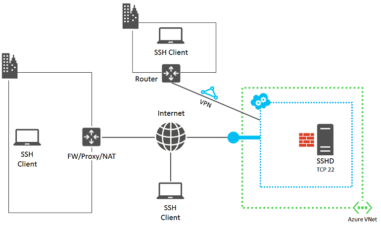
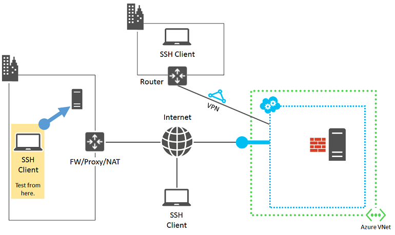
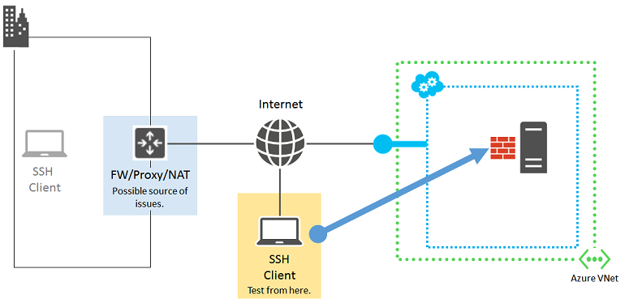
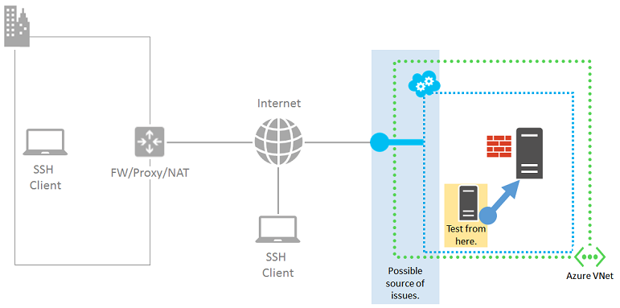
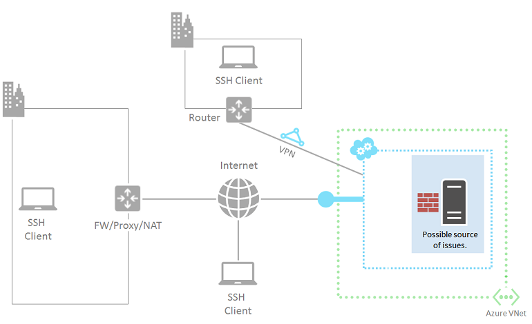

# SSH 详细故障排除步骤
有许多可能的原因会导致 SSH 客户端无法访问 VM 上的 SSH 服务。如果已经执行了较[常规的 SSH 故障排除步骤](troubleshoot-ssh-connection.md)，则需要进一步排查连接问题。本文将指导用户完成详细的故障排除步骤，以确定 SSH 连接失败的位置以及解决方法。

## 采取预备步骤
下图显示了与错误相关的组件。

  

以下步骤将帮助用户查明失败的原因，并得出解决方法或应对措施。

首先，在门户中检查 VM 的状态。

在 [Azure 门户预览](https://portal.azure.cn)中：

1. 对于使用 Resource Manager 模型创建的 VM，请选择“虚拟机”> VM 名称。

    - 或 -

    对于使用经典部署模型创建的 VM，请选择“虚拟机(经典)”> VM 名称。

    VM 的状态窗格应显示“正在运行”。向下滚动以显示计算、存储和网络资源的最近活动。

2. 选择“设置”以检查终结点、IP 地址和其他设置。

    若要识别使用 Resource Manager 创建的 VM 中的终结点，请验证是否已定义[网络安全组](../../virtual-network/virtual-networks-nsg.md)。此外，请验证是否已对网络安全组应用规则，以及子网中是否引用了这些规则。

在 [Azure 经典管理门户](https://manage.windowsazure.cn)中，针对使用经典部署模型创建的 VM 执行以下操作：

1. 选择“虚拟机”> *VM 名称*。
2. 选择 VM 的“仪表板”以查看 VM 的状态。
3. 选择“监视器”，以查看计算、存储和网络资源的最近活动。
4. 选择“终结点”以确保 SSH 流量有终结点。

若要验证网络连接，请检查所配置的终结点，并了解是否可通过其他协议（例如 HTTP 或其他服务）连接到该 VM。

在执行这些步骤之后，重新尝试 SSH 连接。

## 查找问题的来源
如果计算机上的 SSH 客户端无法访问 Azure VM 上的 SSH 服务，则原因可能是以下方面存在问题或配置错误：

* [SSH 客户端计算机](#source-1-ssh-client-computer)
* [组织边缘设备](#source-2-organization-edge-device)
* [云服务终结点和访问控制列表 (ACL)](#source-3-cloud-service-endpoint-and-acl)
* [网络安全组](#source-4-network-security-groups)
* [基于 Linux 的 Azure VM](#source-5-linux-based-azure-virtual-machine)

##  来源 1：SSH 客户端计算机
若要将你的计算机从失败原因中排除，请验证你的计算机是否能够与其他基于 Linux 的本地计算机建立 SSH 连接。

  

如果连接失败，请检查计算机上是否存在以下问题：

* 本地防火墙设置阻止了入站或出站 SSH 流量 (TCP 22)
* 本地安装的客户端代理软件阻止了 SSH 连接
* 本地安装的网络监视软件阻止了 SSH 连接
* 监视流量或允许/禁止特定类型流量的其他类型的安全软件

如果存在其中一种情况，请暂时禁用相关软件，然后尝试与本地计算机建立 SSH 连接，以找出计算机上阻止连接的原因。然后，与网络管理员合作以更正软件设置，从而允许 SSH 连接。

如果使用的是证书身份验证，请验证你是否具有访问主目录中的 .ssh 文件夹的权限：

* Chmod 700 ~/.ssh
* Chmod 644 ~/.ssh/*.pub
* Chmod 600 ~/.ssh/id\_rsa（或存储私钥的其他任何文件）
* Chmod 644 ~/.ssh/known\_hosts（包含通过 SSH 连接的主机）

##  来源 2：组织边缘设备
若要将你的组织边缘设备从失败原因中排除，请验证直接连接到 Internet 的计算机是否可以与 Azure VM 建立 SSH 连接。如果是通过站点到站点 VPN 或 Azure ExpressRoute 连接来访问 VM，请跳转到[来源 4：网络安全组](#nsg)。

  

如果没有直接连接到 Internet 的计算机，可以在其自己的资源组或云服务中创建新的 Azure VM，然后进行使用。有关详细信息，请参阅[在 Azure 中创建运行 Linux 的虚拟机](quick-create-cli.md)。测试完成后，请删除资源组或 VM 以及云服务。

如果可以创建与直接连接到 Internet 的计算机之间的 SSH 连接，则检查你的组织边缘设备中是否存在以下问题：

* 内部防火墙阻止了与 Internet 的 SSH 连接
* 代理服务器阻止了 SSH 连接
* 边界网络中的设备上运行的入侵检测或网络监视软件阻止了 SSH 连接

与网络管理员合作以更正组织边缘设备的设置，从而允许与 Internet 建立 SSH 流量连接。

## 来源 3：云服务终结点和 ACL
> [!NOTE]
此来源仅适用于使用经典部署模型创建的 VM。对于使用 Resource Manager 创建的 VM，请跳转到[来源 4：网络安全组](#nsg)。

若要将云服务终结点和 ACL 从失败原因中排除，请验证同一虚拟网络中的其他 Azure VM 是否可与 VM 建立 SSH 连接。

  

如果同一虚拟网络中没有其他 VM，可以轻松创建一个 VM。有关详细信息，请参阅[使用 CLI 在 Azure 上创建 Linux VM](quick-create-cli.md)。测试完成后，请删除多余的 VM。

如果可以与同一虚拟网络中的某个 VM 建立 SSH 连接，请检查以下方面：

* **目标 VM 上 SSH 流量的终结点配置。** 终结点的专用 TCP 端口应该与 VM 上的 SSH 服务正在侦听的 TCP 端口匹配。（默认端口为 22）。对于使用 Resource Manager 部署模型创建的 VM，请在 Azure 门户预览中选择“虚拟机”> VM 名称 >“设置”>“终结点”来验证 SSH TCP 端口号。
* **目标虚拟机上的 SSH 流量终结点的 ACL。** ACL 允许你指定基于源 IP 地址允许或拒绝的从 Internet 传入的流量。错误配置的 ACL 可能会阻止 SSH 流量传入终结点。检查你的 ACL 以确保允许从你的代理服务器或其他边缘服务器的公共 IP 地址传入的流量。有关详细信息，请参阅[关于网络访问控制列表 (ACL)](../../virtual-network/virtual-networks-acl.md)。

若要将终结点从问题原因中排除，请删除当前终结点，创建另一个终结点，然后指定 SSH 名称（公共和专用端口号为 TCP 端口 22）。有关详细信息，请参阅[在 Azure 中的虚拟机上设置终结点](../windows/classic/setup-endpoints.md)。

##  来源 4：网络安全组
通过使用网络安全组，可以对允许的入站和出站流量进行更精细的控制。你可以创建跨 Azure 虚拟网络中的子网和云服务的规则。检查你的网络安全组规则，确保允许传入和传出 Internet 的 SSH 流量。有关详细信息，请参阅[关于网络安全组](../../virtual-network/virtual-networks-nsg.md)。

##  来源 5：基于 Linux 的 Azure 虚拟机
最后一个可能出现问题的来源是 Azure 虚拟机本身。

  

如果尚未这样做，请遵循[如何为基于 Linux 的虚拟机重置密码或 SSH](classic/reset-access.md) 中的说明。

尝试从计算机重新建立连接。如果仍然失败，则可能存在以下问题：

* SSH 服务未在目标虚拟机上运行。
* 未在 TCP 端口 22 上侦听 SSH 服务。若要测试，可在本地计算机上安装一个 telnet 客户端，然后运行“telnet *cloudServiceName*.chinacloudapp.cn 22”。此步骤确定虚拟机是否允许与 SSH 终结点进行入站和出站通信。
* 目标虚拟机上的本地防火墙具有阻止入站或出站 SSH 流量的规则。
* Azure 虚拟机上运行的入侵检测或网络监视软件阻止了 SSH 连接。

## 其他资源
有关对应用程序访问进行故障排除的详细信息，请参阅[对在 Azure 虚拟机上运行的应用程序的访问进行故障排除](troubleshoot-app-connection.md)

<!---HONumber=Mooncake_0116_2017-->
<!--Update_Description: update meta properties & wording update-->