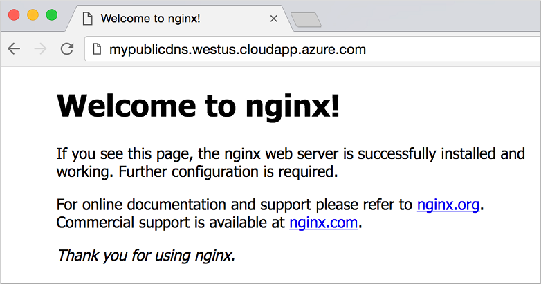

# <a name="create-a-docker-environment-in-azure-using-the-docker-vm-extension"></a>在 Azure 中使用 Docker VM 扩展创建 Docker 环境
Docker 是流行的容器管理和映像处理平台，用于在 Linux 上快速操作容器。 在 Azure 中，可以根据需要使用各种方式部署 Docker。 本文重点介绍如何通过 Azure CLI 2.0 使用 Docker VM 扩展和 Azure Resource Manager 模板。 也可以使用 [Azure CLI 1.0](dockerextension-nodejs.md) 执行这些步骤。

## <a name="azure-docker-vm-extension-overview"></a>Azure Docker VM 扩展概述
Azure Docker VM 扩展在 Linux 虚拟机 (VM) 中安装并配置 Docker 守护程序、Docker 客户端和 Docker Compose。 使用 Azure Docker VM 扩展，可以获得更多控制和功能，而不是只是使用 Docker Machine 或自己创建 Docker 主机。 借助这些附加功能（例如 [Docker Compose](https://docs.docker.com/compose/overview/)），Azure Docker VM 扩展可用于更可靠的开发人员或生产环境。

有关不同部署方法的详细信息，包括如何使用 Docker Machine，请参阅以下文章：
<!-- Not Available Azure Container Services -->

* 若要快速建立应用原型，可以使用 [Docker Machine](docker-machine.md) 创建一个 Docker 主机。
<!-- Not Available /container-service/ -->

## <a name="deploy-a-template-with-the-azure-docker-vm-extension"></a>使用 Azure Docker VM 扩展部署模板
让我们使用现有的快速入门模板，创建使用 Azure Docker VM 扩展来安装和配置 Docker 主机的 Ubuntu VM。 可以在此处查看模板：[使用 Docker 轻松部署 Ubuntu VM](https://github.com/Azure/azure-quickstart-templates/tree/master/docker-simple-on-ubuntu)。 需要安装最新的 [Azure CLI 2.0](https://docs.azure.cn/zh-cn/cli/install-az-cli2?view=azure-cli-latest) 并已使用 [az login](https://docs.azure.cn/zh-cn/cli/?view=azure-cli-latest#login) 登录到 Azure 帐户。

[!INCLUDE [azure-cli-2-azurechinacloud-environment-parameter](../../../includes/azure-cli-2-azurechinacloud-environment-parameter.md)]

首先，使用 [az group create](https://docs.azure.cn/zh-cn/cli/group?view=azure-cli-latest#create) 创建资源组。 以下示例在“chinaeast”位置创建名为“myResourceGroup”的资源组：

```azurecli
az group create --name myResourceGroup --location chinaeast
```

接下来，使用 [az group deployment create](https://docs.azure.cn/zh-cn/cli/group/deployment?view=azure-cli-latest#create) 部署 VM，其中包含 [GitHub 中此 Azure Resource Manager 模板](https://github.com/Azure/azure-quickstart-templates/tree/master/docker-simple-on-ubuntu)中的 Azure Docker VM 扩展。 出现提示时，为 newStorageAccountName、adminUsername、adminPassword 和 dnsNameForPublicIP 提供自己的唯一值：

>[!NOTE]
> 必须修改从 GitHub 存储库“azure-quickstart-templates”下载的模板，以适应 Azure 中国云环境。 例如，替换某些终结点（将“blob.core.windows.net”替换为“blob.core.chinacloudapi.cn”，将“cloudapp.azure.com”替换为“cloudapp.chinacloudapi.cn”）；更改某些不受支持的 VM 映像。


```azurecli
# download the azuredeploy.json with https://raw.githubusercontent.com/Azure/azure-quickstart-templates/master/docker-simple-on-ubuntu/azuredeploy.json
az group deployment create --resource-group myResourceGroup `
  --template-file ./azuredeploy.json `
  --parameters newStorageAccountName=mystorageaccount adminUsername=azureadmin adminPassword=P@ssw0rd! dnsNameForPublicIP=mypublicdns vmSize=Standard_A1
```
<!--parameters using KEY=VALUE, the json format popup some convert error -->

需要几分钟才能完成部署。

## <a name="deploy-your-first-nginx-container"></a>部署第一个 NGINX 容器
若要查看 VM 的详细信息（包括 DNS 名称），请使用 [az vm show](https://docs.azure.cn/zh-cn/cli/vm?view=azure-cli-latest#show)：

```azurecli
az vm show \
    --resource-group myResourceGroup \
    --name myDockerVM \
    --show-details \
    --query [fqdns] \
    --output tsv
```

通过 SSH 连接到新的 Docker 主机。 提供来自前面步骤的自己的用户名和 DNS 名称：

```bash
ssh azureuser@mypublicdns.chinaeast.cloudapp.chinacloudapi.cn
```

登录到 Docker 主机后，运行 NGINX 容器：

```bash
sudo docker run -d -p 80:80 nginx
```

下载 NGINX 映像并启动容器时，输出结果类似于以下示例：

```bash
Unable to find image 'nginx:latest' locally
latest: Pulling from library/nginx
efd26ecc9548: Pull complete
a3ed95caeb02: Pull complete
a48df1751a97: Pull complete
8ddc2d7beb91: Pull complete
Digest: sha256:2ca2638e55319b7bc0c7d028209ea69b1368e95b01383e66dfe7e4f43780926d
Status: Downloaded newer image for nginx:latest
b6ed109fb743a762ff21a4606dd38d3e5d35aff43fa7f12e8d4ed1d920b0cd74
```

检查在 Docker 主机上运行的容器的状态，如下所示：

```bash
sudo docker ps
```

输出类似于以下示例，它显示 NGINX 容器正在运行，且正在转发 TCP 端口 80 和 443：

```bash
CONTAINER ID        IMAGE               COMMAND                  CREATED              STATUS              PORTS                         NAMES
b6ed109fb743        nginx               "nginx -g 'daemon off"   About a minute ago   Up About a minute   0.0.0.0:80->80/tcp, 443/tcp   adoring_payne
```

若要查看容器的运行情况，请打开 Web 浏览器并输入 Docker 主机的 DNS 名称：



## <a name="azure-docker-vm-extension-template-reference"></a>Azure Docker VM 扩展模板参考
之前的示例使用现有的快速入门模板。 也可以使用自己的 Resource Manager 模板部署 Azure Docker VM 扩展。 为此，请将以下内容添加到资源管理器模板，并适当地定义 VM 的 `vmName`：

```json
{
  "type": "Microsoft.Compute/virtualMachines/extensions",
  "name": "[concat(variables('vmName'), '/DockerExtension'))]",
  "apiVersion": "2015-05-01-preview",
  "location": "[parameters('location')]",
  "dependsOn": [
    "[concat('Microsoft.Compute/virtualMachines/', variables('vmName'))]"
  ],
  "properties": {
    "publisher": "Microsoft.Azure.Extensions",
    "type": "DockerExtension",
    "typeHandlerVersion": "1.*",
    "autoUpgradeMinorVersion": true,
    "settings": {},
    "protectedSettings": {}
  }
}
```

有关更详细的资源管理器模板用法演练，请阅读 [Azure 资源管理器概述](../../azure-resource-manager/resource-group-overview.md)。

## <a name="next-steps"></a>后续步骤
可能需要使用 [Docker Compose](https://docs.docker.com/compose/overview/) [配置 Docker 守护程序 TCP 端口](https://docs.docker.com/engine/reference/commandline/dockerd/#/bind-docker-to-another-hostport-or-a-unix-socket)，了解 [Docker 安全性](https://docs.docker.com/engine/security/security/)或部署容器。 有关 Azure Docker VM 扩展本身的详细信息，请参阅 [GitHub 项目](https://github.com/Azure/azure-docker-extension/)。

阅读有关 Azure 中其他 Docker 部署选项的详细信息：

* [通过 Azure 驱动程序使用 Docker Machine](docker-machine.md)  
* [开始使用 Docker 和 Compose，在 Azure 虚拟机上定义和运行多容器应用程序](docker-compose-quickstart.md)。
<!-- Not Available * [Deploy an Azure Container Service cluster](../../container-service/dcos-swarm/container-service-deployment.md)-->

<!--Update_Description: update meta properties， update link, update cmdlet -->
