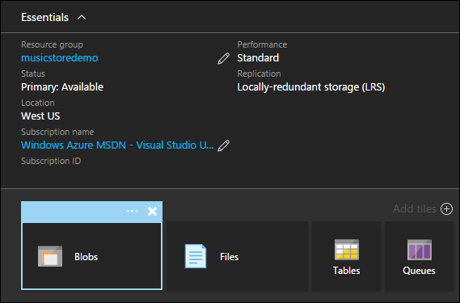
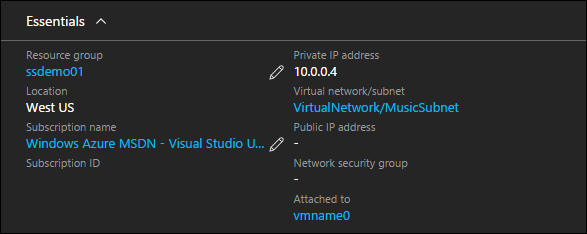
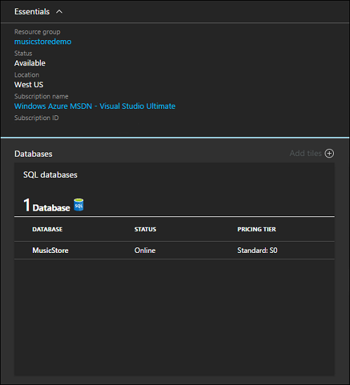

# 使用 Azure Resource Manager 模板的应用程序体系结构

开发 Azure Resource Manager 部署时，需要将计算要求映射到 Azure 资源和服务。如果应用程序由多个 http 终结点、一个数据库和一个数据缓存服务组成，则需要合理化托管其中每个组件的 Azure 资源。例如，示例音乐应用商店应用程序包含一个托管在虚拟机上的 Web 应用程序，以及一个托管在 Azure SQL 数据库中的 SQL 数据库。

本文档详细说明如何在示例 Azure Resource Manager 模板中配置音乐应用商店计算资源。所有依赖项和独特配置都已突出显示。为了获得最佳体验，请将一个解决方案实例预先部署到 Azure 订阅，然后将它与 Azure Resource Manager 模板配合运行。可通过以下链接找到完整模板 – [Ubuntu 上的音乐应用商店部署](https://github.com/Microsoft/dotnet-core-sample-templates/tree/master/dotnet-core-music-linux)。

## 虚拟机

音乐应用商店应用程序包含一个可供客户浏览和购买音乐的 Web 应用程序。尽管有多个 Azure 服务可以托管 Web 应用程序，但本示例使用的是虚拟机。使用示例音乐应用商店模板可以部署虚拟机、安装 Web 服务器，以及安装并配置音乐应用商店网站。本文只详细说明虚拟机部署。Web 服务器和应用程序的配置在下一篇文章中详细说明。

可通过使用 Visual Studio 中的“添加新资源”向导或者在部署模板中插入有效的 JSON，将虚拟机添加到模板。部署虚拟机时，还需要几个相关的资源。如果使用 Visual Studio 来创建模板，系统将自动创建这些资源。如果手动构造模板，则需要插入并配置这些资源。

单击以下链接可查看 Resource Manager 模板中的 JSON 示例 – [虚拟机 JSON](https://github.com/Microsoft/dotnet-core-sample-templates/blob/master/dotnet-core-music-linux/azuredeploy.json#L295)。

```json
{
  "apiVersion": "2015-06-15",
  "type": "Microsoft.Compute/virtualMachines",
  "name": "[concat(variables('vmName'),copyindex())]",
  "location": "[resourceGroup().location]",
  "copy": {
    "name": "virtualMachineLoop",
    "count": "[parameters('numberOfInstances')]"
  },
  "tags": {
    "displayName": "virtual-machine"
  },
  "dependsOn": [
    "[concat('Microsoft.Storage/storageAccounts/', variables('vhdStorageName'))]",
    "[concat('Microsoft.Compute/availabilitySets/', variables('availabilitySetName'))]",
    "nicLoop"
  ],
  "properties": {
    "availabilitySet": {
      "id": "[resourceId('Microsoft.Compute/availabilitySets', variables('availabilitySetName'))]"
    },
      ........<truncated>  
    }
```

部署后，可以在 Azure 门户预览中查看虚拟机属性。

  

## 存储帐户

存储帐户有许多存储选项和功能。在 Azure 虚拟机的上下文中，存储帐户保存虚拟机的虚拟硬盘和其他任何数据磁盘。音乐应用商店示例包含一个存储帐户，其中保存了部署中每个虚拟机的虚拟硬盘。

单击以下链接可查看 Resource Manager 模板中的 JSON 示例 – [存储帐户](https://github.com/Microsoft/dotnet-core-sample-templates/blob/master/dotnet-core-music-linux/azuredeploy.json#L109)。

```json
{
  "apiVersion": "2015-06-15",
  "type": "Microsoft.Storage/storageAccounts",
  "name": "[variables('vhdStorageName')]",
  "location": "[resourceGroup().location]",
  "tags": {
    "displayName": "storage-account"
  },
  "properties": {
    "accountType": "[variables('vhdStorageType')]"
  }
},
```

存储帐户与虚拟机 Resource Manager 模板声明中的某个虚拟机相关联。

单击以下链接可查看 Resource Manager 模板中的 JSON 示例 – [虚拟机与存储帐户的关联](https://github.com/Microsoft/dotnet-core-sample-templates/blob/master/dotnet-core-music-linux/azuredeploy.json#L341)。

```json
"osDisk": {
  "name": "osdisk",
  "vhd": {
    "uri": "[concat(reference(concat('Microsoft.Storage/storageAccounts/',variables('vhdStorageName')), '2015-06-15').primaryEndpoints.blob,'vhds/osdisk', copyindex(), '.vhd')]"
  },
  "caching": "ReadWrite",
  "createOption": "FromImage"
}
```

部署之后，可在 Azure 门户预览中查看存储帐户。

  

单击进入存储帐户 Blob 容器，即可查看使用模板部署的每个虚拟机的虚拟硬盘文件。

  

有关 Azure 存储的信息，请参阅 [Azure 存储文档](../../storage/index.md)。

## 虚拟网络

如果虚拟机需要内部网络功能（例如与其他虚拟机和 Azure 资源通信的功能），则需要配置 Azure 虚拟网络。创建虚拟网络不意味着能够从 Internet 访问虚拟机。公共连接需要一个公共 IP 地址，本系列教程的后续文章会详细说明。

单击以下链接可查看 Resource Manager 模板中的 JSON 示例 – [虚拟网络和子网](https://github.com/Microsoft/dotnet-core-sample-templates/blob/master/dotnet-core-music-linux/azuredeploy.json#L136)。

```json
{
  "apiVersion": "2015-06-15",
  "type": "Microsoft.Network/virtualNetworks",
  "name": "[variables('virtualNetworkName')]",
  "location": "[resourceGroup().location]",
  "dependsOn": [
    "[concat('Microsoft.Network/networkSecurityGroups/', variables('networkSecurityGroup'))]"
  ],
  "tags": {
    "displayName": "virtual-network"
  },
  "properties": {
    "addressSpace": {
      "addressPrefixes": [
        "10.0.0.0/24"
      ]
    },
    "subnets": [
      {
        "name": "[variables('subnetName')]",
        "properties": {
          "addressPrefix": "10.0.0.0/24",
          "networkSecurityGroup": {
            "id": "[resourceId('Microsoft.Network/networkSecurityGroups', variables('networkSecurityGroup'))]"
          }
        }
      }
    ]
  }
}
```

在 Azure 门户预览中，虚拟网络如下图所示。请注意，使用模板部署的所有虚拟机都已附加到虚拟网络。

  

## 网络接口

 网络接口将虚拟机连接到虚拟网络，更具体地说，是连接到虚拟网络中定义的子网。

 单击以下链接可查看 Resource Manager 模板中的 JSON 示例 – [网络接口](https://github.com/Microsoft/dotnet-core-sample-templates/blob/master/dotnet-core-music-linux/azuredeploy.json#L166)。

```json
{
  "apiVersion": "2015-06-15",
  "type": "Microsoft.Network/networkInterfaces",
  "name": "[concat(variables('networkInterfaceNamePrefix'), copyindex())]",
  "location": "[resourceGroup().location]",
  "tags": {
    "displayName": "network-interface"
  },
  "copy": {
    "name": "nicLoop",
    "count": "[parameters('numberOfInstances')]"
  },
  "dependsOn": [
    "[concat('Microsoft.Network/virtualNetworks/', variables('virtualNetworkName'))]",
    "[concat('Microsoft.Network/loadBalancers/', variables('loadBalancerName'))]",
    "[concat('Microsoft.Network/publicIPAddresses/', variables('publicIpAddressName'))]",
    "[concat('Microsoft.Network/loadBalancers/', variables('loadBalancerName'), '/inboundNatRules/', 'SSH-VM', copyIndex())]"
  ],
  "properties": {
    "ipConfigurations": [
      {
        "name": "ipconfig1",
        "properties": {
          "privateIPAllocationMethod": "Dynamic",
          "subnet": {
            "id": "[variables('subnetRef')]"
          },
          "loadBalancerBackendAddressPools": [
            {
              "id": "[variables('lbPoolID')]"
            }
          ],
          "loadBalancerInboundNatRules": [
            {
              "id": "[concat(variables('lbID'),'/inboundNatRules/SSH-VM', copyIndex())]"
            }
          ]
        }
      }
    ]
  }
}
```

每个虚拟机资源包含一个网络配置文件。网络接口在此配置文件中与虚拟机关联。

单击以下链接可查看 Resource Manager 模板中的 JSON 示例 – [虚拟机网络配置文件](https://github.com/Microsoft/dotnet-core-sample-templates/blob/master/dotnet-core-music-linux/azuredeploy.json#L350)。

```json
"networkProfile": {
  "networkInterfaces": [
    {
      "id": "[resourceId('Microsoft.Network/networkInterfaces', concat(variables('networkInterfaceNamePrefix'), copyindex()))]"
    }
  ]
}
```

在 Azure 门户预览中，网络接口如下图所示。可以在网络接口资源上看到内部 IP 地址与虚拟机的关联。

  

有关 Azure 虚拟网络的详细信息，请参阅 [Azure 虚拟网络文档](../../virtual-network/index.md)。

## Azure SQL 数据库

除了部署托管音乐应用商店网站的虚拟机以外，还需要部署一个 Azure SQL 数据库来托管音乐应用商店数据库。利用 Azure SQL 数据库的好处在于不需要构建另一组虚拟机，可将缩放性和可用性内置在服务中。

可以通过使用 Visual Studio 中的“添加新资源”向导或者在模板中插入有效的 JSON 来添加 Azure SQL 数据库。SQL Server 资源包括对 SQL 实例拥有管理权限的用户名和密码。此外，还要添加一个 SQL 防火墙资源。默认情况下，托管在 Azure 中的应用程序能够与 SQL 实例连接。若要允许外部应用程序（例如 SQL Server Management Studio）连接到 SQL 实例，需要配置防火墙。对于音乐应用商店演示而言，无需更改默认配置。

单击以下链接可查看 Resource Manager 模板中的 JSON 示例 – [Azure SQL 数据库](https://github.com/Microsoft/dotnet-core-sample-templates/blob/master/dotnet-core-music-linux/azuredeploy.json#L401)。

```json
{
  "apiVersion": "2014-04-01-preview",
  "type": "Microsoft.Sql/servers",
  "name": "[variables('musicStoreSqlName')]",
  "location": "[resourceGroup().location]",

  "dependsOn": [],
  "tags": {
    "displayName": "sql-music-store"
  },
  "properties": {
    "administratorLogin": "[parameters('adminUsername')]",
    "administratorLoginPassword": "[parameters('sqlAdminPassword')]"
  },
  "resources": [
    {
      "apiVersion": "2014-04-01-preview",
      "type": "firewallrules",
      "name": "firewall-allow-azure",
      "location": "[resourceGroup().location]",
      "dependsOn": [
        "[concat('Microsoft.Sql/servers/', variables('musicStoreSqlName'))]"
      ],
      "properties": {
        "startIpAddress": "0.0.0.0",
        "endIpAddress": "0.0.0.0"
      }
    }
  ]
}
```

Azure 门户预览中显示的 SQL Server 和 MusicStore 数据库视图。

  

有关部署 Azure SQL 数据库的详细信息，请参阅 [Azure SQL 数据库文档](../../sql-database/index.md)。

## 后续步骤

<hr>

[步骤 2 - Azure Resource Manager 模板中的访问权限和安全性](dotnet-core-3-access-security.md)

<!---HONumber=Mooncake_1114_2016-->