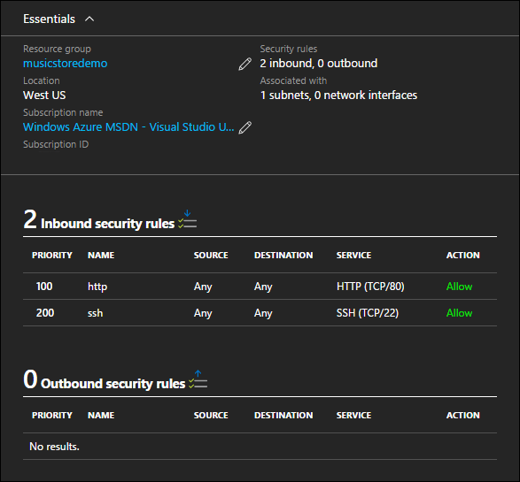

# Azure Resource Manager 模板中的访问权限和安全性

可能需要通过 Internet 或与 Azure 建立的 VPN/Express Route 连接才能访问托管在 Azure 中的应用程序。在音乐应用商店应用程序示例中，网站通过公共 IP 地址在 Internet 上提供访问。建立访问方式后，应该保护对应用程序的连接，以及对虚拟机资源本身的访问。这种访问安全性是通过网络安全组提供的。

本文档详细说明如何在示例 Azure Resource Manager 模板中保护音乐应用商店应用程序。所有依赖项和独特配置都已突出显示。为了获得最佳体验，请将一个解决方案实例预先部署到 Azure 订阅，然后将它与 Azure Resource Manager 模板配合运行。可通过以下链接找到完整模板 – [Ubuntu 上的音乐应用商店部署](https://github.com/Microsoft/dotnet-core-sample-templates/tree/master/dotnet-core-music-linux)。

## 公共 IP 地址

若要提供对 Azure 资源的公共访问，可以使用公共 IP 地址。可以使用静态或动态 IP 地址来配置公共 IP 地址。如果使用动态地址，当虚拟机被停止和解除分配时，系统将删除该地址。当计算机重新启动时，系统可能为它分配不同的公共 IP 地址。若要防止 IP 地址更改，可以使用保留 IP 地址。

可通过使用 Visual Studio 中的“添加新资源向导”或者在模板中插入有效 JSON，将公共 IP 地址添加到 Azure Resource Manager 模板中。

单击以下链接可查看 Resource Manager 模板中的 JSON 示例 – [公共 IP 地址](https://github.com/Microsoft/dotnet-core-sample-templates/blob/master/dotnet-core-music-linux/azuredeploy.json#L121)。

```json
{
  "apiVersion": "2015-06-15",
  "type": "Microsoft.Network/publicIPAddresses",
  "name": "[variables('publicipaddressName')]",
  "location": "[resourceGroup().location]",
  "tags": {
    "displayName": "public-ip-front"
  },
  "properties": {
    "publicIPAllocationMethod": "Dynamic",
    "dnsSettings": {
      "domainNameLabel": "[parameters('publicipaddressDnsName')]"
    }
  }
},
```

公共 IP 地址可与虚拟网络适配器或负载均衡器关联。在本示例中，由于音乐应用商店网站的负载在多个虚拟机之间均衡，因此公共 IP 地址已附加到负载均衡器。

单击以下链接可查看 Resource Manager 模板中的 JSON 示例 – [公共 IP 地址与负载均衡器的关联](https://github.com/Microsoft/dotnet-core-sample-templates/blob/master/dotnet-core-music-linux/azuredeploy.json#L208)。

```json
"frontendIPConfigurations": [
  {
    "properties": {
      "publicIPAddress": {
        "id": "[resourceId('Microsoft.Network/publicIPAddresses', variables('publicipaddressName'))]"
      }
    },
    "name": "LoadBalancerFrontend"
  }
],
```

Azure 门户预览中显示的公共 IP 地址。请注意，公共 IP 地址与负载均衡器而不是虚拟机关联。本系列教程的下一篇文档详细介绍了网络负载均衡器。

  

有关 Azure 公共 IP 地址的详细信息，请参阅 [Azure 中的 IP 地址](../../virtual-network/virtual-network-ip-addresses-overview-arm.md)。

## 网络安全组

与 Azure 资源建立访问后，应该对此访问进行限制。对于 Azure 虚拟机，可以使用网络安全组来实现保护访问的目的。在音乐应用商店应用程序示例中，除了通过端口 80 进行的 http 访问和通过端口 22 进行的 SSH 访问以外，所有对虚拟机的访问都受到限制。可通过使用 Visual Studio 中的“添加新资源向导”或者在模板中插入有效 JSON，将网络安全组添加到 Azure Resource Manager 模板中。

单击以下链接可查看 Resource Manager 模板中的 JSON 示例 – [网络安全组](https://github.com/Microsoft/dotnet-core-sample-templates/blob/master/dotnet-core-music-linux/azuredeploy.json#L68)。

```json
{
  "apiVersion": "2015-05-01-preview",
  "type": "Microsoft.Network/networkSecurityGroups",
  "name": "[variables('nsgfront')]",
  "location": "[resourceGroup().location]",
  "tags": {
    "displayName": "nsg-front"
  },
  "properties": {
    "securityRules": [
      {
        "name": "http",
        "properties": {
          "description": "http endpoint",
          "protocol": "Tcp",
          "sourcePortRange": "*",
          "destinationPortRange": "80",
          "sourceAddressPrefix": "*",
          "destinationAddressPrefix": "*",
          "access": "Allow",
          "priority": 100,
          "direction": "Inbound"
        }
      },
      ........<truncated> 
    ]
  }
},
```

在本示例中，网络安全组与虚拟网络资源中声明的子网对象关联。

单击以下链接可查看 Resource Manager 模板中的 JSON 示例 – [网络安全组与虚拟网络的关联](https://github.com/Microsoft/dotnet-core-sample-templates/blob/master/dotnet-core-music-linux/azuredeploy.json#L158)。

```json
"subnets": [
  {
    "name": "[variables('subnetName')]",
    "properties": {
      "addressPrefix": "10.0.0.0/24",
      "networkSecurityGroup": {
        "id": "[resourceId('Microsoft.Network/networkSecurityGroups', variables('networkSecurityGroup'))]"
      }
    }
  }
```

Azure 门户预览中的网络安全组如下所示。请注意，NSG 可与子网和/或网络接口关联。在本例中，NSG 与子网关联。在此配置中，入站规则应用到与子网连接的所有虚拟机。

  

有关网络安全组的深入信息，请参阅[什么是网络安全组](../../virtual-network/virtual-networks-nsg.md)。

## 后续步骤

<hr>

[步骤 3 - Azure Resource Manager 模板的可用性和缩放](dotnet-core-4-availability-scale.md)

<!---HONumber=Mooncake_1114_2016-->