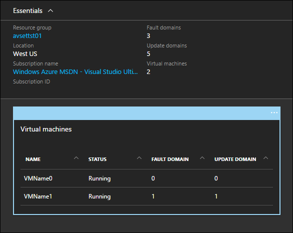
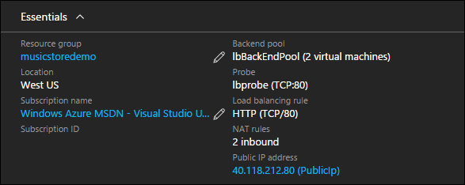
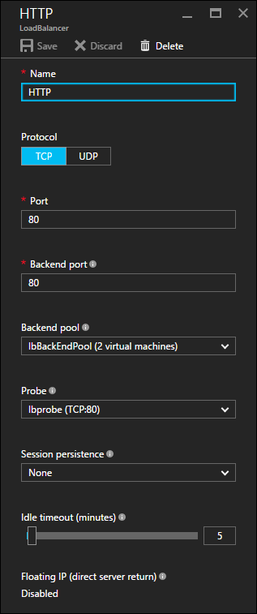
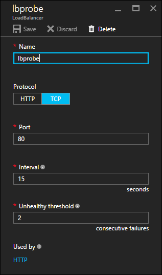
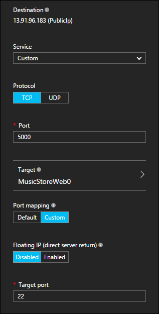

# Azure Resource Manager 模板的可用性和缩放
可用性和缩放是指满足特定需求而要达到的运行时间与能力。如果应用程序必须在 99.9% 的时间保持运行状态，则就需要一个允许多个并发计算资源的体系结构。例如，具有较高程度可用性的配置不会使用单个网站，而是使用同一站点的多个实例，这些实例采用均衡技术。在此配置中，可以关闭一个应用程序实例进行维护，剩余的实例继续正常运行。另一方面，缩放是指应用程序为需求提供服务的能力。使用负载均衡的应用程序时，在池中添加或删除实例，即可让应用程序根据需求缩放。

本文档详细说明如何针对可用性和缩放配置音乐应用商店示例部署。所有依赖项和独特配置都已突出显示。为了获得最佳体验，请将一个解决方案实例预先部署到 Azure 订阅，然后将它与 Azure Resource Manager 模板配合运行。可通过以下链接找到完整模板 – [Ubuntu 上的音乐应用商店部署](https://github.com/Microsoft/dotnet-core-sample-templates/tree/master/dotnet-core-music-linux)。

## 可用性集
可用性集以逻辑方式将 Azure 虚拟机分散在不同的物理主机与其他基础结构组件（例如电源和物理网络硬件）上。可用性集确保在维护期间，设备故障或其他停机事件不会影响到所有虚拟机。可通过使用 Visual Studio 中的“添加新资源向导”或者在模板中插入有效 JSON，将可用性集添加到 Azure Resource Manager 模板中。

单击以下链接可查看 Resource Manager 模板中的 JSON 示例 – [可用性集](https://github.com/Microsoft/dotnet-core-sample-templates/blob/master/dotnet-core-music-linux/azuredeploy.json#L387)。

```
{
  "apiVersion": "2015-06-15",
  "type": "Microsoft.Compute/availabilitySets",
  "name": "[variables('availabilitySetName')]",
  "location": "[resourceGroup().location]",
  "dependsOn": [],
  "tags": {
    "displayName": "avalibility-set"
  },
  "properties": {
    "platformUpdateDomainCount": 5,
    "platformFaultDomainCount": 3
  }
}
```

可用性集声明为虚拟机资源的属性。

单击以下链接可查看 Resource Manager 模板中的 JSON 示例 – [可用性集与虚拟机的关联](https://github.com/Microsoft/dotnet-core-sample-templates/blob/master/dotnet-core-music-linux/azuredeploy.json#L313)。

```
"properties": {
  "availabilitySet": {
    "id": "[resourceId('Microsoft.Compute/availabilitySets', variables('availabilitySetName'))]"
  }
```

Azure 门户预览中显示的可用性集。下面说明了每个虚拟机及其配置的详细信息。

  

有关可用性集的深入信息，请参阅 [Manage availability of virtual machines](manage-availability.md)（管理虚拟机的可用性）。

## 网络负载均衡器
可用性集提供应用程序容错能力，而负载均衡器可让单个网络地址上有多个应用程序实例可供使用。多个应用程序实例可以托管在多个虚拟机上，每个虚拟机都连接到负载均衡器。访问应用程序时，负载均衡器将传入请求路由到每个附加的成员。可以通过使用 Visual Studio 中的“添加新资源向导”或者在 Azure Resource Manager 模板中插入格式正确的 JSON 资源，来添加负载均衡器。

单击以下链接可查看 Resource Manager 模板中的 JSON 示例 – [网络负载均衡器](https://github.com/Microsoft/dotnet-core-sample-templates/blob/master/dotnet-core-music-linux/azuredeploy.json#L208)。

```
{
  "apiVersion": "2015-06-15",
  "type": "Microsoft.Network/loadBalancers",
  "name": "[variables('loadBalancerName')]",
  "location": "[resourceGroup().location]",
  "tags": {
    "displayName": "load-balancer-front"
  },
  ........<truncated>
}
```

由于示例应用程序通过公共 IP 地址向 Internet 公开，因此，此地址与负载均衡器关联。

单击以下链接可查看 Resource Manager 模板中的 JSON 示例 – [网络负载均衡器与公共 IP 地址的关联](https://github.com/Microsoft/dotnet-core-sample-templates/blob/master/dotnet-core-music-linux/azuredeploy.json#L221)。

```
"frontendIPConfigurations": [
  {
    "properties": {
      "publicIPAddress": {
        "id": "[resourceId('Microsoft.Network/publicIPAddresses', variables('publicipaddressName'))]"
      }
    },
    "name": "LoadBalancerFrontend"
  }
]
```

在 Azure 门户预览中，网络负载均衡器概述显示了与公共 IP 地址的关联。

  

## 负载均衡器规则
使用负载均衡器时，可配置规则来控制如何在各个目标资源之间均衡流量。在示例音乐应用商店应用程序中，流量将进入公共 IP 地址的端口 80，然后分发到所有虚拟机的端口 80。

单击以下链接可查看 Resource Manager 模板中的 JSON 示例 – [负载均衡器规则](https://github.com/Microsoft/dotnet-core-sample-templates/blob/master/dotnet-core-music-linux/azuredeploy.json#L270)。

```
"loadBalancingRules": [
  {
    "name": "[variables('loadBalencerRule')]",
    "properties": {
      "frontendIPConfiguration": {
        "id": "[concat(resourceId('Microsoft.Network/loadBalancers', variables('loadBalancerName')), '/frontendIPConfigurations/LoadBalancerFrontend')]"
      },
      "backendAddressPool": {
        "id": "[variables('lbPoolID')]"
      },
      "protocol": "Tcp",
      "frontendPort": 80,
      "backendPort": 80,
      "enableFloatingIP": false,
      "idleTimeoutInMinutes": 5,
      "probe": {
        "id": "[variables('lbProbeID')]"
      }
    }
  }
]
```

门户中显示的网络负载均衡器规则。

  

## 负载均衡器探测
负载均衡器还需要监视每个虚拟机，以便只将请求提供给正在运行的系统。这种监视通过不断探测预定义的端口来进行。音乐应用商店部署配置为探测所有包含的虚拟机上的端口 80。

单击以下链接可查看 Resource Manager 模板中的 JSON 示例 – [负载均衡器探测](https://github.com/Microsoft/dotnet-core-sample-templates/blob/master/dotnet-core-music-linux/azuredeploy.json#L257)。

```
"probes": [
  {
    "properties": {
      "protocol": "Tcp",
      "port": 80,
      "intervalInSeconds": 15,
      "numberOfProbes": 2
    },
    "name": "lbprobe"
  }
]
```

Azure 门户预览中显示的负载均衡器探测。

  

## 入站 NAT 规则
使用负载均衡器时，需要部署规则来提供对每个虚拟机的非负载均衡访问。例如，与每个虚拟机创建 SSH 连接时，不应该对此流量进行负载均衡，而应配置一个预先确定的路径。预先确定的路径是使用入站 NAT 规则资源配置的。使用此资源可将入站通信映射到各个虚拟机。

在音乐应用商店应用程序中，从 5000 开始的端口映射到每个虚拟机上的端口 22，实现 SSH 访问。使用 `copyindex()` 函数可以递增传入端口，使第二个虚拟机接收传入端口 5001，第三个虚拟机接收 5002，依此类推。

单击以下链接可查看 Resource Manager 模板中的 JSON 示例 – [入站 NAT 规则](https://github.com/Microsoft/dotnet-core-sample-templates/blob/master/dotnet-core-music-linux/azuredeploy.json#L270)。

```
{
  "apiVersion": "2015-06-15",
  "type": "Microsoft.Network/loadBalancers/inboundNatRules",
  "name": "[concat(variables('loadBalancerName'), '/', 'SSH-VM', copyIndex())]",
  "tags": {
    "displayName": "load-balancer-nat-rule"
  },
  "location": "[resourceGroup().location]",
  "copy": {
    "name": "lbNatLoop",
    "count": "[parameters('numberOfInstances')]"
  },
  "dependsOn": [
    "[concat('Microsoft.Network/loadBalancers/', variables('loadBalancerName'))]"
  ],
  "properties": {
    "frontendIPConfiguration": {
      "id": "[variables('ipConfigID')]"
    },
    "protocol": "tcp",
    "frontendPort": "[copyIndex(5000)]",
    "backendPort": 22,
    "enableFloatingIP": false
  }
}
```

Azure 门户预览中显示的一个示例入站 NAT 规则。在部署中为每个虚拟机创建一个 SSH NAT 规则。

  

有关 Azure 网络负载均衡器的深入信息，请参阅 [Azure 基础结构服务的负载均衡](../../load-balancer/load-balancer-overview.md)。

## 部署多个 VM
最后，为使可用性集或负载均衡器有效运行，需要部署多个虚拟机。可以使用 Azure Resource Manager 模板复制函数来部署多个 VM。使用复制函数时，不需要定义有限数量的虚拟机，而可以在部署时动态提供此值。复制函数使用要创建的实例数目，可以部署适当数目的虚拟机和关联的资源。

音乐应用商店示例模板中已定义一个提取实例计数的参数。创建虚拟机和相关资源时，将在整个模板中使用此数字。

```
"numberOfInstances": {
  "type": "int",
  "minValue": 1,
  "defaultValue": 1,
  "metadata": {
    "description": "Number of VM instances to be created behind load balancer."
  }
}
```

在虚拟机资源中，复制循环已命名，实例参数数目用于控制生成的副本数目。

单击以下链接可查看 Resource Manager 模板中的 JSON 示例 – [虚拟机复制函数](https://github.com/Microsoft/dotnet-core-sample-templates/blob/master/dotnet-core-music-linux/azuredeploy.json#L300)。

```
"apiVersion": "2015-06-15",
"type": "Microsoft.Compute/virtualMachines",
"name": "[concat(variables('vmName'),copyindex())]",
"location": "[resourceGroup().location]",
"copy": {
  "name": "virtualMachineLoop",
  "count": "[parameters('numberOfInstances')]"
}
```

可以使用 `copyIndex()` 函数访问复制函数的当前迭代。复制索引函数的值可用于命名虚拟机和其他资源。例如，如果部署了两个虚拟机实例，它们需要不同的名称。可将 `copyIndex()` 函数用作虚拟机名称的一部分来创建唯一名称。在虚拟机资源中可以看到一个用于命名目的的 `copyindex()` 函数示例。此处的计算机名称由 `vmName` 参数和 `copyIndex()` 函数串连而成。

单击以下链接可查看 Resource Manager 模板中的 JSON 示例 – [复制索引函数](https://github.com/Microsoft/dotnet-core-sample-templates/blob/master/dotnet-core-music-linux/azuredeploy.json#L319)。

```
"osProfile": {
  "computerName": "[concat(parameters('vmName'),copyindex())]",
  "adminUsername": "[parameters('adminUsername')]",
  "linuxConfiguration": {
    "disablePasswordAuthentication": "true",
    "ssh": {
      "publicKeys": [
        {
          "path": "[variables('sshKeyPath')]",
          "keyData": "[parameters('sshKeyData')]"
        }
      ]
    }
  }
}
```

`copyIndex` 函数在音乐应用商店示例模板中多次使用。利用 `copyIndex` 的资源和函数包括特定于单个虚拟机实例的任何对象，例如网络接口、负载均衡器规则以及依赖于函数的任何对象。

有关复制函数的详细信息，请参阅[在 Azure Resource Manager 中创建多个资源实例](../../azure-resource-manager/resource-group-create-multiple.md)。

## 后续步骤
<hr>

[步骤 4 - 使用 Azure Resource Manager 模板部署应用程序](dotnet-core-5-app-deployment.md)

<!---HONumber=Mooncake_1212_2016-->