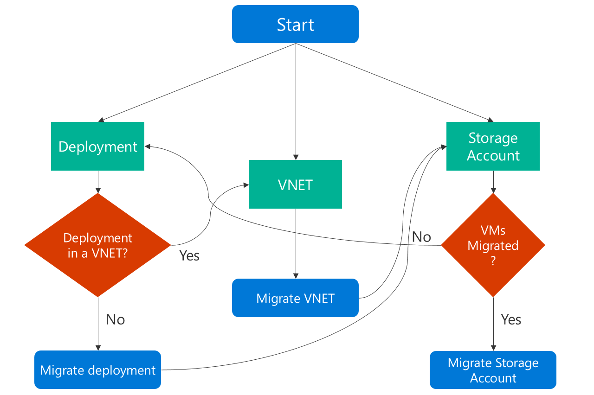

# <a name="migrate-iaas-resources-from-classic-to-azure-resource-manager-by-using-azure-cli"></a>使用 Azure CLI 将 IaaS 资源从经典部署模型迁移到 Azure Resource Manager 部署模型
以下步骤演示如何使用 Azure 命令行接口 (CLI) 命令将基础结构即服务 (IaaS) 资源从经典部署模型迁移到 Azure Resource Manager 部署模型。 本文中的操作需要 [Azure CLI](../../cli-install-nodejs.md)。

> [!NOTE]
> 此处描述的所有操作都是幂等的。 如果你遇到功能不受支持或配置错误以外的问题，建议你重试准备、中止或提交操作。 然后平台将重试操作。
> 
> 

<br>
下面是一个流程图，用于确定在迁移过程中需要执行步骤的顺序



## <a name="step-1-prepare-for-migration"></a>步骤 1：准备迁移
下面是建议你在将 IaaS 资源从经典部署模型迁移到 Resource Manager 部署模型时遵循的一些最佳实践：

* 请参阅[不受支持的配置或功能的列表](../windows/migration-classic-resource-manager-overview.md)。 如果虚拟机使用不受支持的配置或功能，建议你等到我们宣布支持该功能/配置时再进行迁移。 或者，可以删除该功能或移出该配置，以利迁移进行（如果这样做符合要求）。
* 如果你通过自动化脚本来部署目前的基础结构和应用程序，则可尝试使用这些脚本进行迁移，以便创建类似的测试性设置。 也可以使用 Azure 门户预览设置示例环境。

> [!IMPORTANT]
> 目前不支持通过应用程序网关从经典部署模型迁移到 Resource Manager 部署模型。 若要迁移带应用程序网关的经典虚拟网络，请先删除该网关，然后运行准备操作来移动网络。 完成迁移后，在 Azure Resource Manager 中重新连接该网关。 
>
>无法自动迁移其他订阅中连接到 ExpressRoute 线路的 ExpressRoute 网关。 此类情况下，请删除 ExpressRoute 网关、迁移虚拟网络并重新创建网关。 有关详细信息，请参阅[将 ExpressRoute 线路和关联的虚拟网络从经典部署模型迁移到 Resource Manager 部署模型](../../expressroute/expressroute-migration-classic-resource-manager.md)。
> 
> 

## <a name="step-2-set-your-subscription-and-register-the-provider"></a>步骤 2：设置订阅并注册提供程序
对于迁移方案，需要针对经典部署模型和 Resource Manager 部署模型设置环境。 [安装 Azure CLI](../../cli-install-nodejs.md) 并[选择订阅](../../xplat-cli-connect.md)。

登录到帐户。

    azure login -e AzureChinaCloud

使用以下命令选择 Azure 订阅。

    azure account set "<azure-subscription-name>"

> [!NOTE]
> 注册是一次性步骤，但必须在尝试迁移之前完成。 如果不注册，你会看到以下错误消息 
> 
> *BadRequest : Subscription is not registered for migration.* 
> 
> 

使用以下命令向迁移资源提供程序注册。 请注意，在某些情况下，此命令会超时。 但是，注册会成功。

    azure provider register Microsoft.ClassicInfrastructureMigrate

请等五分钟让注册完成。 可以使用以下命令来检查审批状态。 请确保在继续操作之前，RegistrationState 为 `Registered` 。

    azure provider show Microsoft.ClassicInfrastructureMigrate

现在请将 CLI 切换到 `asm` 模式。

    azure config mode asm

## <a name="step-3-make-sure-you-have-enough-azure-resource-manager-virtual-machine-cores-in-the-azure-region-of-your-current-deployment-or-vnet"></a>步骤 3：请确保在当前部署或 VNET 的 Azure 区域中有足够的 Azure Resource Manager 虚拟机核心
要执行此步骤，需要切换到 `arm` 模式。 使用以下命令执行此操作。

```
azure config mode arm
```

可以使用以下 CLI 命令检查当前 Azure Resource Manager 中已有的核心数量。 若要了解有关核心配额的详细信息，请参阅[限制和 Azure Resource Manager](../../azure-subscription-service-limits.md#limits-and-the-azure-resource-manager)。

```
azure vm list-usage -l "<Your VNET or Deployment's Azure region"
```

验证完此步骤后，可以切换回 `asm` 模式。

    azure config mode asm

## <a name="step-4-option-1---migrate-virtual-machines-in-a-cloud-service"></a>步骤 4：选项 1 - 迁移云服务中的虚拟机
使用以下命令获取云服务列表，然后选取要迁移的云服务。 请注意，如果云服务中的 VM 在虚拟网络中或者具有 Web/辅助角色，你将收到错误消息。

    azure service list

运行以下命令，从详细输出中获取云服务的部署名称。 在大多数情况下，部署名称与云服务名称相同。

    azure service show <serviceName> -vv

首先，使用以下命令验证用户是否可以迁移云服务：

```shell
azure service deployment validate-migration <serviceName> <deploymentName> new "" "" ""
```

准备迁移云服务中的虚拟机。 可以从两个选项中进行选择。

如果你想要将 VM 迁移到平台所创建的虚拟网络上，请使用以下命令。

    azure service deployment prepare-migration <serviceName> <deploymentName> new "" "" ""

如果你想要迁移到 Resource Manager 部署模型中的现有虚拟网络，请使用以下命令。

    azure service deployment prepare-migration <serviceName> <deploymentName> existing <destinationVNETResourceGroupName> <subnetName> <vnetName>

准备操作成功后，可以查看详细输出，以获取 VM 的迁移状态，并确保其处于 `Prepared` 状态。

    azure vm show <vmName> -vv

使用 CLI 或 Azure 门户预览查看准备好的资源的配置。 如果你尚未做好迁移准备，因此想要回到旧的状态，请使用以下命令。

    azure service deployment abort-migration <serviceName> <deploymentName>

如果准备好的配置看起来没问题，则可继续进行，使用以下命令提交资源。

    azure service deployment commit-migration <serviceName> <deploymentName>

## <a name="step-4-option-2----migrate-virtual-machines-in-a-virtual-network"></a>步骤 4：选项 2 - 迁移虚拟网络中的虚拟机
选取要迁移的虚拟网络。 请注意，如果虚拟网络包含的 Web/辅助角色或 VM 的配置不受支持，你将收到验证错误消息。

使用以下命令获取订阅中的所有虚拟网络。

    azure network vnet list

输出将如下所示：


在上面的示例中，**virtualNetworkName** 是完整名称 **"Group classicubuntu16 classicubuntu16"**。

首先，请使用以下命令验证用户是否可以迁移虚拟网络：

```shell
azure network vnet validate-migration <virtualNetworkName>
```

使用以下命令来准备要迁移的所选虚拟网络。

    azure network vnet prepare-migration <virtualNetworkName>

使用 CLI 或 Azure 门户预览查看准备好的虚拟机的配置。 如果你尚未做好迁移准备，因此想要回到旧的状态，请使用以下命令。

    azure network vnet abort-migration <virtualNetworkName>

如果准备好的配置看起来没问题，则可继续进行，使用以下命令提交资源。

    azure network vnet commit-migration <virtualNetworkName>

## <a name="step-5-migrate-a-storage-account"></a>步骤 5：迁移存储帐户
完成虚拟机迁移之后，建议你迁移存储帐户。

使用以下命令来准备要迁移的存储帐户

    azure storage account prepare-migration <storageAccountName>

使用 CLI 或 Azure 门户预览查看准备好的存储帐户的配置。 如果你尚未做好迁移准备，因此想要回到旧的状态，请使用以下命令。

    azure storage account abort-migration <storageAccountName>

如果准备好的配置看起来没问题，则可继续进行，使用以下命令提交资源。

    azure storage account commit-migration <storageAccountName>

## <a name="next-steps"></a>后续步骤

* [平台支持的从经典部署模型到 Azure Resource Manager 部署模型的 IaaS 资源迁移概述](migration-classic-resource-manager-overview.md?toc=%2fvirtual-machines%2flinux%2ftoc.json)
* [有关平台支持的从经典部署模型到 Azure Resource Manager 部署模型的迁移的技术深入探讨](migration-classic-resource-manager-deep-dive.md?toc=%2fvirtual-machines%2flinux%2ftoc.json)
* [规划从经典部署模型到 Azure Resource Manager 的 IaaS 资源迁移](migration-classic-resource-manager-plan.md?toc=%2fvirtual-machines%2flinux%2ftoc.json)
* [使用 PowerShell 将 IaaS 资源从经典部署模型迁移到 Azure Resource Manager](../windows/migration-classic-resource-manager-ps.md?toc=%2fvirtual-machines%2fwindows%2ftoc.json)
* [用于帮助将 IaaS 资源从经典部署模型迁移到 Azure Resource Manager 部署模型的社区工具](../windows/migration-classic-resource-manager-community-tools.md?toc=%2fvirtual-machines%2fwindows%2ftoc.json)
* [查看最常见的迁移错误](migration-classic-resource-manager-errors.md?toc=%2fvirtual-machines%2flinux%2ftoc.json)
* [查看有关将 IaaS 资源从经典部署模型迁移到 Azure Resource Manager 部署模型的最常见问题](migration-classic-resource-manager-faq.md?toc=%2fvirtual-machines%2flinux%2ftoc.json)

