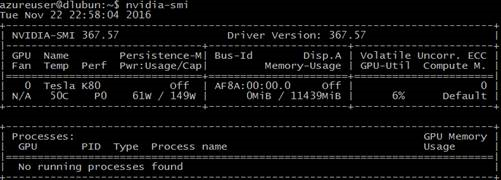

# <a name="install-nvidia-gpu-drivers-on-n-series-vms-running-linux"></a>在运行 Linux 的 N 系列 VM 上安装 NVIDIA GPU 驱动程序

若要利用运行 Linux 的 Azure N 系列 VM 的 GPU 功能，必须安装 NVIDIA GPU 驱动程序。 [NVIDIA GPU 驱动程序扩展](../extensions/hpccompute-gpu-linux.md)可在 N 系列 VM 上安装适当的 NVIDIA CUDA 或 GRID 驱动程序。 请使用 Azure 门户或工具（例如 Azure CLI 或 Azure 资源管理器模板）安装或管理该扩展。 有关受支持的分发版和部署步骤，请参阅 [NVIDIA GPU 驱动程序扩展文档](../extensions/hpccompute-gpu-linux.md)。

如果选择手动安装 GPU 驱动程序，本文提供了受支持的分发版、驱动程序以及安装和验证步骤。 针对 [Windows VM](../windows/n-series-driver-setup.md?toc=%2fvirtual-machines%2fwindows%2ftoc.json) 也提供了驱动程序手动安装信息。

有关 N 系列 VM 规格、存储容量和磁盘详细信息，请参阅 [GPU Linux VM 大小](sizes-gpu.md?toc=%2fvirtual-machines%2flinux%2ftoc.json)。 

[!INCLUDE [virtual-machines-n-series-linux-support](../../../includes/virtual-machines-n-series-linux-support.md)]

## <a name="install-cuda-drivers-on-n-series-vms"></a>在 N 系列 VM 上安装 CUDA 驱动程序

从 NVIDIA CUDA 工具包在 N 系列 VM 上安装 CUDA 驱动程序的步骤如下。 

C 和 C++ 开发人员可以选择安装完整的工具包来生成 GPU 加速应用程序。 有关详细信息，请参阅 [CUDA 安装指南](https://docs.nvidia.com/cuda/cuda-installation-guide-linux/index.html)。

要安装 CUDA 驱动程序，请建立到每个 VM 的 SSH 连接。 若要验证系统是否具有支持 CUDA 的 GPU，请运行以下命令：

```bash
lspci | grep -i NVIDIA
```
会看到类似于以下示例（显示 NVIDIA Tesla K80 卡）的输出：


然后，运行特定于分发的安装命令。

### <a name="ubuntu"></a>Ubuntu 

1. 从 NVIDIA 网站下载并安装 CUDA 驱动程序。 例如，对于 Ubuntu 16.04 LTS：
    ```bash
    CUDA_REPO_PKG=cuda-repo-ubuntu1604_10.0.130-1_amd64.deb

    wget -O /tmp/${CUDA_REPO_PKG} http://developer.download.nvidia.com/compute/cuda/repos/ubuntu1604/x86_64/${CUDA_REPO_PKG} 

    sudo dpkg -i /tmp/${CUDA_REPO_PKG}

    sudo apt-key adv --fetch-keys https://developer.download.nvidia.com/compute/cuda/repos/ubuntu1604/x86_64/7fa2af80.pub 

    rm -f /tmp/${CUDA_REPO_PKG}

    sudo apt-get update

    sudo apt-get install cuda-drivers
    ```

   安装可能需要几分钟。

2. 若要安装完整的 CUDA 工具包，请键入：

    ```bash
    sudo apt-get install cuda
    ```

3. 重新启动 VM，并继续验证安装。

#### <a name="cuda-driver-updates"></a>CUDA 驱动程序更新

在部署后，建议定期更新 CUDA 驱动程序。

```bash
sudo apt-get update

sudo apt-get upgrade -y

sudo apt-get dist-upgrade -y

sudo apt-get install cuda-drivers

sudo reboot
```

### <a name="centos"></a>CentOS

<!-- Not Available on Red Hat Enterprise Linux 7.3 or 7.4-->

1. 更新内核（建议）。 如果选择不更新内核，请确保 `kernel-devel` 和 `dkms` 的版本适合你的内核。

    ```
    sudo yum install kernel kernel-tools kernel-headers kernel-devel

    sudo reboot
    ```

2. 安装最新的[适用于 Hyper-V 和 Azure 的 Linux 集成服务](https://www.microsoft.com/download/details.aspx?id=55106)。

    ```bash
    wget https://aka.ms/lis

    tar xvzf lis

    cd LISISO

    sudo ./install.sh

    sudo reboot
    ```

3. 重新连接到 VM 并使用以下命令继续安装：

    ```bash
    sudo rpm -Uvh https://dl.fedoraproject.org/pub/epel/epel-release-latest-7.noarch.rpm

    sudo yum install dkms

    CUDA_REPO_PKG=cuda-repo-rhel7-10.0.130-1.x86_64.rpm

    wget http://developer.download.nvidia.com/compute/cuda/repos/rhel7/x86_64/${CUDA_REPO_PKG} -O /tmp/${CUDA_REPO_PKG}

    sudo rpm -ivh /tmp/${CUDA_REPO_PKG}

    rm -f /tmp/${CUDA_REPO_PKG}

    sudo yum install cuda-drivers
    ```

    安装可能需要几分钟。 

4. 若要安装完整的 CUDA 工具包，请键入：

    ```bash
    sudo yum install cuda
    ```

5. 重新启动 VM，并继续验证安装。

### <a name="verify-driver-installation"></a>验证驱动程序安装

要查询 GPU 设备状态，请建立到 VM 的 SSH 连接，并运行与驱动程序一起安装的 [nvidia-smi](https://developer.nvidia.com/nvidia-system-management-interface) 命令行实用工具。 

如果安装了驱动程序，将看到如下输出。 请注意，除非当前正在 VM 上运行 GPU 工作负荷，否则 GPU-Util 将显示 0%。 驱动程序版本和 GPU 详细信息可能与所示的内容不同。



## <a name="rdma-network-connectivity"></a>RDMA 网络连接

可以在同一可用性集或 VM 规模集的单个放置组中部署的支持 RDMA 的 N 系列 VM（如 NC24r）上启用 RDMA 网络连接。 对于使用 Intel MPI 5.x 或更高版本运行的应用程序，RDMA 网络支持消息传递接口 (MPI) 流量。 其他要求如下：

### <a name="distributions"></a>分发

在 N 系列 VM 上，在支持 RDMA 连接的 Azure 市场中，从以下映像之一部署支持 RDMA 的 N 系列 VM：

* **Ubuntu 16.04 LTS** - 在 VM 上配置 RDMA 驱动程序，并注册 Intel 下载 Intel MPI：

  [!INCLUDE [virtual-machines-common-ubuntu-rdma](../../../includes/virtual-machines-common-ubuntu-rdma.md)]

* **基于 CentOS 的 7.4 HPC** - 在 VM 上安装 RDMA 驱动程序和 Intel MPI 5.1。

<!--Not Available on ## Install GRID drivers on NV or NVv2-series VMs-->

## <a name="troubleshooting"></a>故障排除

* 可以使用 `nvidia-smi` 设置持久性模式，以便在需要查询卡时该命令的输出更快。 若要设置持久性模式，请执行 `nvidia-smi -pm 1`。 请注意，如果重启 VM，此模式设置将消失。 你可以始终将该模式设置编写为在启动时执行。

## <a name="next-steps"></a>后续步骤

* 若要捕获安装了 NVIDIA 驱动程序的 Linux VM 映像，请参阅[如何通用化和捕获 Linux 虚拟机](capture-image.md?toc=%2fvirtual-machines%2flinux%2ftoc.json)。

<!-- Update_Description: update meta properties -->
