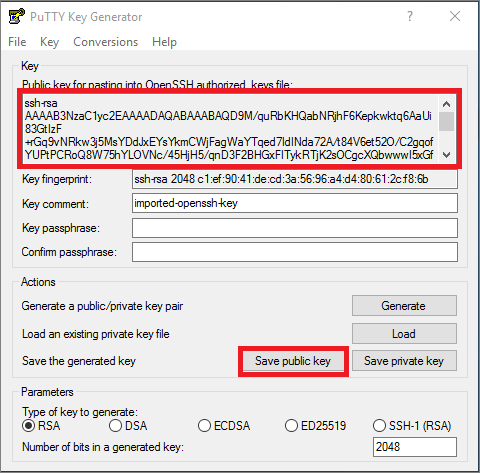
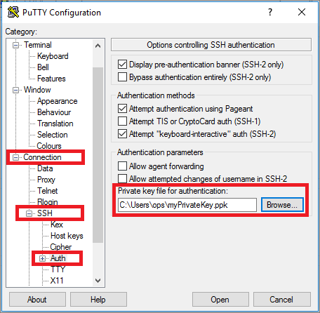

# <a name="how-to-use-ssh-keys-with-windows-on-azure"></a>如何在 Azure 上将 SSH 密钥与 Windows 配合使用

本文介绍了如何在 Windows 计算机上生成和使用安全外壳 (SSH) 密钥以在 Azure 中创建并连接到 Linux 虚拟机 (VM)。 若要使用来自 Linux 或 macOS 客户端的 SSH 密钥，请参阅[快速](mac-create-ssh-keys.md)或[详细](create-ssh-keys-detailed.md)指南。

[!INCLUDE [virtual-machines-common-ssh-overview](../../../includes/virtual-machines-common-ssh-overview.md)]

[!INCLUDE [virtual-machines-common-ssh-support](../../../includes/virtual-machines-common-ssh-support.md)]

## <a name="windows-packages-and-ssh-clients"></a>Windows 程序包和 SSH 客户端
可使用 *SSH 客户端*连接到 Azure 中的 Linux VM，并对其进行管理。 运行 Linux 或 macOS 的计算机通常具有一套 SSH 命令来生成和管理 SSH 密钥并建立 SSH 连接。 

Windows 计算机并不总是装有类似的 SSH 命令。 最新版本的 Windows 10 提供 [OpenSSH 客户端命令](https://blogs.msdn.microsoft.com/commandline/2018/03/07/windows10v1803/)来创建和管理 SSH 密钥，并通过命令提示符建立 SSH 连接。 最近的 Windows 10 版本还包括[适用于 Linux 的 Windows 子系统](https://docs.microsoft.com/zh-cn/windows/wsl/about)，以便在 Bash shell 中以本机方式运行并访问 SSH 客户端等实用工具。 

以下程序包中包含可以在本地安装的其他常见 Windows SSH 客户端：

* [PuTTY](http://www.chiark.greenend.org.uk/~sgtatham/putty/)
* [Git For Windows](https://git-for-windows.github.io/)
* [MobaXterm](http://mobaxterm.mobatek.net/)
* [Cygwin](https://cygwin.com/)

<!-- Not Available on [Azure Cloud Shell](../../cloud-shell/overview.md)-->

## <a name="create-an-ssh-key-pair"></a>创建 SSH 密钥对
以下各部分介绍了在 Windows 上创建 SSH 密钥对的两种选项。 可以使用 shell 命令 (`ssh-keygen`) 或 GUI 工具 (PuTTYgen)。

### <a name="create-ssh-keys-with-ssh-keygen"></a>使用 ssh-keygen 创建 SSH 密钥

如果在 Windows 上运行支持 SSH 客户端工具的命令外壳，请使用 `ssh-keygen` 命令创建 SSH 密钥对。 键入以下命令，并回答提示。 如果所选的位置中存在 SSH 密钥对，则这些文件将被覆盖。 
<!-- Not Available on (or Bash in Azure Cloud Shell) -->

```bash
ssh-keygen -t rsa -b 2048
```

有关详细背景和信息，请参阅使用 `ssh-keygen` 创建 SSH 密钥的[快速](mac-create-ssh-keys.md)或[详细](create-ssh-keys-detailed.md)步骤。

### <a name="create-ssh-keys-with-puttygen"></a>使用 PuTTYgen 创建 SSH 密钥

如果更喜欢使用基于 GUI 的工具创建 SSH 密钥，可使用 [PuTTY 下载包](http://www.chiark.greenend.org.uk/~sgtatham/putty/download.html)附带的 PuTTYgen 密钥生成器。 

使用 PuTTYgen 创建 SSH RSA 密钥对：

1. 启动 PuTTYgen。

2. 单击“生成”。 默认情况下，PuTTYgen 生成一个 2048 位的 SSH-2 RSA 密钥。

4. 在空白区域中四处移动鼠标指针来为密钥提供随机性。

5. 生成公钥后，可选择输入并确认通行短语。 使用 SSH 私钥面向 VM 进行身份验证时，系统会提示输入通行短语。 如果有人获取了私钥但没有通行短语，他们可以登录到使用该密钥的任何 VM 或服务。 我们建议创建一个通行短语。 但是，如果你忘记了通行短语，将没有办法恢复它。

6. 公钥会显示在窗口的顶部。 创建 Linux VM 时，可以复制此完整公钥并将其粘贴到 Azure 门户或 Azure 资源管理器模板中。 也可以选择“保存公钥”将副本保存到计算机中：

    

7. （可选）若要将私钥以 PuTTy 私钥格式（.ppk 文件）保存，请选择“保存私钥”。 稍后在使用 PuTTY 通过 SSH 连接到 VM 时将需要该 .ppk 文件。

    

    如果要将私钥以 OpenSSH 格式（许多 SSH 客户端使用的私钥格式）保存，请选择“转换” > “导出 OpenSSH 密钥”。

## <a name="provide-an-ssh-public-key-when-deploying-a-vm"></a>部署 VM 时提供 SSH 公钥

若要创建使用 SSH 密钥进行身份验证的 Linux VM，请在使用 Azure 门户或其他方法创建 VM 时提供 SSH 公钥。

以下示例演示在创建 Linux VM 时，如何复制此公钥并将其粘贴到 Azure 门户中。 然后，公钥通常将存储在新 VM 上的 ~/.ssh/authorized_key 目录中。

   

## <a name="connect-to-your-vm"></a>连接到 VM

在 Windows 中建立 SSH 以连接 Linux VM 的方法之一是使用 SSH 客户端。 如果 Windows 系统上安装了 SSH 客户端，这是首选方法。 如果更喜欢基于 GUI 的工具，可使用 PuTTY 进行连接。  
<!-- Not Available on or you use SSH tools in Bash in Azure Cloud Shell-->

### <a name="use-an-ssh-client"></a>使用 SSH 客户端
凭借部署在 Azure VM 上的公钥和本地系统上的私钥，使用 VM 的 IP 地址或 DNS 名称通过 SSH 连接到 VM。 将以下命令中的 *azureuser* 和 *myvm.chinanorth.cloudapp.chinacloudapi.cn* 替换为管理员用户名和完全限定的域名（或 IP 地址）：

```bash
ssh azureuser@myvm.chinanorth.cloudapp.chinacloudapi.cn
```

如果创建密钥对时配置了通行短语，则在登录过程中遇到提示时，请输入该通行短语。

### <a name="connect-with-putty"></a>通过 PuTTY 连接

如果安装了 [PuTTY 下载包](http://www.chiark.greenend.org.uk/~sgtatham/putty/download.html)并且之前生成了 PuTTY 私钥 (.ppk) 文件，则可以通过 PuTTY 连接到 Linux VM。

1. 启动 PuTTY。

2. 在 Azure 门户中填写 VM 的主机名或 IP 地址：

    

3. 选择“连接” > “SSH” > “身份验证”类别。 浏览并选择 PuTTY 私钥（.ppk 文件）：

    

4. 单击“打开”以连接到 VM。

## <a name="next-steps"></a>后续步骤

* 有关使用 SSH 密钥的详细步骤、选项以及高级示例，请参阅[创建 SSH 密钥对的详细步骤](create-ssh-keys-detailed.md)。

<!-- Not Available on [PowerShell quickstart](../../cloud-shell/quickstart-powershell.md#ssh)-->

* 如果在使用 SSH 连接到 Linux VM 时遇到麻烦，请参阅 [Troubleshoot SSH connections to an Azure Linux VM](troubleshoot-ssh-connection.md?toc=%2fvirtual-machines%2flinux%2ftoc.json)（通过 SSH 连接到 Azure Linux VM 故障排除）。

<!-- Update_Description: update meta properties, wording update, update link -->