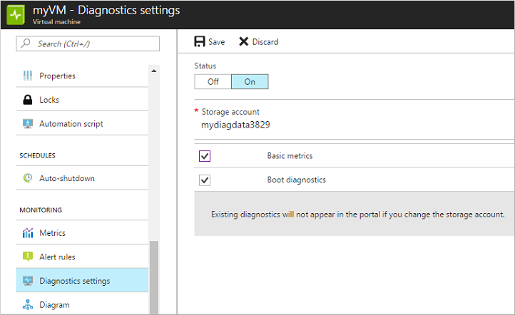

<a id="how-to-monitor-a-linux-virtual-machine-in-azure" class="xliff"></a>

# 如何监视 Azure 中的 Linux 虚拟机

为确保 Azure 中的虚拟机 (VM) 正常运行，可以查看启动诊断和性能指标。 本教程介绍如何执行下列操作：

> [!div class="checklist"]
> * 在 VM 上启用启动诊断
> * 查看启动诊断
> * 在 VM 上启用诊断扩展
> * 基于诊断指标创建警报

[!INCLUDE [azure-cli-2-azurechinacloud-environment-parameter](../../../includes/azure-cli-2-azurechinacloud-environment-parameter.md)]

本教程需要 Azure CLI 2.0.4 或更高版本。 运行 `az --version` 即可查找版本。 如果需要进行升级，请参阅[安装 Azure CLI 2.0](https://docs.microsoft.com/cli/azure/install-azure-cli)。

<a id="create-vm" class="xliff"></a>

## 创建 VM

若要查看诊断和指标的状态，需要创建一个 VM。 首先，使用 [az group create](https://docs.microsoft.com/cli/azure/group#create) 创建资源组。 以下示例在“chinaeast”位置创建名为“myResourceGroupMonitor”的资源组。

```azurecli 
az group create --name myResourceGroupMonitor --location chinaeast
```

现在，请使用 [az vm create](https://docs.microsoft.com/cli/azure/vm#create) 创建 VM。 以下示例创建一个名为 myVM 的 VM：

```azurecli 
az vm create \
  --resource-group myResourceGroupMonitor \
  --name myVM \
  --image UbuntuLTS \
  --admin-username azureuser \
  --generate-ssh-keys
```

<a id="enable-boot-diagnostics" class="xliff"></a>

## 启用启动诊断

Linux VM 启动时，启动诊断扩展将捕获启动输出并将其存储在 Azure 存储中。 此数据可以用于排查 VM 启动问题。 使用 Azure CLI 创建 Linux VM 时，不会自动启用启动诊断。

在启用启动诊断之前，需要创建一个存储帐户来存储启动日志。 存储帐户的名称必须全局唯一，介于 3 和 24 个字符之间，并且只能包含数字和小写字母。 使用 [az storage account create](https://docs.microsoft.com/cli/azure/storage/account#create) 命令创建存储帐户。 本示例使用一个随机字符串来创建唯一的存储帐户名称。 

```azurecli 
storageacct=mydiagdata$RANDOM

az storage account create \
  --resource-group myResourceGroupMonitor \
  --name $storageacct \
  --sku Standard_LRS \
  --location chinaeast
```

启用引导诊断时，需要 Blob 存储容器的 URI。 以下命令查询存储帐户以返回此 URI。 URI 值存储在名为 *bloburi* 的变量中，将在下一步骤中使用。

```azurecli 
bloburi=$(az storage account show --resource-group myResourceGroupMonitor --name $storageacct --query 'primaryEndpoints.blob' -o tsv)
```

现在，请使用 [az vm boot-diagnostics enable](https://docs.microsoft.com/cli/azure/vm/boot-diagnostics#enable) 启用启动诊断。 `--storage` 值是在上一步骤中收集的 Blob URI。

```azurecli 
az vm boot-diagnostics enable \
  --resource-group myResourceGroupMonitor \
  --name myVM \
  --storage $bloburi
```

<a id="view-boot-diagnostics" class="xliff"></a>

## 查看启动诊断

启用引导诊断后，每当停止再启动 VM 时，会将有关启动过程的信息写入日志文件。 本示例首先使用 [az vm deallocate](https://docs.microsoft.com/cli/azure/vm#deallocate) 命令解除分配 VM，如下所示：

```azurecli 
az vm deallocate --resource-group myResourceGroupMonitor --name myVM
```

现在，请使用 [az vm start](https://docs.microsoft.com/cli/azure/vm#stop) 命令启动 VM，如下所示：

```azurecli 
az vm start --resource-group myResourceGroupMonitor --name myVM
```

可以使用 [az vm boot-diagnostics get-boot-log](https://docs.microsoft.com/cli/azure/vm/boot-diagnostics#get-boot-log) 命令获取 *myVM* 的启动诊断数据，如下所示：

```azurecli 
az vm boot-diagnostics get-boot-log --resource-group myResourceGroupMonitor --name myVM
```

<a id="install-diagnostics-extension" class="xliff"></a>

## 安装诊断扩展

> [!IMPORTANT]
> 本文档介绍 Linux 诊断扩展 2.3 版（已弃用）。 2.3 版的有效支持期至 2018 年 6 月 30 日。
>
> 可以改为启用 Linux 诊断扩展 3.0 版。 有关详细信息，请参阅[文档](./diagnostic-extension.md)。

可以使用基本的主机指标，但若要查看更详细的指标和 VM 特定的指标，需在 VM 上安装 Azure 诊断扩展。 使用 Azure 诊断扩展可从 VM 检索其他监视数据和诊断数据。 可以查看这些性能指标，并根据 VM 的性能情况创建警报。 诊断扩展是通过 Azure 门户安装的，如下所述：

1. 在 Azure 门户中，单击“资源组”，选择“myResourceGroup”，然后在资源列表中选择“myVM”。
1. 单击“诊断设置”。 列表中将显示已在上一部分中启用的“启动诊断”。 单击“基本指标”对应的复选框。
1. 在“存储帐户”部分中，浏览到在上一部分创建的 *mydiagdata[1234]* 帐户并将其选中。
1. 单击“保存”按钮  。

    

<a id="create-alerts" class="xliff"></a>

## 创建警报

可以根据特定的性能指标创建警报。 例如，当平均 CPU 使用率超过特定的阈值或者可用磁盘空间低于特定的空间量时，警报可用于发出通知。 警报显示在 Azure 门户中，也可以通过电子邮件发送。 还可以触发 Azure 自动化 Runbook 或 Azure 逻辑应用来响应生成的警报。

以下示例针对平均 CPU 使用率创建警报。

1. 在 Azure 门户中，单击“资源组”，选择“myResourceGroup”，然后在资源列表中选择“myVM”。
2. 在 VM 边栏选项卡上单击“警报规则”，然后单击警报边栏选项卡顶部的“添加指标警报”。
4. 为警报提供**名称**，例如 *myAlertRule*
5. 若要在 CPU 百分比持续 5 分钟超过 1.0 时触发警报，请选中其他所有默认值。
6. （可选）选中“电子邮件所有者、参与者和读者”对应的框，以便向他们发送电子邮件通知。 默认操作是在门户中显示通知。
7. 单击“确定”按钮。

<a id="next-steps" class="xliff"></a>

## 后续步骤

在本教程中，你已使用 Azure 安全中心配置并查看了 VM。 你已了解如何：

> [!div class="checklist"]
> * 在 VM 上启用启动诊断
> * 查看启动诊断
> * 在 VM 上启用诊断扩展
> * 基于诊断指标创建警报

请访问以下链接，查看预先生成的虚拟机脚本示例。

> [!div class="nextstepaction"]
> [Linux 虚拟机脚本示例](./cli-samples.md)
