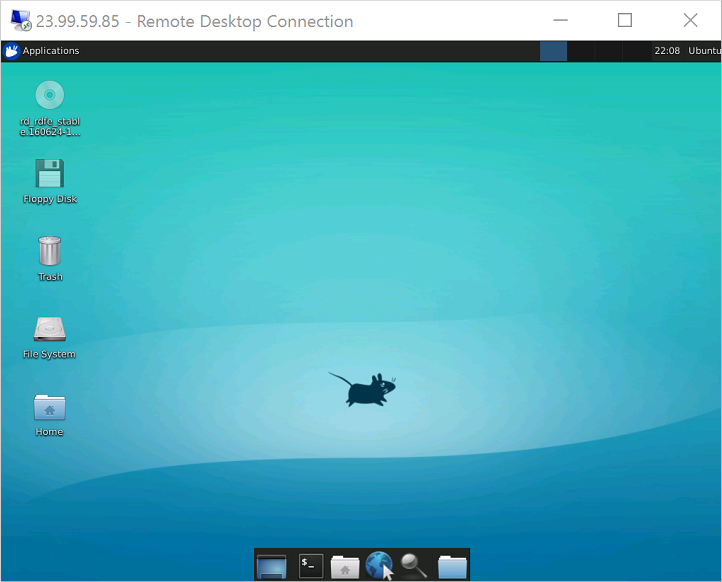

# <a name="install-and-configure-remote-desktop-to-connect-to-a-linux-vm-in-azure"></a>安装和配置远程桌面以连接到 Azure 中的 Linux VM
通常使用安全外壳 (SSH) 连接从命令行管理 Azure 中的 Linux 虚拟机 (VM)。 如果不熟悉 Linux，或者要快速进行故障排除，使用远程桌面可能会更方便。 本文详细介绍如何使用 Resource Manager 部署模型为 Linux VM 安装和配置桌面环境 ([xfce](https://www.xfce.org)) 和远程桌面 ([xrdp](https://www.xrdp.org))。


## <a name="prerequisites"></a>先决条件
本文需要 Azure 中的现有 Ubuntu 18.04 LTS VM。 如果需要创建 VM，请使用以下方法之一：

- [Azure CLI](quick-create-cli.md)
- [Azure 门户](quick-create-portal.md)

[!INCLUDE [azure-cli-2-azurechinacloud-environment-parameter](../../../includes/azure-cli-2-azurechinacloud-environment-parameter.md)]

## <a name="install-a-desktop-environment-on-your-linux-vm"></a>在 Linux VM 上安装桌面环境
Azure 中的大多数 Linux VM 默认情况下未安装桌面环境。 通常使用 SSH 连接（而不是桌面环境）来管理 Linux VM。 Linux 中有各种可以选择的桌面环境。 根据所选的桌面环境，可能会占用 1 到 2 GB 的磁盘空间，并需要 5 到 10 分钟来安装和配置所有所需的包。

以下示例在 Ubuntu 18.04 LTS VM 上安装轻型 [xfce4](https://www.xfce.org/) 桌面环境。 其他发行版的命令略有不同（例如，使用 `yum` 在 CentOS 上安装并配置适当的 `selinux` 规则，或者使用 `zypper` 在 SUSE 上安装）。

<!-- Change Red Hat to CentOS -->

首先，通过 SSH 连接到 VM。 以下示例使用用户名 *azureuser* 连接到名为 *myvm.chinanorth.cloudapp.chinacloudapi.cn* 的 VM。 使用自己的值：

```bash
ssh azureuser@myvm.chinanorth.cloudapp.chinacloudapi.cn
```

如果要使用 Windows 并且需要有关使用 SSH 的详细信息，请参阅[如何将 SSH 密钥用于 Windows](ssh-from-windows.md)。

接下来，使用 `apt` 安装 xfce，如下所示：

```bash
sudo apt-get update
sudo apt-get -y install xfce4
```

## <a name="install-and-configure-a-remote-desktop-server"></a>安装和配置远程桌面服务器
安装桌面环境后，请配置远程桌面服务来侦听传入连接。 [xrdp](http://xrdp.org) 是大多数 Linux 分发版中提供的开源远程桌面协议 (RDP) 服务器，可与 xfce 完美配合。 在 Ubuntu VM 上安装 xrdp，如下所示：

```bash
sudo apt-get -y install xrdp
sudo systemctl enable xrdp
```

告诉 xrdp 在启动会话时要使用的桌面环境。 配置 xrdp 以使用 xfce 作为桌面环境，如下所示：

```bash
echo xfce4-session >~/.xsession
```

重新启动 xrdp 服务使更改生效，如下所示：

```bash
sudo service xrdp restart
```


## <a name="set-a-local-user-account-password"></a>设置本地用户帐户密码
如果在创建 VM 时已为用户帐户创建密码，请跳过此步骤。 如果仅使用 SSH 密钥身份验证，并且未设置本地帐户密码，请在使用 xrdp 之前指定密码以登录到 VM。 xrdp 无法接受使用 SSH 密钥进行身份验证。 以下示例为用户帐户 *azureuser* 指定密码：

```bash
sudo passwd azureuser
```

> [!NOTE]
> 指定密码不会将 SSHD 配置更新为允许密码登录（如果当前不允许）。 从安全角度看，用户可能想要使用基于密钥的身份验证通过 SSH 隧道连接到 VM，并连接到 xrdp。 如果是这样，请跳过以下创建网络安全组规则的步骤，以允许远程桌面流量。


## <a name="create-a-network-security-group-rule-for-remote-desktop-traffic"></a>为远程桌面流量创建网络安全组规则
若要允许远程桌面流量到达 Linux VM，需要创建网络安全组规则以允许端口 3389 上的 TCP 访问 VM。 有关网络安全组规则的详细信息，请参阅[什么是网络安全组？](../../virtual-network/security-overview.md?toc=%2fvirtual-machines%2flinux%2ftoc.json) 还可以[使用 Azure 门户创建网络安全组规则](../windows/nsg-quickstart-portal.md?toc=%2fvirtual-machines%2flinux%2ftoc.json)。

以下示例使用 [az vm open-port](https://docs.azure.cn/cli/vm?view=azure-cli-latest#az-vm-open-port) 在端口 *3389* 上创建一个网络安全组规则。 使用 Azure CLI（而不是与 VM 的 SSH 会话），打开以下网络安全组规则：

```azurecli
az vm open-port --resource-group myResourceGroup --name myVM --port 3389
```


## <a name="connect-your-linux-vm-with-a-remote-desktop-client"></a>使用远程桌面客户端连接 Linux VM
打开本地的远程桌面客户端，并连接到 Linux VM 的 IP 地址或 DNS 名称。 输入 VM 上的用户帐户的用户名和密码，如下所示：


进行身份验证后，会加载 xfce 桌面环境，其外观类似于以下示例：



如果本地 RDP 客户端使用网络级别身份验证 (NLA)，则可能需要禁用该连接设置。 XRDP 目前不支持 NLA。 也可以查看其他支持 NLA 的 RDP 解决方案，例如 [FreeRDP](https://www.freerdp.com)。


## <a name="troubleshoot"></a>故障排除
如果无法使用远程桌面客户端连接到 Linux VM，请在 Linux VM上使用 `netstat` 验证 VM 是否正在侦听 RDP 连接，如下所示：

```bash
sudo netstat -plnt | grep rdp
```

以下示例显示正在按预期方式侦听 TCP 端口 3389 的 VM：

```bash
tcp     0     0      127.0.0.1:3350     0.0.0.0:*     LISTEN     53192/xrdp-sesman
tcp     0     0      0.0.0.0:3389       0.0.0.0:*     LISTEN     53188/xrdp
```

如果*xrdp-sesman* 服务未在侦听，请在 Ubuntu VM 上重新启动该服务，如下所示：

```bash
sudo service xrdp restart
```

请查看 Ubuntu VM 上的 */var/log* 中的日志，以获得该服务可能未响应的原因的指示。 也可以在远程桌面连接尝试期间监视 syslog 以查看任何错误：

```bash
tail -f /var/log/syslog
```

其他 Linux 发行版（例如，CentOS 和 SUSE）可能采用其他方式来重启服务并更换要查看的日志文件位置。

<!-- Change Red Hat to CentOS -->

如果用户在远程桌面客户端中未收到任何响应，并且在系统日志中看不到任何事件，则此行为指示远程桌面流量无法到达 VM。 查看网络安全组规则，以确保有规则允许端口 3389 上的 TCP。 有关详细信息，请参阅[排查应用程序连接问题](../windows/troubleshoot-app-connection.md)。


## <a name="next-steps"></a>后续步骤
有关为 Linux VM 创建 SSH 密钥和在 Linux VM 上使用 SSH 密钥的详细信息，请参阅[在 Azure 中为 Linux VM 创建 SSH 密钥](mac-create-ssh-keys.md)。

有关从 Windows 使用 SSH 的信息，请参阅[如何在 Windows 中使用 SSH 密钥](ssh-from-windows.md)。

<!-- Update_Description: update meta properties, wording update -->