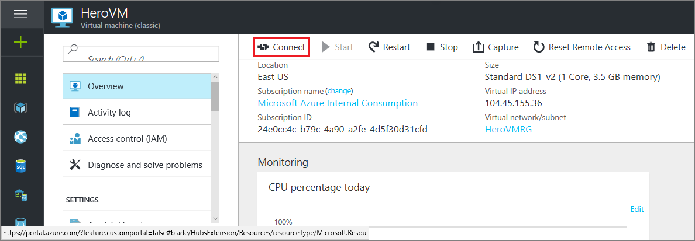
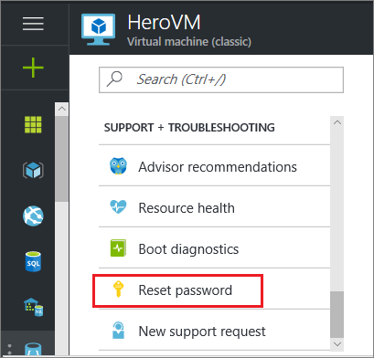

# 使用 Azure 门户预览登录到 Windows 虚拟机
在 Azure 门户预览中，使用“连接”按钮启动远程桌面会话，然后登录到 Windows VM。

是否要连接到 Linux VM？ 请参阅[如何登录到运行 Linux 的虚拟机](virtual-machines-linux-mac-create-ssh-keys.md?toc=%2fazure%2fvirtual-machines%2flinux%2ftoc.json)。

<!--
Deleting, but not 100% sure
Learn how to [perform these steps using new Azure portal preview](virtual-machines-windows-connect-logon.md?toc=%2fazure%2fvirtual-machines%2fwindows%2ftoc.json).
-->

> [!IMPORTANT]
> Azure 提供两个不同的部署模型用于创建和处理资源：[Resource Manager 和经典模型](../azure-resource-manager/resource-manager-deployment-model.md)。 本文介绍如何使用经典部署模型。 Azure 建议大多数新部署使用 Resource Manager 模型。 有关如何使用 Resource Manager 模型登录到 VM 的信息，请参阅[此处](virtual-machines-windows-connect-logon.md?toc=%2fazure%2fvirtual-machines%2fwindows%2ftoc.json)。

## 连接到虚拟机
1. 登录 Azure 门户预览。
2. 单击要访问的虚拟机。 其名称在“所有资源”窗格中列出。

    

3. 单击虚拟机仪表板顶部的命令栏上的“连接”。

    

## 登录到虚拟机
[!INCLUDE [virtual-machines-log-on-win-server](../../includes/virtual-machines-log-on-win-server.md)]

## 后续步骤
* 如果“连接”按钮处于非活动状态或者在使用远程桌面连接时遇到其他问题，请尝试重置配置。 在虚拟机仪表板中单击“重置远程访问”。

    

* 如果密码出现问题，可尝试重置密码。 在虚拟机仪表板左侧，“支持 + 故障排除”下面单击“重置密码”。

    

如果这些提示不起作用或不是所需的内容，请参阅[对与基于 Windows 的 Azure 虚拟机的远程桌面连接进行故障排除](virtual-machines-windows-troubleshoot-rdp-connection.md?toc=%2fazure%2fvirtual-machines%2fwindows%2ftoc.json)。 此文将指导你完成诊断和解决常见问题。
