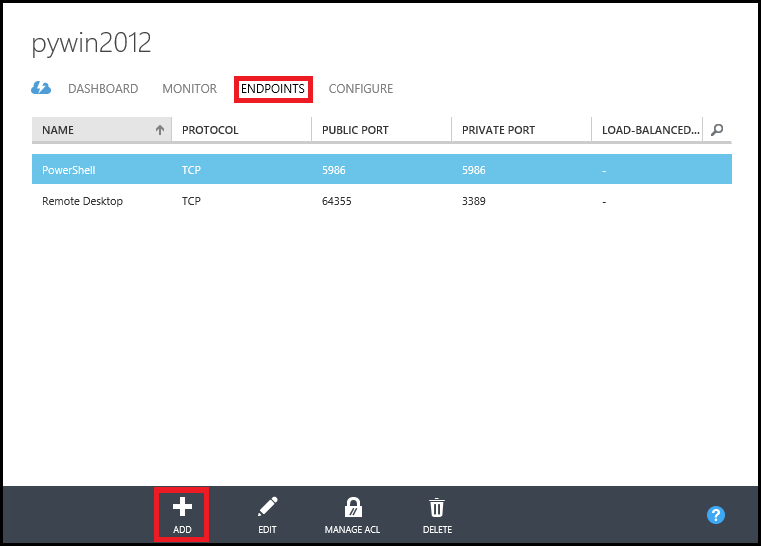

# Django Hello World Web 应用

> [!div class="op_single_selector"]
>- [Windows](virtual-machines-windows-classic-python-django-web-app.md)
>- [Mac/Linux](virtual-machines-linux-python-django-web-app.md)

[!INCLUDE [learn-about-deployment-models](../../includes/learn-about-deployment-models-classic-include.md)]

想发布 Django，请查看这个[资源管理器模板](https://github.com/Azure/azure-quickstart-templates/tree/master/django-app/).

本教程介绍如何在 Azure 中使用 Windows Server 虚拟机托管基于 Django 的 Web 应用。本教程假定您之前未使用过 Azure。完成本教程之后，你将能够在云中启动和运行基于 Django 的应用程序。

你将了解如何执行以下操作：

* 设置 Azure 虚拟机以托管 Django。虽然本教程介绍如何在 Windows Server 下实现此目的，但也可以使用托管在 Azure 中的 Linux VM 实现相同目的。
* 从 Windows 创建新的 Django 应用程序。

通过按照本教程中的说明进行操作，您将构建一个简单的 Hello World Web 应用。该应用程序将托管在 Azure 虚拟机中。

接下来显示的是已完成应用程序的屏幕截图。

![显示 Azure 上的 hello world 页面的浏览器窗口][1]

[!INCLUDE [create-account-and-vms-note](../../includes/create-account-and-vms-note.md)]

## 创建并配置 Azure 虚拟机以托管 Django

1. 按照[此处](virtual-machines-windows-classic-tutorial.md)提供的说明可创建 Windows Server 2012 R2 Datacenter 分发的 Azure 虚拟机。

1. 指示 Azure 将来自 Web 的端口 80 通信定向到虚拟机上的端口 80：
 - 在 Azure 经典管理门户中导航到你新创建的虚拟机，然后单击“终结点”。
 - 单击屏幕底部的“添加”按钮。
    

 - 打开 **TCP** 协议的**公用端口 80** 作为**专用端口 80**。![][port80]
1. 在“仪表板”选项卡上，单击“连接”以使用**远程桌面**远程登录到新创建的 Azure 虚拟机。  

**重要说明：**下面的所有说明假定你已正确登录到虚拟机并在那里而非在你的本地计算机发出命令。

## <a id="setup"> </a>安装 Python、Django、WFastCGI

**注意：**若要使用 Internet Explorer 下载，可能需要配置 IE ESC 设置（单击“开始”/“管理工具”/“服务器管理器”/“本地服务器”，然后单击“IE 增强的安全配置”，将其设置为“关闭”）。

1. 从 [python.org][] 安装最新的 Python 2.7 或 3.4。
1. 使用 pip 安装 wfastcgi 和 django 包。

    对于 Python 2.7，使用以下命令。

    ```
    c:\python27\scripts\pip install wfastcgi
    c:\python27\scripts\pip install django
    ```

    对于 Python 3.4，使用以下命令。

    ```
    c:\python34\scripts\pip install wfastcgi
    c:\python34\scripts\pip install django
    ```

## 安装具有 FastCGI 的 IIS

1. 安装具有 FastCGI 支持的 IIS。执行此操作可能需要几分钟。

    ```
    start /wait %windir%\System32\PkgMgr.exe /iu:IIS-WebServerRole;IIS-WebServer;IIS-CommonHttpFeatures;IIS-StaticContent;IIS-DefaultDocument;IIS-DirectoryBrowsing;IIS-HttpErrors;IIS-HealthAndDiagnostics;IIS-HttpLogging;IIS-LoggingLibraries;IIS-RequestMonitor;IIS-Security;IIS-RequestFiltering;IIS-HttpCompressionStatic;IIS-WebServerManagementTools;IIS-ManagementConsole;WAS-WindowsActivationService;WAS-ProcessModel;WAS-NetFxEnvironment;WAS-ConfigurationAPI;IIS-CGI
    ```

## 创建新的 Django 应用程序

1.  从 *C:\\inetpub\\wwwroot* 输入以下命令以创建新的 Django 项目：

    对于 Python 2.7，使用以下命令。

    ```
    C:\Python27\Scripts\django-admin.exe startproject helloworld
    ```

    对于 Python 3.4，使用以下命令。

    ```
    C:\Python34\Scripts\django-admin.exe startproject helloworld
    ```

    

1.  **django-admin** 命令生成基于 Django 的 Web 应用的基本结构：

  -   **helloworld\\manage.py** 可帮助你启动托管和停止托管你的基于 Django 的 Web 应用
  -   **helloworld\\helloworld\\settings.py** 包含你的应用程序的 Django 设置。
  -   **helloworld\\helloworld\\urls.py** 包含每个 url 及其视图之间的映射代码。

1.  在 *C:\\inetpub\\wwwroot\\helloworld\\helloworld* 目录中创建一个名为 **views.py** 的新文件。这会包含呈现“hello world”页面的视图。启动编辑器并输入以下代码：

    ```
    from django.http import HttpResponse
    def home(request):
        html = "<html><body>Hello World!</body></html>"
        return HttpResponse(html)
    ```

1.  将 urls.py 文件的内容替换为以下代码。

    ```
    from django.conf.urls import patterns, url
    urlpatterns = patterns('',
        url(r'^$', 'helloworld.views.home', name='home'),
    )
    ```

## 配置 IIS

1. 解锁全局 applicationhost.config 中的处理程序节。这将在 web.config 中启用 python 处理程序。

    ```
    %windir%\system32\inetsrv\appcmd unlock config -section:system.webServer/handlers
    ```

1. 启用 WFastCGI。这会将应用程序添加到引用 Python 解释程序可执行文件和 wfastcgi.py 脚本的全局 applicationhost.config。

    Python 2.7：

    ```
    c:\python27\scripts\wfastcgi-enable
    ```

    Python 3.4：

    ```
    c:\python34\scripts\wfastcgi-enable
    ```

1. 在 *C:\\inetpub\\wwwroot\\helloworld* 中创建 web.config 文件。`scriptProcessor` 属性的值应与上一步的输出相匹配。有关 wfastcgi 设置的更多信息，请参阅 pypi 上 [wfastcgi][] 的相关页。

    Python 2.7：

    ```
    <configuration>
      <appSettings>
        <add key="WSGI_HANDLER" value="django.core.handlers.wsgi.WSGIHandler()" />
        <add key="PYTHONPATH" value="C:\inetpub\wwwroot\helloworld" />
        <add key="DJANGO_SETTINGS_MODULE" value="helloworld.settings" />
      </appSettings>
      <system.webServer>
        <handlers>
            <add name="Python FastCGI" path="*" verb="*" modules="FastCgiModule" scriptProcessor="C:\Python27\python.exe|C:\Python27\Lib\site-packages\wfastcgi.pyc" resourceType="Unspecified" />
        </handlers>
      </system.webServer>
    </configuration>
    ```

    Python 3.4：

    ```
    <configuration>
      <appSettings>
        <add key="WSGI_HANDLER" value="django.core.handlers.wsgi.WSGIHandler()" />
        <add key="PYTHONPATH" value="C:\inetpub\wwwroot\helloworld" />
        <add key="DJANGO_SETTINGS_MODULE" value="helloworld.settings" />
      </appSettings>
      <system.webServer>
        <handlers>
            <add name="Python FastCGI" path="*" verb="*" modules="FastCgiModule" scriptProcessor="C:\Python34\python.exe|C:\Python34\Lib\site-packages\wfastcgi.py" resourceType="Unspecified" />
        </handlers>
      </system.webServer>
    </configuration>
    ```

1. 更新 IIS 默认 Web 应用的位置以指向 django 项目文件夹。

    ```
    %windir%\system32\inetsrv\appcmd set vdir "Default Web Site/" -physicalPath:"C:\inetpub\wwwroot\helloworld"
    ```

1. 最后，在你的浏览器中加载网页。

![显示 Azure 上的 hello world 页面的浏览器窗口][1]

## 关闭你的 Azure 虚拟机

完成本教程后，请关闭并/或删除你新创建的 Azure 虚拟机以为其他教程释放资源并避免产生 Azure 使用费。

[1]: ./media/virtual-machines-windows-classic-python-django-web-app/django-helloworld-browser-azure.png

[port80]: ./media/virtual-machines-windows-classic-python-django-web-app/django-helloworld-port80.png

[Web Platform Installer]: http://www.microsoft.com/web/downloads/platform.aspx
[python.org]: https://www.python.org/downloads/
[wfastcgi]: https://pypi.python.org/pypi/wfastcgi

<!---HONumber=70-->