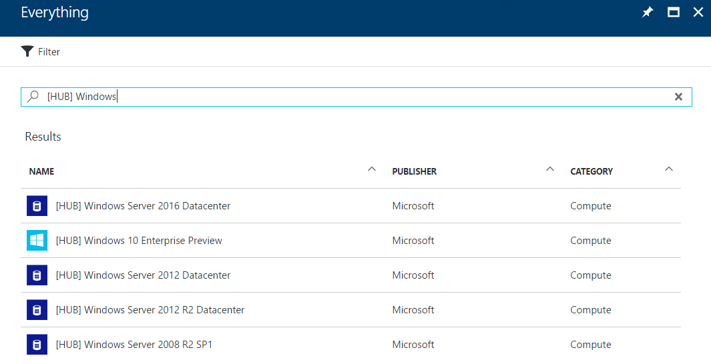

<!-- waiting for notification -->

---
title: "适用于 Windows Server 和 Windows 客户端的 Azure 混合使用权益 | Azure"
description: "了解如何充分利用 Windows 软件保障权益将本地许可证引入到 Azure 中"
services: virtual-machines-windows
documentationcenter: ''
author: george-moore
manager: timlt
editor: ''

ms.assetid: 332583b6-15a3-4efb-80c3-9082587828b0
ms.service: virtual-machines-windows
ms.devlang: na
ms.topic: article
ms.tgt_pltfrm: vm-windows
ms.workload: infrastructure-services
ms.date: 3/10/2017
wacn.date: ''
ms.author: georgem

---
# <a name="azure-hybrid-use-benefit-for-windows-server-and-windows-client"></a>适用于 Windows Server 和 Windows 客户端的 Azure 混合使用权益
对于有软件保障的客户，Azure 混合使用权益可让你使用本地 Windows Server 和 Windows 客户端许可证，并以较低的成本在 Azure 中运行Windows 虚拟机。 适用于 Windows Server 的 Azure 混合使用权益包括 Windows Server 2008R2、Windows Server 2012、Windows Server 2012R2 和 Windows Server 2016。 适用于 Windows 客户端的 Azure 混合使用权益包括 Windows 10。 有关详细信息，请参阅 [Azure 混合使用权益许可页](https://azure.microsoft.com/pricing/hybrid-use-benefit/)。

>[!IMPORTANT]
>适用于 Windows 客户端的 Azure 混合使用权益目前为预览版。 仅适用于：具有按用户分配的 Windows 10 企业版 E3/E5 或按用户分配的 Windows VDA（用户订阅许可证或附加用户订阅许可证，统称为“合格许可证”）的企业客户。
>
>

## <a name="ways-to-use-azure-hybrid-use-benefit"></a>Azure Hybrid Use Benefit 的用法
可以使用 Azure Hybrid Use Benefit 通过多种不同的方法来部署 Windows VM：

1. 如果拥有企业协议订阅，可从通过 Azure 混合使用权益预配的[特定应用商店映像中部署 VM](#deploy-a-vm-using-the-azure-marketplace)。
2. 如果没有企业协议，可[上传自定义 VM](#upload-a-windows-vhd)，然后[使用 Resource Manager 模板](#deploy-a-vm-via-resource-manager)或 [Azure PowerShell](#detailed-powershell-deployment-walkthrough) 进行部署。

## <a name="deploy-a-vm-using-the-azure-marketplace"></a>使用 Azure 应用商店部署 VM
对于拥有 [企业协议订阅](https://www.microsoft.com/Licensing/licensing-programs/enterprise.aspx)的客户，应用商店中提供了已预配置 Azure Hybrid Use Benefit 的映像。 例如，可直接从 Azure 门户预览、Resource Manager 模板或 Azure PowerShell 部署这些映像。 应用商店中的映像使用 `[HUB]` 名称做了标注，如下所示：



可以直接从 Azure 门户预览部署这些映像。 若要在 Resource Manager 模板和 Azure PowerShell 中使用，请查看如下所示的映像列表：

对于 Windows Server：

```powershell
Get-AzureRMVMImageSku -Location "China North" -Publisher "MicrosoftWindowsServer" `
    -Offer "WindowsServer-HUB"
```

对于 Windows 客户端：

```powershell
Get-AzureRMVMImageSku -Location "China North" -Publisher "MicrosoftWindowsServer" `
    -Offer "Windows-HUB"
```

如果没有企业协议订阅，请继续阅读有关如何上传自定义 VM 和通过 Azure 混合使用权益部署的说明。

## <a name="upload-a-windows-vhd"></a>上传 Windows VHD
若要在 Azure 中部署 Windows VM，必须先创建包含基本 Windows 版本的 VHD。 必须先通过 Sysprep 妥善准备此 VHD，再将其上传到 Azure。 可以[阅读有关 VHD 要求和 Sysprep 进程](virtual-machines-windows-upload-image.md?toc=%2fazure%2fvirtual-machines%2fwindows%2ftoc.json)以及[针对服务器角色的 Sysprep 支持](https://msdn.microsoft.com/windows/hardware/commercialize/manufacture/desktop/sysprep-support-for-server-roles)的详细信息。 在运行 Sysprep 之前备份 VM。 

确保 [已安装并配置最新的 Azure PowerShell](https://docs.microsoft.com/powershell/azureps-cmdlets-docs)。 准备好 VHD 之后，即可使用 `Add-AzureRmVhd` cmdlet 将 VHD 上传到 Azure 存储帐户，如下所示：

```powershell
Add-AzureRmVhd -ResourceGroupName "myResourceGroup" -LocalFilePath "C:\Path\To\myvhd.vhd" `
    -Destination "https://mystorageaccount.blob.core.chinacloudapi.cn/vhds/myvhd.vhd"
```

> [!NOTE]
> Microsoft SQL Server、SharePoint Server 和 Dynamics 还可以利用软件保障许可。 你仍需要准备 Windows Server 映像，方法是安装应用程序组件，并相应地提供许可证密钥，然后将磁盘映像上传到 Azure。 查看使用应用程序运行 Sysprep 的相关文档，例如[使用 Sysprep 安装 SQL Server 的注意事项](https://msdn.microsoft.com/library/ee210754.aspx)或[生成 SharePoint Server 2016 参考映像 (Sysprep)](http://social.technet.microsoft.com/wiki/contents/articles/33789.build-a-sharepoint-server-2016-reference-image-sysprep.aspx)。
>
>

还可以阅读有关[将 VHD 上传到 Azure 的过程](virtual-machines-windows-upload-image.md#upload-the-vhd-to-your-storage-account)的详细信息

## <a name="deploy-an-uploaded-vm-via-resource-manager"></a>通过 Resource Manager 部署已上传的 VM
在 Resource Manager 模板中，可以为 `licenseType` 指定附加参数。 可以阅读有关[创作 Azure Resource Manager 模板](../azure-resource-manager/resource-group-authoring-templates.md)的详细信息。 将 VHD 上传到 Azure 之后，请编辑 Resource Manager 模板以将许可证类型包含为计算提供程序的一部分，然后照常部署模板：

对于 Windows Server：

```json
"properties": {  
   "licenseType": "Windows_Server",
   "hardwareProfile": {
        "vmSize": "[variables('vmSize')]"
   }
```

对于 Windows 客户端：

```json
"properties": {  
   "licenseType": "Windows_Client",
   "hardwareProfile": {
        "vmSize": "[variables('vmSize')]"
   }
```

## <a name="deploy-an-uploaded-vm-via-powershell-quickstart"></a>通过 PowerShell 快速入门部署和上传 VM
通过 PowerShell 部署 Windows Server VM 时，可以使用 `-LicenseType`的附加参数。 将 VHD 上传到 Azure 之后，可以使用 `New-AzureRmVM` 创建 VM 并指定许可类型，如下所示：

对于 Windows Server：

```powershell
New-AzureRmVM -ResourceGroupName "myResourceGroup" -Location "China North" -VM $vm -LicenseType "Windows_Server"
```

对于 Windows 客户端：

```powershell
New-AzureRmVM -ResourceGroupName "myResourceGroup" -Location "China North" -VM $vm -LicenseType "Windows_Client"
```

可以在下面[阅读有关如何通过 PowerShell 在 Azure 中部署 VM 的更详细演练](virtual-machines-windows-hybrid-use-benefit-licensing.md#detailed-powershell-deployment-walkthrough)，或阅读有关[使用 Resource Manager 和 PowerShell 创建 Windows VM](virtual-machines-windows-ps-create.md?toc=%2fazure%2fvirtual-machines%2fwindows%2ftoc.json) 的不同步骤的更具描述性说明。

## <a name="verify-your-vm-is-utilizing-the-licensing-benefit"></a>验证 VM 是否正在利用许可权益
通过 PowerShell 或 Resource Manager 部署方法部署 VM 之后，请使用 `Get-AzureRmVM` 验证许可证类型，如下所示：

```powershell
Get-AzureRmVM -ResourceGroup "myResourceGroup" -Name "myVM"
```

输出类似于 Windows Server 的以下示例：

```powershell
Type                     : Microsoft.Compute/virtualMachines
Location                 : chinanorth
LicenseType              : Windows_Server
```

以下 VM 在部署时未提供 Azure 混合使用权益许可（例如直接从 Azure 库部署 VM），可看出其中的输出差异：

```powershell
Type                     : Microsoft.Compute/virtualMachines
Location                 : chinanorth
LicenseType              :
```

## <a name="detailed-powershell-deployment-walkthrough"></a>详细的 PowerShell 部署演练
以下的详细 PowerShell 步骤演示了 VM 的完整部署。 可以在[使用 Resource Manager 和 PowerShell 创建 Windows VM](virtual-machines-windows-ps-create.md?toc=%2fazure%2fvirtual-machines%2fwindows%2ftoc.json) 中了解更多上下文，包括实际的 cmdlet 和所创建的不同组件。 你可以逐步执行创建资源组、存储帐户和虚拟网络，然后定义 VM 并完成创建 VM 的整个过程。

首先请安全获取凭据，并设置位置和资源组名称：

```powershell
$cred = Get-Credential
$location = "China North"
$resourceGroupName = "myResourceGroup"
```

创建一个公共 IP：

```powershell
$publicIPName = "myPublicIP"
$publicIP = New-AzureRmPublicIpAddress -Name $publicIPName -ResourceGroupName $resourceGroupName `
    -Location $location -AllocationMethod "Dynamic"
```

定义子网、NIC 和 VNET：

```powershell
$subnetName = "mySubnet"
$nicName = "myNIC"
$vnetName = "myVnet"
$subnetconfig = New-AzureRmVirtualNetworkSubnetConfig -Name $subnetName -AddressPrefix 10.0.0.0/8
$vnet = New-AzureRmVirtualNetwork -Name $vnetName -ResourceGroupName $resourceGroupName -Location $location `
    -AddressPrefix 10.0.0.0/8 -Subnet $subnetconfig
$nic = New-AzureRmNetworkInterface -Name $nicName -ResourceGroupName $resourceGroupName -Location $location `
    -SubnetId $vnet.Subnets[0].Id -PublicIpAddressId $publicIP.Id
```

为 VM 命名并创建 VM 配置：

```powershell
$vmName = "myVM"
$vmConfig = New-AzureRmVMConfig -VMName $vmName -VMSize "Standard_A1"
```

定义 OS：

```powershell
$computerName = "myVM"
$vm = Set-AzureRmVMOperatingSystem -VM $vmConfig -Windows -ComputerName $computerName -Credential $cred `
    -ProvisionVMAgent -EnableAutoUpdate
```

将 NIC 添加到 VM：

```powershell
$vm = Add-AzureRmVMNetworkInterface -VM $vm -Id $nic.Id
```

定义要使用的存储帐户：

```powershell
$storageAcc = Get-AzureRmStorageAccount -ResourceGroupName $resourceGroupName -AccountName mystorageaccount
```

上传准备妥当的 VHD，并附加到 VM 以供使用：

```powershell
$osDiskName = "licensing.vhd"
$osDiskUri = '{0}vhds/{1}{2}.vhd' -f $storageAcc.PrimaryEndpoints.Blob.ToString(), $vmName.ToLower(), $osDiskName
$urlOfUploadedImageVhd = "https://mystorageaccount.blob.core.chinacloudapi.cn/vhd/myvhd.vhd"
$vm = Set-AzureRmVMOSDisk -VM $vm -Name $osDiskName -VhdUri $osDiskUri -CreateOption FromImage `
    -SourceImageUri $urlOfUploadedImageVhd -Windows
```

最后，创建 VM 并定义许可类型，以利用 Azure Hybrid Use Benefit：

对于 Windows Server：

```powershell
New-AzureRmVM -ResourceGroupName $resourceGroupName -Location $location -VM $vm -LicenseType "Windows_Server"
```

对于 Windows 客户端：

```powershell
New-AzureRmVM -ResourceGroupName $resourceGroupName -Location $location -VM $vm -LicenseType "Windows_Client"
```

## <a name="next-steps"></a>后续步骤
阅读有关 [Azure Hybrid Use Benefit 许可](https://azure.microsoft.com/pricing/hybrid-use-benefit/)的详细信息。

了解有关[使用 Resource Manager模板](../azure-resource-manager/resource-group-overview.md)的详细信息。