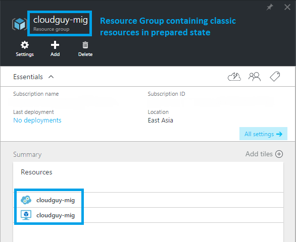

# 有关平台支持的从经典部署模型到 Azure Resource Manager 的迁移的技术深入探讨
本文将深入探讨如何从 Azure 经典部署模型迁移到 Azure Resource Manager 部署模型。本文将介绍资源和功能级别的资源，让用户了解 Azure 平台如何在两种部署模型之间迁移资源。有关详细信息，请阅读服务通告文章：[平台支持的从经典部署模型到 Azure Resource Manager 的 IaaS 资源迁移](./virtual-machines-windows-migration-classic-resource-manager.md)。

## 详细迁移指南
可以在下表中找到资源的经典与 Resource Manager 表示形式。目前不支持其他功能和资源。

| 经典表示形式 | Resource Manager 表示形式 | 详细说明 |
| --- | --- | --- |
| 云服务名称 |DNS 名称 |在迁移期间，将会以命名模式 `<cloudservicename>-migrated` 为每个云服务创建新的资源组。此资源组包含用户的所有资源。云服务名称会成为与公共 IP 地址关联的 DNS 名称。 |
| 虚拟机 |虚拟机 |VM 特定属性将原封不动地进行迁移。某些 osProfile 信息（例如计算机名称）不会存储在经典部署模型中，因此迁移后将保留空白。 |
| 附加到 VM 的磁盘资源 |附加到 VM 的隐式磁盘 |在 Resource Manager 部署模型中，磁盘不会建模为顶级资源。这些磁盘将作为 VM 下的隐式磁盘进行迁移。目前只支持附加到 VM 的磁盘。Resource Manager VM 现在可以使用经典存储帐户轻松地迁移磁盘，不需任何更新。 |
| VM 扩展 |VM 扩展 |除 XML 扩展以外的所有资源扩展都会从经典部署模型中迁移。 |
| 虚拟机证书 |Azure 密钥保管库中的证书 |如果云服务包含服务证书，则会为每个云服务创建新的 Azure 密钥保管库，并将证书移到该密钥保管库。VM 将更新为引用该密钥保管库中的证书。  **注意：**请不要删除密钥保管库，否则可能导致 VM 进入故障状态。我们正致力于改进后端中的功能，将来有望能够安全删除密钥保管库，或将其连同 VM 一起移到新订阅中。 |
| WinRM 配置 |osProfile 下的 WinRM 配置 |Windows 远程管理配置在迁移过程中会原封不动地进行转移。 |
| 可用性集属性 |可用性集资源 |可用性集规范是经典部署模型中 VM 上的属性。在迁移过程中，可用性集将成为顶级资源。以下配置不受支持：每个云服务包含多个可用性集，或者在一个云服务中有一个或多个可用性集以及不在任何可用性集中的 VM。 |
| VM 上的网络配置 |主网络接口 |在迁移后，VM 上的网络配置会表示为主网络接口资源。对于不在虚拟网络中的 VM，内部 IP 地址在迁移期间将会更改。 |
| VM 上的多个网络接口 |网络接口 |如果 VM 有多个关联的网络接口，则在迁移到 Resource Manager 部署模型的过程中，每个网络接口以及所有属性将成为顶级资源。 |
| 负载均衡的终结点集 |负载均衡器 |在经典部署模型中，平台已经为每个云服务分配一个隐式负载均衡器。在迁移期间，将创建新的负载均衡器资源，负载均衡终结点集将成为负载均衡器规则。 |
| 入站 NAT 规则 |入站 NAT 规则 |在迁移期间，VM 上定义的输入终结点将转换成负载均衡器下的入站网络地址转换规则。 |
| VIP 地址 |具有 DNS 名称的公共 IP 地址 |虚拟 IP 地址会变成公共 IP 地址并与负载均衡器关联。 |
| 虚拟网络 |虚拟网络 |虚拟网络将连同其所有属性一起迁移到 Resource Manager 部署模型。将创建名为 `-migrated` 的新资源组。存在[不受支持的配置](./virtual-machines-windows-migration-classic-resource-manager.md)。 |
| 保留 IP |具有静态分配方法的公共 IP 地址 |与负载均衡器关联的保留 IP 将在迁移云服务或虚拟机的过程中一起迁移。目前不支持进行未关联的保留 IP 迁移。 |
| 每个 VM 的公共 IP 地址 |具有动态分配方法的公共 IP 地址 |与 VM 关联的公共 IP 地址将转换为公共 IP 地址资源，分配方法将设置为静态。 |
| NSG |NSG |在迁移到 Resource Manager 部署模型的过程中，将克隆与子网关联的网络安全组。在迁移期间不会删除经典部署模型中的 NSG。但是，当迁移正在进行时，会阻止 NSG 的管理平面操作。 |
| DNS 服务器 |DNS 服务器 |与虚拟网络或 VM 关联的 DNS 服务器将在迁移相应资源的过程中连同所有属性一起迁移。 |
| UDR |UDR |在迁移到 Resource Manager 部署模型的过程中，将克隆与子网关联的用户定义路由。在迁移期间不会删除经典部署模型中的 UDR。当迁移正在进行时，会阻止 UDR 的管理平面操作。 |
| VM 网络配置中的 IP 转发属性 |NIC 中的 IP 转发属性 |VM 上的 IP 转发属性在迁移期间将转换为网络接口上的属性。 |
| 具有多个 IP 的负载均衡器 |具有多个公共 IP 资源的负载均衡器 |与负载均衡器关联的每个公共 IP 都将转换为公共 IP 资源，并在迁移后与负载均衡器关联。 |
| VM 上的内部 DNS 名称 |NIC 上的内部 DNS 名称 |在迁移期间，VM 的内部 DNS 后缀将迁移到 NIC 上名为“InternalDomainNameSuffix”的只读属性。在迁移后，该后缀将保持不变，并且 VM 解决方案应继续像以前一样正常工作。 |
| 虚拟网络网关 |虚拟网络网关 |虚拟网络网关属性将按原样迁移。与网关关联的 VIP 也不会更改。 |
| 本地网络站点 |本地网络网关 |本地网络站点属性将按原样迁移到名为“本地网络网关”的新资源。这表示本地地址前缀和远程网关 IP 。 |
| 连接引用 |连接 |迁移后，网络配置中的网关与本地网络站点之间的连接引用由 Resource Manager 中一个新建的、名为“连接”的资源表示。网络配置文件中的所有连接引用属性将按原样复制到新建的连接资源。经典模型中的 VNet 到 VNet 连接是通过与代表 VNet 的本地网络站点建立两条 IPsec 隧道来实现的。无需本地网络网关，即可在 Resource Manager 模型中将此连接转换为 Vnet2Vnet 连接类型。 |

## 简单迁移的演练图解
以下屏幕截图显示的是准备阶段以后的情况，其中有一个现有的云服务，以及一个不在虚拟网络中的 VM：

  

以下屏幕截图显示，在迁移过程完成以后，在新的资源组中创建了新的资源：

## 后续步骤
你已经了解经典 IaaS 资源到 Resource Manager 的迁移，现在可以开始迁移资源。

* [使用 PowerShell 将 IaaS 资源从经典部署模型迁移到 Azure Resource Manager](./virtual-machines-windows-ps-migration-classic-resource-manager.md)
* [使用 CLI 将 IaaS 资源从经典部署模型迁移到 Azure Resource Manager](./virtual-machines-linux-cli-migration-classic-resource-manager.md)
* [平台支持的从经典部署模型到 Azure Resource Manager 的 IaaS 资源迁移](./virtual-machines-windows-migration-classic-resource-manager.md)
* [使用社区 PowerShell 脚本将经典虚拟机克隆到 Azure Resource Manager](./virtual-machines-windows-migration-scripts.md)
* [查看最常见的迁移错误](./virtual-machines-migration-errors.md)

<!---HONumber=Mooncake_0116_2017-->
<!--Update_Description: add virtual network gateway, local network gateway, and connection in migration guidance table-->