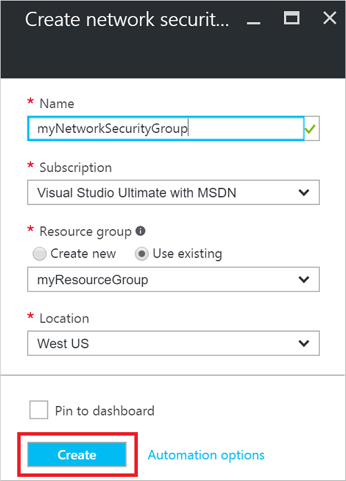
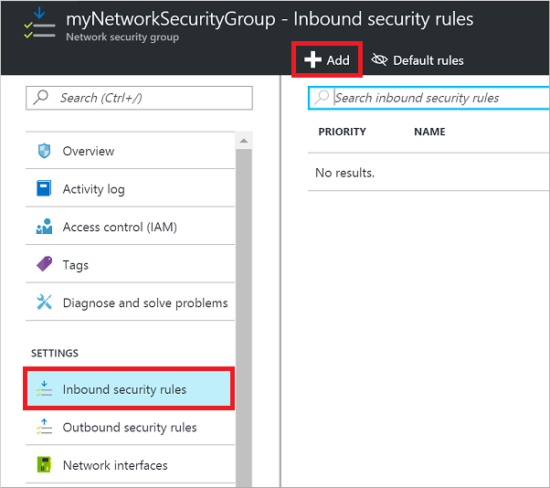
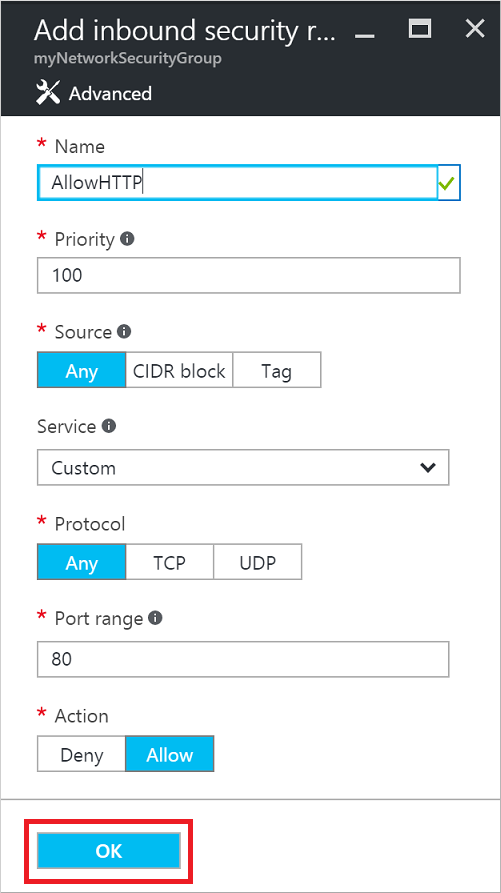

# 使用 Azure 门户预览打开 Azure 中 VM 的端口
[!INCLUDE [virtual-machines-common-nsg-quickstart](../../includes/virtual-machines-common-nsg-quickstart.md)]

## 快速命令
也可以[通过 Azure PowerShell 执行这些步骤](./virtual-machines-windows-nsg-quickstart-powershell.md)。

首先，创建网络安全组。在门户中选择一个资源组，单击“添加”，然后搜索并选择“网络安全组”：

  

输入网络安全组的名称，选择或创建资源组，然后选择一个位置。完成后，单击“创建”：

  

选择新的网络安全组。选择“入站安全规则”，然后单击“添加”按钮以创建规则：

  

提供新规则的名称。默认情况下已输入端口 80。向网络安全组添加其他规则时，可以在此边栏选项卡中更改源、协议和目标。单击“确定”创建规则：

  

最后一步是将网络安全组与子网或特定网络接口相关联。让我们将网络安全组与子网相关联。选择“子网”，然后单击“关联”：

  

选择虚拟网络，然后选择相应的子网：

现在，你已经创建了网络安全组、创建了允许端口 80 上的流量的入站规则，并将网关安全组与子网进行了关联。可以通过端口 80 访问与该子网连接的任何 VM。

## 有关网络安全组的详细信息
利用此处的快速命令，可以让流向 VM 的流量开始正常运行。网络安全组提供许多出色的功能和粒度来控制资源的访问。请参阅[创建网络安全组和 ACL 规则](../virtual-network/virtual-networks-create-nsg-arm-ps.md)了解更多信息。

可以将网络安全组和 ACL 规则定义为 Azure Resource Manager 模板的一部分。深入了解[使用模板创建网络安全组](../virtual-network/virtual-networks-create-nsg-arm-template.md)。

如果需要使用端口转发将唯一的外部端口映射至 VM 上的内部端口，请使用负载均衡器和网络地址转换 (NAT) 规则。例如，你可能想对外公开 TCP 端口 8080，然后让流量定向到 VM 上的 TCP 端口 80。了解如何[创建面向 Internet 的负载均衡器](../load-balancer/load-balancer-get-started-internet-arm-ps.md)。

## 后续步骤
在本示例中，你创建了简单的规则来允许 HTTP 流量。下列文章更介绍了有关创建更详细环境的信息：

* [Azure Resource Manager 概述](../azure-resource-manager/resource-group-overview.md)
* [什么是网络安全组 (NSG)？](../virtual-network/virtual-networks-nsg.md)
* [Azure Resource Manager 中负载均衡器的概述](../load-balancer/load-balancer-arm.md)

<!---HONumber=Mooncake_1212_2016-->