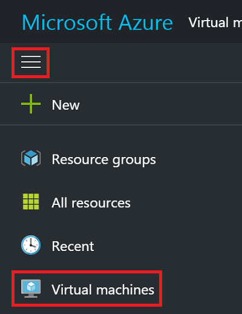
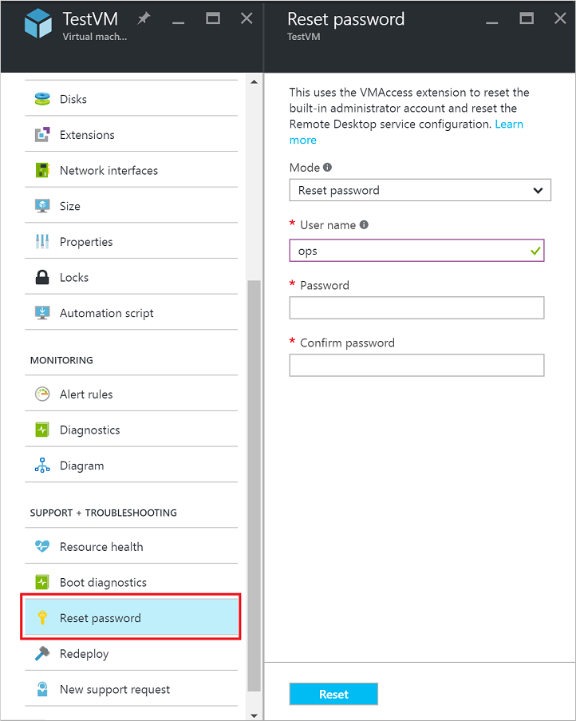
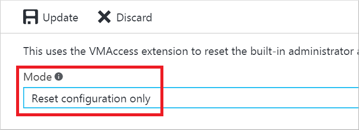

# <a name="how-to-reset-the-remote-desktop-service-or-its-login-password-in-a-windows-vm"></a>如何在 Windows VM 中重置远程桌面服务或其登录密码
如果无法连接到 Windows 虚拟机 (VM)，可以重置本地管理员密码或重置远程桌面服务配置。 可以使用 Azure 门户预览或 Azure PowerShell 中的 VM 访问扩展重置密码。 如果使用 PowerShell，请务必[安装和配置最新的 PowerShell 模块](https://docs.microsoft.com/powershell/azureps-cmdlets-docs)，并登录到 Azure 订阅。 也可以对[使用经典部署模型创建的 VM 执行这些步骤](virtual-machines-windows-classic-reset-rdp.md)。

## <a name="ways-to-reset-configuration-or-credentials"></a>重置配置或凭据的方式
可以根据需要，通过多种不同的方式重置远程桌面服务和凭据：

- [使用 Azure 门户预览重置](#azure-portal-preview)
- [使用 Azure PowerShell 进行重置](#vmaccess-extension-and-powershell)

## <a name="azure-portal-preview"></a>Azure 门户预览
若要展开门户菜单，请单击左上角的三个条形，然后单击“虚拟机” ：



### <a name="reset-the-local-administrator-account-password"></a>**重置本地管理员帐户密码**

选择 Windows 虚拟机，然后单击“支持 + 故障排除” > “重置密码”。 此时会显示密码重置边栏选项卡：



输入用户名和新密码，然后单击“更新”。 尝试重新连接到 VM。

### <a name="reset-the-remote-desktop-service-configuration"></a>**重置远程桌面服务配置**

选择 Windows 虚拟机，然后单击“支持 + 故障排除” > “重置密码”。 此时会显示密码重置边栏选项卡。 



从下拉菜单中选择“仅重置配置”，然后单击“更新”。 尝试重新连接到 VM。

## <a name="vmaccess-extension-and-powershell"></a> VMAccess 扩展和 PowerShell
请务必[安装和配置最新的 PowerShell 模块](https://docs.microsoft.com/powershell/azureps-cmdlets-docs)，并使用 `Login-AzureRmAccount -EnvironmentName AzureChinaCloud` cmdlet 登录到 Azure 订阅。

### <a name="reset-the-local-administrator-account-password"></a>**重置本地管理员帐户密码**
使用 [Set-AzureRmVMAccessExtension](https://msdn.microsoft.com/library/mt619447.aspx) PowerShell cmdlet 重置管理员密码或用户名。 按如下所示创建帐户凭据：

```powershell
$cred=Get-Credential
```

> [!NOTE] 
> 如果在 VM 上键入不同于当前本地管理员帐户的名称，则 VMAccess 扩展将重命名本地管理员帐户，将指定密码分配给该帐户，并发出远程桌面注销事件。 如果 VM 上的本地管理员帐户处于禁用状态，则 VMAccess 扩展将启用它。

以下示例将名为 `myResourceGroup` 的资源组中名为 `myVM` 的 VM 更新为指定凭据。

```powershell
Set-AzureRmVMAccessExtension -ResourceGroupName "myResourceGroup" -VMName "myVM" `
    -Name "myVMAccess" -Location ChinaNorth -UserName $cred.GetNetworkCredential().Username `
    -Password $cred.GetNetworkCredential().Password -typeHandlerVersion "2.0"
```

### <a name="reset-the-remote-desktop-service-configuration"></a>**重置远程桌面服务配置**
使用 [Set-AzureRmVMAccessExtension](https://msdn.microsoft.com/library/mt619447.aspx) PowerShell cmdlet 重置对 VM 的远程访问。 以下示例在名为 `myResourceGroup` 的资源组中名为 `myVM` 的 VM 上重置名为 `myVMAccess` 的访问扩展：

```powershell
Set-AzureRmVMAccessExtension -ResourceGroupName "myResoureGroup" -VMName "myVM" `
    -Name "myVMAccess" -Location ChinaNorth -typeHandlerVersion "2.0 -ForceRerun
```

> [!TIP]
> 无论何时，一个 VM 只能有一个 VM 访问代理。 若要成功设置 VM 访问代理属性，可以使用 `-ForceRerun` 选项。 使用 `-ForceRerun` 时，请确保使用与前述命令使用的 VM 访问代理相同的名称。

如果仍然无法远程连接到虚拟机，请参阅 [Troubleshoot Remote Desktop connections to a Windows-based Azure virtual machine](virtual-machines-windows-troubleshoot-rdp-connection.md?toc=%2fazure%2fvirtual-machines%2fwindows%2ftoc.json)（对与基于 Windows 的 Azure 虚拟机的远程桌面连接进行故障排除），了解其他值得一试的步骤。

## <a name="next-steps"></a>后续步骤
如果 Azure VM 访问扩展无响应，并且密码无法重置，可以[脱机重置本地 Windows 密码](virtual-machines-windows-reset-local-password-without-agent.md?toc=%2fazure%2fvirtual-machines%2fwindows%2ftoc.json)。 此方法是一个更高级的方案，需将问题 VM 的虚拟硬盘连接到另一个 VM。 请首先按照本文中所述的步骤操作，将脱机密码重置方法作为最后的选择。

[Azure VM 扩展和功能](virtual-machines-windows-extensions-features.md?toc=%2fazure%2fvirtual-machines%2fwindows%2ftoc.json)

[使用 RDP 或 SSH 连接到 Azure 虚拟机](virtual-machines-linux-azure-overview.md)

[对与基于 Windows 的 Azure 虚拟机的远程桌面连接进行故障排除](virtual-machines-windows-troubleshoot-rdp-connection.md?toc=%2fazure%2fvirtual-machines%2fwindows%2ftoc.json)
