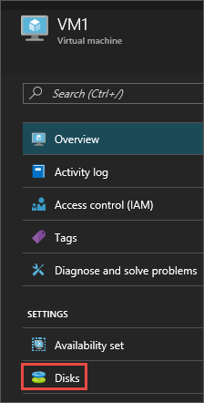
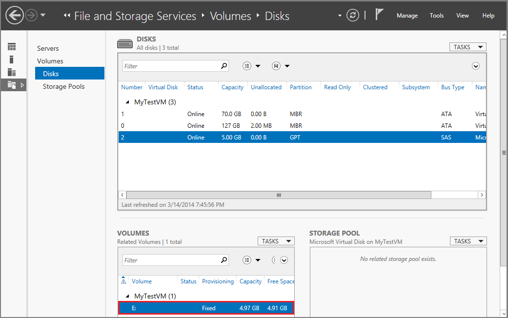

# <a name="how-to-attach-a-data-disk-to-a-windows-vm-in-the-azure-portal-preview"></a>如何在 Azure 门户预览版中将数据磁盘附加到 Windows VM
本文介绍如何通过 Azure 门户预览版将新磁盘和现有磁盘附加到 Windows 虚拟机。 也可以[在 Azure 门户预览中将数据磁盘附加到 Linux VM](../linux/attach-disk-portal.md?toc=%2fvirtual-machines%2flinux%2ftoc.json)。 在开始之前，请查看以下提示：

* 虚拟机的大小决定了可以附加多少个磁盘。 有关详细信息，请参阅[虚拟机大小](sizes.md?toc=%2fvirtual-machines%2fwindows%2ftoc.json)。
* 要使用高级存储，需要使用 DS 系列或 GS 系列虚拟机。 可以用高级存储帐户和标准存储帐户将磁盘用于这些虚拟机。 高级存储只在某些区域可用。 有关详细信息，请参阅[高级存储：适用于 Azure 虚拟机工作负荷的高性能存储](../../storage/storage-premium-storage.md?toc=%2fvirtual-machines%2fwindows%2ftoc.json)。
* 对于新磁盘，不需要首先进行创建，因为 Azure 将在附加磁盘时创建该磁盘。
* 对于现有磁盘，Azure 存储帐户中必须要有可用的 .vhd 文件。 你可以使用已经存在的 .vhd（如果该磁盘没有附加到另一虚拟机），也可以将自己的 .vhd 文件上载到存储帐户。

还可以[使用 Powershell 附加数据磁盘](attach-disk-ps.md)。

## <a name="find-the-virtual-machine"></a>查找虚拟机
1. 登录 [Azure 门户预览](https://portal.azure.cn/)。
2. 在“中心”菜单中，单击“虚拟机” 。
3. 从列表中选择虚拟机。
4. 在“虚拟机”边栏选项卡的“概要”中，单击“磁盘”。

    

按照附加[新磁盘](#option-1-attach-and-initialize-a-new-disk)或[现有磁盘](#option-2-attach-an-existing-disk)的说明继续操作。

## <a name="option-1-attach-and-initialize-a-new-disk"></a>选项 1：附加并初始化新的磁盘
1. 在“磁盘”边栏选项卡上，单击“附加新磁盘”。
2. 检查默认设置，根据需要更新，然后单击“确定”。

    
3. 在 Azure 创建磁盘并将磁盘附加到虚拟机之后，新磁盘将出现在“数据磁盘”下的虚拟机磁盘设置中。

### <a name="initialize-a-new-data-disk"></a>初始化新的数据磁盘

1. 连接到虚拟机。 有关说明，请参阅[如何连接并登录到运行 Windows 的 Azure 虚拟机](connect-logon.md?toc=%2fvirtual-machines%2fwindows%2ftoc.json)。
2. 在登录虚拟机后，打开“服务器管理器” 。 在左窗格中，选择“文件和存储服务” 。

    
3. 展开菜单并选择“磁盘” 。
4. “磁盘”  部分会列出磁盘。 在大多数情况下，会有磁盘 0、磁盘 1 和磁盘 2。 磁盘 0 是操作系统磁盘，磁盘 1 是临时磁盘，磁盘 2 是刚附加到 VM 的数据磁盘。 新的数据磁盘会将分区列为“未知” 。 右键单击磁盘，然后选择“初始化” 。
5. 在初始化磁盘时，系统会通知用户所有的数据将被擦除。 单击“是”以确认警告并初始化磁盘  。 完成后，即会将分区列为“GPT” 。 再次右键单击磁盘，然后选择“新建卷” 。
6. 使用默认值完成向导操作。 完成向导后，“卷”  部分将列出新卷。 现在，磁盘处于联机状态并已准备好存储数据。

    

## <a name="option-2-attach-an-existing-disk"></a>选项 2：附加现有磁盘
1. 在“磁盘”边栏选项卡上，单击“附加现有磁盘”。
2. 在“附加现有磁盘”下，单击“VHD 文件”。

    
3. 在“存储帐户” 下，选择帐户和容纳 .vhd 文件的容器。

    
4. 选择 .vhd 文件
5. 在“附加现有磁盘”下，刚才选择的文件将出现在“VHD 文件”中。 单击 **“确定”**。
6. 在 Azure 将磁盘附加到虚拟机之后，磁盘将出现在“数据磁盘” 下的虚拟机磁盘设置中。

## <a name="use-trim-with-standard-storage"></a>将 TRIM 与标准存储配合使用

如果使用标准存储 (HDD)，应启用 TRIM。 TRIM 会丢弃磁盘上未使用的块，使用户只需为实际使用的存储付费。 如果创建了较大的文件，然后将其删除，这样可以节省成本。 

可以运行此命令来检查 TRIM 设置。 在 Windows VM 上打开命令提示符，然后键入：

```
fsutil behavior query DisableDeleteNotify
```

如果该命令返回 0，则表示正确启用了 TRIM。 如果该命令返回 1，则运行以下命令以启用 TRIM：

```
fsutil behavior set DisableDeleteNotify 0
```

从磁盘中删除数据后，可以通过使用 TRIM 运行碎片整理确保 TRIM 操作刷新正常：

```
defrag.exe <volume:> -l
```

## <a name="next-steps"></a>后续步骤
如果应用程序需要使用 D: 盘存储数据，可以[更改 Windows 临时磁盘的驱动器号](change-drive-letter.md?toc=%2fvirtual-machines%2fwindows%2fclassic%2ftoc.json)。

