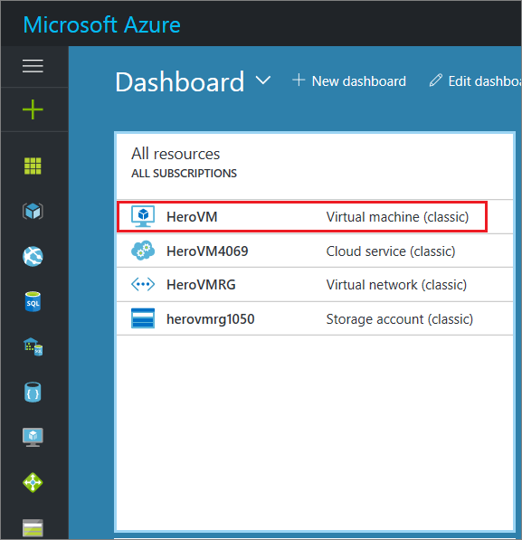

# 使用 Azure 门户登录到 Windows 虚拟机
在 Azure 门户中，使用“连接”按钮启动远程桌面会话，然后登录到 Windows VM。

是否要连接到 Linux VM？ 请参阅[如何登录到运行 Linux 的虚拟机](../../linux/mac-create-ssh-keys.md)。

<!--
Deleting, but not 100% sure
Learn how to [perform these steps using new Azure portal](../connect-logon.md?toc=%2fvirtual-machines%2fwindows%2ftoc.json).
-->

> [!IMPORTANT]
> Azure 提供两个不同的部署模型用于创建和处理资源：[Resource Manager 和经典模型](../../../resource-manager-deployment-model.md)。 本文介绍如何使用经典部署模型。 Azure 建议大多数新部署使用 Resource Manager 模型。 有关如何使用 Resource Manager 模型登录到 VM 的信息，请参阅[此处](../connect-logon.md?toc=%2fvirtual-machines%2fwindows%2ftoc.json)。
> [!INCLUDE [virtual-machines-common-classic-createportal](../../../../includes/virtual-machines-classic-portal.md)]

## 连接到虚拟机
1. 登录到 Azure 门户。
2. 单击要访问的虚拟机。 其名称在“所有资源”窗格中列出。

    

1. 单击虚拟机属性页上的“连接”按钮。 
2. 在“连接到虚拟机”页上，保持选择相应的选项，单击“下载 RDP 文件”。
2. 打开下载的 RDP 文件，然后在出现提示时单击“连接”。 
2. 此时会出现“`.rdp` 文件来自未知发布者”的警告。 这是一般警报。 在“远程桌面”窗口中，单击“连接”继续。

    
3. 在“Windows 安全性”窗口中，依次选择“更多选择”、“使用其他帐户”。 键入虚拟机上帐户的凭据，并单击“确定”。

     **本地帐户** - 通常，这是创建虚拟机时指定的本地帐户用户名和密码。 在本示例中，域是虚拟机的名称，输入格式为 *vmname*&#92;*username*。  

    **已加入域的 VM** - 如果 VM 属于某个域，请以*域*&#92;*用户名*格式输入用户名。 该帐户还需要属于管理员组或已被授予 VM 的远程访问权限。

    **域控制器** - 如果 VM 是域控制器，请键入该域的域管理员帐户的用户名和密码。
4. 单击“是”验证虚拟机的 ID 并完成登录。

   

## 后续步骤
* 如果“连接”按钮处于非活动状态或者在使用远程桌面连接时遇到其他问题，请尝试重置配置。 在虚拟机仪表板中单击“重置远程访问”。

    

* 如果密码出现问题，可尝试重置密码。 在虚拟机仪表板左侧，“支持 + 故障排除”下面单击“重置密码”。

    

如果这些提示不起作用或不是所需的内容，请参阅[对与基于 Windows 的 Azure 虚拟机的远程桌面连接进行故障排除](../troubleshoot-rdp-connection.md?toc=%2fvirtual-machines%2fwindows%2ftoc.json)。 此文指导完成诊断和解决常见问题。

<!-- Update_Description: update meta properties， wording update, update link -->