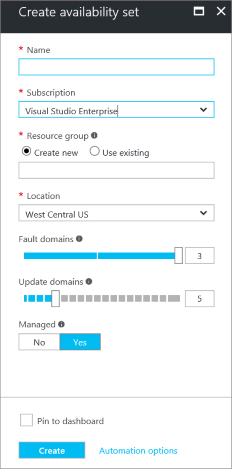
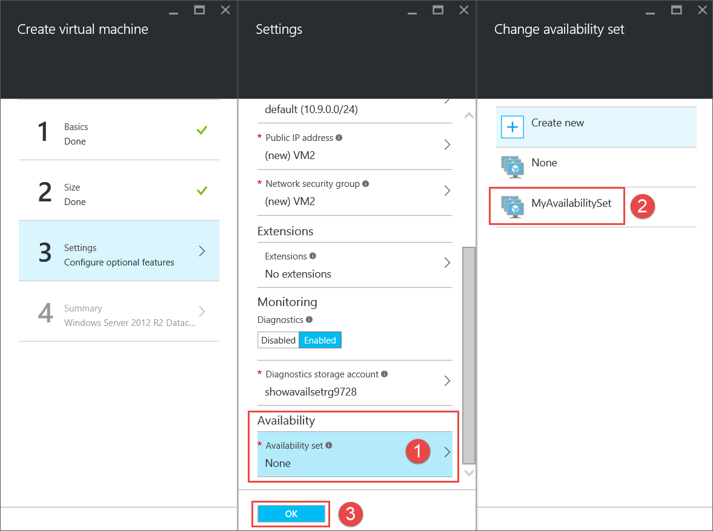

# <a name="increase-vm-availability-by-creating-an-azure-availability-set"></a>通过创建 Azure 可用性集增加 VM 可用性 
可用性集为应用程序提供冗余。 建议将两个或更多虚拟机组合到一个可用性集中。 这种配置可以确保在发生计划内或计划外维护事件时，至少有一个虚拟机可用，并满足 99.95% 的 Azure SLA 要求。 有关详细信息，请参阅[虚拟机的 SLA](https://www.azure.cn/support/sla/virtual-machines/)。

> [!IMPORTANT]
> 必须在可用性集所在的资源组中创建 VM。
> 

如果希望 VM 属于某个可用性集，需要先创建该可用性集或在该集中创建第一个 VM。

有关创建和使用可用性集的详细信息，请参阅[管理虚拟机的可用性](manage-availability.md?toc=%2fvirtual-machines%2fwindows%2ftoc.json)。

## <a name="use-the-portal-to-create-an-availability-set-before-creating-your-vms"></a>在创建 VM 之前使用门户创建可用性集
1. 在中心菜单中，单击“浏览”，然后选择“可用性集”。
2. 在“可用性集”边栏选项卡上，单击“添加”。

    
3. 在“创建可用性集”  边栏选项卡上，填写可用性集的相关信息。

    

    * **名称** - 名称应为 1-80 个字符，由数字、字母、句点、下划线和短划线组成。 第一个字符必须是字母或数字。 最后一个字符必须是字母、数字或下划线。
    * **容错域** - 容错域定义一组共用一个通用电源和网络交换机的虚拟机。 默认情况下，VM 最多分组到三个容错域中，此值可以更改为 1 到 3 之间的值。
    * **更新域** - 默认情况下分配五个更新域，此值可以设置为 1 到 20 之间的值。 更新域表示虚拟机组以及可同时重新启动的基础物理硬件。 例如，如果指定五个更新域，在单个可用性集中配置了五个以上的虚拟机时，第六个虚拟机将放置在第一个虚拟机所在的更新域中，第七个虚拟机将放置在第二个虚拟机所在的更新域中，依此类推。 重启顺序可能不是连续的，但一次只能重启一个更新域。
    * **订阅** - 如果有多个订阅，请选择要使用的订阅。
    * **资源组** - 通过以下方法选择现有资源组：单击箭头，然后从下拉列表中选择资源组。 也可以通过键入名称来创建新的资源组。 名称可以包含以下任意字符：字母、数字、句点、短划线、下划线和左右括号。 名称不能以句点结尾。 可用性组中的所有 VM 需要与可用性集创建在同一资源组中。
    * **位置** - 从下拉列表中选择一个位置。

4. 完成信息输入后，单击“创建”。 

## <a name="use-the-portal-to-create-a-virtual-machine-and-an-availability-set-at-the-same-time"></a>使用门户同时创建虚拟机和可用性集
如果要使用门户创建新 VM，还可以在为该 VM 创建新可用性集的同时，创建该集中的第一个 VM。


## <a name="add-a-new-vm-to-an-existing-availability-set-in-the-portal"></a>在门户中将新 VM 添加到现有可用性集
对于所创建的应属于该集的每个其他 VM，请确保在同一个 **资源组** 中创建该 VM，然后在步骤 3 中选择现有可用性集。 



## <a name="use-powershell-to-create-an-availability-set"></a>使用 PowerShell 创建可用性集
此示例在位于**中国北部**的 **myResourceGroup** 资源组中创建一个名为 **myAvailabilitySet** 的可用性集。 此操作需在创建属于该集的第一个 VM 之前完成。

在开始之前，请确保你有最新版本的 AzureRM.Compute PowerShell 模块。 运行以下命令来安装该模块。

```powershell
Install-Module AzureRM.Compute -RequiredVersion 2.6.0
```
有关详细信息，请参阅 [Azure PowerShell 版本控制](https://docs.microsoft.com/powershell/azureps-cmdlets-docs/#azure-powershell-versioning)。

请键入：

```powershell
    New-AzureRmAvailabilitySet -ResourceGroupName "myResourceGroup" '
    -Name "myAvailabilitySet" -Location "China North" 
```

有关详细信息，请参阅 [New-AzureRmAvailabilitySet](https://docs.microsoft.com/powershell/module/azurerm.compute/new-azurermavailabilityset)。

## <a name="troubleshooting"></a>故障排除
* 创建 VM 时，如果所需的可用性集不在门户的下拉列表中，则表示可能已在不同的资源组中创建该可用性集。 如果不知道可用性集所属的资源组，请转到中心菜单并单击“浏览”>“可用性集”，以查看可用性集及其所属资源组的列表。

## <a name="next-steps"></a>后续步骤
通过添加附加[数据磁盘](attach-disk-portal.md?toc=%2fvirtual-machines%2fwindows%2ftoc.json)，向 VM 添加附加存储。
