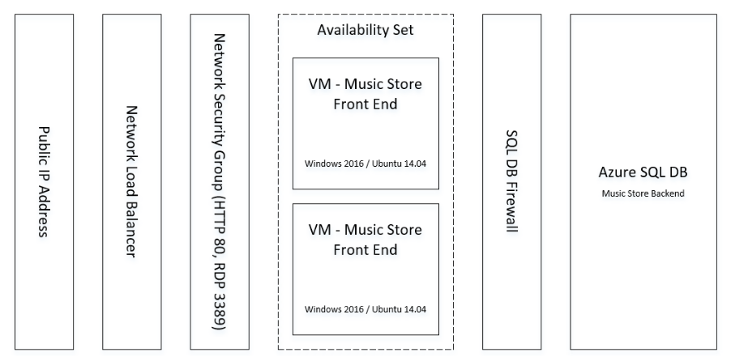

# 将应用程序自动部署到 Azure 虚拟机
本系列教程包括四个部分，详细说明如何使用 Azure Resource Manager 模板来部署和配置 Azure 资源与应用程序。本系列教程将部署一个示例模板，并检查部署模板。本系列教程旨在讲解 Azure 资源之间的关系，并实践有关部署完全集成的 Azure Resource Manager 模板的体验。本文档假设读者对 Azure Resource Manager 有一个基本的了解。开始本教程之前，请先熟悉 Azure Resource Manager 的概念。

## 音乐应用商店应用程序
本系列教程中使用的示例是一个模拟音乐应用商店购物体验的 .Net Core 应用程序。此应用程序可以部署到 Linux 或 Windows 虚拟系统，针对这两者都已创建示例部署。该应用程序包含一个 Web 应用程序和一个 SQL 数据库。开始阅读本系列教程的文章之前，请先使用此页面上的“部署”按钮来部署应用程序。完整部署后，应用程序/Azure 体系结构将如下图所示。

可以在[音乐应用商店 Windows 模板](https://github.com/Microsoft/dotnet-core-sample-templates/tree/master/dotnet-core-music-windows)中找到音乐应用商店 Resource Manager 模板

  

以下四篇文章探讨了其中的每个组件（包括关联的 JSON 模板）。

* [**应用程序体系结构**](dotnet-core-2-architecture.md) – 应用程序组件（例如网站和数据库）必须托管在 Azure 计算机资源（例如虚拟机和 Azure SQL 数据库）上。此文档演练如何将计算需求映射到 Azure 资源，以及如何使用 Azure Resource Manager 模板来部署这些资源。
* [**访问权限和安全性**](dotnet-core-3-access-security.md) – 将应用程序托管在 Azure 中时，必须考虑如何访问应用程序，以及不同的应用程序组件如何访问彼此。此文档详细说明如何提供和保护对应用程序的 Internet 访问权限，以及应用程序组件之间的访问。
* [**可用性和可缩放性**](dotnet-core-4-availability-scale.md) – 可用性和可缩放性是指可在基础结构停机时保持运行的能力，以及可根据应用程序需求缩放计算资源的能力。此文档详细说明部署负载均衡和高可用性应用程序时所需的组件。
* [**应用程序部署**](dotnet-core-5-app-deployment.md) - 将应用程序部署到 Azure 虚拟机时，必须考虑将应用程序二进制文件安装在虚拟机上的方法。此文档详细说明如何使用 Azure 虚拟机自定义脚本扩展来自动安装应用程序。

开发 Azure Resource Manager 模板时，目标是要自动部署 Azure 基础结构，以及自动安装和配置托管在此 Azure 基础结构上的任何应用程序。这些文章提供了这种体验的示例。

## 部署音乐应用商店应用程序
可以使用此按钮部署音乐应用商店应用程序。

>[!NOTE]
> 必须修改下载的模板，以适应 Azure 中国云环境。例如，替换某些终结点（将“blob.core.windows.net”替换为“blob.core.chinacloudapi.cn”，将“cloudapp.azure.com”替换为“chinacloudapp.cn”，将“database.windows.net”替换为“database.chinacloudapi.cn”）；更改某些不受支持的 VM 映像；更改某些不受支持的 VM 大小。

Azure Resource Manager 模板需要以下参数值。

| 参数名称 | 说明 |
| --- | --- |
| ADMINUSERNAME |在虚拟机和 Azure SQL 数据库上使用的管理员用户名。 |
| ADMINPASSWORD |在 Azure 虚拟机和 SQL 数据库上使用的密码。 |
| NUMBEROFINSTANCES |要创建的虚拟机数目。其中每个虚拟机托管音乐应用商店 Web 应用程序，这些虚拟机上的所有流量经过负载均衡。 |
| PUBLICIPADDRESSDNSNAME |与公共 IP 地址关联的全局唯一 DNS 名称。 |

模板部署完成后，可使用任何 Internet 浏览器浏览到公共 IP 地址。将显示 .Net Core 音乐站点。

## 后续步骤

[步骤 1 - 使用 Azure Resource Manager 模板的应用程序体系结构](dotnet-core-2-architecture.md)

[步骤 2 - Azure Resource Manager 模板中的访问权限和安全性](dotnet-core-3-access-security.md)

[步骤 3 - Azure Resource Manager 模板的可用性和缩放](dotnet-core-4-availability-scale.md)

[步骤 4 - 使用 Azure Resource Manager 模板部署应用程序](dotnet-core-5-app-deployment.md)

<!---HONumber=Mooncake_1212_2016-->