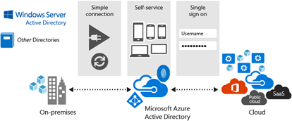

# <a name="manage-an-hpc-pack-cluster-in-azure-using-azure-active-directory"></a>使用 Azure Active Directory 管理 Azure 中的 HPC Pack 群集
对于在 Azure 中部署 HPC Pack 群集的管理员，[Microsoft HPC Pack 2016](https://technet.microsoft.com/library/cc514029) 支持与 [Azure Active Directory](../../active-directory/index.md) (Azure AD) 的集成。

对于以下高级任务，请按照本文中的步骤操作： 
* 手动将 HPC Pack 群集与 Azure AD 租户集成
* 在 Azure 的 HPC Pack 群集中管理和计划作业 

将 HPC Pack 群集解决方案与 Azure AD 集成时按照标准步骤集成其他应用程序和服务。 本文假定你熟悉 Azure AD 中的基本用户管理。 有关详细信息和背景，请参阅 [Azure Active Directory 文档](../../active-directory/index.md)和以下部分。

## <a name="benefits-of-integration"></a>集成的好处

Azure Active Directory (Azure AD) 是基于多租户云的目录和标识管理服务，可提供对云解决方案的单一登录 (SSO) 访问。

HPC Pack 群集与 Azure AD 集成可帮助用户实现以下目标：

* 从 HPC Pack 群集中删除传统的 Active Directory 域控制器。 这可以帮助减少维护群集的成本（如果这对于业务是不必要的）并加速执行部署过程。
* 利用 Azure AD 带来的以下好处：
    *   单一登录 
    *   对 Azure 中的 HPC Pack 群集使用本地 AD 标识 

    

## <a name="prerequisites"></a>先决条件
* **Azure 虚拟机中部署的 HPC Pack 2016 群集** - 需要获得头节点的 DNS 名称和群集管理员的凭据才能完成本文中的步骤。

  > [!NOTE]
  > 在 HPC Pack 2016 之前的 HPC Pack 版本中不支持 Azure Active Directory 集成。

* **客户端计算机** - 需要 Windows 或 Windows Server 客户端计算机才能运行 HPC Pack 客户端实用工具。 如果只想要使用 HPC Pack Web 门户或 REST API 来提交作业，则可以使用自选的任意客户端计算机。

* **HPC Pack 客户端实用工具** - 使用 Microsoft 下载中心提供的免费安装包在客户端计算机上安装 HPC Pack 客户端实用工具。

## <a name="step-1-register-the-hpc-cluster-server-with-your-azure-ad-tenant"></a>步骤 1：将 HPC 群集服务器注册到 Azure AD 租户
1. 登录到 [Azure 门户](https://portal.azure.cn)。
2. 如果你的帐户有权限访问多个 Azure AD 租户，请在右上角单击该帐户， 并将门户会话设置为所需的租户。 必须有权访问该目录中的资源。 
3. 单击左侧服务导航窗格中的“Azure Active Directory”，然后单击“用户和组”，并确保已有创建或配置的用户帐户。
4. 在“Azure Active Directory”中，依次单击“应用注册” > “新应用程序注册”。 输入以下信息：
    * **名称** - HPCPackClusterServer
    * 应用程序类型 - 选择“Web 应用/ API”
    * **登录 URL** - 示例的基 URL，默认情况下为 `https://hpcserver`
    * 单击**创建**。
5. 添加应用后，在“应用注册”列表中选择该应用。 然后单击“设置” > “属性”。 输入以下信息：
    * 为“多租户”选择“是”。
    * 将“应用 ID URI”更改为 `https://<Directory_name>/<application_name>`。 例如，将 `<Directory_name`> 替换为 Azure AD 租户的全名 `hpclocal.partner.onmschina.cn`，并将 `<application_name>` 替换为之前选择的名称。
6. 单击“保存” 。 保存完成时，在应用页上单击“清单”。 通过查找 `appRoles` 设置并添加以下应用程序角色来编辑清单，然后单击“保存”：

  ```json
  "appRoles": [
     {
     "allowedMemberTypes": [
         "User",
         "Application"
     ],
     "displayName": "HpcAdminMirror",
     "id": "61e10148-16a8-432a-b86d-ef620c3e48ef",
     "isEnabled": true,
     "description": "HpcAdminMirror",
     "value": "HpcAdminMirror"
     },
     {
     "allowedMemberTypes": [
         "User",
         "Application"
     ],
     "description": "HpcUsers",
     "displayName": "HpcUsers",
     "id": "91e10148-16a8-432a-b86d-ef620c3e48ef",
     "isEnabled": true,
     "value": "HpcUsers"
     }
  ],
  ```
7. 在“Azure Active Directory”中，单击“企业应用程序” > “所有应用程序”。 从列表中选择“HPCPackClusterServer”。
8. 单击“属性”，然后将“需要进行用户分配”更改为“是”。 单击“保存” 。
9. 单击“用户和组” > “添加用户”。 分别选择一个用户和一个角色，然后单击“分配”。 将可用角色之一（HpcUsers 或 HpcAdminMirror）分配给该用户。 为目录中的其他用户重复此步骤。 有关群集用户的背景信息，请参阅[管理群集用户](https://technet.microsoft.com/library/ff919335(v=ws.11).aspx)。

## <a name="step-2-register-the-hpc-cluster-client-with-your-azure-ad-tenant"></a>步骤 2：将 HPC 群集客户端注册到 Azure AD 租户

1. 登录到 [Azure 门户](https://portal.azure.cn)。
2. 如果你的帐户有权限访问多个 Azure AD 租户，请在右上角单击该帐户， 并将门户会话设置为所需的租户。 必须有权访问该目录中的资源。 
3. 在“Azure Active Directory”中，依次单击“应用注册” > “新应用程序注册”。 输入以下信息：

    * **名称** - HPCPackClusterClient    
    * “应用程序类型”- 选择“本机”
    * **重定向 URI** - `http://hpcclient`
    * 单击“创建” 

4. 添加应用后，在“应用注册”列表中选择该应用。 复制应用程序 ID 值并保存它。 稍后在配置应用程序时需要此值。

5. 依次单击“设置” > “所需的权限” > “添加” > “选择 API”。 搜索并选择 HpcPackClusterServer 应用程序（在步骤 1 中创建）。

6. 在“启用访问”页上，选择“访问 HpcClusterServer”。 然后单击“完成”。

## <a name="step-3-configure-the-hpc-cluster"></a>步骤 3：配置 HPC 群集

1. 连接到 Azure 中的 HPC Pack 2016 头节点。

2. 启动 HPC PowerShell。

3. 运行以下命令：

    ```powershell

    Set-HpcClusterRegistry -SupportAAD true -AADInstance https://login.chinacloudapi.cn/ -AADAppName HpcPackClusterServer -AADTenant <your AAD tenant name> -AADClientAppId <client ID> -AADClientAppRedirectUri http://hpcclient
    ```
    其中

    * `AADTenant` 指定 Azure AD 租户名称，例如 `hpclocal.partner.onmschina.cn`
    * `AADClientAppId` 指定在步骤 2 中所创建应用的应用程序 ID。

4. 执行以下操作之一，具体取决于头节点配置：

    * 在单个头节点 HPC Pack 群集中，重新启动 HpcScheduler 服务。

    * 在带有多个头节点的 HPC Pack 群集中，在头节点上运行以下 PowerShell 命令，以重新启动 HpcSchedulerStateful 服务：

    ```powershell
    Connect-ServiceFabricCluster

    Move-ServiceFabricPrimaryReplica -ServiceName "fabric:/HpcApplication/SchedulerStatefulService"

    ```

## <a name="step-4-manage-and-submit-jobs-from-the-client"></a>步骤 4：从客户端管理和提交作业

若要在计算机上安装 HPC Pack 客户端实用工具，请从 Microsoft 下载中心下载 HPC Pack 2016 安装程序文件（完整安装）。 开始安装时，请选择针对 **HPC Pack 客户端实用工具**的安装选项。

若要准备客户端计算机，请在客户端计算机上安装在 HPC 群集安装过程中使用的证书。 使用标准 Windows 证书管理过程将公用证书安装到“证书 - 当前用户” > “受信任根证书颁发机构”存储。 

现在可以运行 HPC Pack 命令或通过 HPC Pack 作业管理器 GUI 使用 Azure AD 帐户提交和管理群集作业。 有关作业提交选项，请参阅[将 HPC 作业提交到 Azure 中的 HPC Pack 群集](hpcpack-cluster-submit-jobs.md#step-3-run-test-jobs-on-the-cluster)。

> [!NOTE]
> 首次尝试连接到 Azure 中的 HPC Pack 群集时，会显示弹出窗口。 输入用于登录的 Azure AD 凭据。 然后缓存令牌。 之后在 Azure 中连接到群集时会使用缓存的令牌，除非身份验证更改或清除缓存。
>

例如，完成前面的步骤后，可以从本地客户端查询作业，如下所示：

```powershell 
Get-HpcJob -State All -Scheduler https://<Azure load balancer DNS name> -Owner <Azure AD account>
```

## <a name="useful-cmdlets-for-job-submission-with-azure-ad-integration"></a>与 Azure AD 集成的用于提交作业的有用 cmdlet 

### <a name="manage-the-local-token-cache"></a>管理本地令牌缓存

HPC Pack 2016 提供以下 HPC PowerShell cmdlet 用于管理本地令牌缓存。 这些 cmdlet 可用于以非交互方式提交作业。 请参阅以下示例：

```powershell
Remove-HpcTokenCache

$SecurePassword = "<password>" | ConvertTo-SecureString -AsPlainText -Force

Set-HpcTokenCache -UserName <AADUsername> -Password $SecurePassword -scheduler https://<Azure load balancer DNS name> 
```

### <a name="set-the-credentials-for-submitting-jobs-using-the-azure-ad-account"></a>设置用于使用 Azure AD 帐户提交作业的凭据 

有时，需要在 HPC 群集用户下运行作业（对于已加入域的 HPC 群集，以域用户身份运行；对于未加入域的 HPC 群集，以头节点上的本地用户身份运行）。

1. 使用以下命令设置凭据：

    ```powershell
    $localUser = "<username>"

    $localUserPassword="<password>"

    $secpasswd = ConvertTo-SecureString $localUserPassword -AsPlainText -Force

    $mycreds = New-Object System.Management.Automation.PSCredential ($localUser, $secpasswd)

    Set-HpcJobCredential -Credential $mycreds -Scheduler https://<Azure load balancer DNS name>
    ```

2. 然后提交作业，如下所示。 作业/任务在计算节点的 $localUser 下运行。

    ```powershell
    $emptycreds = New-Object System.Management.Automation.PSCredential ($localUser, (new-object System.Security.SecureString))
    ...
    $job = New-HpcJob -Scheduler https://<Azure load balancer DNS name>

    Add-HpcTask -Job $job -CommandLine "ping localhost" -Scheduler https://<Azure load balancer DNS name>

    Submit-HpcJob -Job $job -Scheduler https://<Azure load balancer DNS name> -Credential $emptycreds
    ```

   如果未使用 `Submit-HpcJob` 指定 `-Credential`，则作业/任务以 Azure AD 帐户身份在本地映射的用户下运行。 （HPC 群集使用与 Azure AD 帐户相同的名称创建本地用户以运行任务。）

3. 为 Azure AD 帐户设置扩展的数据。 使用 Azure AD 帐户在 Linux 节点上运行 MPI 作业时，这种做法十分有用。

   * 为 Azure AD 帐户本身设置扩展的数据

      ```powershell
      Set-HpcJobCredential -Scheduler https://<Azure load balancer DNS name> -ExtendedData <data> -AadUser
      ```

   * 设置扩展的数据和 HPC 群集的运行方式用户

      ```powershell
      Set-HpcJobCredential -Credential $mycreds -Scheduler https://<Azure load balancer DNS name> -ExtendedData <data>
      ```
<!-- Update_Description: update meta properties, update link -->