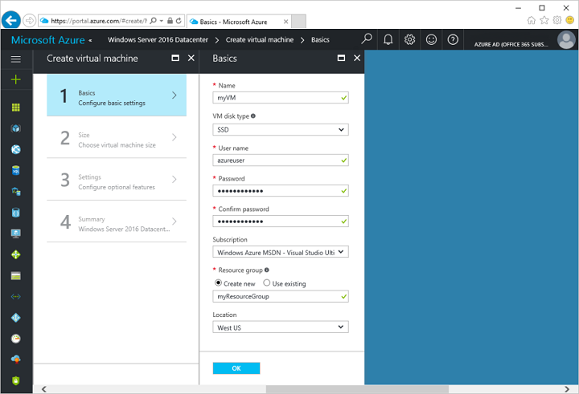

# <a name="create-a-windows-virtual-machine-with-the-azure-portal"></a>使用 Azure 门户创建 Windows 虚拟机

可以通过 Azure 门户创建 Azure 虚拟机。 此方法提供一个基于浏览器的用户界面，用于创建和配置虚拟机和所有相关的资源。 本快速入门介绍了如何创建虚拟机并在 VM 上安装 Webserver。

如果没有 Azure 订阅，可在开始前创建一个[试用帐户](https://www.azure.cn/pricing/1rmb-trial/?WT.mc_id=A261C142F)。

## <a name="log-in-to-azure"></a>登录 Azure

通过 http://portal.azure.cn 登录到 Azure 门户。

## <a name="create-virtual-machine"></a>创建虚拟机

1. 单击 Azure 门户左上角的“新建”按钮。

2. 选择“计算”，然后选择“Windows Server 2016 Datacenter”。 

3. 输入虚拟机信息。 在此处输入的用户名和密码用于登录到虚拟机。 完成后，单击“确定”。

      

4. 为 VM 选择大小。 若要查看更多的大小，请选择“全部查看”或更改“支持的磁盘类型”筛选器。 

      

5. 在“设置”下，保留默认值，然后单击“确定”。 

6. 在摘要页上，单击“确定”以开始虚拟机部署。

7. VM 将固定到 Azure 门户仪表板。 完成部署后，会自动打开 VM 摘要。

## <a name="connect-to-virtual-machine"></a>连接到虚拟机

创建与虚拟机的远程桌面连接。

1. 单击虚拟机属性上的“连接”按钮。 此时会创建和下载远程桌面协议文件（.rdp 文件）。

     

2. 若要连接到 VM，请打开下载的 RDP 文件。 出现提示时，请单击“连接”。 在 Mac 上，需要一个 RDP 客户端，例如 Mac 应用商店提供的这个[远程桌面客户端](https://itunes.apple.com/us/app/microsoft-remote-desktop/id715768417?mt=12)。

3. 输入在创建虚拟机时指定的用户名和密码，并单击“确定”。

4. 你可能会在登录过程中收到证书警告。 单击“是”或“继续”继续进行连接。

## <a name="install-iis-using-powershell"></a>使用 PowerShell 安装 IIS

在虚拟机上启动 PowerShell 会话并运行以下命令，安装 IIS。

```powershell
Install-WindowsFeature -name Web-Server -IncludeManagementTools
```

完成后，退出 RDP 会话，返回 Azure 门户中的 VM 属性。

## <a name="open-port-80-for-web-traffic"></a>为 Web 流量打开端口 80 

网络安全组 (NSG) 保护入站和出站流量的安全。 从 Azure 门户创建 VM 后，将会在进行 RDP 连接的端口 3389 上创建入站规则。 由于此 VM 托管 webserver，需为端口 80 创建 NSG 规则。

1. 在虚拟机上，单击**资源组**的名称。
2. 选择“网络安全组”。 可以通过“类型”列来标识 NSG。 
3. 在左侧菜单的“设置”下，单击“入站安全规则”。
4. 单击“添加”。
5. 在“名称”中，键入“http”。 请确保将“端口范围”设置为 80，将“操作”设置为“允许”。 
6. 单击 **“确定”**。

## <a name="view-the-iis-welcome-page"></a>查看 IIS 欢迎页

安装 IIS 并向 VM 打开端口 80 以后，即可通过 Internet 访问 webserver。 打开 Web 浏览器，输入 VM 的公共 IP 地址。 该公共 IP 地址可以在 Azure 门户的“虚拟机”下找到。

 

## <a name="clean-up-resources"></a>清理资源

不再需要资源组、虚拟机和所有相关的资源时，可将其删除。 为此，请选择适用于 VM 的资源组，然后单击“删除”。

## <a name="next-steps"></a>后续步骤

在本快速入门中，部署了一个简单的虚拟机、一条网络安全组规则，并安装了一个 Web 服务器。 若要深入了解 Azure 虚拟机，请继续学习 Windows VM 教程。

> [!div class="nextstepaction"]
> [Azure Windows 虚拟机教程](./tutorial-manage-vm.md)

<!--Update_Description: wording update-->