# 在 Azure 上为 SAP ERP 6.0 部署 SAP IDE EHP7 SP3
本文介绍如何通过 SAP Cloud Appliance Library 3.0，在 Azure 上部署运行 SQL Server 和 Windows OS 的 SAP IDES。 屏幕截图将逐步显示此过程。 部署列表中的其他解决方案在过程上是相同的， 只需选择不同的解决方案即可。

若要开始使用 SAP Cloud Appliance Library (SAP CAL)，请转到[此处](https://cal.sap.com/)。 SAP 提供了有关全新 [SAP Cloud Appliance Library 3.0](http://scn.sap.com/community/cloud-appliance-library/blog/2016/05/27/sap-cloud-appliance-library-30-came-with-a-new-user-experience)的博客。 

以下屏幕截图逐步显示如何在 Azure 上部署 SAP IDES。 其他解决方案的部署过程相同。

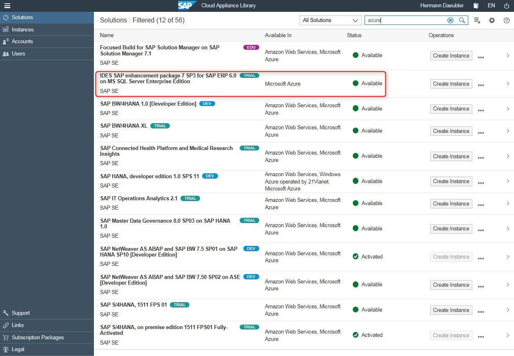

第一张图显示 Azure 上的所有可用解决方案。 本文选择了突出显示的、只可在 Azure 上使用的基于 Windows 的 SAP IDE 解决方案来演练部署过程。

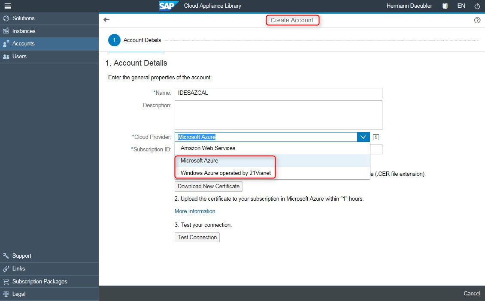

首先必须创建一个新的 SAP CAL 帐户。 Azure 目前有两种选择 - 标准 Azure，以及在中国大陆由合作伙伴 21Vianet 运营的 Azure。

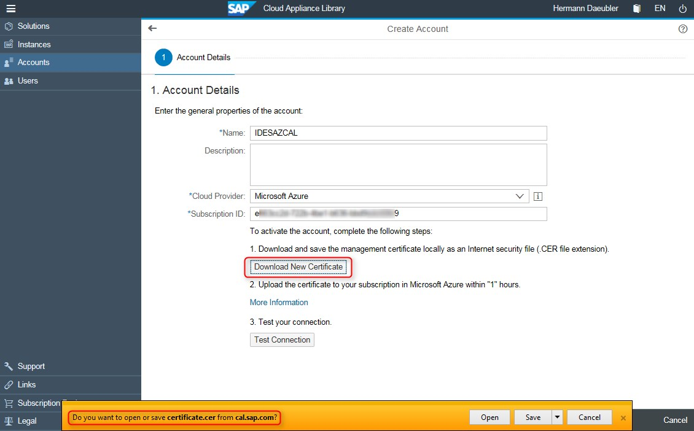

然后，必须输入可在 Azure 门户预览上找到的 Azure 订阅 ID - 请进一步参阅下文有关如何获取该 ID 的内容。 接下来，需要下载 Azure 管理证书。

在新 Azure 门户预览中，可以在左侧看到“订阅”项。 单击该项可显示用户的所有活动订阅。

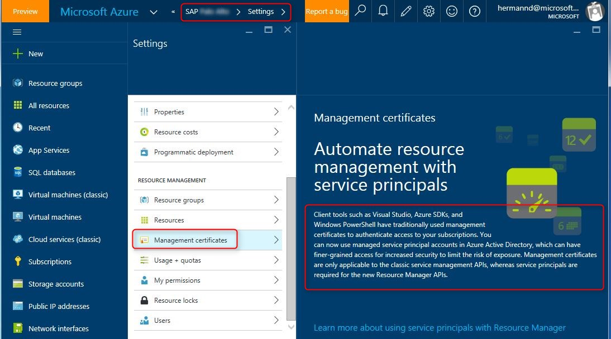

选择其中一个订阅并选择“管理证书”会出现一个新概念，那就是要对新的 Azure Resource Manager 模型使用“服务主体”。
SAP CAL 尚未针对此新模型进行改编，仍需要在“经典”模型和以前的 Azure 门户预览中使用管理证书。

此处显示的是以前的 Azure 门户预览。 上载管理证书后，SAP CAL 便有权在客户订阅中创建虚拟机。 在“订阅”选项卡下面，可以找到必须在 SAP CAL 门户中输入的订阅 ID。

在第二个选项卡上，可以上载前面从 SAP CAL 下载的管理证书。

此时会弹出一个小对话框用于选择下载的证书文件。

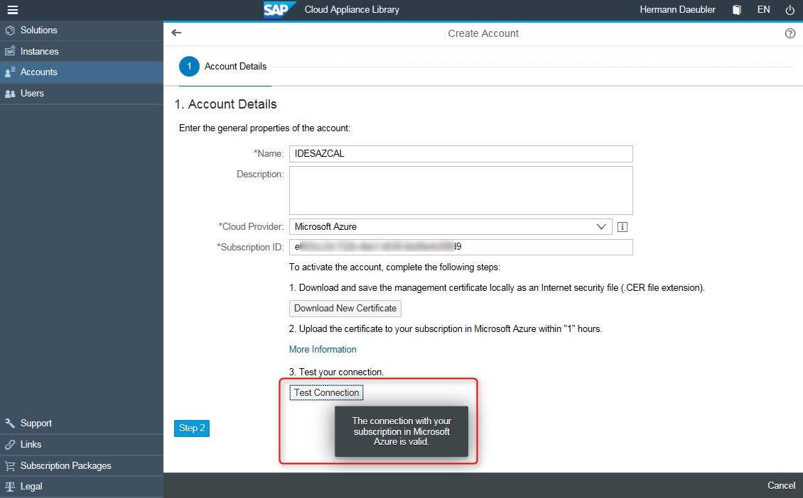

上载证书后，可在 SAP CAl 中测试 SAP CAL 与客户 Azure 订阅之间的连接。 此时应弹出一小段消息，告知连接有效。

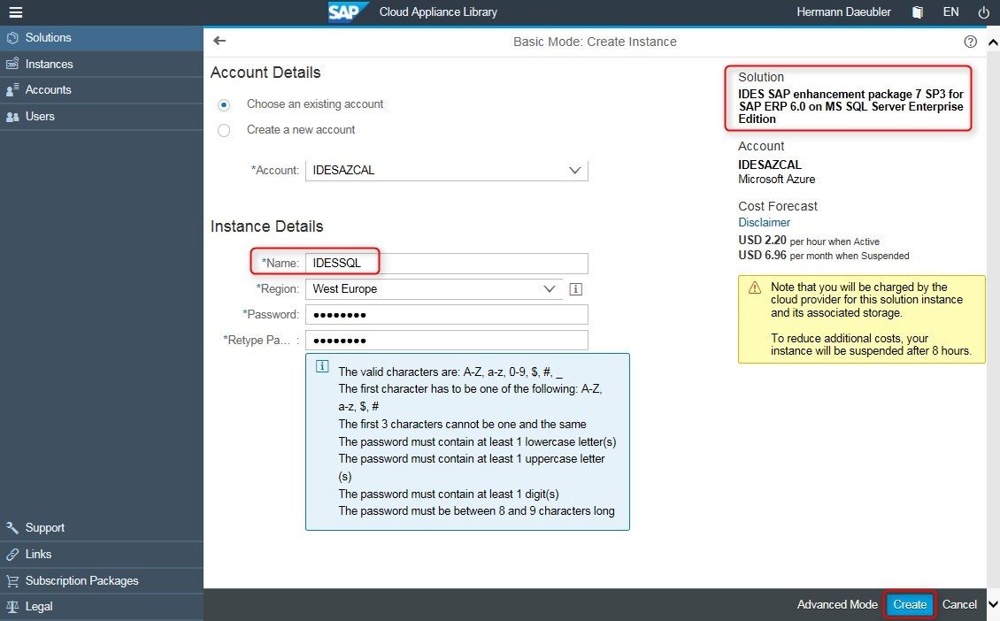

设置帐户之后，必须选择要部署的解决方案并创建实例。
在“基本”模式下，此过程非常简单。 输入实例名称，选择 Azure 区域，定义解决方案的主要密码。

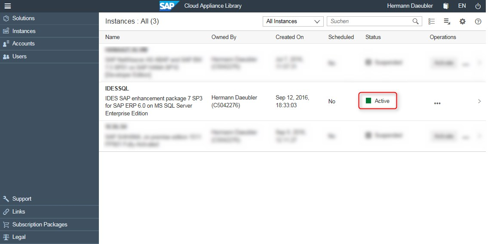

一段时间后，根据解决方案的大小和复杂性（SAP CAL 的估算值），解决方案将显示为“活动”并可供使用。 非常简单。

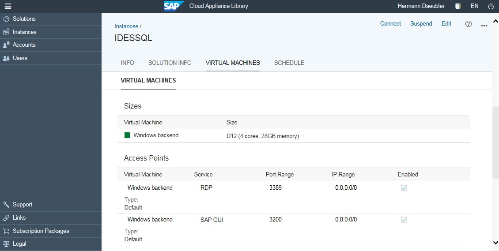

查看解决方案的一些详细信息，可以看到已部署的 VM 种类。 在本例中，只有一个 D12 大小的 Azure VM，它是由 SAP CAL D12 创建的。

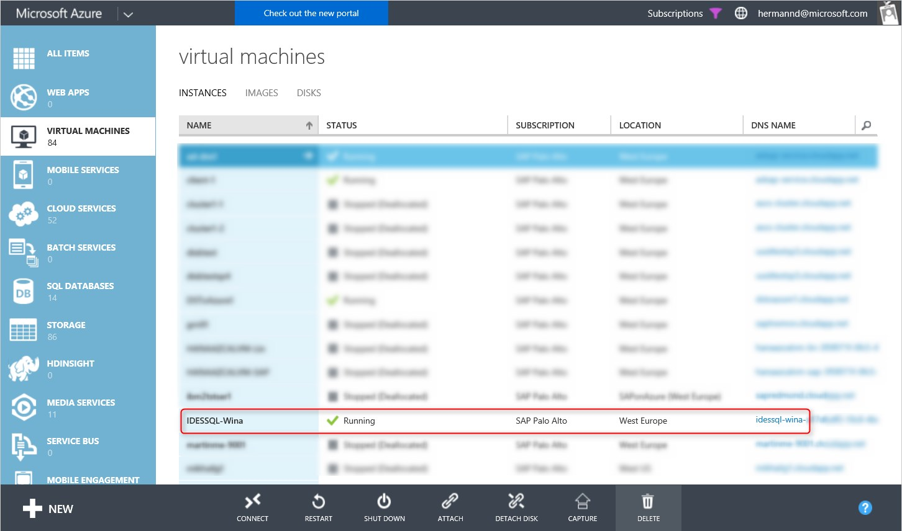

在 Azure 门户预览中，可以找到以 SAP CAL 中所提供的相同实例名称开头的虚拟机。

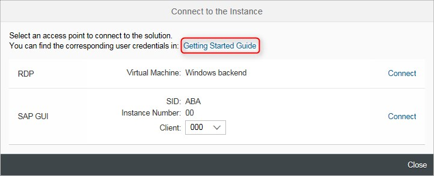

现在，可以通过 SAP CAL 门户中的连接按钮连接到解决方案。 小对话框包含用户指南的链接，其中描述了使用解决方案时所需的全部默认凭据。
[此处](https://caldocs.hana.ondemand.com/caldocs/help/Getting_Started_Guide_IDES607MSSQL.pdf) 提供了 IDE 解决方案指南的链接。

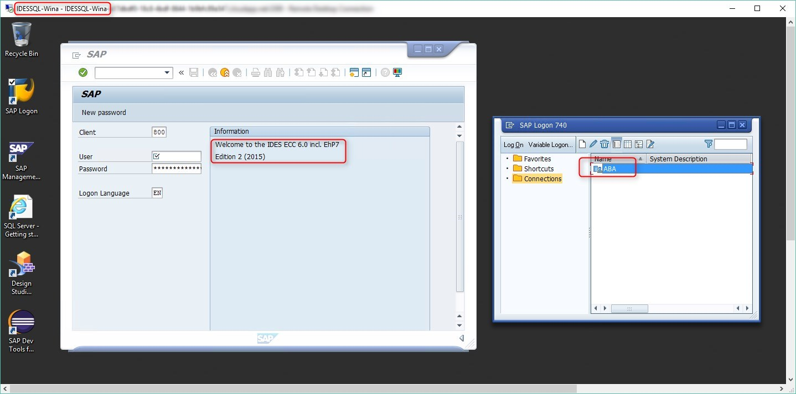

另一种做法是登录到 Windows VM，然后启动预配置的 SAP GUI 或其他界面。
