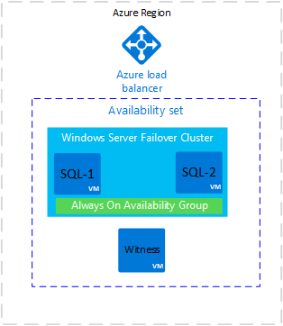
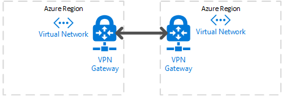
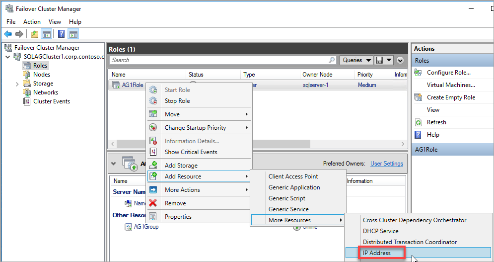
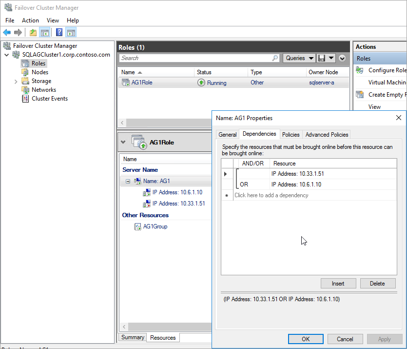

# <a name="configure-an-always-on-availability-group-on-azure-virtual-machines-in-different-regions"></a>在位于不同区域的 Azure 虚拟机上配置 Always On 可用性组

本文介绍了如何在位于远程 Azure 位置的 Azure 虚拟机上配置 SQL Server Always On 可用性组副本。 使用此配置以支持灾难恢复。

本文适用于处于 Resource Manager 模式的 Azure 虚拟机。

下图显示了 Azure 虚拟机上可用性组的常见部署：



在此部署中，所有虚拟机位于一个 Azure 区域。 在 SQL-1 和 SQL-2 上，可以使用自动故障转移为可用性组副本配置同步提交。 若要构建此体系结构，请参阅[可用性组模板或教程](virtual-machines-windows-portal-sql-availability-group-overview.md)。

如果 Azure 区域无法访问，则此体系结构容易中断。 为了解决此漏洞，可在不同的 Azure 区域添加一个副本。 下图显示了新体系结构的大致形式：


上图显示了名为 SQL-3 的新虚拟机。 SQL-3 位于不同的 Azure 区域中。 SQL-3 已添加到 Windows Server 故障转移群集。 SQL-3 可以托管可用性组副本。 最后，请注意，SQL-3 所在的 Azure 区域具有一个新的 Azure 负载均衡器。

>[!NOTE]
> 如果同一区域中有多个虚拟机，则需要创建 Azure 可用性集。 如果区域中只有一个虚拟机，则不需要可用性集。 只能在创建虚拟机时将虚拟机放入可用性集。 如果虚拟机已在可用性集中，以后可为附加的副本添加虚拟机。

在此体系结构中，远程区域中的副本通常配置了异步提交可用性模式和手动故障转移模式。

如果可用性组副本位于不同 Azure 区域中的 Azure 虚拟机上，则每个区域需要：

* 一个虚拟网络网关
* 一个虚拟网络网关连接

下图显示了数据中心之间的网络通信方式。



>[!IMPORTANT]
>对于在两个 Azure 区域之间进行复制的数据，此体系结构会产生出站数据费用。 请参阅[带宽定价](https://www.azure.cn/pricing/details/data-transfer/)。  

## <a name="create-remote-replica"></a>创建远程副本

若要在远程数据中心创建副本，请执行以下步骤：

1. [在新区域中创建虚拟网络](../../../virtual-network/manage-virtual-network.md#create-a-virtual-network)。

1. [使用 Azure 门户配置 VNet 到 VNet 连接](../../../vpn-gateway/vpn-gateway-howto-vnet-vnet-resource-manager-portal.md)。

    >[!NOTE]
    >在某些情况下，可能需要使用 PowerShell 创建 VNet 到 VNet 连接。 例如，使用不同的 Azure 帐户时无法在门户中配置连接。 这种情况请参阅[使用 Azure 门户配置 VNet 到 VNet 连接](../../../vpn-gateway/vpn-gateway-vnet-vnet-rm-ps.md)。

1. [在新区域中创建域控制器](https://docs.microsoft.com/en-us/windows-server/identity/ad-ds/introduction-to-active-directory-domain-services-ad-ds-virtualization-level-100)。

    <!--Notice: URL ture /active-directory/active-directory-new-forest-virtual-machine.md to https://docs.microsoft.com/en-us/windows-server/identity/ad-ds/introduction-to-active-directory-domain-services-ad-ds-virtualization-level-100-->
    
    如果主站点中的域控制器不可用，此域控制器可提供身份验证。

1. [在新区域中创建 SQL Server 虚拟机](virtual-machines-windows-portal-sql-server-provision.md)。

1. [在新区域的网络中创建 Azure 负载均衡器](virtual-machines-windows-portal-sql-availability-group-tutorial.md#configure-internal-load-balancer)。

    此负载均衡器必须：

    - 与新虚拟机位于同一网络和子网中。
    - 可用性组侦听器具有静态 IP 地址。
    - 包括后端池，该池只由负载均衡器所在区域中的虚拟机构成。
    - 使用特定于 IP 地址的 TCP 端口探测。
    - 具有特定于同一区域中 SQL Server 的负载均衡规则。  
    - 如果后端池中的虚拟机不是单个可用性集或虚拟机规模集的一部分，则为标准负载均衡器。 有关其他信息，请查看 [Azure 负载均衡器标准概述](/load-balancer/load-balancer-standard-overview)。

1. [向新的 SQL Server 添加故障转移群集功能](virtual-machines-windows-portal-sql-availability-group-prereq.md#add-failover-clustering-features-to-both-sql-server-vms)。

1. [将新的 SQL Server 添加到域](virtual-machines-windows-portal-sql-availability-group-prereq.md#joinDomain)。

1. [将新的 SQL Server 服务帐户设置为使用域帐户](virtual-machines-windows-portal-sql-availability-group-prereq.md#setServiceAccount)。

1. [将新的 SQL Server 添加到 Windows Server 故障转移群集](virtual-machines-windows-portal-sql-availability-group-tutorial.md#addNode)。

1. 在群集上创建 IP 地址资源。

    可在故障转移群集管理器中创建 IP 地址资源。 右键单击可用性组角色，单击“添加资源”  ，“更多资源”  ，然后单击“IP 地址”  。

    

    按如下所示配置此 IP 地址：

    - 使用远程数据中心内的网络。
    - 从新的 Azure 负载均衡器分配 IP 地址。 

1. 在 SQL Server 配置管理器中的新 SQL Server 上，[启用 Always On 可用性组](https://msdn.microsoft.com/library/ff878259.aspx)。

1. [在新的 SQL Server 上打开防火墙端口](virtual-machines-windows-portal-sql-availability-group-prereq.md#endpoint-firewall)。

    需要打开的端口号取决于环境。 打开镜像终结点和 Azure 负载均衡器运行状况探测的端口。

1. [将副本添加到新 SQL Server 上的可用性组](https://msdn.microsoft.com/library/hh213239.aspx)。

    对位于远程 Azure 区域中的副本，将其设置为与手动故障转移进行异步复制。  

1. 将 IP 地址资源设成侦听器客户端访问点（网络名称）群集的依赖项。

    以下屏幕截图显示了正确配置的 IP 地址群集资源：

    

    >[!IMPORTANT]
    >该群集资源组包含这两个 IP 地址。 这两个 IP 地址是侦听器客户端接入点的依赖项。 在群集依赖项配置中使用 **OR** 运算符。

1. [在 PowerShell 中设置群集参数](virtual-machines-windows-portal-sql-availability-group-tutorial.md#setparam)。

使用在新区域中的负载均衡器上配置的群集网络名称、IP 地址和探测端口运行 PowerShell 脚本。

    ```powershell
    $ClusterNetworkName = "<MyClusterNetworkName>" # The cluster name for the network in the new region (Use Get-ClusterNetwork on Windows Server 2012 of higher to find the name).
    $IPResourceName = "<IPResourceName>" # The cluster name for the new IP Address resource.
    $ILBIP = "<n.n.n.n>" # The IP Address of the Internal Load Balancer (ILB) in the new region. This is the static IP address for the load balancer you configured in the Azure portal.
    [int]$ProbePort = <nnnnn> # The probe port you set on the ILB.

    Import-Module FailoverClusters

    Get-ClusterResource $IPResourceName | Set-ClusterParameter -Multiple @{"Address"="$ILBIP";"ProbePort"=$ProbePort;"SubnetMask"="255.255.255.255";"Network"="$ClusterNetworkName";"EnableDhcp"=0}
    ```

## <a name="set-connection-for-multiple-subnets"></a>设置多个子网的连接

远程数据中心内的副本是可用性组的一部分，但位于不同的子网。 如果此副本成为主副本，可能会发生应用程序连接超时。 多子网部署中的本地可用性组也存在相同的行为。 若要允许从客户端应用程序建立连接，请更新客户端连接，或者在群集网络名称资源上配置名称解析缓存。

最好是通过更新客户端连接字符串来设置 `MultiSubnetFailover=Yes`。 请参阅[使用 MultiSubnetFailover 进行连接](https://msdn.microsoft.com/library/gg471494#Anchor_0)。

如果无法修改连接字符串，可以配置名称解析缓存。 请参阅[出现超时错误并且在多子网环境中无法连接到 SQL Server 2012 AlwaysOn 可用性组侦听程序](https://support.microsoft.com/help/2792139/time-out-error-and-you-cannot-connect-to-a-sql-server-2012-alwayson-av)。

## <a name="fail-over-to-remote-region"></a>故障转移到远程区域

要测试侦听器与远程区域之间的连接，可将副本故障转移到远程区域。 尽管副本是异步的，但故障转移存在丢失数据的可能性。 要故障转移且不丢失数据，请将可用性模式改为同步，并将故障转移模式设置为自动。 使用以下步骤：

1. 在“对象资源管理器”  中连接到承载主副本的 SQL Server 实例。
1. 在“AlwaysOn 可用性组”  的“可用性组”  下，右键单击可用性组，然后单击“属性”  。
1. 在“常规”  页上的“可用性副本”  下，将灾难恢复站点中的辅助副本设置为使用“同步提交”  可用性模式和“自动”  故障转移模式。
1. 如果辅助副本和主副本位于同一站点，且辅助副本具有高可用性，则将辅助副本设置为“异步提交”  和“手动”  。
1. 单击“确定”。
1. 在“对象资源管理器”  中，右键单击可用性组中，然后单击“显示仪表板”  。
1. 在仪表板上确认灾难恢复恢复上的副本为同步。
1. 在“对象资源管理器”  中，右键单击可用性组中，然后单击“付账转移...”  。SQL Server Management Studio 将打开向导对 SQL Server 进行故障转移。  
1. 单击“下一步”  ，然后选择灾难恢复站点中的 SQL Server 实例。 再次单击“下一步”  。
1. 连接到灾难恢复站点中的 SQL Server 实例，然后单击“下一步”  。
1. 在“摘要”  页上查看设置，然后单击“完成”  。

测试连接后，将主副本移回主数据中心，将可用性模式设置回其正常运行的设置。 下表显示了本文档所述体系结构的正常运行的设置：

| Location | 服务器实例 | 角色 | 可用性模式 | 故障转移模式
| ----- | ----- | ----- | ----- | -----
| 主数据中心 | SQL-1 | 主要 | 同步 | 自动
| 主数据中心 | SQL-2 | 次要 | 同步 | 自动
| 辅助或远程数据中心 | SQL-3 | 辅助 | 异步 | 手动

### <a name="more-information-about-planned-and-forced-manual-failover"></a>有关计划内和强制手动故障转移的详细信息

有关详细信息，请参阅以下主题：

- [对可用性组执行计划的手动故障转移 (SQL Server)](https://msdn.microsoft.com/library/hh231018.aspx)
- [对可用性组执行强制的手动故障转移 (SQL Server)](https://msdn.microsoft.com/library/ff877957.aspx)

## <a name="additional-links"></a>其他链接

* [Always On 可用性组](https://msdn.microsoft.com/library/hh510230.aspx)
* [Azure 虚拟机](/virtual-machines/windows/)
* [Azure 负载均衡器](virtual-machines-windows-portal-sql-availability-group-tutorial.md#configure-internal-load-balancer)
* [Azure 可用性集](../manage-availability.md)

<!-- Update_Description: wording update, update link -->