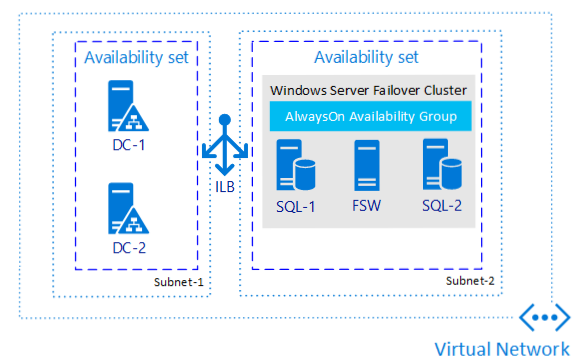
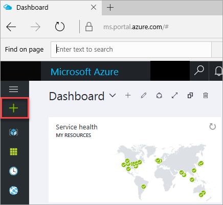
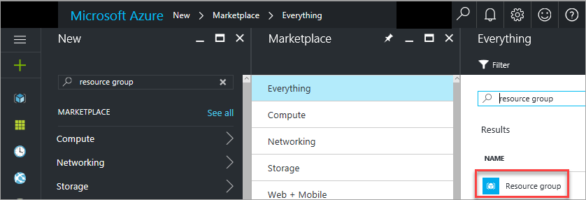
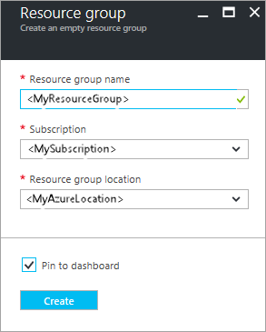
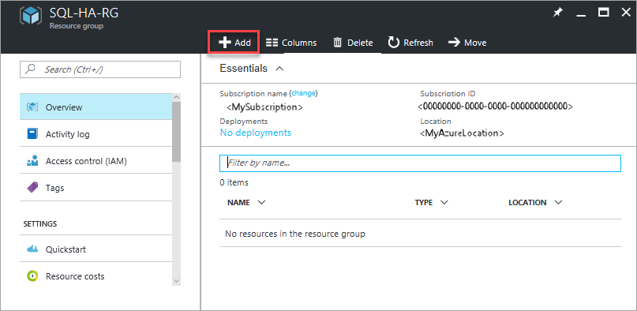
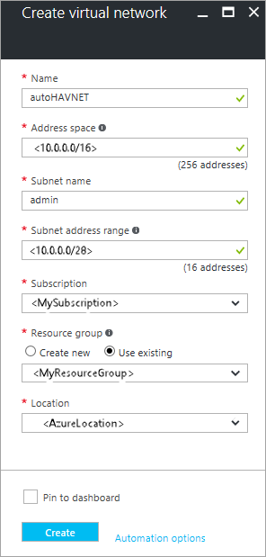
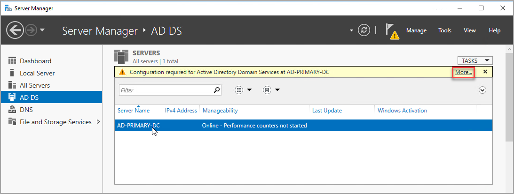
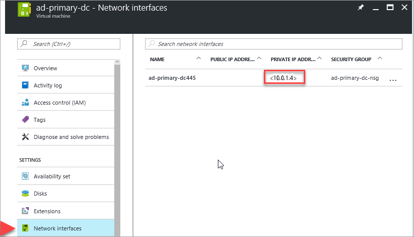
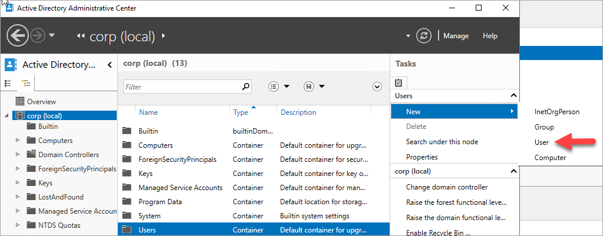
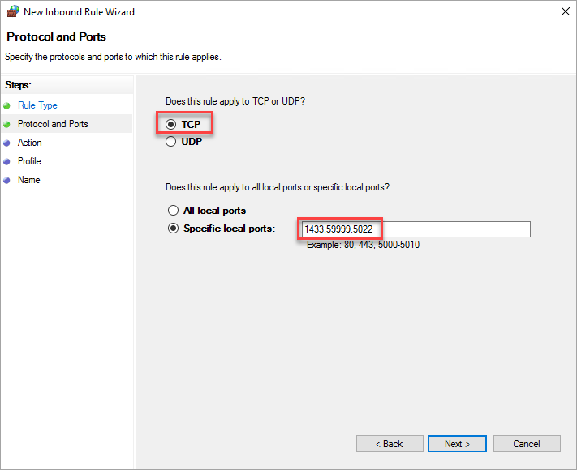

# 满足在 Azure 虚拟机中创建 Always On 可用性组的先决条件

本教程说明如何完成必备组件配置，以便[在 Azure 虚拟机上中创建 SQL Server Always On 可用性组](virtual-machines-windows-portal-sql-availability-group-tutorial.md)。 满足先决条件后，可在单个资源组中获得一个域控制器、两个 SQL Server 和一个见证服务器。

**估计所需时间**：可能需要几个小时才能满足先决条件。 大部分时间花费在创建虚拟机上。

下图演示了在本教程中生成的项目。

## 查看可用性组文档

本教程假设读者对 SQL Server Always On 可用性组有一个基本的了解。 如果读者不熟悉此技术，请参阅 [Always On 可用性组概述 (SQL Server)](http://msdn.microsoft.com/library/ff877884.aspx)。

## 创建 Azure 帐户
* 需要一个 Azure 帐户。 可以[建立 Azure 试用帐户](https://www.azure.cn/pricing/1rmb-trial/?WT.mc_id=A261C142F)。 

## 创建资源组
1. 登录 [Azure 门户](http://portal.azure.cn)。 
2. 在门户中单击 **+** 创建一个新对象。

    

1. 在“应用商店”搜索窗口中键入“资源组”。

    
1. 单击“创建” **Resource group**。
4. 单击“创建” 。 
5. 在“资源组”边栏选项卡中的“资源组名称”下，键入资源组的名称。 例如，键入 **sql-ha-rg**。
6. 若有多个 Azure 订阅，请验证此订阅是否为要在其中创建可用性组的 Azure 订阅。 
7. 选择一个位置。 该位置为要在其中创建可用性组的 Azure 区域。 本教程中将在一个 Azure 位置构建所有资源。 
8. 确认已选中“固定到仪表板”  。 此可选设置将在 Azure 门户仪表板上放置资源组的快捷方式。

    

9. 单击“创建”  以创建资源组。

Azure 将创建资源组，并在门户中固定资源组的快捷方式。

## 创建网络和子网
下一步是在 Azure 资源组中创建网络和子网。

此解决方案使用一个包含两个子网的虚拟网络。 有关 Azure 中网络的详细信息，请参阅[虚拟网络概述](../../../virtual-network/virtual-networks-overview.md)。

若要创建虚拟网络，请执行以下操作：

1. 在 Azure 门户上的资源组中，单击“+ 添加”。  边栏选项卡。 

    
2. 搜索“虚拟网络” 。

     
3. 单击“虚拟网络”。
4. 在“虚拟网络”边栏选项卡中，单击“Resource Manager”部署模型，然后单击“创建”。

    下表显示了虚拟网络的设置：

    | **字段** | 值 |
    | --- | --- |
    | **Name** |autoHAVNET |
    | **地址空间** |10.33.0.0/24 |
    | **子网名称** |管理员 |
    | **子网地址范围** |10.33.0.0/29 |
    | **订阅** |指定要使用的订阅。 如果只有一个订阅，“订阅”字段将是空白的。 |
    | **位置** |指定 Azure 位置。 |

    地址空间和子网地址范围可能与此表中的不同。 门户将根据具体的订阅建议可用的地址空间和相应的子网地址范围。 如果地址空间不足，请使用其他订阅。 

    本示例使用子网名称 **Admin**。 此子网用于域控制器。 

6. 单击“创建” 。

    

Azure 将返回到门户仪表板，并在创建好新网络时发出通知。

### 创建第二个子网。
新虚拟网络包含一个名为 **Admin**的子网。 域控制器将使用此子网。 SQL Server 使用名为 **SQL**的第二个子网。 若要配置此子网，请执行以下操作：

1. 在仪表板上，单击所创建的资源组 **SQL-HA-RG**。 在“资源”下的资源组中找到网络。

    如果看不到 **SQL-HA-RG**，单击“资源组”并根据资源组名称筛选即可找到它。
2. 单击资源列表中的 **autoHAVNET**。 Azure 将打开网络配置边栏选项卡。
3. 在 **autoHAVNET** 虚拟网络中，单击“所有设置”。
4. 在“设置”边栏选项卡中，单击“子网”。

    请注意已创建的子网。 

    
5. 创建第二个子网。 单击“+ 子网”。 
6. 在“添加子网”边栏选项卡中，通过在“名称”下键入 **sqlsubnet** 来配置子网。 Azure 将自动指定一个有效的**地址范围**。 请确认此地址范围中至少有 10 个地址。 生产环境中可能需要更多地址。 
7. 单击“确定” 。

    

下表汇总了网络配置设置：

| **字段** | 值 |
| --- | --- |
| **Name** |**autoHAVNET** |
| **地址空间** |取决于订阅中可用的地址空间。 典型值为 10.0.0.0/16 |
| **子网名称** |**admin** |
| **子网地址范围** |取决于订阅中可用的地址范围。 典型值为 10.0.0.0/24。 |
| **子网名称** |**sqlsubnet** |
| **子网地址范围** |取决于订阅中可用的地址范围。 典型值为 10.0.1.0/24。 |
| **订阅** |指定要使用的订阅。 |
| **资源组** |**SQL-HA-RG** |
| **位置** |指定为资源组选择的同一位置。 |

## 创建可用性集

在创建虚拟机之前，需要创建可用性集。 可用性集可减少计划内或计划外维护事件的停机时间。 Azure 可用性集是 Azure 置于物理容错域和更新域上的逻辑资源组。 容错域可确保可用性集的成员具有单独的电源和网络资源。 更新域可确保可用性集的成员不会同时停机进行维护。 [管理虚拟机的可用性](../../virtual-machines-windows-manage-availability.md?toc=%2fvirtual-machines%2fwindows%2ftoc.json)

需要两个可用性集。 一个用于域控制器。 另一个用于 SQL Server。

若要创建可用性集，请转到资源组再单击“添加” 。 键入“可用性集” 筛选结果。 单击结果中的“可用性集”  。 单击“创建” 。

根据下表中的参数配置两个可用性集：

| **字段** | 域控制器可用性集 | SQL Server 可用性集 |
| --- | --- | --- |
| **Name** |adavailabilityset |sqlavailabilityset |
| **资源组** |sql-ha-rg |sql-ha-rg |
| **容错域** |3 |3 |
| **更新域** |5 |3 |

创建可用性集之后，请返回到 Azure 门户中的资源组。

## 创建域控制器
现已创建网络、子网、可用性集和面向 Internet 的负载均衡器。 接下来可以为域控制器创建虚拟机。

### 为域控制器创建虚拟机
若要创建并配置域控制器，请返回到 **SQL-HA-RG** 资源组。

1. 单击“添加”。 此时将打开“全部”  边栏选项卡。
2. 键入 **Windows Server 2016 Datacenter**。 
3. 单击“Windows Server 2016 Datacenter”。 在“Windows Server 2016 Datacenter”边栏选项卡中，确认部署模型是否为“Resource Manager”，然后单击“创建”。 Azure 将打开“创建虚拟机”边栏选项卡。 

重复上述步骤创建两个虚拟机。 将两个虚拟机命名为：

* ad-primary-dc
* ad-secondary-dc

    > [!NOTE]
    > **ad-secondary-dc** 是可选组件，可为 Active Directory 域服务提供高可用性。 
    > 
    > 

下表显示了这两个虚拟机的设置：

| **字段** | 值 |
| --- | --- |
| **VM 磁盘类型** |SSD |
| **用户名** |DomainAdmin |
| **密码** |Contoso!0000 |
| **订阅** |*你的订阅* |
| **资源组** |sql-ha-rg |
| **位置** |*你的位置* |
| **大小** |DS1_V2 |
| **存储帐户** |*自动创建* |
| **虚拟网络** |autoHAVNET |
| **子网** |管理员 |
| **公共 IP 地址** |*与 VM 同名* |
| **网络安全组** |*与 VM 同名* |
| **可用性集** |adavailabilityset |
| **诊断** |已启用 |
| **诊断存储帐户** |*自动创建* |

>[!IMPORTANT]
>只能在创建 VM 时将 VM 放入可用性集。 创建 VM 后，无法更改可用性集。 请参阅[管理虚拟机的可用性](../../virtual-machines-windows-manage-availability.md)。

Azure 将创建虚拟机。

创建虚拟机后，请配置域控制器。

### 配置域控制器
执行以下步骤，将 **ad-primary-dc** 计算机配置为 corp.contoso.com 的域控制器。

1. 在门户中打开 **SQL-HA-RG** 资源组，然后选择 **ad-primary-dc** 计算机。 在“ad-primary-dc”边栏选项卡中，单击“连接”，打开用于远程桌面访问的 RDP 文件。

    
2. 使用已配置的管理员帐户 (**\DomainAdmin**) 和密码 (**Contoso!0000**) 登录。
3. 默认情况下，应显示“服务器管理器”仪表板。
4. 单击仪表板上的“添加角色和功能”链接。

    
5. 选择“下一步”，直到到达“服务器角色”部分。
6. 选择“Active Directory 域服务”和“DNS 服务器”角色。 出现提示时，添加这些角色所需的任何其他功能。

    > [!NOTE]
    > Windows 会警告你没有静态 IP 地址。 如果你要测试配置，请单击“继续”。 对于生产方案，请在 Azure 门户中将 IP 地址设置为静态地址，或[使用 PowerShell 设置域控制器计算机的静态 IP 地址](../../../virtual-network/virtual-networks-reserved-private-ip.md)。
    > 
    > 

    
7. 单击“下一步”，直到显示“确认”部分。 选中“必要时自动重新启动目标服务器”复选框。
8. 单击“安装” 。
9. 功能安装完毕后，返回到“服务器管理器”仪表板。
10. 选择左侧窗格中的新“AD DS”选项。
11. 单击黄色警告栏上的“更多”链接。

    
12. 在“所有服务器任务详细信息”对话框的“操作”栏中，单击“将此服务器提升为域控制器”。
13. 在“Active Directory 域服务配置向导”中，使用以下值：

    | **Page** | 设置 |
    | --- | --- |
    | **部署配置** |**添加新林**  **根域名** = corp.contoso.com |
    | **域控制器选项** |**DSRM 密码** = Contoso!0000 **确认密码** = Contoso!0000 |
14. 单击“下一步”浏览向导中的其他页。 在“必备项检查”页上，确认看到以下消息：“所有先决条件检查都成功通过”。 查看任何适用的警告消息，但可以继续安装。
15. 单击“安装” 。 **ad-primary-dc** 虚拟机将自动重新启动。

### 记下主域控制器的 IP 地址

为 DNS 使用主域控制器。 记下主域控制器的 IP 地址。

获取主域控制器 IP 地址的方法之一是使用 Azure 门户。 

1. 在 Azure 门户中打开资源组。 

1. 单击主域控制器。

1. 在主域控制器边栏选项卡中，单击“网络接口”。

记下此服务器的专用 IP 地址。 

### 配置第二个域控制器
在主域控制器重新启动之后，可以配置第二个域控制器。 此可选步骤适用于实现高可用性。 遵循以下步骤配置第二个域控制器：

1. 在门户中打开 **SQL-HA-RG** 资源组，然后选择 **ad-secondary-dc** 计算机。 在“ad-secondary-dc”边栏选项卡中单击“连接”，打开用于执行远程桌面访问的 RDP 文件。
4. 使用已配置的管理员帐户 (**BUILTIN\DomainAdmin**) 和密码 (**Contoso!0000**) 登录到 VM。
3. 将首选 DNS 服务器地址更改为域控制器的地址。 
1. 在“网络和共享中心”中，单击网络接口。 
   

5. 单击“属性”。
10. 选择“Internet 协议版本 4 (TCP/IPv4)”，然后单击“属性”。
11. 选择“使用以下 DNS 服务器地址”，并在“首选 DNS 服务器”中指定主域控制器的地址。
1. 单击“确定”，然后单击“关闭”提交更改。 你现在能够将该 VM 加入到 **corp.contoso.com**中。

    >[!IMPORTANT]
    >如果在更改 DNS 设置后与远程桌面断开了连接，请转到 Azure 门户并重新启动虚拟机。

1. 通过远程桌面连接到辅助域控制器，打开“服务器管理器仪表板”。
4. 单击仪表板上的“添加角色和功能”链接。

    
5. 选择“下一步”，直到到达“服务器角色”部分。
6. 选择“Active Directory 域服务”和“DNS 服务器”角色。 出现提示时，添加这些角色所需的任何其他功能。

9. 功能安装完毕后，返回到“服务器管理器”仪表板。
10. 选择左侧窗格中的新“AD DS”选项。
11. 单击黄色警告栏上的“更多”链接。
12. 在“所有服务器任务详细信息”对话框的“操作”栏中，单击“将此服务器提升为域控制器”。
1. 在“部署配置”下面，选择“将域控制器添加到现有域”。 
   

1. 单击“选择...”。
1. 使用管理员帐户 (**CORP.CONTOSO.COM\domainadmin**) 和密码 (**Contoso!0000**) 进行连接。
1. 在“从林中选择域”中单击你的域，然后单击“确定”。 

1. 在“域控制器选项”中，使用默认值并设置 DSRM 密码。

    >[!NOTE]
    >“DNS 选项”页可能会发出警告，指出无法为此 DNS 服务器创建委托。 在非生产环境中可以忽略此警告。 
1. 单击“下一步”，直到出现“必备项检查”对话框。 上提出。

服务器完成配置更改后，请重新启动服务器。 

### 配置域帐户

接下来的步骤将配置 Active Directory (AD) 帐户。 下表显示了帐户：

| |安装帐户  |sqlserver-0  SQL Server 和 SQL 代理服务帐户 |sqlserver-1 SQL Server 和 SQL 代理服务帐户
| --- | --- | --- | --- 
|**名字** |安装 |SQLSvc1 | SQLSvc2
|**用户 SamAccountName** |安装 |SQLSvc1 | SQLSvc2

使用以下步骤创建每个帐户。 

1. 重新登录到 **ad-primary-dc** 计算机。
2. 在“服务器管理器”中，选择“工具”，然后单击“Active Directory 管理中心”。   
3. 在左窗格中选择“corp (local)”。
4. 在右侧的“任务”窗格中，选择“新建”，然后单击“用户”。 
   

    >[!TIP]
    >为每个帐户设置复杂密码。  对于非生产环境，请将用户帐户设置为永不过期。

5. 单击“确定”创建用户。 
6. 针对每个帐户（共三个）重复上述步骤。 

### 向安装帐户授予所需的权限
1. 在“Active Directory 管理中心”的左窗格中，选择“corp (本地)”。 然后，在右侧的“任务”窗格中，单击“属性”。

    
8. 选择“扩展”，然后单击“安全性”选项卡上的“高级”按钮。
9. 在“corp 的高级安全设置”对话框中， 单击 **“添加”**。
10. 单击“选择主体”。 然后，搜索 **CORP\Install**。 单击 **“确定”**。
11. 选中“读取所有属性”。

1. 选中“创建计算机对象”。

     
12. 单击“确定”，然后再次单击“确定”。 关闭 corp 属性窗口。

现已配置好 Active Directory 和用户对象，接下来将创建两个 SQL Server VM 和 1 个见证服务器 VM。 然后将这三个 VM 加入域。

## 创建 SQL Server
### 创建并配置 SQL Server VM
接下来，请创建三个 VM，包括两个 SQL Server VM 和一个其他群集节点的 VM。 若要创建每个 VM，请返回到 **SQL-HA-RG** 资源组，单击“添加”，搜索相应的库项，然后依次选择“虚拟机”和“从库中”。 参考下表中的信息创建 VM：

| Page | VM1 | VM2 | VM3 |
| --- | --- | --- | --- |
| 选择相应的库项 |**Windows Server 2016 Datacenter** |**Windows Server 2016 上的 SQL Server 2016 SP1 Enterprise** |**Windows Server 2016 上的 SQL Server 2016 SP1 Enterprise** |
| 虚拟机配置**基本信息** |**名称** = cluster-fsw **用户名** = DomainAdmin **密码** = Contoso!0000 **订阅** = 自己的订阅 **资源组** = SQL-HA-RG **位置** = 所在的 Azure 位置 |**名称** = sqlserver-0 **用户名** = DomainAdmin **密码** = Contoso!0000 **订阅** = 自己的订阅 **资源组** = SQL-HA-RG **位置** = 所在的 Azure 位置 |**名称** = sqlserver-1 **用户名** = DomainAdmin **密码** = Contoso!0000 **订阅** = 自己的订阅 **资源组** = SQL-HA-RG **位置** = 所在的 Azure 位置 |
| 虚拟机配置**大小** |DS1\_V2（单核，3.5 GB） |**大小** = DS2\_V2（双核，7 GB） |**大小** = DS2\_V2（双核，7 GB） |
| 虚拟机配置**设置** |**存储** = 高级 (SSD) **网络子网** = autoHAVNET **存储帐户** = 使用自动生成的存储帐户 **子网** = sqlsubnet(10.1.1.0/24) **公共 IP 地址** = 无 **网络安全组** = 无 **监视诊断** = 已启用 **诊断存储帐户** = 使用自动生成的存储帐户 **可用性集** = sqlAvailabilitySet  |**存储** = 高级 (SSD) **网络子网** = autoHAVNET **存储帐户** = 使用自动生成的存储帐户 **子网** = sqlsubnet(10.1.1.0/24) **公共 IP 地址** = 无 **网络安全组** = 无 **监视诊断** = 已启用 **诊断存储帐户** = 使用自动生成的存储帐户 **可用性集** = sqlAvailabilitySet  |**存储** = 高级 (SSD) **网络子网** = autoHAVNET **存储帐户** = 使用自动生成的存储帐户 **子网** = sqlsubnet(10.1.1.0/24) **公共 IP 地址** = 无 **网络安全组** = 无 **监视诊断** = 已启用 **诊断存储帐户** = 使用自动生成的存储帐户 **可用性集** = sqlAvailabilitySet  |
| 虚拟机配置 **SQL Server 设置** |不适用 |**SQL 连接** = 专用（虚拟网络内部） **端口** = 1433 **SQL 身份验证** = 禁用 **存储配置** = 常规 **自动修补** = 星期日 2:00 **自动备份** = 已禁用 **Azure 密钥保管库集成** = 已禁用 |**SQL 连接** = 专用（虚拟网络内部） **端口** = 1433 **SQL 身份验证** = 禁用 **存储配置** = 常规 **自动修补** = 星期日 2:00 **自动备份** = 已禁用 **Azure 密钥保管库集成** = 已禁用 |

 

> [!NOTE]
> 此处建议的计算机大小适合用于在 Azure VM 中测试可用性组。 为获得生产工作负荷的最佳性能，请参阅 [Azure 虚拟机中 SQL Server 的性能最佳实践](virtual-machines-windows-sql-performance.md?toc=%2fvirtual-machines%2fwindows%2ftoc.json)中关于 SQL Server 计算机大小和配置的建议。
> 
> 

在三个虚拟机预配完毕之后，需要将它们加入到 **corp.contoso.com** 域中，并向这些虚拟机授予 CORP\Install 管理权限。

### 在每台服务器上设置 DNS
首先，请更改每个成员服务器的首选 DNS 服务器地址。 执行以下步骤:

1. 在门户中打开 **SQL-HA-RG** 资源组，然后选择 **sqlserver-0** 计算机。 在“sqlserver-0”边栏选项卡中，单击“连接”，打开用于执行远程桌面访问的 RDP 文件。
2. 使用已配置的管理员帐户 (**\DomainAdmin**) 和密码 (**Contoso!0000**) 登录。
3. 默认情况下，应显示“服务器管理器”仪表板。 单击左窗格中的“本地服务器”。
5. 选择“由 DHCP 分配的启用 IPv6 的 IPv4 地址”链接。
6. 在“网络连接”窗口中，选择网络图标。
7. 在命令栏中，单击“更改此连接的设置”。 如果看不到此选项，单击双右箭头。
8. 选择“Internet 协议版本 4 (TCP/IPv4)”，然后单击“属性”。
9. 选择“使用以下 DNS 服务器地址”，并在“首选 DNS 服务器”中指定主域控制器的地址。
   >[!TIP]
   >若要获取服务器的 IP 地址，请使用 `nslookup`。 
   >在命令提示符下，键入 `nslookup ad-primary-dc`。 
11. 单击“确定”，然后单击“关闭”提交更改。 

    >[!IMPORTANT]
    >如果在更改 DNS 设置后与远程桌面断开了连接，请转到 Azure 门户并重新启动虚拟机。

针对所有服务器重复上述步骤。

### 将服务器加入域。

你现在能够将该 VM 加入到 **corp.contoso.com**中。 针对 SQL Server 和文件共享见证服务器执行以下操作： 

1. 使用 **BUILTIN\DomainAdmin** 远程连接到虚拟机。 
1. 在“服务器管理器”中，单击“本地服务器”
1. 单击“工作组”链接。
1. 在“计算机名”选项上，单击“更改”。
1. 选中“域”复选框并在文本框中键入 **corp.contoso.com**。 单击 **“确定”**。
1. 在“Windows 安全性”弹出对话框中，指定默认域管理员帐户 (**CORP\DomainAdmin**) 和密码 (**Contoso!0000**) 的凭据。
1. 在看到“欢迎使用 corp.contoso.com 域”消息时，请单击“确定”。
1. 单击“关闭”，然后单击弹出对话框中的“立即重新启动”。

### 接下来，添加 Corp\Install 用户作为每个群集 VM 上的管理员：

将每个虚拟机作为域的成员重新启动后，请将 **CORP\Install** 添加为本地管理员组的成员。 

1. 等待 VM 重新启动，然后从主域控制器重新启动 RDP 文件，使用 **CORP\DomainAdmin** 帐户登录到 **sqlserver-0**。
   >[!TIP]
   >请确保使用域管理员帐户登录。 在前面的步骤中，使用的是 BUILT IN 管理员帐户。 既然服务器已加入域，现在就应该使用域帐户。 在 RDP 会话中，指定*域*\\*用户名*。

2. 在“服务器管理器”中，选择“工具”，然后单击“计算机管理”。
3. 在“计算机管理”窗口中，展开“本地用户和组”，然后选择“组”。
4. 双击“管理员”组。
5. 在“管理员属性”对话框中，单击“添加”按钮。
6. 输入用户 **CORP\Install**，然后单击“确定”。 
7. 单击“确定”以关闭“管理员属性”对话框。
8. 在 **sqlserver-1** 和 **cluster-fsw** 上重复上述步骤。

### 设置 SQL Server 服务帐户

在每个 SQL Server 上设置 SQL Server 服务帐户。 使用[配置域帐户](#DomainAccounts)时创建的帐户。

1. 打开“SQL Server 配置管理器”。

1. 右键单击 SQL Server 服务，然后单击“属性”。

1. 设置帐户和密码。 

1. 对另一个 SQL Server 重复上述步骤。  

对于 SQL Server 可用性组，每个 SQL Server 都需要以域帐户的身份运行。 

### 在每个 SQL Server 上创建安装帐户的登录名

使用安装帐户配置可用性组。 此帐户需是每个 SQL Server 上的 **sysadmin** 固定服务器角色的成员。 以下步骤将创建安装帐户的登录名：

1. 使用 *\<MachineName\>\DomainAdmin* 帐户通过 RDP 连接到服务器。

1. 打开 SQL Server Management Studio，然后连接到 SQL Server 的本地实例。 

1. 在“对象资源管理器”中，单击“安全性”。

1. 右键单击“登录名”。 单击“新建登录名...”。

1. 在“登录名 - 新建”中，单击“搜索...”。

1. 单击“位置...”。

1. 输入域管理员的网络凭据。 

1. 使用安装帐户。

1. 将该登录名设置为 **sysadmin** 固定服务器角色的成员。 

1. 单击“确定”。 

在另一个 SQL Server 上重复上述步骤。 

##  将故障转移群集功能添加到两个 SQL Server

若要添加故障转移群集功能，请在两个 SQL Server 上执行以下步骤：

1. 通过远程桌面连接到辅助域控制器，打开“服务器管理器仪表板”。
4. 单击仪表板上的“添加角色和功能”链接。

    
5. 选择“下一步”，直到看到“服务器功能”部分。
1. 在“功能”中，选择“故障转移群集”。 
1. 添加其他所需的功能。 
1. 单击“安装”添加所有功能。

在另一个 SQL Server 上重复上述步骤。 

##  在每个 SQL Server 上配置防火墙

该解决方案要求在防火墙中打开以下 TCP 端口：

- **SQL Server** 
   端口 1433，用于 SQL Server 的默认实例。 
- **Azure 负载均衡器探测** 
   任何可用端口。 示例中经常使用 59999。
- **数据库镜像终结点**  
   任何可用端口。 示例中经常使用 5022。 

需要在两个 SQL Server 上打开这些防火墙端口。

打开端口的方式取决于所用的防火墙解决方案。 下一部分将介绍如何在 Windows 防火墙中打开端口。 在每个 SQL Server 上打开所需的端口。 

### 在防火墙中打开 TCP 端口 

1. 在第一个 SQL Server 的“开始”屏幕中，启动“高级安全 Windows 防火墙”。

2. 在左窗格中，选择“入站规则”。 在右窗格上，单击“新建规则”。

3. 对于“规则类型”，请选择“端口”。

1. 对于端口，请指定“TCP”并键入相应的端口号。 请参阅以下示例：

    

1. 单击“下一步”。 

5. 在“操作”页面中，保持选中“允许连接”，然后单击“下一步”。

6. 在“配置文件”页面中，接受默认设置并单击“下一步”。

7. 在“名称”页上的“名称”文本框中指定一个规则名称，如 **Azure LB Probe**，然后单击“完成”。

在第二个 SQL Server 上，以相同的方式重复上述步骤。

## 后续步骤

* [在 Azure 虚拟机上创建 SQL Server Always On 可用性组](virtual-machines-windows-portal-sql-availability-group-tutorial.md)
