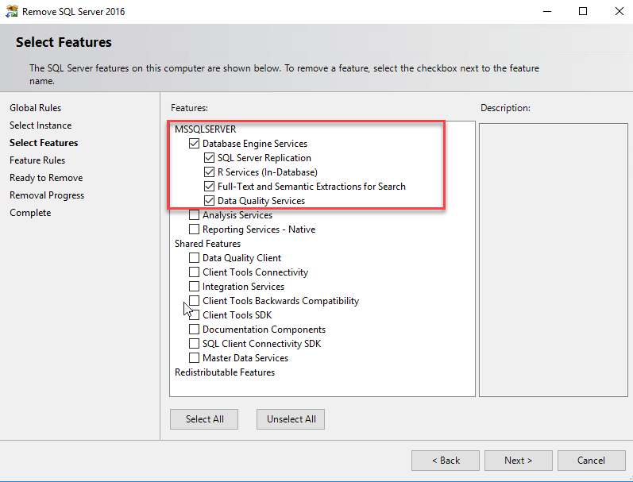
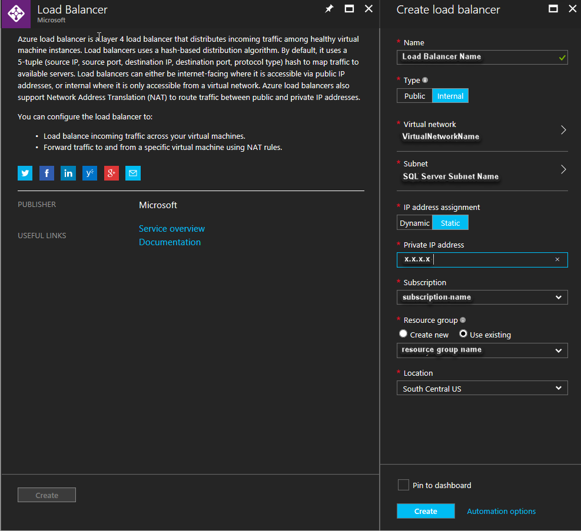

# <a name="configure-a-sql-server-failover-cluster-instance-with-premium-file-share-on-azure-virtual-machines"></a>在 Azure 虚拟机上配置使用高级文件共享的 SQL Server 故障转移群集实例

本文介绍如何在 Azure 虚拟机上创建使用[高级文件共享](../../../storage/files/storage-how-to-create-premium-fileshare.md)的 SQL Server 故障转移群集实例 (FCI)。

高级文件共享以 SSD 为基础，可以稳定保持较低的延迟，完全支持用于 Windows Server 2012 或更高版本上的 SQL Server 2012 或更高版本的故障转移群集实例。 高级文件共享提供更高的灵活性，使你可以在不停机的情况下对文件共享进行大小调整和缩放。

## <a name="before-you-begin"></a>准备阶段

在开始之前，需要了解几个事项并做好准备。

应该对以下技术有实际的了解：

- [Windows 群集技术](https://docs.microsoft.com/windows-server/failover-clustering/failover-clustering-overview)
- [SQL Server 故障转移群集实例](https://docs.microsoft.com/sql/sql-server/failover-clusters/windows/always-on-failover-cluster-instances-sql-server)

要注意一点是，在 Azure IaaS VM 故障转移群集上，我们建议每个服务器（群集节点）使用一个 NIC 和一个子网。 Azure 网络具有物理冗余，这使得在 Azure IaaS VM 来宾群集上不需要额外的 NIC 和子网。 群集验证报告将发出警告，指出节点只能在单个网络上访问。 在 Azure IaaS VM 故障转移群集上，可以忽略此警告。

此外，应该对以下技术有大致的了解：

- [Azure 高级文件共享](../../../storage/files/storage-how-to-create-premium-fileshare.md)
- [Azure 资源组](../../../azure-resource-manager/management/manage-resource-groups-portal.md)

<!--Not Available on > [!IMPORTANT]-->
<!--Not Available on [lightweight](virtual-machines-windows-sql-register-with-resource-provider.md#register-with-sql-vm-resource-provider)-->
<!--Not Available on register-with-sql-vm-resource-provider -->

高级文件共享提供符合许多工作负荷需求的 IOPS 和吞吐量。 对于 IO 密集型工作负荷，请考虑使用基于托管高级磁盘或超级磁盘的[支持存储空间直通的 SQL Server 故障转移群集实例](virtual-machines-windows-portal-sql-create-failover-cluster.md)。  

在开始部署或迁移之前，请检查环境的 IOPS 活动，并验证高级文件共享能否提供所需的 IOPS。 使用 Windows 性能监视器磁盘计数器监视 SQL Server 数据、日志和临时数据库文件所需的总 IOPS（每秒磁盘传输次数）和吞吐量（每秒磁盘字节数）。

许多工作负荷会出现 IO 突发，因此，最好在重度使用期间进行检查，并记下最大 IOPS 和平均 IOPS。 高级文件共享基于共享大小提供 IOPS。 高级文件共享还提供免费突发，在最长一小时时，可将 IO 突发为基准量的三倍。

有关高级文件共享性能的详细信息，请参阅[文件共享性能层](/storage/files/storage-files-planning#file-share-performance-tiers)。

### <a name="licensing-and-pricing"></a>许可和定价

在 Azure 虚拟机上，可以使用标准预付费套餐针对 SQL Server 授予许可，也可以使用自带许可 (BYOL) VM 映像。 选择的映像类型会影响收费方式。

使用标准预付费套餐许可，Azure 虚拟机上的 SQL Server 的故障转移群集实例 (FCI) 会对 FCI 的所有节点（包括被动节点）收取费用。 有关详细信息，请参阅 [SQL Server Enterprise 虚拟机定价](https://www.azure.cn/pricing/details/virtual-machines/)。

<!--MOONCAKE: CORRECT ON [SQL Server Enterprise Virtual Machines Pricing](https://www.azure.cn/pricing/details/virtual-machines/)-->

如果你已签署附带软件保障的企业协议，则可为每个活动节点使用一个免费的被动 FCI 节点。 若要在 Azure 中利用此优势，请使用 BYOL VM 映像，然后在 FCI 的主动节点和被动节点上使用相同的许可证。 有关详细信息，请参阅[企业协议](https://www.microsoft.com/Licensing/licensing-programs/enterprise.aspx)。

如需比较 Azure 虚拟机中 SQL Server 的标准预付费套餐和 BYOL 许可，请参阅 [SQL VM 入门](virtual-machines-windows-sql-server-iaas-overview.md#get-started-with-sql-vms)。

有关许可 SQL Server 的完整信息，请参阅[定价](https://www.microsoft.com/sql-server/sql-server-2017-pricing)。

### <a name="filestream"></a>文件流

使用高级文件共享的故障转移群集不支持文件流。 若要使用文件流，请使用[存储空间直通](virtual-machines-windows-portal-sql-create-failover-cluster.md)部署群集。

## <a name="prerequisites"></a>先决条件

在完成本文中的步骤之前，应已做好以下准备：

- 一个 Azure 订阅。
- Azure 虚拟机上的 Windows 域。
- 有权在 Azure 虚拟机和 Active Directory 中创建对象的域用户帐户。
- 用于运行 SQL Server 服务，并且在装载文件共享时可用来登录虚拟机的域用户帐户。  
- 能够为以下组件提供足够 IP 地址空间的 Azure 虚拟网络和子网：
    - 两个虚拟机。
    - 故障转移群集的 IP 地址。
    - 每个 FCI 的 IP 地址。
- 在 Azure 网络中配置的、指向域控制器的 DNS。
- 用作群集驱动器的[高级文件共享](../../../storage/files/storage-how-to-create-premium-fileshare.md)，基于数据文件的数据库的存储配额。
- 如果在 Windows Server 2012 R2 和更低版本上操作，则需要将另一个文件共享用作文件共享见证，因为只有 Windows 2016 和更高版本支持云见证。 可以使用另一个 Azure 文件共享，也可以在单独的虚拟机上使用文件共享。 如果你打算使用另一个 Azure 文件共享，可以通过针对群集驱动器所用高级文件共享执行的相同过程来装载此另一个文件共享。 

满足这些先决条件后，即可开始构建故障转移群集。 第一步是创建虚拟机。

## <a name="step-1-create-the-virtual-machines"></a>步骤 1：创建虚拟机

1. 使用订阅登录到 [Azure 门户](https://portal.azure.cn)。

1. [创建 Azure 可用性集](../tutorial-availability-sets.md)。

    可用性集可将各个容错域和更新域中的虚拟机分组。 它确保应用程序不会受到单一故障点（例如网络交换机或服务器机架电源装置）的影响。

    如果尚未为虚拟机创建资源组，请在创建 Azure 可用性集时执行该操作。 若要使用 Azure 门户创建可用性集，请执行以下步骤：

    1. 在 Azure 门户中，选择“创建资源”打开 Azure 市场。  搜索“可用性集”。 
    1. 选择“可用性集”。 
    1. 选择“创建”  。
    1. 在“创建可用性集”下，提供以下值： 
        
        - **名称**：可用性集的名称。
        - **订阅**：Azure 订阅。
        - **资源组**：如果想要使用现有的组，请单击“选择现有项”并从列表中选择该组。  否则，请选择“新建”并输入组的名称。 
        - **位置**：设置要在其中创建虚拟机的位置。
        - **容错域**：使用默认值 (**2**)。
            
            <!--MOONCAKE: the Fault domains is 2 on Azure China Cloud-->
            
        - **更新域**：使用默认值 (**5**)。
        
    1. 选择“创建”以创建可用性集。 

1. 在可用性集中创建虚拟机。

    在 Azure 可用性集中预配两个 SQL Server 虚拟机。 有关说明，请参阅[在 Azure 门户中预配 SQL Server 虚拟机](virtual-machines-windows-portal-sql-server-provision.md)。

    将两个虚拟机放在以下位置：

    - 可用性集所在的同一个 Azure 资源组中。
    - 域控制器所在的同一个网络中。
    - 能够为两个虚拟机提供足够 IP 地址空间的子网中，以及最终可能要在此群集上使用的所有 FCI 中。
    - Azure 可用性集中。

        >[!IMPORTANT]
        >创建虚拟机后无法设置或更改可用性集。

    从 Azure 市场中选择映像。 可以使用包含 Windows Server 和 SQL Server，或者只包含 Windows Server 的 Azure 市场映像。 有关详细信息，请参阅 [Azure 虚拟机上的 SQL Server 概述](virtual-machines-windows-sql-server-iaas-overview.md)。

    Azure 库中的正式 SQL Server 映像包含已安装的 SQL Server 实例、SQL Server 安装软件和所需的密钥。

    >[!IMPORTANT]
    > 创建虚拟机后，请删除预装的独立 SQL Server 实例。 设置故障转移群集并将高级文件共享设置为存储后，使用预装的 SQL Server 媒体创建 SQL Server FCI。

    或者，可以使用只包含操作系统的 Azure 市场映像。 选择一个 **Windows Server 2016 Datacenter** 映像，在设置故障转移群集并将高级文件共享设置为存储后安装 SQL Server FCI。 此映像不包含 SQL Server 安装媒体。 将 SQL Server 安装媒体放在可以针对每个服务器运行该媒体的位置。

1. Azure 在创建虚拟机之后，使用 RDP 连接到每个虚拟机。

    首次使用 RDP 连接到虚拟机时，系统会提示是否允许在网络上发现该电脑。 请选择“是”。 

1. 如果使用某个基于 SQL Server 的虚拟机映像，请删除 SQL Server 实例。

    1. 在“程序和功能”中，右键单击“Microsoft SQL Server 201_ (64 位)”并选择“卸载/更改”。   
    1. 选择“删除”  。
    1. 选择默认实例。
    1. 删除“数据库引擎服务”下的所有功能。  不要删除“共享功能”。  此时会显示以下屏幕截图中所示的内容：

        

    1. 依次选择“下一步”、“删除”。  

1. <a name="ports"></a>打开防火墙端口。

    在每个虚拟机上的 Windows 防火墙中打开以下端口：

    | 目的 | TCP 端口 | 注释
    | ------ | ------ | ------
    | SQL Server | 1433 | SQL Server 的默认实例正常使用的端口。 如果使用了库中的某个映像，此端口会自动打开。
    | 运行状况探测 | 59999 | 任何打开的 TCP 端口。 在后面的步骤中，需要将负载均衡器[运行状况探测](#probe)和群集配置为使用此端口。
    | 文件共享 | 445 | 文件共享服务使用的端口。

1. [将虚拟机添加到现有的域](virtual-machines-windows-portal-sql-availability-group-prereq.md#joinDomain)。

创建并配置虚拟机后，可以配置高级文件共享。

## <a name="step-2-mount-the-premium-file-share"></a>步骤 2：装载高级文件共享

1. 登录到 [Azure 门户](https://portal.azure.cn)并转到你的存储帐户。
1. 转到“文件服务”下的“文件共享”，选择要用于 SQL 存储的高级文件共享。  
1. 选择“连接”显示文件共享的连接字符串。 
1. 从下拉列表中选择要使用的驱动器号，然后将这两个代码块复制到记事本中。

    </img>

1. 使用由 SQL Server FCI 用作服务帐户的帐户通过 RDP 连接到 SQL Server VM。
1. 打开 PowerShell 命令管理控制台。
1. 运行前面在门户中操作时保存的命令。
1. 使用文件资源管理器或“运行”对话框（Windows 徽标键 + R）转到该共享。  使用网络路径 `\\storageaccountname.file.core.chinacloudapi.cn\filesharename`。 例如： `\\sqlvmstorageaccount.file.core.chinacloudapi.cn\sqlpremiumfileshare`

1. 在新连接的、要将 SQL 数据文件要放入到的文件共享上至少创建一个文件夹。
1. 针对要加入群集的每个 SQL Server VM 重复上述步骤。

    > [!IMPORTANT]
    > - 考虑对备份文件使用单独的文件共享，以便在此共享中节省数据和日志文件占用的 IOPS 和空间容量。 可将高级或标准文件共享用于备份文件。
    > - 如果在 Windows 2012 R2 和更低版本中操作，请遵循相同的步骤来装载要用作文件共享见证的文件共享。 

## <a name="step-3-configure-the-failover-cluster"></a>步骤 3：配置故障转移群集

下一步是配置故障转移群集。 完成此步骤中的以下子步骤：

1. 添加 Windows Server 故障转移群集功能。
1. 验证群集。
1. 创建故障转移群集。
1. 创建云见证（适用于 Windows Server 2016 和更高版本）或文件共享见证（适用于 Windows Server 2012 R2 和更低版本）。

### <a name="add-windows-server-failover-clustering"></a>添加 Windows Server 故障转移群集

1. 使用属于本地管理员的成员并且有权在 Active Directory 中创建对象的域帐户，通过 RDP 连接到第一个虚拟机。 使用此帐户完成余下的配置。

1. [将故障转移群集添加到每个虚拟机](virtual-machines-windows-portal-sql-availability-group-prereq.md#add-failover-clustering-features-to-both-sql-server-vms)。

    若要通过 UI 安装故障转移群集，请在两个虚拟机上执行以下步骤：
    1. 在“服务器管理器”中选择“管理”，然后选择“添加角色和功能”。   
    1. 在“添加角色和功能向导”中，选择“下一步”，直到出现“选择功能”。   
    1. 在“选择功能”中，选择“故障转移群集”。   请包含所有所需的功能和管理工具。 选择“添加功能”。 
    1. 选择“下一步”，然后选择“完成”安装这些功能。  

    若要使用 PowerShell 安装故障转移群集，请在某个虚拟机上通过管理员 PowerShell 会话运行以下脚本：

    ```powershell
    $nodes = ("<node1>","<node2>")
    Invoke-Command  $nodes {Install-WindowsFeature Failover-Clustering -IncludeAllSubFeature -IncludeManagementTools}
    ```

### <a name="validate-the-cluster"></a>验证群集

使用 UI 或 PowerShell 验证群集。

若要使用 UI 验证群集，请在某个虚拟机中执行以下步骤：

1. 在“服务器管理器”下，依次选择“工具”、“故障转移群集管理器”。   
1. 在“故障转移群集管理器”下，依次选择“操作”、“验证配置”。   
1. 选择“**下一步**”。
1. 在“选择服务器或群集”下，输入两个虚拟机的名称。 
1. 在“测试选项”下，选择“仅运行选择的测试”。   选择“**下一步**”。
1. 在“测试选择”下，选择除“存储”和“存储空间直通”以外的其他所有测试，如下所示：   

   </img>

1. 选择“**下一步**”。
1. 在“确认”下，选择“下一步”。  

“验证配置向导”将运行验证测试。 

若要使用 PowerShell 验证群集，请在某个虚拟机上通过管理员 PowerShell 会话运行以下脚本：

```powershell
Test-Cluster -Node ("<node1>","<node2>") -Include "Inventory", "Network", "System Configuration"
```

验证群集后，创建故障转移群集。

### <a name="create-the-failover-cluster"></a>创建故障转移群集

若要创建故障转移群集，需要：
- 要成为群集节点的虚拟机的名称。
- 故障转移群集的名称
- 故障转移群集的 IP 地址。 可以使用群集节点所在的同一 Azure 虚拟网络和子网中未使用的 IP 地址。

#### <a name="windows-server-2012-through-windows-server-2016"></a>Windows Server 2012 至 Windows Server 2016

以下 PowerShell 脚本为 Windows Server 2012 至 Windows Server 2016 创建故障转移群集。 使用节点的名称（虚拟机名称）以及 Azure 虚拟网络中可用的 IP 地址更新脚本。

```powershell
New-Cluster -Name <FailoverCluster-Name> -Node ("<node1>","<node2>") -StaticAddress <n.n.n.n> -NoStorage
```   

#### <a name="windows-server-2019"></a>Windows Server 2019

以下 PowerShell 脚本为 Windows Server 2019 创建故障转移群集。 有关详细信息，请参阅[故障转移群集：群集网络对象](https://blogs.windows.com/windowsexperience/2018/08/14/announcing-windows-server-2019-insider-preview-build-17733/#W0YAxO8BfwBRbkzG.97)。 使用节点的名称（虚拟机名称）以及 Azure 虚拟网络中可用的 IP 地址更新脚本。

```powershell
New-Cluster -Name <FailoverCluster-Name> -Node ("<node1>","<node2>") -StaticAddress <n.n.n.n> -NoStorage -ManagementPointNetworkType Singleton 
```

### <a name="create-a-cloud-witness-win-2016-"></a>创建云见证 (Win 2016 +)

如果在 Windows Server 2016 和更高版本中操作，需要创建云见证。 云见证是 Azure 存储 Blob 中存储的新型群集仲裁见证。 这样就不需要提供一个单独的 VM 来托管见证共享，也不需要使用单独的文件共享。

1. [为故障转移群集创建云见证](https://technet.microsoft.com/windows-server-docs/failover-clustering/deploy-cloud-witness)。

1. 创建 Blob 容器。

1. 保存访问密钥和容器 URL。

### <a name="configure-quorum"></a>配置仲裁 

对于 Windows Server 2016 和更高版本，请将群集配置为使用刚刚创建的云见证。 执行[在用户界面中配置仲裁见证](https://technet.microsoft.com/windows-server-docs/failover-clustering/deploy-cloud-witness#to-configure-cloud-witness-as-a-quorum-witness)中的所有步骤。

对于 Windows Server 2012 R2 和更低版本，请执行[在用户界面中配置仲裁见证](https://technet.microsoft.com/windows-server-docs/failover-clustering/deploy-cloud-witness#to-configure-cloud-witness-as-a-quorum-witness)中的相同步骤，但在“选择仲裁见证”页上，需选择“配置文件共享见证”选项。   指定分配用作文件共享见证的文件共享，无论该文件共享是在单独的虚拟机上配置的，还是从 Azure 装载的。 

## <a name="step-4-test-cluster-failover"></a>步骤 4：测试群集故障转移

测试群集的故障转移。 在“故障转移群集管理器”中，右键单击你的群集并选择“更多操作” > “移动核心群集资源” > “选择节点”，然后选择群集的其他节点。     将核心群集资源移到群集的每个节点，然后将其移回到主节点。 如果能够成功地将群集移到每个节点，则可以安装 SQL Server。  

:::image type="content" source="media/virtual-machines-windows-portal-sql-create-failover-cluster-premium-file-share/test-cluster-failover.png" alt-text="通过将核心资源移到其他节点来测试群集故障转移":::

## <a name="step-5-create-the-sql-server-fci"></a>步骤 5：创建 SQL Server FCI

配置故障转移群集后，可以创建 SQL Server FCI。

1. 使用 RDP 连接到第一个虚拟机。

1. 在“故障转移群集管理器”中，确保所有核心群集资源位于第一个虚拟机上。  如果需要，可将所有资源移到此虚拟机。

1. 找到安装媒体。 如果虚拟机使用某个 Azure 市场映像，该媒体将位于 `C:\SQLServer_<version number>_Full`。 选择“设置”  。

1. 在“SQL Server 安装中心”中选择“安装”。  

1. 选择“新建 SQL Server 故障转移群集安装”。  遵照向导中的说明安装 SQL Server FCI。

    FCI 数据目录需位于高级文件共享中。 输入共享的完整路径，格式为：`\\storageaccountname.file.core.chinacloudapi.cn\filesharename\foldername`。 此时会出现一条警告，指出已指定某个文件服务器作为数据目录。 预期会出现此警告。 请确保在保存文件共享时通过 RDP 连接到 VM 所用的用户帐户，是 SQL Server 服务用来避免可能故障的同一帐户。

    </img>

1. 完成向导中的步骤后，安装程序将在第一个节点上安装 SQL Server FCI。

1. 安装程序在第一个节点上安装 FCI 后，请使用 RDP 连接到第二个节点。

1. 打开“SQL Server 安装中心”。  选择“安装”。 

1. 选择“将节点添加到 SQL Server 故障转移群集”。  按照向导中的说明安装 SQL Server 并将此服务器添加到 FCI。

   >[!NOTE]
   >如果使用了包含 SQL Server 的 Azure 市场库映像，该映像已随附 SQL Server 工具。 如果未使用其中的某个映像，请单独安装 SQL Server 工具。 请参阅 [Download SQL Server Management Studio (SSMS)](https://msdn.microsoft.com/library/mt238290.aspx)（下载 SQL Server Management Studio (SSMS)）。

## <a name="step-6-create-the-azure-load-balancer"></a>步骤 6：创建 Azure 负载均衡器

在 Azure 虚拟机上，群集使用负载均衡器来保存每次都需要位于一个群集节点上的 IP 地址。 在此解决方案中，负载均衡器保存 SQL Server FCI 的 IP 地址。

有关详细信息，请参阅 [创建并配置 Azure 负载均衡器](virtual-machines-windows-portal-sql-availability-group-tutorial.md#configure-internal-load-balancer)。

### <a name="create-the-load-balancer-in-the-azure-portal"></a>在 Azure 门户中创建负载均衡器

若要创建负载均衡器，请执行以下操作：

1. 在 Azure 门户中，转到包含虚拟机的资源组。

1. 选择“添加”   。 在 Azure 市场中搜索“负载均衡器”。  选择“负载均衡器”。 

1. 选择“创建”  。

1. 使用以下值设置负载均衡器：

    - **订阅**：Azure 订阅。
    - **资源组**：包含你的虚拟机的资源组。
    - **名称**：标识负载均衡器的名称。
    - **区域**：包含你的虚拟机的 Azure 位置。
    - **类型**：公共或专用。 可从虚拟网络内部访问专用负载均衡器。 大多数 Azure 应用程序可以使用专用负载均衡器。 如果应用程序需要通过 Internet 直接访问 SQL Server，请使用公共负载均衡器。
    - **SKU**：标准。
    - **虚拟网络**：虚拟机所在的网络。
    - **IP 地址分配**：静态。 
    - **专用 IP 地址**：分配给 SQL Server FCI 群集网络资源的 IP 地址。

    下图显示了“创建负载均衡器”UI： 

    

### <a name="configure-the-load-balancer-backend-pool"></a>配置负载均衡器后端池

1. 返回到包含虚拟机的 Azure 资源组，找到新的负载均衡器。 可能需要在资源组中刷新视图。 选择负载均衡器。

1. 依次选择“后端池”、“添加”。  

1. 将该后端池与包含 VM 的可用性集进行关联。

1. 在“目标网络 IP 配置”下选择“虚拟机”，并选择要作为群集节点参与操作的虚拟机。   请务必包括将承载 FCI 的所有虚拟机。

1. 选择“确定”以创建后端池。 

### <a name="configure-a-load-balancer-health-probe"></a>配置负载均衡器运行状况探测

1. 在负载均衡器边栏选项卡上，选择“运行状况探测”。 

1. 选择“添加”   。

1. 在“添加运行状况探测”边栏选项卡中，<a name="probe"></a>设置以下运行状况探测参数。 

    - **名称**：运行状况探测的名称。
    - **协议**：TCP。
    - **端口**：在[此步骤](#ports)中在防火墙中为运行状况探测创建的端口。 在本文中，示例使用了 TCP 端口 `59999`。
    - **时间间隔**：5 秒。
    - **不正常阈值**：2 次连续失败。

1. 选择“确定”  。

### <a name="set-load-balancing-rules"></a>设置负载均衡规则

1. 在负载均衡器边栏选项卡上，选择“负载均衡规则”。 

1. 选择“添加”   。

1. 设置负载均衡规则参数：

    - **名称**：负载均衡规则的名称。
    - **前端 IP 地址**：SQL Server FCI 群集网络资源的 IP 地址。
    - **端口**：SQL Server FCI TCP 端口。 默认实例端口为 1433。
    - **后端端口**：使用与启用“浮动 IP (直接服务器返回)”时为“端口”所用的相同值。  
    - **后端池**：前面配置的后端池名称。
    - **运行状况探测**：前面配置的运行状况探测。
    - **会话持久性**：无。
    - **空闲超时(分钟)** ：4.
    - **浮动 IP (直接服务器返回)** ：已启用。

1. 选择“确定”  。

## <a name="step-7-configure-the-cluster-for-the-probe"></a>步骤 7：为探测配置群集

在 PowerShell 中设置群集探测端口参数。

若要设置群集探测端口参数，请使用环境中的值更新以下脚本中的变量。 从脚本中删除尖括号（`<` 和 `>`）。

```powershell
$ClusterNetworkName = "<Cluster Network Name>"
$IPResourceName = "<SQL Server FCI IP Address Resource Name>" 
$ILBIP = "<n.n.n.n>" 
[int]$ProbePort = <nnnnn>

Import-Module FailoverClusters

Get-ClusterResource $IPResourceName | Set-ClusterParameter -Multiple @{"Address"="$ILBIP";"ProbePort"=$ProbePort;"SubnetMask"="255.255.255.255";"Network"="$ClusterNetworkName";"EnableDhcp"=0}
```

以下列表描述了需要更新的值：

- `<Cluster Network Name>`：Windows Server 故障转移群集的网络名称。 在“故障转移群集管理器” > “网络”中，右键单击该网络并选择“属性”。    正确的值位于“常规”  选项卡的“名称”  下。

- `<SQL Server FCI IP Address Resource Name>`：SQL Server FCI IP 地址资源名称。 在“故障转移群集管理器” > “角色”中“SQL Server FCI”角色的“服务器名称”下，右键单击 IP 地址资源并选择单击“属性”。     正确的值位于“常规”  选项卡的“名称”  下。

- `<ILBIP>`：ILB IP 地址。 在 Azure 门户中将此地址配置为 ILB 前端地址。 这也是 SQL Server FCI IP 地址。 可在“故障转移群集管理器”  中找到该地址，它与 `<SQL Server FCI IP Address Resource Name>` 位于同一属性页。  

- `<nnnnn>`：在负载均衡器运行状况探测中配置的探测端口。 任何未使用的 TCP 端口都有效。

>[!IMPORTANT]
>群集参数的子网掩码必须是 TCP IP 广播地址：`255.255.255.255`。

设置群集探测后，可在 PowerShell 中看到所有群集参数。 运行此脚本：

```powershell
Get-ClusterResource $IPResourceName | Get-ClusterParameter 
```

## <a name="step-8-test-fci-failover"></a>步骤 8：测试 FCI 故障转移

测试 FCI 的故障转移以验证群集功能。 执行以下步骤：

1. 使用 RDP 连接到 SQL Server FCI 群集节点之一。

1. 打开“故障转移群集管理器”。  选择“角色”  。 观察哪个节点拥有 SQL Server FCI 角色。

1. 右键单击“SQL Server FCI”角色。

1. 依次选择“移动”、“可能最佳的节点”。  

“故障转移群集管理器”将显示该角色，其资源已脱机。  然后资源将会移动，并在另一个节点上重新联机。

### <a name="test-connectivity"></a>测试连接

若要测试连接，请登录到同一虚拟网络中的另一个虚拟机。 打开“SQL Server Management Studio”并连接到 SQL Server FCI 名称。 

>[!NOTE]
>如果需要，可以[下载 SQL Server Management Studio](https://msdn.microsoft.com/library/mt238290.aspx)。

## <a name="limitations"></a>限制

Azure 虚拟机支持 Windows Server 2019 上的 Microsoft 分布式事务处理协调器 (MSDTC)，其中存储位于群集共享卷 (CSV) 和[标准负载均衡器](../../../load-balancer/load-balancer-standard-overview.md)上。

Azure 虚拟机上的 Windows Server 2016 或更低版本不支持 MSDTC，因为：

- 无法将群集 MSDTC 资源配置为使用共享存储。 在 Windows Server 2016 上，如果创建 MSDTC 资源，即使存储可用，也不会显示任何可用的共享存储。 Windows Server 2019 中已修复此问题。
- 基本负载均衡器不会处理 RPC 端口。

## <a name="see-also"></a>另请参阅

- [Windows 群集技术](https://docs.microsoft.com/windows-server/failover-clustering/failover-clustering-overview)
- [SQL Server 故障转移群集实例](https://docs.microsoft.com/sql/sql-server/failover-clusters/windows/always-on-failover-cluster-instances-sql-server)

<!-- Update_Description: new article about VM windows portal to create failover cluster premium file share -->
<!-- NEW.date: 11/11/2018 -->