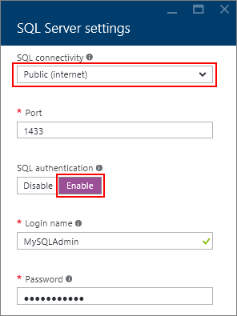

# 连接到 Azure (Resource Manager) 上的 SQL Server 虚拟机
> [!div class="op_single_selector"]
> * [Resource Manager](virtual-machines-windows-sql-connect.md)
> * [经典](../classic/sql-connect.md)
> 
> 

## 概述
本主题介绍如何连接到运行于 Azure 虚拟机的 SQL Server 实例。 它介绍了一些[常规连接方案](#connection-scenarios)，并提供了[在 Azure VM 中配置 SQL Server 连接的详细步骤](#steps-for-manually-configuring-sql-server-connectivity-in-an-azure-vm)。

[!INCLUDE [learn-about-deployment-models](../../../../includes/learn-about-deployment-models-rm-include.md)]

若要查看本文的经典版本，请参阅[连接到 Azure 经典上的 SQL Server 虚拟机](../classic/sql-connect.md)。

如需观看预配和连接的完整演练，请参阅[在 Azure 上预配 SQL Server 虚拟机](virtual-machines-windows-portal-sql-server-provision.md)。

## 连接方案
将客户端连接到虚拟机上运行的 SQL Server 的方式各不相同，具体取决于客户端的位置与计算机/网络配置。 这些方案包括：

* [通过 Internet 连接到 SQL Server](#connect-to-sql-server-over-the-internet)
* [连接到同一虚拟网络中的 SQL Server](#connect-to-sql-server-in-the-same-virtual-network)

### 通过 Internet 连接到 SQL Server
若要从 Internet 连接到 SQL Server 数据库引擎，需完成多个必要的步骤，例如配置防火墙、启用 SQL 身份验证以及配置网络安全组。必须设置网络安全组规则，以便在端口 1433 上进行 TCP 通信。

如果使用门户通过 Resource Manager 来预配 SQL Server 虚拟机映像，则当选择“公共”作为 SQL 连接选项时，系统会完成以下步骤：

如果不是在进行预配，则可按照 [本文中手动配置连接的步骤](#steps-for-manually-configuring-sql-server-connectivity-in-an-azure-vm)来手动配置 SQL Server 和虚拟机。

> [!NOTE]
> SQL Server Express 版本的虚拟机映像不会自动启用 TCP/IP 协议。 对于 Express 版本，必须在创建 VM 后使用 SQL Server 配置管理器来 [手动启用 TCP/IP 协议](#configure-sql-server-to-listen-on-the-tcp-protocol) 。
> 
> 

完成此步骤以后，任何可以访问 Internet 的客户端都可以连接到 SQL Server 实例，只需指定虚拟机的公共 IP 地址或分配到该 IP 地址的 DNS 标签即可。 如果 SQL Server 端口为 1433，则不需在连接字符串中进行指定。

    "Server=sqlvmlabel.chinaeast.chinacloudapp.cn;Integrated Security=false;User ID=<login_name>;Password=<your_password>"

尽管客户端可通过 Internet 进行连接，但这并不意味着任何人都可以连接到 SQL Server。 外部客户端必须有正确的用户名和密码。 为了提高安全性，可以不使用 1433 这个众所周知的端口。 例如，如果将 SQL Server 配置为在端口 1500 上进行侦听并制定了适当的防火墙和网络安全组规则，则可将端口号附加到服务器名称上进行连接，示例如下：

    "Server=sqlvmlabel.chinaeast.chinacloudapp.cn,1500;Integrated Security=false;User ID=<login_name>;Password=<your_password>"

> [!NOTE]
> 务必注意，使用此方法与 SQL Server 通信时，Azure 数据中心的所有传出数据都将服从一般[出站数据传输定价](https://www.azure.cn/pricing/details/data-transfer/)。
> 
> 

### 连接到同一虚拟网络中的 SQL Server
[虚拟网络](../../../virtual-network/virtual-networks-overview.md)支持其他方案。 可以连接同一虚拟网络中的 VM，即使这些 VM 位于不同的资源组中。 使用[站点到站点 VPN](../../../vpn-gateway/vpn-gateway-site-to-site-create.md)，可以创建连接 VM 与本地网络和计算机的混合体系结构。

虚拟网络还可让你将 Azure VM 加入域。 这是对 SQL Server 使用 Windows 身份验证的唯一方式。 其他连接方案需要使用用户名和密码进行 SQL 身份验证。

如果使用门户通过 Resource Manager 来预配 SQL Server 虚拟机映像，则可选择“专用”  作为 SQL 连接选项，以便在虚拟网络上设置通信所需的适当防火墙规则。 如果不是在进行预配，则可按照 [本文中手动配置连接的步骤](#steps-for-manually-configuring-sql-server-connectivity-in-an-azure-vm)来手动配置 SQL Server 和虚拟机。 但如果计划配置域环境和 Windows 身份验证，则不需要使用本文中的步骤来配置 SQL 身份验证和登录。 也不需要配置通过 Internet 进行访问的网络安全组规则。

> [!NOTE]
> SQL Server Express 版本的虚拟机映像不会自动启用 TCP/IP 协议。 对于 Express 版本，必须在创建 VM 后使用 SQL Server 配置管理器来 [手动启用 TCP/IP 协议](#configure-sql-server-to-listen-on-the-tcp-protocol) 。
> 
> 

假设已在虚拟网络中配置 DNS，则可在连接字符串中指定 SQL Server VM 计算机名来连接 SQL Server 实例。 以下示例还假设同时已配置 Windows 身份验证，并且用户已获得访问 SQL Server 实例的权限。

    "Server=mysqlvm;Integrated Security=true"

请注意，在此方案中，还可以指定 VM 的 IP 地址。

## 在 Azure VM 中手动配置 SQL Server 连接的步骤
以下步骤演示了如何手动设置到 SQL Server 实例的连接，然后选择性地使用 SQL Server Management Studio (SSMS) 通过 Internet 进行连接。 请注意，在门户中选择适当的 SQL Server 连接选项时，系统会完成下面的多项步骤。

必须先完成以下各节中所述的下列任务，才能通过其他 VM 或 Internet 连接到 SQL Server 的实例：

* [在 Windows 防火墙中打开 TCP 端口](#open-tcp-ports-in-the-windows-firewall-for-the-default-instance-of-the-database-engine)
* [将 SQL Server 配置为侦听 TCP 协议](#configure-sql-server-to-listen-on-the-tcp-protocol)
* [配置混合模式的 SQL Server 身份验证](#configure-sql-server-for-mixed-mode-authentication)
* [创建 SQL Server 身份验证登录名](#create-sql-server-authentication-logins)
* [配置网络安全组入站规则](#configure-a-network-security-group-inbound-rule-for-the-vm)
* [配置用于公共 IP 地址的 DNS 标签](#configure-a-dns-label-for-the-public-ip-address)
* [从其他计算机连接到数据库引擎](#connect-to-the-database-engine-from-another-computer)

[!INCLUDE [Connect to SQL Server in a VM](../../../../includes/virtual-machines-sql-server-connection-steps.md)]

[!INCLUDE [Connect to SQL Server in a VM Resource Manager](../../../../includes/virtual-machines-sql-server-connection-steps-resource-manager-nsg-rule.md)]

[!INCLUDE [Connect to SQL Server in a VM Resource Manager](../../../../includes/virtual-machines-sql-server-connection-steps-resource-manager.md)]

## 后续步骤
若要查看预配说明以及这些连接步骤，请参阅[在 Azure 上预配 SQL Server 虚拟机](virtual-machines-windows-portal-sql-server-provision.md)。

有关其他与在 Azure VM 中运行 SQL Server 相关的主题，请参阅 [SQL Server on Azure Virtual Machines](virtual-machines-windows-sql-server-iaas-overview.md)（Azure 虚拟机上的 SQL Server）。
