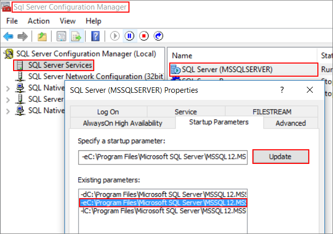

# Azure 虚拟机中 SQL Server 的性能最佳实践
## 概述
本主题提供有关优化 SQL Server 在 Azure 虚拟机中性能的最佳实践。 在 Azure 虚拟机中运行 SQL Server 时，我们建议你继续使用适用于本地服务器环境中的 SQL Server 的相同数据库性能优化选项。 但是，关系数据库在公有云中的性能取决于许多因素，如虚拟机的大小和数据磁盘的配置。

创建 SQL Server 映像时， [考虑在 Azure 门户预览中预配 VM](virtual-machines-windows-portal-sql-server-provision.md)。 使用 Resource Manager 在门户中预配的 SQL Server VM 将实施所有这些最佳实践，包括存储配置。

本文重点介绍获得 SQL Server 在 Azure VM 上的 *最佳* 性能。 如果你的工作负荷要求较低，可能不需要下面列出的每项优化。 评估这些建议时应考虑性能需求和工作负荷模式。

[!INCLUDE [learn-about-deployment-models](../../../../includes/learn-about-deployment-models-both-include.md)]

## 快速检查列表
下面是 SQL Server 在 Azure 虚拟机中的优化性能快速检查列表：

| 区域 | 优化 |
| --- | --- |
| [VM 大小](#vm-size-guidance) |SQL Enterprise 版：[DS3](../../virtual-machines-windows-sizes.md#ds-series) 或更高。  SQL Standard 和 Web 版：[DS2](../../virtual-machines-windows-sizes.md#ds-series) 或更高。 |
| [存储](#storage-guidance) |使用[高级存储](../../../storage/storage-premium-storage.md)。 仅建议将标准存储用于开发/测试。  将[存储帐户](../../../storage/storage-create-storage-account.md)和 SQL Server VM 保存在相同的区域。  在存储帐户上禁用 Azure [异地冗余存储](../../../storage/storage-redundancy.md)（异地复制）。 |
| [磁盘](#disks-guidance) |使用至少 2 个 [P30 磁盘](../../../storage/storage-premium-storage.md#premium-storage-scalability-and-performance-targets)（一个用于日志，另一个用于数据文件和 TempDB）。  避免使用操作系统或临时磁盘进行数据库存储或日志记录。  在托管数据文件和 TempDB 的磁盘上启用读取缓存。  不要在托管日志文件的磁盘上启用缓存。  重要说明：更改 Azure VM 磁盘的缓存设置时，请停止 SQL Server 服务。  条带化多个 Azure 数据磁盘，提高 IO 吞吐量。  使用规定的分配大小格式化。 |
| [I/O](#io-guidance) |启用数据库页面压缩。  对数据文件启用即时文件初始化。  限制或禁用数据库自动增长。  禁用数据库自动收缩。  将所有数据库（包括系统数据库）转移到数据磁盘。  将 SQL Server 错误日志和跟踪文件目录移到数据磁盘。  设置默认的备份和数据库文件位置。  启用锁定页面。  应用 SQL Server 性能修复程序。 |
| [功能特点](#feature-specific-guidance) |直接备份到 blob 存储。 |

有关*如何*和*为何*进行这些优化的详细信息，请参阅以下部分提供的详细信息与指导。

##  VM 大小指导原则
对于性能敏感型应用程序，建议使用以下[虚拟机大小](../../virtual-machines-windows-sizes.md?toc=%2fazure%2fvirtual-machines%2fwindows%2ftoc.json)：

* **SQL Server Enterprise 版本**：DS3 或更高
* **SQL Server Standard 和 Web 版本**：DS2 或更高

##  存储指导原则
DS 系列（以及 DSv2 系列）VM 支持[高级存储](../../../storage/storage-premium-storage.md)。 对于所有生产工作负荷，建议使用高级存储。

> [!WARNING]
> 标准存储具有不同的延迟和带宽，建议仅用于开发/测试工作负荷。 生产工作负荷应使用高级存储。
>
>

此外，我们建议在 SQL Server 虚拟机所在的数据中心内创建 Azure 存储帐户，以减小传输延迟。 创建存储帐户时应禁用异地复制，因为无法保证在多个磁盘上的写入顺序一致。 相反，请考虑在两个 Azure 数据中心之间配置一个 SQL Server 灾难恢复技术。 有关详细信息，请参阅 [Azure 虚拟机中 SQL Server 的高可用性和灾难恢复](virtual-machines-windows-sql-high-availability-dr.md)。

##  磁盘指导原则
Azure VM 上有三种主要磁盘类型：

* **OS 磁盘**：创建 Azure 虚拟机时，该平台至少将一个磁盘（标记为 **C** 驱动器）附加到 VM 作为操作系统磁盘。 此磁盘是一个 VHD，在存储空间中存储为一个页 blob。
* **临时磁盘**：Azure 虚拟机包含另一个称为临时磁盘的磁盘（标记为 **D**: 驱动器）。 这是可用于暂存空间的节点上的一个磁盘。
* **数据磁盘**：还可以将其他磁盘作为数据磁盘附加到虚拟机，这些磁盘将在存储空间中存储为页 blob。

以下部分说明了有关使用这些不同磁盘的建议。

### 操作系统磁盘
操作系统磁盘是可以作为操作系统的运行版本来启动和装载的 VHD，标记为 **C** 驱动器。

操作系统磁盘上的默认缓存策略是 **读/写**。 对于性能敏感型应用程序，我们建议使用数据磁盘而不是操作系统磁盘。 请参阅下面有关数据磁盘的部分。

### 临时磁盘
临时存储驱动器，标记为 **D**: 驱动器，不会保留到 Azure Blob 存储中。 不要在 **D**: 驱动器中存储用户数据库文件或用户事务日志文件。

D 系列、Dv2 系列和 G 系列 VM 上的临时驱动器基于 SSD。 如果工作负荷重度使用 TempDB（例如，要处理临时对象或复杂联接），在 **D** 驱动器上存储 TempDB 可能会提高 TempDB 吞吐量并降低 TempDB 延迟。

对于支持高级存储的 VM（DS 系列和 DSv2 系列），我们建议将 TempDB 存储在支持高级存储且已启用读取缓存的磁盘上。 这项建议有一种例外情况；如果 TempDB 的使用是写入密集型的，则可以通过将 TempDB 存储在本地 **D** 驱动器（在这些计算机大小上也是基于 SSD）上来实现更高性能。

### 数据磁盘数
* **将数据磁盘用于数据和日志文件**：至少使用两个高级存储 [P30 磁盘](../../../storage/storage-premium-storage.md#premium-storage-scalability-and-performance-targets)，一个磁盘包含日志文件，另一个包含数据和 TempDB 文件。 每个高级存储磁盘均根据其大小提供了许多 IOP 和带宽 (MB/s)，如以下文章所述：[使用高级存储磁盘](../../../storage/storage-premium-storage.md)。 
* **磁盘条带化**：为提高吞吐量，可以添加更多的数据磁盘，并使用磁盘条带化。 若要确定数据磁盘的数量，需要分析日志文件以及数据和 TempDB 文件所需的 IOPS 数量和带宽。 请注意，不同的 VM 大小对受支持的 IOP 数量和带宽有不同的限制，请参阅每个 [VM 大小](../../virtual-machines-windows-sizes.md?toc=%2fazure%2fvirtual-machines%2fwindows%2ftoc.json)的 IOPS 表。 遵循以下指南：

    * 对于 Windows 8/Windows Server 2012 或更高版本，使用[存储空间](https://technet.microsoft.com/library/hh831739.aspx)。 对于 OLTP 工作负荷，将条带大小设置为 64 KB，对于数据仓库工作负荷，将条带大小设置为 256 KB，以避免分区定位错误导致的性能影响。 此外，设置卷计数 = 物理磁盘的数量。 若要配置具有 8 个以上磁盘的存储空间，必须使用 PowerShell（而不是服务器管理器 UI）来显式设置卷数以匹配磁盘数。 有关如何配置[存储空间](https://technet.microsoft.com/library/hh831739.aspx)的详细信息，请参阅 [Windows PowerShell 中的存储空间 Cmdlet](https://technet.microsoft.com/library/jj851254.aspx)
    * 对于 Windows 2008 R2 或更早版本，你可以使用动态磁盘（操作系统条带化卷），条带大小始终为 64 KB。 请注意，从 Windows 8/Windows Server 2012 开始不推荐使用此选项。 有关信息，请参阅[虚拟磁盘服务正在过渡到 Windows 存储管理 API](https://msdn.microsoft.com/library/windows/desktop/hh848071.aspx) 中的支持声明。
    * 如果你的工作负荷不是日志密集型的并且不需要专用的 IOPS，你可以只配置一个存储池。 否则，请创建两个存储池，一个用于日志文件，另一个用于数据文件和 TempDB。 根据负载预期确定与每个存储池相关联的磁盘数。 请记住，不同的 VM 大小允许不同数量的附加数据磁盘。 有关详细信息，请参阅[虚拟机的大小](../../virtual-machines-windows-sizes.md?toc=%2fazure%2fvirtual-machines%2fwindows%2ftoc.json)。
    * 如果使用的不是高级存储（开发/测试方案），建议添加 [VM 大小](../../virtual-machines-windows-sizes.md?toc=%2fazure%2fvirtual-machines%2fwindows%2ftoc.json)支持的最大数量的数据磁盘并使用磁盘条带化。
* **缓存策略**：对于高级存储数据磁盘，请只在托管数据文件和 TempDB 的数据磁盘上启用读取缓存。 如果使用的不是高级存储，不要在任何数据磁盘上启用任何缓存。 有关配置磁盘缓存的说明，请参阅以下主题：[Set-AzureOSDisk](https://msdn.microsoft.com/library/azure/jj152847) 和 [Set-AzureDataDisk](https://msdn.microsoft.com/library/azure/jj152851.aspx)。

    > [!WARNING]
    > 请在更改 Azure VM 磁盘的缓存设置时停止 SQL Server 服务，以免出现数据库损坏的情况。
    >
    >
* **NTFS 分配单元大小**：当格式化数据磁盘时，建议为数据和日志文件以及 TempDB 使用 64-KB 分配单元大小。
* **磁盘管理最佳实践**：删除数据磁盘或更改其缓存类型时，请在更改过程中停止 SQL Server 服务。 在 OS 磁盘上更改缓存设置时，Azure 会先停止 VM，在更改缓存类型后再重新启动 VM。 更改数据磁盘的缓存设置时，不会停止 VM，但会在更改期间将数据磁盘从 VM 分离，完成后再重新附加该数据磁盘。

    > [!WARNING]
    > 在进行这些操作时，如果无法停止 SQL Server 服务，则会导致数据库损坏。
    >
    >

##  I/O 指导原则
* 当你并行化你的应用程序和请求时可实现使用高级存储的最佳结果。 高级存储专为 IO 队列深度大于 1 的方案设计，因此对于单线程串行请求（即使它们是存储密集型的），你将不会看到明显的性能提升。 例如，这会影响性能分析工具（如 SQLIO）的单线程测试结果。
* 请考虑使用[数据库页压缩](https://msdn.microsoft.com/library/cc280449.aspx)，因为这有助于提高 I/O 密集型工作负荷的性能。 但是，数据压缩可能会增加数据库服务器上的 CPU 消耗。
* 请考虑启用即时文件初始化以减少初始文件分配所需的时间。 若要利用即时文件初始化，请将 SE_MANAGE_VOLUME_NAME 授予 SQL Server (MSSQLSERVER) 服务帐户并将其添加到**执行卷维护任务**安全策略。 如果使用的是用于 Azure 的 SQL Server 平台映像，默认服务帐户 (NT Service\MSSQLSERVER) 不会添加到**执行卷维护任务**安全策略。 换而言之，SQL Server Azure 平台映像中不会启用即时文件初始化。 将 SQL Server 服务帐户添加到 **执行卷维护任务** 安全策略后，请重新启动 SQL Server 服务。 使用此功能可能有一些安全注意事项。 有关详细信息，请参阅[数据库文件初始化](https://msdn.microsoft.com/library/ms175935.aspx)。
* **自动增长** 被视为只是非预期增长的偶发情况。 请勿使用自动增长来管理数据和日志每天的增长。 如果使用自动增长，请使用大小开关预先增长文件。
* 请确保禁用 **自动收缩** 以避免可能对性能产生负面影响的不必要开销。
* 将所有数据库（包括系统数据库）转移到数据磁盘。 有关详细信息，请参阅 [Move System Databases](https://msdn.microsoft.com/library/ms345408.aspx)（移动系统数据库）。
* 将 SQL Server 错误日志和跟踪文件目录移到数据磁盘。 在 SQL Server 配置管理器中右键单击 SQL Server 实例并选择属性，即可实现此目的。 可以在“启动参数”选项卡中更改错误日志和跟踪文件设置。 在“高级”选项卡中指定转储目录。 以下屏幕截图显示了错误日志启动参数的位置。

    
* 设置默认的备份和数据库文件位置。 使用本主题中的建议，并在“服务器属性”窗口中进行更改。 有关说明，请参阅 [View or Change the Default Locations for Data and Log Files (SQL Server Management Studio)](https://msdn.microsoft.com/library/dd206993.aspx)（查看或更改数据和日志文件的默认位置 (SQL Server Management Studio)）。 以下屏幕截图演示了进行这些更改的位置。

    
* 建立锁定的页以减少 IO 和任何分页活动。 有关详细信息，请参阅 [Enable the Lock Pages in Memory Option (Windows)](https://msdn.microsoft.com/library/ms190730.aspx)（启用在内存中锁定页面的选项 (Windows)）。
* 如果你运行的是 SQL Server 2012，安装 Service Pack 1 Cumulative Update 10。 此更新包含修复程序，适用于在 SQL Server 2012 中执行“select into temporary table”语句时出现 I/O 性能不良的情况。 有关信息，请参阅此 [知识库文章](http://support.microsoft.com/kb/2958012)。
* 请考虑在传入/传出 Azure 时压缩所有数据文件。

##  功能特定的指导原则
某些部署可以使用更高级的配置技术，获得更多的性能好处。 下面的列表主要介绍可帮助你实现更佳性能的一些 SQL Server 功能：

* **备份到 Azure 存储**：为在 Azure 虚拟机中运行的 SQL Server 执行备份时，可以使用 [SQL Server 备份到 URL](https://msdn.microsoft.com/library/dn435916.aspx)。 此功能从 SQL Server 2012 SP1 CU2 开始提供，建议在备份到附加数据磁盘时使用。 备份到 Azure 存储或从中还原时，请按照 [SQL Server 备份到 URL 最佳实践和故障排除以及从 Azure 存储中存储的备份还原](https://msdn.microsoft.com/library/jj919149.aspx)中提供的建议操作。 此外还可以使用 [Azure 虚拟机中 SQL Server 的自动备份](virtual-machines-windows-sql-automated-backup.md)自动执行这些备份。

    对于 SQL Server 2012 以前版本，可以使用 [SQL Server 备份到 Azure 工具](https://www.microsoft.com/download/details.aspx?id=40740)。 此工具可以通过使用多个备份条带目标帮助提高备份吞吐量。
* **Azure 中的 SQL Server 数据文件**：[Azure 中的 SQL Server 数据文件](https://msdn.microsoft.com/library/dn385720.aspx)这一新功能从 SQL Server 2014 开始提供。 使用 Azure 中的数据文件运行 SQL Server，与使用 Azure 数据磁盘时的性能特征相当。

## 后续步骤
如有兴趣更深入地了解 SQL Server 和高级存储，请参阅文章[将 Azure 高级存储用于虚拟机上的 SQL Server](../sqlclassic/virtual-machines-windows-classic-sql-server-premium-storage.md)。

有关安全最佳实践，请参阅 [Azure 虚拟机中 SQL Server 的安全注意事项](virtual-machines-windows-sql-security.md)。

查看 [Azure 虚拟机上的 SQL Server 概述](virtual-machines-windows-sql-server-iaas-overview.md)中的其他 SQL Server 虚拟机主题。
