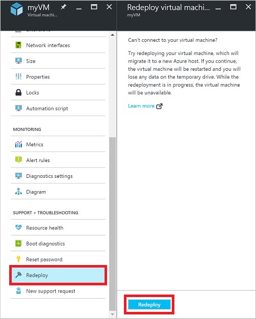
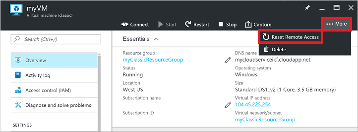
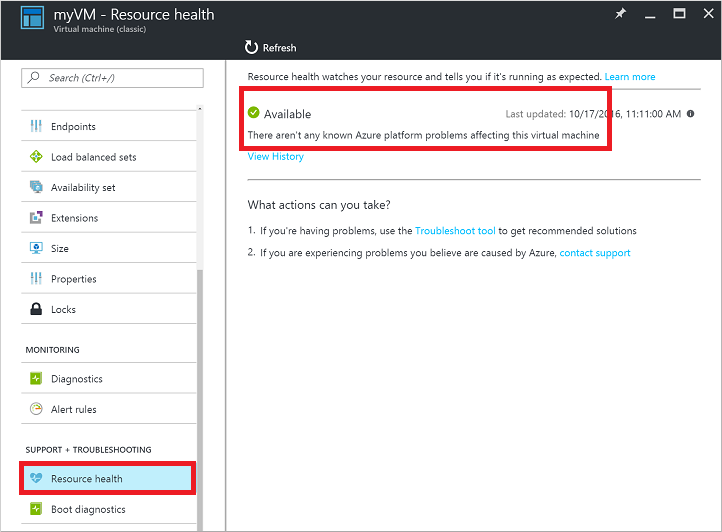

# <a name="troubleshoot-remote-desktop-connections-to-an-azure-virtual-machine"></a>排查 Azure 虚拟机的远程桌面连接问题
与基于 Windows 的 Azure 虚拟机 (VM) 的远程桌面协议 (RDP) 连接可能会因各种原因而失败，使用户无法访问 VM。 问题可能出在 VM 上的远程桌面服务、网络连接或主计算机上的远程桌面客户端。 本文介绍解决 RDP 连接问题的一些最常见方法。 

如果对本文中的任何观点存在疑问，可以联系 [MSDN Azure 和 CSDN Azure](https://www.azure.cn/support/forums/)上的 Azure 专家。 或者，也可以提出 Azure 支持事件。 请转到 [Azure 支持站点](https://www.azure.cn/support/contact/)并选择“获取支持”。

<a name="quickfixrdp"></a>

## <a name="quick-troubleshooting-steps"></a>快速故障排除步骤
在执行每个故障排除步骤之后，请尝试连接到 VM：

1. 重置远程桌面配置。
2. 检查网络安全组规则/云服务终结点。
3. 查看 VM 控制台日志。
4. 重置 VM 的 NIC。
5. 重置 VM 密码。
6. 重新启动 VM。
7. 重新部署 VM。
<!--Not Available 5.Check the VM Resource Health.-->

如需更详细的步骤和说明，请继续阅读余下的内容。 请确保本地网络设备（如路由器和防火墙）未阻止出站 TCP 端口 3389，如 [RDP 详细故障排除方案](detailed-troubleshoot-rdp.md?toc=%2fvirtual-machines%2fwindows%2ftoc.json)中所述。

> [!TIP]
> 如果门户中 VM 的“连接”按钮不可用，并且用户未通过 [Express Route](../../expressroute/expressroute-introduction.md) 或[站点到站点 VPN](../../vpn-gateway/vpn-gateway-howto-site-to-site-resource-manager-portal.md) 连接来连接到 Azure，则必须先为 VM 创建并分配一个公共 IP 地址，然后才能使用 RDP。 详细了解 [Azure 中的公共 IP 地址](../../virtual-network/virtual-network-ip-addresses-overview-arm.md)。

## <a name="ways-to-troubleshoot-rdp-issues"></a>排查 RDP 问题的方法
可以使用以下方法之一，对使用 Resource Manager 部署模型创建的 VM 进行故障排除：

* [Azure 门户](#using-the-azure-portal) - 如果需要快速重置 RDP 配置或用户凭据，并且没有安装 Azure 工具，则很适合使用此方法。
* [Azure PowerShell](#using-azure-powershell) - 如果熟悉 PowerShell 提示符，可使用 Azure PowerShell cmdlet 快速重置 RDP 配置或用户凭据。

还可以查找有关针对使用 [经典部署模型](#troubleshoot-vms-created-using-the-classic-deployment-model)创建的 VM 进行故障排除的步骤。

<a name="fix-common-remote-desktop-errors"></a>
<a name="using-the-azure-portal"></a>
## <a name="troubleshoot-using-the-azure-portal"></a>使用 Azure 门户进行故障排除
在执行每个故障排除步骤之后，请尝试再次连接到 VM。 如果仍然无法连接，请尝试下一步。

1. **重置 RDP 连接**。 当“远程连接”已禁用或 Windows 防火墙规则阻止 RDP 时，此故障排除步骤可重置 RDP 配置。

    在 Azure 门户中选择 VM。 在“设置”窗格中向下滚动到靠近列表底部的“支持 + 故障排除”部分。 单击“重置密码”按钮。 将“模式”设置为“仅重置配置”，然后单击“更新”按钮：

    
2. **验证网络安全组规则**。 使用 [IP 流验证](../../network-watcher/network-watcher-check-ip-flow-verify-portal.md)来确认网络安全组中的规则是否阻止了传入或传出虚拟机的流量。 还可以查看有效的安全组规则，确保入站“允许”NSG 规则存在并已针对 RDP 端口（默认值 3389）进行优化。 有关详细信息，请参阅[使用有效的安全规则排查 VM 流量流问题](../../virtual-network/diagnose-network-traffic-filter-problem.md)。

3. **查看 VM 启动诊断**。 此故障排除步骤检查 VM 控制台日志，确定 VM 是否报告了问题。 并非所有 VM 都已启用启动诊断，因此，此故障排除步骤可能是可选的。

    本文未介绍具体的故障排除步骤，而是指出会影响 RDP 连接的更广泛问题。 有关查看控制台日志和 VM 屏幕截图的详细信息，请参阅 [VM 启动诊断](boot-diagnostics.md)。

4. **重置 VM 的 NIC**。 有关详细信息，请参阅[如何重置 Azure Windows VM 的 NIC](reset-network-interface.md)。
<!-- Not Availble **Check the VM Resource Health**.  -->

6. **重置用户凭据**。 不确定或者忘了凭据时，可以使用此故障排除步骤重置本地管理员帐户的密码。  登录到 VM 后，应重置该用户的密码。

    在 Azure 门户中选择 VM。 在“设置”窗格中向下滚动到靠近列表底部的“支持 + 故障排除”部分。 单击“重置密码”按钮。 确保“模式”已设置为“重置密码”，然后输入用户名和新密码。 Finally, click the <bpt id="p1">**</bpt>Update<ept id="p1">**</ept> button:

    
7. **重新启动 VM**。 此故障排除步骤可以更正 VM 本身具有的任何基础问题。

    在 Azure 门户中选择 VM，并单击“概述”选项卡。

    
8. **重新部署 VM**。 此故障排除步骤将 VM 重新部署到 Azure 内的另一台主机，以更正任何基础平台或网络问题。

    在 Azure 门户中选择 VM。 在“设置”窗格中向下滚动到靠近列表底部的“支持 + 故障排除”部分。 单击“重新部署”按钮，然后单击“重新部署”：

    

    完成此操作后，会丢失临时磁盘数据，系统会更新与 VM 关联的动态 IP 地址。

9. **验证路由**。 使用网络观察程序的[下一跃点](../../network-watcher/network-watcher-check-next-hop-portal.md)功能确认路由未阻止将流量路由到虚拟机或从虚拟机路由流量。 还可以查看有效路由，以了解网络接口的所有有效路由。 有关详细信息，请参阅[使用有效路由排查 VM 流量流问题](../../virtual-network/diagnose-network-routing-problem.md)。

10. 确保任何本地防火墙或计算机上的防火墙允许发往 Azure 的出站 TCP 3389 流量。

如果仍遇到 RDP 问题，可以[开具支持请求](https://www.azure.cn/support/contact/)或阅读[更详细的 RDP 故障排除概念和步骤](detailed-troubleshoot-rdp.md?toc=%2fvirtual-machines%2fwindows%2ftoc.json)。

<a name="using-azure-powershell"></a>
## <a name="troubleshoot-using-azure-powershell"></a>使用 Azure PowerShell 进行故障排除
如果尚未执行该操作，请[安装并配置最新的 Azure PowerShell](https://docs.microsoft.com/powershell/azure/overview)。

以下示例使用 `myResourceGroup`、`myVM`、`myVMAccessExtension` 之类的变量。 将这些变量名称和位置替换为自己的值。

> [!NOTE]
> 使用 [Set-AzureRmVMAccessExtension](https://docs.microsoft.com/powershell/module/azurerm.compute/set-azurermvmaccessextension) PowerShell cmdlet 重置用户凭据和 RDP 配置。 在以下示例中， `myVMAccessExtension` 是在重置过程中指定的名称。 如果以前使用过 VMAccessAgent，可以使用 `Get-AzureRmVM -ResourceGroupName "myResourceGroup" -Name "myVM"` 检查 VM 的属性，从而获取现有的扩展名称。 若要查看名称，请查看输出的“Extensions”节中的内容。

在执行每个故障排除步骤之后，请尝试再次连接到 VM。 如果仍然无法连接，请尝试下一步。

1. **重置 RDP 连接**。 例如，如果远程连接已禁用或 Windows 防火墙规则正在阻止 RDP，此故障排除步骤可重置 RDP 配置。

    以下示例将在 `ChinaNorth` 位置和名为 `myResourceGroup` 资源组中重置名为 `myVM` 的 VM 上的 RDP 连接：

    ```powershell
    Set-AzureRmVMAccessExtension -ResourceGroupName "myResourceGroup" `
        -VMName "myVM" -Location Westus -Name "myVMAccessExtension"
    ```
2. **验证网络安全组规则**。 此故障排除步骤验证网络安全组中是否存在允许 RDP 流量的规则。 RDP 的默认端口为 TCP 端口 3389。 允许 RDP 通信的规则可能无法在创建 VM 时自动创建。

    首先，将网络安全组的所有配置数据分配到 `$rules` 变量。 以下示例将在名为 `myResourceGroup` 的资源组中获取关于名为 `myNetworkSecurityGroup` 的网络安全组的信息：

    ```powershell
    $rules = Get-AzureRmNetworkSecurityGroup -ResourceGroupName "myResourceGroup" `
        -Name "myNetworkSecurityGroup"
    ```

    现在，查看针对此网络安全组配置的规则。 验证是否存在一个允许使用 TCP 端口 3389 进行入站连接的规则，如下所示：

    ```powershell
    $rules.SecurityRules
    ```

    以下示例显示允许 RDP 通信的有效安全规则。 可以看到 `Protocol`、`DestinationPortRange`、`Access` 和 `Direction` 已正确配置：

    ```powershell
    Name                     : default-allow-rdp
    Id                       : /subscriptions/guid/resourceGroups/myResourceGroup/providers/Microsoft.Network/networkSecurityGroups/myNetworkSecurityGroup/securityRules/default-allow-rdp
    Etag                     : 
    ProvisioningState        : Succeeded
    Description              : 
    Protocol                 : TCP
    SourcePortRange          : *
    DestinationPortRange     : 3389
    SourceAddressPrefix      : *
    DestinationAddressPrefix : *
    Access                   : Allow
    Priority                 : 1000
    Direction                : Inbound
    ```

    如果不存在允许 RDP 通信的规则，请[创建网络安全组规则](nsg-quickstart-powershell.md?toc=%2fvirtual-machines%2fwindows%2ftoc.json)。 允许 TCP 端口 3389。
3. **重置用户凭据**。 不确定或忘记凭据时，此故障排除步骤将重置所指定本地管理员帐户的密码。

    首先，通过为 `$cred` 变量分配凭据来指定用户名和新密码，如下所示：

    ```powershell
    $cred=Get-Credential
    ```

    接下来，更新 VM 上的凭据。 以下示例将在 `ChinaNorth` 位置中和名为 `myResourceGroup` 的资源组中更新名为 `myVM` 的 VM 上的凭据：

    ```powershell
    Set-AzureRmVMAccessExtension -ResourceGroupName "myResourceGroup" `
        -VMName "myVM" -Location ChinaNorth -Name "myVMAccessExtension" `
        -UserName $cred.GetNetworkCredential().Username `
        -Password $cred.GetNetworkCredential().Password
    ```
4. **重新启动 VM**。 此故障排除步骤可以解决 VM 本身存在的任何基本问题。

    以下示例重启 `myResourceGroup` 资源组中名为 `myVM` 的 VM：

    ```powershell
    Restart-AzureRmVM -ResourceGroup "myResourceGroup" -Name "myVM"
    ```
5. **重新部署 VM**。 此故障排除步骤可将 VM 重新部署到 Azure 中的另一台主机，从而解决平台或网络的任何基本问题。

    以下示例重新部署 `ChinaNorth` 位置和 `myResourceGroup` 资源组中名为 `myVM` 的 VM：

    ```powershell
    Set-AzureRmVM -Redeploy -ResourceGroupName "myResourceGroup" -Name "myVM"
    ```

6. **验证路由**。 使用网络观察程序的[下一跃点](../../network-watcher/network-watcher-check-next-hop-portal.md)功能确认路由未阻止将流量路由到虚拟机或从虚拟机路由流量。 还可以查看有效路由，以了解网络接口的所有有效路由。 有关详细信息，请参阅[使用有效路由排查 VM 流量流问题](../../virtual-network/diagnose-network-routing-problem.md)。

7. 确保任何本地防火墙或计算机上的防火墙允许发往 Azure 的出站 TCP 3389 流量。

如果仍遇到 RDP 问题，可以[开具支持请求](https://www.azure.cn/support/contact/)或阅读[更详细的 RDP 故障排除概念和步骤](detailed-troubleshoot-rdp.md?toc=%2fvirtual-machines%2fwindows%2ftoc.json)。

## <a name="troubleshoot-vms-created-using-the-classic-deployment-model"></a>对使用经典部署模型创建的 VM 进行故障排除
执行每个故障排除步骤后，请尝试重新连接到 VM。

1. **重置 RDP 连接**。 当“远程连接”已禁用或 Windows 防火墙规则阻止 RDP 时，此故障排除步骤可重置 RDP 配置。

    在 Azure 门户中选择 VM。 单击“...更多”按钮，然后单击“重置远程访问”：

    
2. **验证云服务终结点**。 此故障排除步骤验证云服务中是否存在允许 RDP 流量的终结点。 RDP 的默认端口为 TCP 端口 3389。 创建 VM 时，可能不会自动创建允许 RDP 流量的规则。

   在 Azure 门户中选择 VM。 单击“终结点”按钮以查看当前为 VM 配置的终结点。 验证终结点存在，它们允许 TCP 端口 3389 上的 RDP 通信。

   以下示例显示了允许 RDP 流量的有效终结点：

   

   如果不存在允许 RDP 通信的终结点，请[创建云服务终结点](classic/setup-endpoints.md?toc=%2fvirtual-machines%2fwindows%2fclassic%2ftoc.json)。 允许使用 TCP 连接到专用端口 3389。
3. **检查 VM 启动诊断**。 此故障排除步骤检查 VM 控制台日志，确定 VM 是否报告了问题。 并非所有 VM 都已启用启动诊断，因此，此故障排除步骤可能是可选的。

    本文未介绍具体的故障排除步骤，而是指出会影响 RDP 连接的更广泛问题。 有关查看控制台日志和 VM 屏幕截图的详细信息，请参阅 [Boot Diagnostics for VMs](https://azure.microsoft.com/blog/boot-diagnostics-for-virtual-machines-v2/)（VM 的启动诊断）。
4. **检查 VM 资源运行状况**。 此故障排除步骤验证 Azure 平台不存在可能影响 VM 连接性的已知问题。

    在 Azure 门户中选择 VM。 在“设置”窗格中向下滚动到靠近列表底部的“支持 + 故障排除”部分。  单击“资源运行状况”按钮。 A healthy VM reports as being <bpt id="p1">**</bpt>Available<ept id="p1">**</ept>:

    
5. **重置用户凭据**。 不确定或者忘了凭据时，可以使用此故障排除步骤重置指定的本地管理员帐户的密码。  登录到 VM 后，应重置该用户的密码。

    在 Azure 门户中选择 VM。 在“设置”窗格中向下滚动到靠近列表底部的“支持 + 故障排除”部分。  单击“重置密码”按钮。 输入用户名和新密码。 最后，单击“保存”按钮： 

    
6. **重新启动 VM**。 此故障排除步骤可以更正 VM 本身具有的任何基础问题。

    在 Azure 门户中选择 VM，并单击“概述”选项卡。

    

7. 确保任何本地防火墙或计算机上的防火墙允许发往 Azure 的出站 TCP 3389 流量。

如果仍遇到 RDP 问题，可以[开具支持请求](https://www.azure.cn/support/contact/)或阅读[更详细的 RDP 故障排除概念和步骤](detailed-troubleshoot-rdp.md?toc=%2fvirtual-machines%2fwindows%2ftoc.json)。

## <a name="troubleshoot-specific-rdp-errors"></a>解决特定 RDP 错误
尝试通过 RDP 连接到 VM 时，可能会遇到特定的错误消息。 以下是最常见的错误消息：

* [由于没有可用于提供许可证的远程桌面授权服务器，远程会话已断开连接](troubleshoot-specific-rdp-errors.md#rdplicense)。
* [远程桌面找不到计算机“名称”。](troubleshoot-specific-rdp-errors.md#rdpname)
* [身份验证出错。无法联系本地安全机构](troubleshoot-specific-rdp-errors.md#rdpauth)。
* [Windows 安全性错误：凭据无效](troubleshoot-specific-rdp-errors.md#wincred)。
* [此计算机无法连接到远程计算机](troubleshoot-specific-rdp-errors.md#rdpconnect)。

## <a name="additional-resources"></a>其他资源
如果未发生上述任何错误但仍无法通过远程桌面连接到 VM，请阅读详细的[远程桌面故障排除指南](detailed-troubleshoot-rdp.md?toc=%2fvirtual-machines%2fwindows%2ftoc.json)。
* 有关用于访问 VM 上运行的应用程序的故障排除步骤，请参阅[对在 Azure VM 上运行的应用程序的访问进行故障排除](../linux/troubleshoot-app-connection.md?toc=%2fvirtual-machines%2flinux%2ftoc.json)。
* 如果在 Azure 中使用 Secure Shell (SSH) 连接到 Linux VM 时遇到问题，请参阅[对 Azure 中到 Linux VM 的 SSH 连接进行故障排除](../linux/troubleshoot-ssh-connection.md?toc=%2fvirtual-machines%2flinux%2ftoc.json)。
<!--Update_Description: update meta properties, wording update  -->
