# <a name="tutorial-create-a-continuous-integration-pipeline-with-visual-studio-team-services-and-iis"></a>教程：使用 Visual Studio Team Services 和 IIS 创建持续集成管道
若要将应用程序开发的生成、测试和部署阶段自动化，可以使用持续集成和部署 (CI/CD) 管道。 本教程介绍如何在 Azure 中使用 Visual Studio Team Services 和 Windows 虚拟机 (VM) 创建一个运行 IIS 的 CI/CD 管道。 你将学习如何执行以下操作：

> [!div class="checklist"]
> * 将 ASP.NET Web 应用程序发布到 Team Services 项目
> * 创建由代码提交触发的生成定义
> * 在 Azure 中的虚拟机上创建和配置 IIS
> * 将 IIS 实例添加到 Team Services 中的部署组
> * 创建发布定义，用于将新的 Web 部署包发布到 IIS
> * 测试 CI/CD 管道

本教程需要 Azure PowerShell 模块 5.7.0 或更高版本。 运行 `Get-Module -ListAvailable AzureRM` 即可查找版本。 如果需要进行升级，请参阅 [Install Azure PowerShell module](https://docs.microsoft.com/powershell/azure/install-azurerm-ps)（安装 Azure PowerShell 模块）。

## <a name="create-project-in-team-services"></a>在 Team Services 中创建项目
使用 Visual Studio Team Services 可以轻松进行协作和开发，而无需维护本地代码管理解决方案。 Team Services 提供云代码测试、生成和应用程序见解信息。 可以选择最适合用于代码开发的版本控制存储库和 IDE。 对于本教程，可以使用试用帐户来创建基本的 ASP.NET Web 应用和 CI/CD 管道。 如果还没有 Team Services 帐户，请[创建一个](http://go.microsoft.com/fwlink/?LinkId=307137)。

若要管理代码提交过程、生成定义及发布定义，请按如下所示在 Team Services 中创建一个项目：

1. 在 Web 浏览器中打开 Team Services 仪表板，然后选择“新建项目”。
2. 为“项目名称”输入 *myWebApp*。 保留其他所有默认值，以便使用“Git”版本控制和“Agile”工作项过程。
3. 选择“与团队成员共享”选项，然后选择“创建”。
5. 创建项目后，请选择“使用自述文件或 gitignore 初始化”选项，然后选择“初始化”。
6. 在新项目中，选择顶部的“仪表板”，然后选择“在 Visual Studio 中打开”。

## <a name="create-aspnet-web-application"></a>创建 ASP.NET Web 应用程序
上一步骤已在 Team Services 中创建一个项目。 最后一个步骤是在 Visual Studio 中打开新项目。 可在“团队资源管理器”窗口中管理代码提交。 创建新项目的本地副本，然后通过模板创建 ASP.NET Web 应用程序，如下所示：

1. 选择“克隆”，创建 Team Services 项目的本地 git 存储库。

    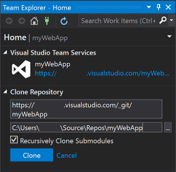

2. 在“解决方案”下面，选择“新建”。

    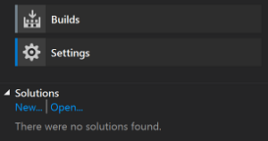

3. 选择“Web”模板，然后选择“ASP.NET Web 应用程序”模板。
    1. 输入应用程序的名称（例如 *myWebApp*），并取消选中“创建解决方案的目录”所对应的框。
    2. 取消选中“将 Application Insights 添加到项目”所对应的框（如果该选项可用）。 Application Insights 要求使用 Azure Application Insights 为 Web 应用程序授权。 本教程为了保持内容简洁，已跳过此过程。
    3. 选择“确定” 。
4. 从模板列表中选择“MVC”。
    1. 依次选择“更改身份验证”、“无身份验证”、“确定”。
    2. 选择“确定”，创建解决方案。
5. 在“团队资源管理器”窗口中选择“更改”。

    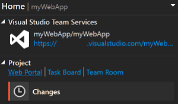

6. 在提交文本框中输入一条消息，例如“初始提交”。 从下拉菜单中选择“全部提交并同步”。

## <a name="create-build-definition"></a>创建生成定义
在 Team Services 中，可以使用生成定义来概述如何生成应用程序。 本教程将创建一个基本的定义，它采用我们的源代码，生成解决方案，然后创建可用于在 IIS 服务器上运行 Web 应用的 Web 部署包。

1. 在 Team Services 项目的顶部选择“生成和发布”，然后选择“生成”。
3. 选择“+ 新建定义”。
4. 选择“ASP.NET (预览)”模板，然后选择“应用”。
5. 保留所有默认任务值。 在“获取源”下面，确保已选择“myWebApp”存储库和“master”分支。

    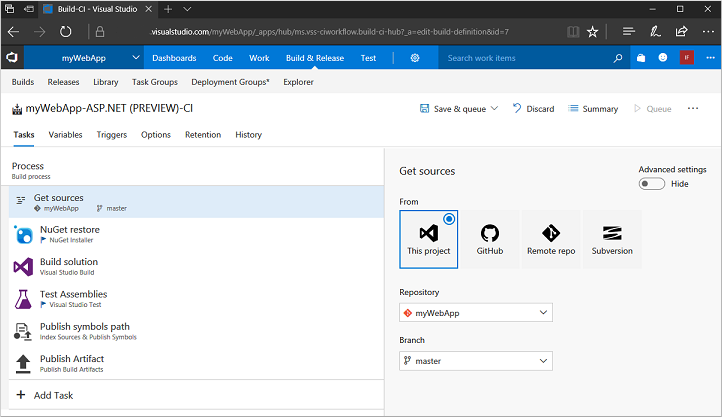

6. 在“触发器”选项卡上，将“启用此触发器”对应的滑块移动到“已启用”。
7. 保存生成定义，选择“保存并排队”将新的生成排入队列，然后再次选择“保存并排队”。 保留默认值并选择“排队”。

监视生成在托管代理上的计划过程，然后开始生成。 输出类似于以下示例：

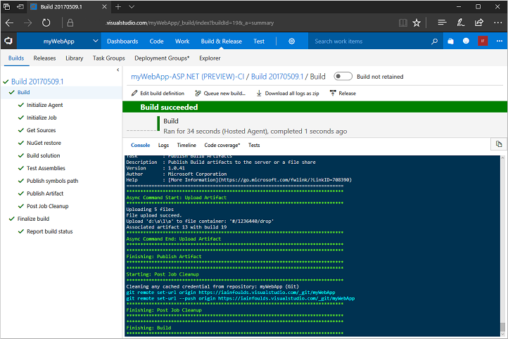

## <a name="create-virtual-machine"></a>创建虚拟机
若要提供一个平台来运行 ASP.NET Web 应用，需要一个运行 IIS 的 Windows 虚拟机。 提交代码和触发生成时，Team Services 使用代理与 IIS 实例交互。

使用 [New-AzureRmVM](https://docs.microsoft.com/powershell/module/azurerm.compute/new-azurermvm) 创建 Windows Server 2016 VM。 以下示例在“中国东部”位置创建名为 myVM 的 VM。 此外，还会创建资源组 myResourceGroupVSTS 和受支持的网络资源。 要允许 Web 流量，可向虚拟机打开 TCP 端口 80。 出现提示时，请提供用作 VM 登录凭据的用户名和密码：

```powershell
# Create user object
$cred = Get-Credential -Message "Enter a username and password for the virtual machine."

# Create a virtual machine
New-AzureRmVM `
  -ResourceGroupName "myResourceGroupVSTS" `
  -Name "myVM" `
  -Location "China East" `
  -ImageName "Win2016Datacenter" `
  -VirtualNetworkName "myVnet" `
  -SubnetName "mySubnet" `
  -SecurityGroupName "myNetworkSecurityGroup" `
  -PublicIpAddressName "myPublicIp" `
  -Credential $cred `
  -OpenPorts 80
```

若要连接到 VM，请使用 [Get-AzureRmPublicIpAddress](https://docs.microsoft.com/powershell/module/azurerm.network/get-azurermpublicipaddress) 获取公共 IP 地址，如下所示：

```powershell
Get-AzureRmPublicIpAddress -ResourceGroupName "myResourceGroupVSTS" | Select IpAddress
```

与 VM 建立远程桌面会话：

```cmd
mstsc /v:<publicIpAddress>
```

在 VM 上，打开“管理员 PowerShell”命令提示符。 按如下所示安装 IIS 和所需的 .NET 功能：

```powershell
Install-WindowsFeature Web-Server,Web-Asp-Net45,NET-Framework-Features
```

## <a name="create-deployment-group"></a>创建部署组
若要将 Web 部署包推送到 IIS 服务器，请在 Team Services 中定义一个部署组。 将代码提交到 Team Services 以及完成生成时，可在此组中指定哪些服务器要用作新生成的目标。

1. 在 Team Services 中选择“生成和发布”，然后选择“部署组”。
2. 选择“添加部署组”。
3. 输入组的名称（例如 *myIIS*），然后选择“创建”。
4. 在“注册计算机”部分中，请确保已选择“Windows”，然后选中“使用脚本中的个人访问令牌进行身份验证”所对应的框。
5. 选择“将脚本复制到剪贴板”。

### <a name="add-iis-vm-to-the-deployment-group"></a>将 IIS VM 添加到部署组
创建部署组后，请将每个 IIS 实例添加到该组。 Team Services 将生成一个脚本，用于在 VM 上下载并配置一个代理，以便接收新的 Web 部署包，然后将这些包应用到 IIS。

1. 返回到 VM 上的“管理员 PowerShell”会话，粘贴并运行从 Team Services 复制的脚本。
2. 当系统提示配置代理的标记时，请选择“Y”，然后输入 *web*。
3. 当系统提示输入用户帐户时，请按 *Return* 接受默认值。
4. 等待脚本完成并出现消息“服务 vstsagent.account.computername 已成功启动”。
5. 在“生成和发布”菜单的“部署组”页中，打开 *myIIS* 部署组。 在“计算机”选项卡上，检查你的 VM 是否已列出。

    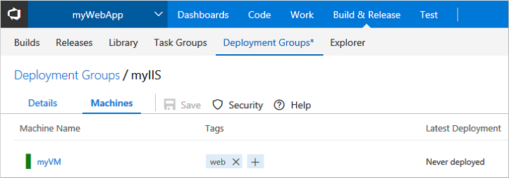

## <a name="create-release-definition"></a>创建发布定义
若要发布生成，请在 Team Services 中创建发布定义。 成功生成应用程序时，会自动触发此定义。 选择要将 Web 部署包推送到的部署组，然后定义相应的 IIS 设置。

1. 选择“生成和发布”，然后选择“生成”。 选择在上一步骤中创建的生成定义。
2. 在“最近完成”下面选择最近的生成，然后选择“发布”。
3. 选择“是”创建发布定义。
4. 选择“空”模板，然后选择“下一步”。
5. 检查项目中是否已填充项目与源生成定义。
6. 选中“持续部署”复选框，然后选择“创建”。
7. 选择“+ 添加任务”旁边的下拉列表框，然后选择“添加部署组阶段”。

    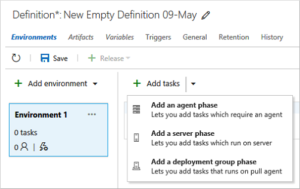

8. 选择“IIS Web 应用部署(预览)”旁边的“添加”，然后选择“关闭”。
9. 选择“在部署组上运行”父任务。
    1. 对于“部署组”，请选择前面创建的部署组，例如 *myIIS*。
    2. 在“计算机标记”框中，选择“添加”，然后选择“web”标记。

    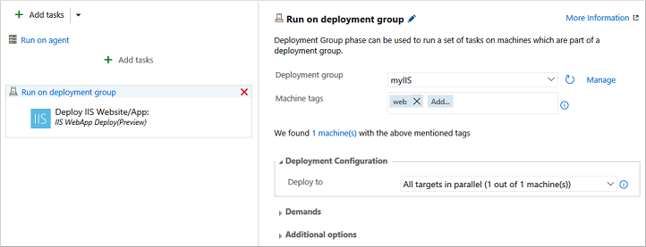

11. 选择“部署: IIS Web 应用部署”任务以配置 IIS 实例设置，如下所示：
    1. 对于“网站名称”，请输入“默认网站”。
    2. 保留其他所有默认设置。
12. 选择“保存”，然后选择“确定”两次。

## <a name="create-a-release-and-publish"></a>创建版本并发布
现在，可将 Web 部署包推送为新版本。 此步骤将与构成部署组的每个实例上的代理通信，推送 Web 部署包，然后将 IIS 配置为运行更新的 Web 应用程序。

1. 在发布定义中选择“+ 发布”，然后选择“创建发布”。
2. 检查下拉列表中是否已选择最新的生成以及“自动化部署: 创建发布后”。 选择“创建” 。
3. 发布定义的顶部将显示一个小标题，例如“已创建发布‘Release-1’”。 选择发布链接。
4. 打开“日志”选项卡查看发布进度。

    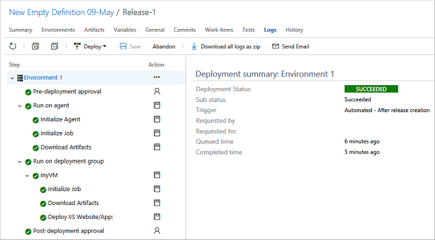

5. 发布完成后，请打开 Web 浏览器并输入 VM 的公共 IIP 地址。 ASP.NET Web 应用程序正在运行。

    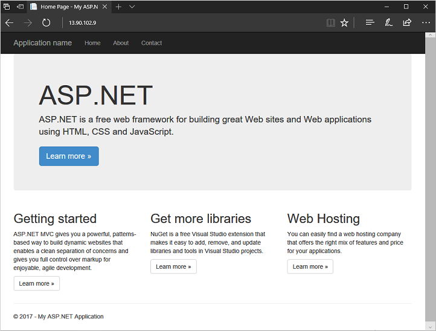

## <a name="test-the-whole-cicd-pipeline"></a>测试整个 CI/CD 管道
在 IIS 上运行 Web 应用程序后，请尝试测试整个 CI/CD 管道。 在 Visual Studio 中进行更改并提交代码后，将触发生成，然后触发将更新的 Web 部署包发布到 IIS 的过程：

1. 在 Visual Studio 中打开“解决方案资源管理器”窗口。
2. 导航到“myWebApp”|“视图”|“主页”|“Index.cshtml”并将它打开
3. 编辑第 6 行，如下所示：

    `<h1>ASP.NET with VSTS and CI/CD!</h1>`

4. 保存文件。
5. 打开“团队资源管理器”窗口，选择“myWebApp”项目，然后选择“更改”。
6. 输入提交消息（例如“测试 CI/CD 管道”），然后从下拉菜单中选择“全部提交并同步”。
7. 在 Team Services 工作区中，已通过代码提交触发了新的生成。 
    - 选择“生成和发布”，然后选择“生成”。 
    - 选择生成定义，然后选择“已排队和正在运行”生成来监视生成进度。
9. 成功生成后，将触发新的发布。
    - 选择“生成和发布”，然后选择“发布”查看已推送到 IIS VM 的 Web 部署包。 
    - 选择“刷新”图标来更新状态。 如果“环境”列显示绿色的复选标记，则表示已成功将发布部署到 IIS。
11. 若要查看已应用的更改，请在浏览器中刷新 IIS 网站。

    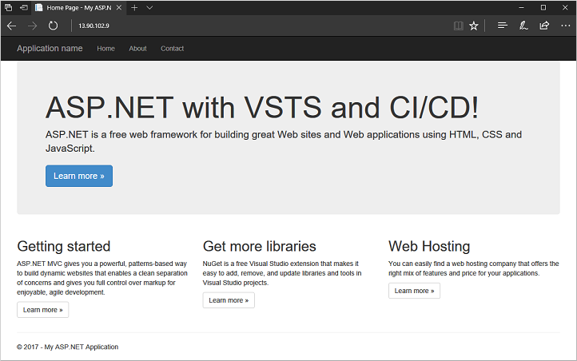

## <a name="next-steps"></a>后续步骤

本教程已在 Team Services 中创建一个 ASP.NET Web 应用程序，并配置了生成和发布定义，以便每次提交代码时将新的 Web 部署包部署到 IIS。 你已了解如何：

> [!div class="checklist"]
> * 将 ASP.NET Web 应用程序发布到 Team Services 项目
> * 创建由代码提交触发的生成定义
> * 在 Azure 中的虚拟机上创建和配置 IIS
> * 将 IIS 实例添加到 Team Services 中的部署组
> * 创建发布定义，用于将新的 Web 部署包发布到 IIS
> * 测试 CI/CD 管道

转到下一教程，了解如何在一对 Windows VM 上安装 SQL&#92;IIS&#92;.NET 网络堆栈。

> [!div class="nextstepaction"]
> [SQL&#92;IIS&#92;.NET 堆栈](tutorial-iis-sql.md)
<!-- Update_Description: update meta properties, wording update  -->