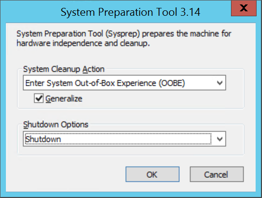

<!-- not suitable for Mooncake -->

---
title: 从通用化的本地 VHD 创建托管 Azure VM | Azure
description: 在 Resource Manager 部署模型中，使用从本地上载的 VHD 在 Azure 中创建托管 VM，然后使用托管磁盘。
services: virtual-machines-windows
documentationcenter: ''
author: cynthn
manager: timlt
editor: ''
tags: azure-resource-manager

ms.assetid: ''
ms.service: virtual-machines-windows
ms.workload: infrastructure-services
ms.tgt_pltfrm: vm-windows
ms.devlang: na
ms.topic: article
ms.date: 02/08/2017
wacn.date: 03/20/2017
ms.author: cynthn
---

# 从使用托管磁盘上载到 Azure 的通用化 VHD 创建新的 VM

可以在 Azure 中创建新的 VM，方法是上载从本地虚拟化工具或其他云导出的 VHD。对新的 VM 使用[托管磁盘](../../storage/storage-managed-disks-overview.md)可以简化 VM 管理，在将 VM 置于可用性集中时提供更好的可用性。如果要上载将用于创建多个 Azure VM 的 VHD，必须先使用 [Sysprep](../virtual-machines-windows-generalize-vhd.md) 通用化 VHD。Sysprep 将从 VHD 中删除计算机特定的所有信息和个人帐户信息。

Azure 托管磁盘不需要用户为 Azure VM 管理[存储帐户](../../storage/storage-introduction.md)。用户只需指定[高级](../../storage/storage-premium-storage-performance.md)或[标准](../../storage/storage-standard-storage.md)类型以及所需的磁盘大小，Azure 将为用户创建和管理磁盘。

> [!IMPORTANT]
在开始迁移到[托管磁盘](../../storage/storage-managed-disks-overview.md)之前，请查看[计划迁移到托管磁盘](on-prem-to-azure.md#plan-for-the-migration-to-managed-disks)。
>
> 将任何 VHD 上载到 Azure 之前，应该遵循[准备要上载到 Azure 的 Windows VHD 或 VHDX](../virtual-machines-windows-prepare-for-upload-vhd-image.md) 中的步骤操作
>
>

## 开始之前
如果使用 PowerShell，请确保使用的是最新版本的 AzureRM.Compute PowerShell 模块。运行以下命令来安装该模块。

```
Install-Module AzureRM.Compute -RequiredVersion 2.6.0
```

有关详细信息，请参阅 [Azure PowerShell Versioning](https://docs.microsoft.com/powershell/azureps-cmdlets-docs/#azure-powershell-versioning)（Azure PowerShell 版本控制）。

## 使用 Sysprep 通用化 Windows VM

Sysprep 将删除所有个人帐户信息及其他某些数据，并准备好要用作映像的计算机。有关 Sysprep 的详细信息，请参阅[如何使用 Sysprep：简介](http://technet.microsoft.com/zh-cn/library/bb457073.aspx)。

确保 Sysprep 支持计算机上运行的服务器角色。有关详细信息，请参阅 [Sysprep Support for Server Roles](https://msdn.microsoft.com/windows/hardware/commercialize/manufacture/desktop/sysprep-support-for-server-roles)（Sysprep 对服务器角色的支持）

> [!IMPORTANT]
如果在首次将 VHD 上载到 Azure 之前运行 Sysprep，请确保先[准备好 VM](../virtual-machines-windows-prepare-for-upload-vhd-image.md)，然后再运行 Sysprep。
> 
> 

1. 登录到 Windows 虚拟机。
2. 以管理员身份打开“命令提示符”窗口。将目录更改为 **%windir%\\system32\\sysprep**，然后运行 `sysprep.exe`。
3. 在“系统准备工具”对话框中，选择“进入系统全新体验(OOBE)”，确保已选中“通用化”复选框。
4. 在**“关机选项”**中选择**“关机”**。
5. 单击**“确定”**。

      

6. 在 Sysprep 完成时，它会关闭虚拟机。不要重新启动 VM。

## 登录到 Azure
如果尚未安装 Azure PowerShell 1.4 版或更高版本，请阅读[如何安装和配置 Azure PowerShell](https://docs.microsoft.com/powershell/azureps-cmdlets-docs)。

1. 打开 Azure PowerShell 并登录到 Azure 帐户。将打开一个弹出窗口，可以输入 Azure 帐户凭据。

    ```
    Login-AzureRmAccount -EnvironmentName AzureChinaCloud
    ```

2. 获取可用订阅的订阅 ID。

    ```
    Get-AzureRmSubscription
    ```

3. 使用订阅 ID 设置正确的订阅。将 `<subscriptionID>` 替换为正确订阅的 ID。

    ```
    Select-AzureRmSubscription -SubscriptionId "<subscriptionID>"
    ```

## 获取存储帐户
需要在 Azure 中创建存储帐户来存储上传的 VM 映像。可以使用现有存储帐户，也可以创建新存储帐户。

如果将使用 VHD 为 VM 创建托管磁盘，存储帐户位置必须与要创建 VM 的位置相同。

显示可用的存储帐户，请键入：

```
Get-AzureRmStorageAccount
```

如果要使用现有存储帐户，请转到[上载 VM 映像](#upload-the-vm-vhd-to-your-storage-account)部分。

若要创建存储帐户，请执行以下步骤：

1. 需要应在其中创建存储帐户的资源组的名称。若要查找订阅中的所有资源组，请键入：

    ```
    Get-AzureRmResourceGroup
    ```

    若要在**中国北部**区域中创建名称为 **myResourceGroup** 的资源组，请键入：

    ```
    New-AzureRmResourceGroup -Name myResourceGroup -Location "China North"
    ```

2. 使用 [New-AzureRmStorageAccount](https://msdn.microsoft.com/zh-cn/library/mt607148.aspx) cmdlet 在此资源组中创建名称为 **mystorageaccount** 存储帐户：

    ```
    New-AzureRmStorageAccount -ResourceGroupName myResourceGroup -Name mystorageaccount -Location "China North" `
        -SkuName "Standard_LRS" -Kind "Storage"
    ```

    -SkuName 的有效值为：

    * **Standard\_LRS** - 本地冗余存储。
    * **Standard\_ZRS** - 区域冗余存储。
    * **Standard\_GRS** - 异地冗余存储。
    * **Standard\_RAGRS** - 读取访问权限异地冗余存储。
    * **Premium\_LRS** - 高级本地冗余存储。

## <a name="upload-the-vm-vhd-to-your-storage-account"></a> 将 VHD 上载到存储帐户

使用 [Add-AzureRmVhd](https://msdn.microsoft.com/zh-cn/library/mt603554.aspx) cmdlet 将 VHD 上载到存储帐户中的容器。此示例将文件 **myVHD.vhd** 从 `"C:\Users\Public\Documents\Virtual hard disks"` 上传到 **myResourceGroup** 资源组中名为 **mystorageaccount** 的存储帐户。该文件将放到名为 **mycontainer** 的容器，新的文件名将是 **myUploadedVHD.vhd**。

```
$rgName = "myResourceGroup"
$urlOfUploadedImageVhd = "https://mystorageaccount.blob.core.chinacloudapi.cn/mycontainer/myUploadedVHD.vhd"
Add-AzureRmVhd -ResourceGroupName $rgName -Destination $urlOfUploadedImageVhd `
    -LocalFilePath "C:\Users\Public\Documents\Virtual hard disks\myVHD.vhd"
```

如果成功，显示如下所示的响应：

```
MD5 hash is being calculated for the file C:\Users\Public\Documents\Virtual hard disks\myVHD.vhd.
MD5 hash calculation is completed.
Elapsed time for the operation: 00:03:35
Creating new page blob of size 53687091712...
Elapsed time for upload: 01:12:49

LocalFilePath           DestinationUri
-------------           --------------
C:\Users\Public\Doc...  https://mystorageaccount.blob.core.chinacloudapi.cn/mycontainer/myUploadedVHD.vhd
```

完成执行此命令可能需要一段时间，具体取决于网络连接速度和 VHD 文件的大小

如果要使用上载的 VHD 创建托管磁盘或新 VM，请保存**目标 URI** 路径供稍后使用。

### 用于上传 VHD 的其他选项

也可以使用以下方法之一将 VHD 上载到存储帐户：

-   [Azure 存储复制 Blob API](https://msdn.microsoft.com/zh-cn/library/azure/dd894037.aspx)

-   [Azure 存储资源管理器上传 Blob](https://azurestorageexplorer.codeplex.com/)

-   [存储导入/导出服务 REST API 参考](https://msdn.microsoft.com/zh-cn/library/dn529096.aspx)

    如果预估上传时间大于 7 天，建议使用导入/导出服务。可根据数据大小和传输单位，利用 [DataTransferSpeedCalculator](https://github.com/Azure-Samples/storage-dotnet-import-export-job-management/blob/master/DataTransferSpeedCalculator.html) 预估时间。

    导入/导出可用于复制到标准存储帐户。需要使用 AzCopy 等工具从标准存储复制到高级存储帐户。

## 通过上载的 VHD 创建托管映像 

使用通用化的 OS VHD 创建托管映像。

1.  首先，设置公共参数：

    ```
    $rgName = "myResourceGroupName"
    $vmName = "myVM"
    $location = "West China North" 
    $imageName = "yourImageName"
    $osVhdUri = "https://storageaccount.blob.core.chinacloudapi.cn/vhdcontainer/osdisk.vhd"
    ```

4.  使用通用化的 OS VHD 创建映像。

    ```
    $imageConfig = New-AzureRmImageConfig -Location $location
    $imageConfig = Set-AzureRmImageOsDisk -Image $imageConfig -OsType Windows -OsState Generalized -BlobUri $osVhdUri
    $image = New-AzureRmImage -ImageName $imageName -ResourceGroupName $rgName -Image $imageConfig
    ```

## 设置映像的某些变量

首先需要收集有关映像的基本信息并创建映像的变量。本示例使用**中国西北**位置的 **myResourceGroup** 资源组中名为 **myImage** 的托管 VM 映像。

```
$rgName = "myResourceGroup"
$location = "West China North"
$imageName = "myImage"
$image = Get-AzureRMImage -ImageName $imageName -ResourceGroupName $rgName
```

## 创建虚拟网络
创建[虚拟网络](../../virtual-network/virtual-networks-overview.md)的 vNet 和子网。

1. 创建子网。本示例创建名为 **mySubnet** 的子网，其地址前缀为 **10.0.0.0/24**。

    ```
    $subnetName = "mySubnet"
    $singleSubnet = New-AzureRmVirtualNetworkSubnetConfig -Name $subnetName -AddressPrefix 10.0.0.0/24
    ```

2. 创建虚拟网络。本示例创建名为 **myVnet** 的虚拟网络，其地址前缀为 **10.0.0.0/16**。

    ```
    $vnetName = "myVnet"
    $vnet = New-AzureRmVirtualNetwork -Name $vnetName -ResourceGroupName $rgName -Location $location `
        -AddressPrefix 10.0.0.0/16 -Subnet $singleSubnet
    ```

## 创建公共 IP 地址和网络接口

若要与虚拟网络中的虚拟机通信，需要一个[公共 IP 地址](../../virtual-network/virtual-network-ip-addresses-overview-arm.md)和网络接口。

1. 创建公共 IP 地址。此示例创建名为 **myPip** 的公共 IP 地址。

    ```
    $ipName = "myPip"
    $pip = New-AzureRmPublicIpAddress -Name $ipName -ResourceGroupName $rgName -Location $location `
        -AllocationMethod Dynamic
    ```

2. 创建 NIC。此示例创建名为 **myNic** 的 NIC。

    ```
    $nicName = "myNic"
    $nic = New-AzureRmNetworkInterface -Name $nicName -ResourceGroupName $rgName -Location $location `
        -SubnetId $vnet.Subnets[0].Id -PublicIpAddressId $pip.Id
    ```

## 创建网络安全组和 RDP 规则

若要使用 RDP 登录到 VM，需要创建一个允许在端口 3389 上进行 RDP 访问的网络安全规则 (NSG)。

此示例创建名为 **myNsg** 的 NSG，其中包含一个允许通过端口 3389 传输 RDP 流量的、名为 **myRdpRule** 的规则。有关 NSG 的详细信息，请参阅 [Opening ports to a VM in Azure using PowerShell](../virtual-machines-windows-nsg-quickstart-powershell.md)（使用 PowerShell 在 Azure 中打开 VM 端口）。

```
$nsgName = "myNsg"
$ruleName = "myRdpRule"
$rdpRule = New-AzureRmNetworkSecurityRuleConfig -Name $ruleName -Description "Allow RDP" `
    -Access Allow -Protocol Tcp -Direction Inbound -Priority 110 `
    -SourceAddressPrefix Internet -SourcePortRange * `
    -DestinationAddressPrefix * -DestinationPortRange 3389

$nsg = New-AzureRmNetworkSecurityGroup -ResourceGroupName $rgName -Location $location `
    -Name $nsgName -SecurityRules $rdpRule
```

## 为虚拟网络创建变量

为完成的虚拟网络创建变量。

```
$vnet = Get-AzureRmVirtualNetwork -ResourceGroupName $rgName -Name $vnetName
```

## 获取 VM 的凭据

以下 cmdlet 将打开一个窗口，需在其中输入远程访问 VM 所用的本地管理员帐户的新用户名和密码。

```
$cred = Get-Credential
```

## 设置 VM 名称和计算机名称的变量以及 VM 的大小

1. 创建 VM 名称与计算机名称的变量。本示例将 VM 名称设置为 **myVM**，将计算机名称设置为 **myComputer**。

    ```
    $vmName = "myVM"
    $computerName = "myComputer"
    ```

2. 设置虚拟机的大小。本示例创建 **Standard\_DS1\_v2** 大小的 VM。有关详细信息，请参阅 [VM 大小](../virtual-machines-windows-sizes.md)文档。

    ```
    $vmSize = "Standard_DS1_v2"
    ```

3. 将 VM 的名称和大小添加到 VM 配置。

    $vm = New-AzureRmVMConfig -VMName $vmName -VMSize $vmSize

## 将 VM 映像设置为新 VM 的源映像

使用托管 VM 映像的 ID 设置源映像。

```
$vm = Set-AzureRmVMSourceImage -VM $vm -Id $image.Id
```

## 设置 OS 配置并添加 NIC。

输入 OS 磁盘的存储类型（PremiumLRS 或 StandardLRS）和大小。本示例将帐户类型设置为 **PremiumLRS**，将磁盘大小设置为 **128 GB**，将磁盘缓存设置为 **ReadWrite**。

```
$vm = Set-AzureRmVMOSDisk -VM $vm  -ManagedDiskStorageAccountType PremiumLRS -DiskSizeInGB 128 `
-CreateOption FromImage -Caching ReadWrite

$vm = Set-AzureRmVMOperatingSystem -VM $vm -Windows -ComputerName $computerName `
-Credential $cred -ProvisionVMAgent -EnableAutoUpdate

$vm = Add-AzureRmVMNetworkInterface -VM $vm -Id $nic.Id
```

## 创建 VM

使用在 **$vm** 变量中生成和存储的配置创建新 VM。

```
New-AzureRmVM -VM $vm -ResourceGroupName $rgName -Location $location
```

## 验证是否已创建 VM
完成后，应会在 [Azure 门户预览](https://portal.azure.cn)的“浏览”>“虚拟机”下看到新建的 VM，也可以使用以下 PowerShell 命令查看该 VM：

```
    $vmList = Get-AzureRmVM -ResourceGroupName $rgName
    $vmList.Name
```

## 后续步骤

若要登录到新虚拟机，请在[门户](https://portal.azure.cn)中浏览到该 VM，单击“连接”，然后打开远程桌面 RDP 文件。使用原始虚拟机的帐户凭据登录到新虚拟机。有关详细信息，请参阅 [How to connect and log on to an Azure virtual machine running Windows](../virtual-machines-windows-connect-logon.md)（如何连接并登录到运行 Windows 的 Azure 虚拟机）。

<!---HONumber=Mooncake_0313_2017-->