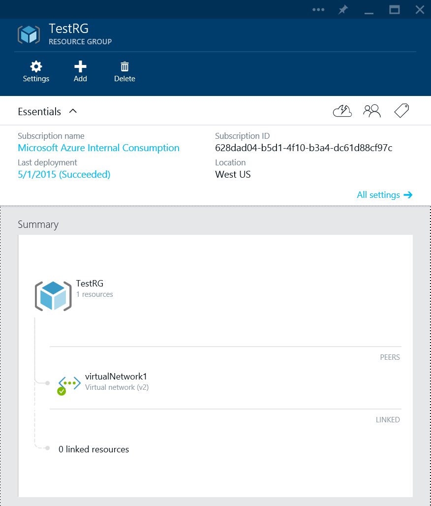

# 网络资源提供程序
要在当今社会获得业务成功，需要满足的一个基本需求就是，能够以灵活、弹性、安全且可重复的方式生成和管理可识别大型网络的应用程序。 使用 Azure Resource Manager 可以创建此类应用程序，作为资源组中的单个资源集合。 此类资源通过 Resource Manager 下的各种资源提供程序进行管理。

Azure Resource Manager 依靠不同的资源提供程序提供对资源的访问。 主要有三个资源提供程序：网络、存储和计算。 本文档讨论网络资源提供程序的特点和优点，包括：

* **元数据** - 可以使用标记将信息添加到资源。 这些标记可用于跟踪不同资源组和订阅中的资源利用率。
* **更好地控制网络** - 网络资源松散耦合，可以更精细地控制它们。 这意味着，在管理网络资源方面拥有更大的弹性。
* **更快的配置** - 因为网络资源松散耦合，可以并行创建和协调网络资源。 这极大地减少了配置时间。
* **基于角色的访问控制** - RBAC 提供了具有特定安全作用域的默认角色，此外，还允许创建自定义角色进行安全管理。
* **简化管理和部署** - 可以将整个应用程序堆栈作为资源组中的单个资源集合创建，因此，可以更轻松地部署和管理应用程序。 此外，由于只需提供模板 JSON 负载就能部署，因此加快了部署速度。
* **快速自定义** - 可以使用声明式模板为部署启用可重复的快速自定义。
* **可重复自定义** - 可以使用声明式模板为部署启用可重复的快速自定义。
* **管理界面** - 可以任意使用以下一个界面来管理资源：
  * 基于 REST 的 API
  * PowerShell
  * .NET SDK
  * Node.JS SDK
  * Java SDK
  * Azure CLI
  * 门户
  * Resource Manager 模板语言

## 网络资源
现在，可以单独管理网络资源，而不用通过单个计算资源（虚拟机）对其进行统一管理。 这可确保在资源组中编写复杂的大规模基础结构时获得更高的弹性和灵活性。

下面显示了涉及多层应用程序的示例部署的概念视图。 看到的每个资源，比如 NIC、公共 IP 地址和虚拟机，都可以单独管理。

每个资源都包含一组通用属性及其各自的属性集。 通用属性：

| 属性 | 说明 | 示例值 |
| --- | --- | --- |
| **name** |唯一的资源名称。 每个资源类型都有自己的命名限制。 |PIP01、VM01、NIC01 |
| **位置** |资源所在的 Azure 区域 |chinanorth、chinaeast |
| **id** |唯一的基于 URI 的标识 |/subscriptions/<subGUID>/resourceGroups/TestRG/providers/Microsoft.Network/publicIPAddresses/TestPIP |

可以在以下部分中检查资源的各个属性。

[!INCLUDE [virtual-networks-nrp-pip-include](../../includes/virtual-networks-nrp-pip-include.md)]

[!INCLUDE [virtual-networks-nrp-nic-include](../../includes/virtual-networks-nrp-nic-include.md)]

[!INCLUDE [virtual-networks-nrp-nsg-include](../../includes/virtual-networks-nrp-nsg-include.md)]

[!INCLUDE [virtual-networks-nrp-udr-include](../../includes/virtual-networks-nrp-udr-include.md)]

[!INCLUDE [virtual-networks-nrp-vnet-include](../../includes/virtual-networks-nrp-vnet-include.md)]

[!INCLUDE [virtual-networks-nrp-lb-include](../../includes/virtual-networks-nrp-lb-include.md)]

[!INCLUDE [virtual-networks-nrp-appgw-include](../../includes/virtual-networks-nrp-appgw-include.md)]

[!INCLUDE [virtual-networks-nrp-vpn-include](../../includes/virtual-networks-nrp-vpn-include.md)]

[!INCLUDE [virtual-networks-nrp-tm-include](../../includes/virtual-networks-nrp-tm-include.md)]

## 管理界面
可以使用不同界面来管理 Azure 网络资源。 在本文档中，我们针对这些界面重点介绍其中两种：REST API 和模板。

### REST API
如前所述，可以通过各种界面（包括 REST API、.NET SDK、Node.JS SDK、Java SDK、PowerShell、CLI、Azure 门户和模板）管理网络资源。

Rest API 符合 HTTP 1.1 协议规范。 下面显示了该 API 的常规 URI 结构：

    https://management.chinacloudapi.cn/subscriptions/{subscription-id}/providers/{resource-provider-namespace}/locations/{region-location}/register?api-version={api-version}

大括号中的参数代表以下元素：

* **subscription-id** - Azure 订阅 ID。
* **resource-provider-namespace** - 正在使用的提供程序的命名空间。 网络资源提供程序的值为 *Microsoft.Network*。
* **region-name** - Azure 区域名称

调用 REST API 时支持以下的 HTTP 方法：

* **PUT** - 用于创建给定类型的资源、修改资源属性或更改资源之间的关联。
* **GET** - 用于检索设置的资源的信息。
* **DELETE** - 用于删除现有资源。

请求和响应都符合 JSON 负载格式。

### Resource Manager 模板语言
除了强制性管理资源（通过 API 或 SDK）以外，还可以使用 Resource Manager 模板语言以声明性编程方式构建和管理网络资源。

下面提供了模板的示例表示形式 -

    {
      "$schema": "http://schema.management.azure.com/schemas/2014-04-01-preview/deploymentTemplate.json",
      "contentVersion": "<version-number-of-template>",
      "parameters": { <parameter-definitions-of-template> },
      "variables": { <variable-definitions-of-template> },
      "resources": [ { <definition-of-resource-to-deploy> } ],
      "outputs": { <output-of-template> }    
    }

该模板主要是资源和通过参数注入的实例值的 JSON 说明。 可以使用以下示例创建包含 2 个子网的虚拟网络。

    {
        "$schema": "http://schema.management.azure.com/schemas/2014-04-01-preview/VNET.json",
        "contentVersion": "1.0.0.0",
        "parameters" : {
          "location": {
            "type": "String",
            "allowedValues": ["China East", "China North"],
            "metadata" : {
              "Description" : "Deployment location"
            }
          },
          "virtualNetworkName":{
            "type" : "string",
            "defaultValue":"myVNET",
            "metadata" : {
              "Description" : "VNET name"
            }
          },
          "addressPrefix":{
            "type" : "string",
            "defaultValue" : "10.0.0.0/16",
            "metadata" : {
              "Description" : "Address prefix"
            }

          },
          "subnet1Name": {
            "type" : "string",
            "defaultValue" : "Subnet-1",
            "metadata" : {
              "Description" : "Subnet 1 Name"
            }
          },
          "subnet2Name": {
            "type" : "string",
            "defaultValue" : "Subnet-2",
            "metadata" : {
              "Description" : "Subnet 2 name"
            }
          },
          "subnet1Prefix" : {
            "type" : "string",
            "defaultValue" : "10.0.0.0/24",
            "metadata" : {
              "Description" : "Subnet 1 Prefix"
            }
          },
          "subnet2Prefix" : {
            "type" : "string",
            "defaultValue" : "10.0.1.0/24",
            "metadata" : {
              "Description" : "Subnet 2 Prefix"
            }
          }
        },
        "resources": [
        {
          "apiVersion": "2015-05-01-preview",
          "type": "Microsoft.Network/virtualNetworks",
          "name": "[parameters('virtualNetworkName')]",
          "location": "[parameters('location')]",
          "properties": {
            "addressSpace": {
              "addressPrefixes": [
                "[parameters('addressPrefix')]"
              ]
            },
            "subnets": [
              {
                "name": "[parameters('subnet1Name')]",
                "properties" : {
                  "addressPrefix": "[parameters('subnet1Prefix')]"
                }
              },
              {
                "name": "[parameters('subnet2Name')]",
                "properties" : {
                  "addressPrefix": "[parameters('subnet2Prefix')]"
                }
              }
            ]
          }
        }
        ]
    }

可以选择在使用模板时手动提供参数值，或者使用参数文件。 以下示例演示可与上述模板一起使用的参数值集：

    {
      "location": {
          "value": "China East"
      },
      "virtualNetworkName": {
          "value": "VNET1"
      },
      "subnet1Name": {
          "value": "Subnet1"
      },
      "subnet2Name": {
          "value": "Subnet2"
      },
      "addressPrefix": {
          "value": "192.168.0.0/16"
      },
      "subnet1Prefix": {
          "value": "192.168.1.0/24"
      },
      "subnet2Prefix": {
          "value": "192.168.2.0/24"
      }
    }

使用模板的主要优势在于：

* 可以声明性方式在资源组中构建复杂的基础结构。 创建资源的业务流程（包括依赖关系管理）由 Resource Manager 处理。
* 可以在多个不同区域和一个区域中重复创建基础结构，只需更改参数即可。
* 声明性方式可以缩短构建模板和推出基础结构的周期时间。

有关示例模板，请参阅 [Azure 快速入门模板](https://github.com/Azure/azure-quickstart-templates)。

有关 Resource Manager 模板语言的详细信息，请参阅 [Azure Resource Manager 模板语言](../azure-resource-manager/resource-group-authoring-templates.md)。

上面的示例模板使用虚拟网络和子网资源。 下面列出了可以使用的其他一些网络资源：

### 使用模板
可以使用 PowerShell、AzureCLI 或通过在 GitHub 中执行单击部署，从模板向 Azure 部署服务。 若要在 GitHub 中从模板部署服务，请执行以下步骤：

1. 从 GitHub 打开 template3 文件。 例如，打开“[包含两个子网的虚拟网络](https://github.com/Azure/azure-quickstart-templates/tree/master/101-vnet-two-subnets)” ，查看模板。 （不要单击“部署到 Azure”，因为这面向全球 Azure）
2. 此处单击“**[部署到 Azure](https://portal.azure.cn/#create/Microsoft.Template/uri/https%3A%2F%2Fraw.githubusercontent.com%2FAzure%2Fazure-quickstart-templates%2Fmaster%2F101-vnet-two-subnets%2Fazuredeploy.json)**”，然后使用凭据登录到 Azure 门户。
3. 验证模板，并单击“保存” 。
4. 单击“编辑参数”并为 vnet 和子网选择一个位置，例如“中国北部”。
5. 根据需要更改 **ADDRESSPREFIX** 和 **SUBNETPREFIX** 参数，然后单击“确定”。
6. 单击“选择资源组”，并单击要将 vnet 和子网添加到的资源组  。 或者，可以通过单击“或新建”创建新的资源组 。
7. 单击**创建**。 请注意磁贴显示了“正在设置模板部署” 。 完成部署后，会看到一个类似于下面的屏幕。

>[!NOTE]
> 必须修改从 GitHub 存储库“azure-quickstart-templates”下载的模板，以适应 Azure 中国云环境。 例如，替换某些终结点（将“blob.core.windows.net”替换为“blob.core.chinacloudapi.cn”，将“cloudapp.azure.com”替换为“chinacloudapp.cn”）；更改某些不受支持的 VM 映像；更改某些不受支持的 VM 大小。

## 后续步骤
[Azure Resource Manager 模板语言](../azure-resource-manager/resource-group-authoring-templates.md)

[Azure 网络 – 常用的模板](https://github.com/Azure/azure-quickstart-templates)

[Azure Resource Manager 和经典部署](../azure-resource-manager/resource-manager-deployment-model.md)

[Azure Resource Manager 概述](../azure-resource-manager/resource-group-overview.md)