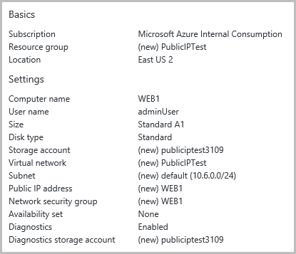

# 使用 Azure 门户创建具有静态公共 IP 地址的 VM

> [!div class="op_single_selector"]
> * [Azure 门户](virtual-network-deploy-static-pip-arm-portal.md)
> * [PowerShell](virtual-network-deploy-static-pip-arm-ps.md)
> * [Azure CLI](virtual-network-deploy-static-pip-arm-cli.md)
> * [PowerShell（经典）](virtual-networks-reserved-public-ip.md)

[!INCLUDE [virtual-network-deploy-static-pip-intro-include.md](../../includes/virtual-network-deploy-static-pip-intro-include.md)]

> [!NOTE]
> Azure 具有用于创建和处理资源的两个不同的部署模型：[Resource Manager 和经典](../resource-manager-deployment-model.md)。 本文介绍如何使用 Resource Manager 部署模型。Azure 建议对大多数新的部署使用该模型，而不是经典部署模型。

[!INCLUDE [virtual-network-deploy-static-pip-scenario-include.md](../../includes/virtual-network-deploy-static-pip-scenario-include.md)]

## 使用静态公共 IP 创建 VM

若要在 Azure 门户中创建具有静态公共 IP 地址的 VM，请完成以下步骤：

1. 从浏览器导航到 [Azure 门户](https://portal.azure.cn)，并在必要时用 Azure 帐户登录。
2. 在门户左上角，单击“创建资源”>>“计算”>“Windows Server 2012 R2 Datacenter”。
3. 在“选择部署模型”列表中，选择“Resource Manager”，然后单击“创建”。
4. 在“基本信息”窗格中，输入如下所示的 VM 信息，然后单击“确定”。

    
5. 在“选择大小”窗格中，单击“A1 标准”（如下所示），然后单击“选择”。

    
6. 在“设置”窗格中，单击“公共 IP 地址”，然后，在“创建公共 IP 地址”窗格中的“分配”下，单击“静态”，如下所示。 然后，单击“确定”。

    
7. 在“设置”窗格中，单击“确定”。
8. 查看“摘要”窗格（如下所示），然后单击“确定”。

    
9. 请注意仪表板中的新磁贴。

    
10. 创建 VM 后，“设置”窗格将显示如下：

    

## 在操作系统中设置 IP 地址

切勿在虚拟机的操作系统中手动分配已分配给 Azure 虚拟机的公共 IP 地址。 我们建议，除非有必要（例如，[为一个 Windows VM 分配多个 IP 地址](virtual-network-multiple-ip-addresses-portal.md)时），否则不要以静态方式在 VM 的操作系统中分配已分配给 Azure 虚拟机的专用 IP。 如果确实需要在操作系统中手动设置该专用 IP 地址，请确保它与分配给 Azure [网络接口](virtual-network-network-interface-addresses.md#change-ip-address-settings)的专用 IP 地址是同一地址，否则可能会丢失与虚拟机的连接。 详细了解[专用 IP 地址](virtual-network-network-interface-addresses.md#private)设置。

## 后续步骤

任何网络流量都可流入和流出本文中创建的 VM。 可以在网络安全组中定义入站和出站安全规则，以限制可以流入和流出网络接口和/或子网的流量。 若要深入了解网络安全组，请参阅[网络安全组概述](security-overview.md)。
<!-- Update_Description: update meta properties, wording update, update link -->