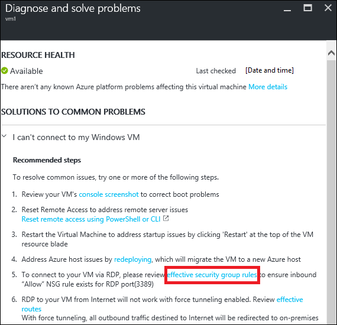
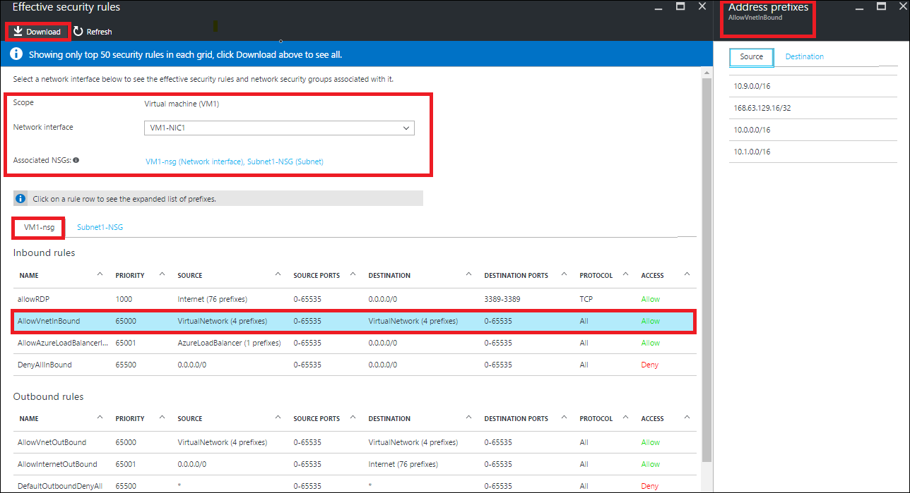
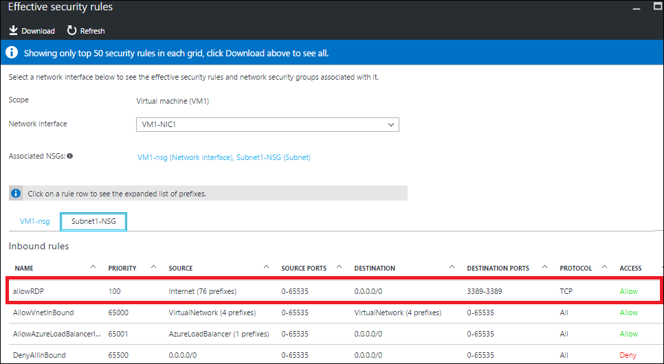
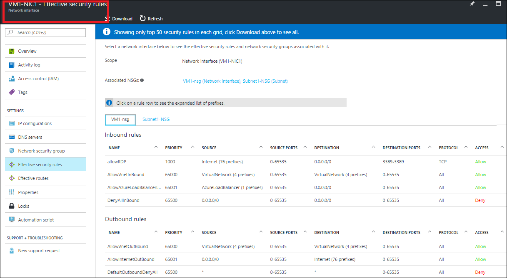

# 使用 Azure 门户排查网络安全组问题

> [!div class="op_single_selector"]
>- [Azure 门户](./virtual-network-nsg-troubleshoot-portal.md)
>- [PowerShell](./virtual-network-nsg-troubleshoot-powershell.md)

如果在虚拟机 (VM) 上配置网络安全组 (NSG) 时遇到 VM 连接问题，可以借助本文中概述的 NSG 诊断功能进行故障排除。

使用 NSG 可以控制流入和流出虚拟机 (VM) 的流量类型。可对 Azure 虚拟网络 (VNet) 中的子网和/或网络接口 (NIC) 应用 NSG。对 NIC 应用的有效规则是对 NIC 应用的 NSG 以及对 NIC 所连接到的子网应用的 NSG 的规则聚合。这些 NSG 的规则有时互相冲突，影响 VM 的网络连接。

可以查看 NSG 中对 VM NIC 应用的所有有效安全规则。本文说明如何在 Azure Resource Manager 部署模型中使用这些规则来排查 VM 连接问题。如果你不熟悉 VNet 与 NSG 的概念，请参阅[虚拟网络](./virtual-networks-overview.md)和[网络安全组](./virtual-networks-nsg.md)概述文章。

## 使用有效的安全规则排查 VM 流量流问题

以下情景是常见连接问题的示例：

名为 *VM1* 的 VM 位于 VNet *ChinaNorth-VNet1* 中的 *Subnet1* 子网内。尝试使用 RDP 通过 TCP 端口 3389 连接到 VM 失败。已同时对 NIC *VM1-NIC1* 和子网 *Subnet1* 应用了 NSG。与网络接口 *VM1-NIC1* 关联的 NSG 中允许发往 TCP 端口 3389 的流量，但对 VM1 的端口 3389 执行 TCP ping 失败。

尽管本示例使用 TCP 端口 3389，但可以使用以下步骤在任何端口上判断入站和出站连接失败情况。

### 查看虚拟机的有效安全规则

完成以下步骤排查 VM 的 NSG 问题：

可以从 VM 本身查看 NIC 上的完整有效安全规则列表。如果有相应的权限，也可以从有效规则的边栏选项卡添加、修改和删除 NIC 与子网的 NSG 规则。

1. 登录到 Azure 门户 (https://portal.azure.cn)。
2. 单击“更多服务”，然后在显示的列表中单击“虚拟机”。
3. 在显示的列表中选择要进行故障排除的 VM，随后会显示一个包含选项的 VM 边栏选项卡。
4. 单击“诊断和解决问题”，然后选择一个常见问题。本示例选择了“无法连接到 Windows VM”。

      

5. 该问题的下面会出现步骤，如下图所示：

      

    在建议的步骤列表中单击“有效的安全组规则”。

6. 此时将显示“获取有效的安全规则”边栏选项卡，如下图所示：

      

    请注意图中的以下部分：

    - **范围：**设置为 *VM1*，即步骤 3 中选择的 VM。
    - **网络接口：**已选择 *VM1-NIC1*。一个 VM 可以有多个网络接口 (NIC)。每个 NIC 可以使用唯一的有效安全规则。进行故障排除时，可能需要查看每个 NIC 的有效安全规则。
    - **关联的 NSG：**可同时对 NIC 和 NIC 连接到的子网应用 NSG。在图中，已同时对 NIC 及其连接到的子网应用 NSG。可以单击 NSG 名称直接修改 NSG 中的规则。
    - **VM1-nsg 选项卡：**图中显示的规则列表是对 NIC 应用的 NSG。每当创建 NSG 时，Azure 就会创建几个默认的规则。无法删除默认规则，但可以使用更高优先级的规则将其覆盖。有关默认规则的详细信息，请阅读 [NSG overview](./virtual-networks-nsg.md#default-rules)（NSG 概述）一文。
    - **DESTINATION 列：**该列中的某些规则带有文本，还有一些规则带有地址前缀。这些文本是创建安全规则时应用的默认标记的名称。标记是系统提供的标识符，代表多个前缀。选择带有标记的规则，例如 *AllowInternetOutBound*，在“地址前缀”边栏选项卡中列出前缀。
    - **下载：**规则的列表可能很长。可以单击“下载”并保存文件，下载规则的 .csv 文件供脱机分析。
    - **AllowRDP** 入站规则：此规则允许通过 RDP 连接到 VM。
7. 单击“Subnet1-NSG”选项卡可查看对子网应用的 NSG 有效规则，如下图所示：

      

    请注意 *denyRDP* **入站**规则。对网络接口应用规则之前，将评估对子网应用的入站规则。由于对子网应用了拒绝规则，永远不会评估 NIC 上的允许规则，因此连接到 TCP 3389 的请求将会失败。

    *denyRDP* 规则是 RDP 连接失败的原因。删除此规则应可解决问题。

    >[!NOTE]
    >如果与 NIC 关联的 VM 不处于运行中状态，或者尚未对 NIC 或子网应用 NSG，则不显示任何规则。

8. 若要编辑 NSG 规则，请在“关联的 NSG”部分中单击“Subnet1-NSG”。此时会打开“Subnet1-NSG”边栏选项卡。可以单击“入站安全规则”直接编辑规则。

      

9. 在“Subnet1-NSG”中删除 *denyRDP* 入站规则并添加 *allowRDP* 规则后，有效规则列表将如下图所示：

      

    打开与 VM 的 RDP 连接或使用 PsPing 工具，确认 TCP 端口 3389 是否已打开。有关 PsPing 的详细信息，请阅读 [PsPing 下载页](https://technet.microsoft.com/sysinternals/psping.aspx)。

###  查看网络接口的有效安全规则

如果特定的 NIC 影响了 VM 流量流，可以完成以下步骤，从网络接口上下文查看 NIC 的完整有效规则列表：

1. 登录到 Azure 门户 (https://portal.azure.cn)。
2. 单击“更多服务”，然后在显示的列表中单击“网络接口”。
3. 选择一个网络接口。在下图中，已选择名为 *VM1-NIC1* 的 NIC。

      

    请注意，“范围”已设置为选定的网络接口。若要详细了解显示的其他信息，请阅读本文**排查 VM 的 NSG 问题**部分中的步骤 6。

    >[!NOTE]
    > 如果从网络接口中删除了某个 NSG，子网 NSG 仍会在给定的 NIC 上有效。在此情况下，输出只显示子网 NSG 的规则。仅当 NIC 已附加到 VM 时，才显示规则。

4. 可以直接编辑与 NIC 和子网关联的 NSG 的规则。若要了解操作方法，请阅读**查看虚拟机的有效安全规则**部分中的步骤 8。

## 查看网络安全组 (NSG) 的有效安全规则

修改 NSG 规则时，可以查看在特定 VM 上添加规则产生的影响。可以查看应用了给定 NSG 的所有 NIC 的完整有效安全规则列表，而无需从给定 NSG 的边栏选项卡切换上下文。若要排查 NSG 中有效规则的问题，请完成以下步骤：

1. 登录到 Azure 门户 (https://portal.azure.cn)。
2. 单击“更多服务”，然后在显示的列表中单击“网络安全组”。
3. 选择一个 NSG。在下图中，已选择名为 VM1-nsg 的 NSG。

      

    请注意上图中的以下部分：

    - **范围：**设置为选定的 NSG。
    - **虚拟机：**向某个子网应用某个 NSG 时，将会向附加到与该子网连接的所有 VM 的所有网络接口应用该 NSG。此列表显示此 NSG 应用到的所有 VM。可以从列表中选择任一 VM。

    >[!NOTE]
    > 如果只向空子网应用了 NSG，则不会列出 VM。如果将 NSG 应用到不与 VM 相关联的 NIC，也不会列出这些 NIC。
    > - **网络接口：**一个 VM 可以有多个网络接口。可以选择附加到选定 VM 的网络接口。
    > - **AssociatedNSGs**：无论何时，一个 NIC 最多只能有两个有效 NSG，一个应用到 NIC，另一个应用到子网。尽管选择的范围为 VM1-nsg，但如果 NIC 具有有效的子网 NSG，则输出会显示两个 NSG。
4. 可以直接编辑与 NIC 或子网关联的 NSG 的规则。若要了解操作方法，请阅读**查看虚拟机的有效安全规则**部分中的步骤 8。

若要详细了解显示的其他信息，请阅读**查看虚拟机的有效安全规则**部分中的步骤 6。

>[!NOTE]
> 尽管只能对一个子网和 NIC 应用一个 NSG，但一个 NSG 可与多个 NIC 和多个子网关联。

## 注意事项

排查连接问题时，请注意以下几点：

- 默认的 NSG 规则会阻止来自 Internet 的入站访问，只允许 VNet 入站流量。若要允许来自 Internet 的入站访问，应该根据需要显式添加规则。
- 如果没有任何 NSG 安全规则导致 VM 出现网络连接失败，则问题的起源可能是：
    - VM 操作系统中运行的防火墙软件
    - 为虚拟设备或本地流量配置的路由。Internet 流量可以通过强制隧道重定向到本地。根据本地网络硬件处理此流量的方式，可能无法使用此设置通过 RDP/SSH 从 Internet 连接到 VM。请阅读[排查路由问题](./virtual-network-routes-troubleshoot-powershell.md)一文，了解如何诊断可能妨碍流量流入和流出 VM 的路由问题。
- 如果已创建对等互连的 VNet，则默认情况下，VIRTUAL\_NETWORK 标记会自动扩展，包含对等互连的 VNet 的前缀。可以在 **ExpandedAddressPrefix** 列表中查看这些前缀，排查与 VNet 对等互连相关的任何问题。
- 仅当有 NSG 与 VM 的 NIC 和/或子网关联时，才会显示有效安全规则。
- 如果没有任何 NSG 与 NIC 或子网关联，并且向 VM 分配了公共 IP 地址，则会打开所有端口以便进行入站和出站访问。如果 VM 使用公共 IP 地址，我们强烈建议对 NIC 或子网应用 NSG。

<!---HONumber=Mooncake_1107_2016-->