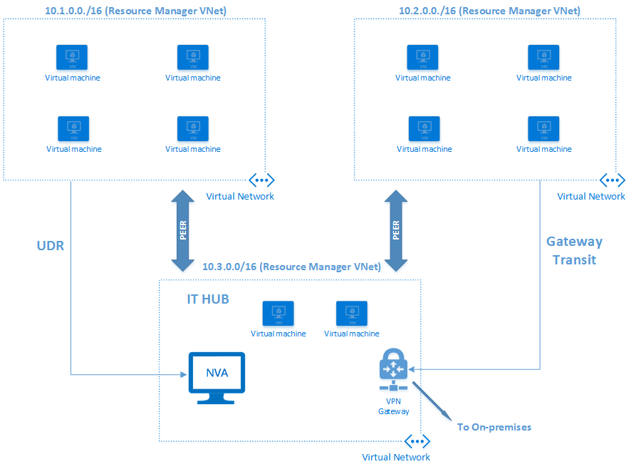

# 虚拟网络对等互连
使用虚拟网络对等互连可以通过 Azure 主干网络连接同一区域中的两个虚拟网络。 对等互连后，出于连接目的，两个虚拟网络会显示为一个。 这两个虚拟网络仍作为单独资源管理，但对等虚拟网络中的虚拟机可直接通过专用 IP 地址彼此通信。

对等虚拟网络中虚拟机之间的流量通过 Azure 基础结构路由，与同一虚拟网络中的虚拟机间的流量的路由方式一样。 使用虚拟网络对等互连的部分优点包括：

* 不同虚拟网络中资源之间的连接延迟低且带宽高。
* 能够将诸如网络设备和 VPN 网关等资源用作对等虚拟网络中的传输点。
* 能够将两个通过 Azure Resource Manager 部署模型创建的虚拟网络对等互连，或者将一个通过 Resource Manager 部署模型创建的虚拟网络对等互连到一个通过经典部署模型创建的虚拟网络。 请阅读[了解 Azure 部署模型](../azure-resource-manager/resource-manager-deployment-model.md?toc=%2fvirtual-network%2ftoc.json)一文，详细了解这两个 Azure 部署模型之间的差异。

虚拟网络对等互连的要求和关键方面：

* 对等虚拟网络必须位于同一 Azure 区域。 可以通过 [VPN 网关](../vpn-gateway/vpn-gateway-about-vpngateways.md?toc=%2fvirtual-network%2ftoc.json#V2V)连接不同 Azure 区域中的虚拟网络。
* 对等虚拟网络的 IP 地址空间不得重叠。
* 虚拟网络与另一虚拟网络对等后，则不能在其添加或删除地址空间。
* 虚拟网络对等互连在两个虚拟网络之间进行。 对等互连之间没有任何派生的可传递关系。 例如，如果 virtualNetworkA 与 virtualNetworkB 对等互连，而 virtualNetworkB 与 virtualNetworkC 对等互连，则 virtualNetwork A 不会对等互连到 virtualNetworkC。
* 可以将存在于两个不同订阅中的虚拟网络对等互连，只要这两个订阅的特权用户授权对等互连，并且订阅与同一个 Azure Active Directory 租户关联即可。 可以使用 [VPN 网关](../vpn-gateway/vpn-gateway-about-vpngateways.md?toc=%2fvirtual-network%2ftoc.json#V2V)连接关联到不同 Active Directory 租户的订阅中的虚拟网络。
* 如果两个虚拟网络都是通过 Resource Manager 部署模型创建的，或者其中一个是通过 Resource Manager 部署模型创建的，而另一个是通过经典部署模型创建的，则可以将这两个虚拟网络对等互连。 但是，两个都是通过经典部署模型创建的虚拟网络不能彼此对等互连。 将通过不同部署模型创建的虚拟网络对等互连时，两个虚拟网络必须存在于同一订阅中。 将通过不同部署模型创建且存在于不同订阅中的 VNet 对等互连的功能目前仍处于**预览**中。 如需更多详细信息，请参阅[创建虚拟网络对等互连](virtual-network-create-peering.md#different-subscriptions-different-deployment-models)一文。
* 虽然在对等虚拟网络中进行虚拟机之间的通信没有其他带宽限制，但有一个最大网络带宽，具体取决于虚拟机大小（仍适用）。 若要深入了解不同 虚拟机大小的最大网络带宽，请参阅有关 [Windows](../virtual-machines/windows/sizes.md?toc=%2fvirtual-network%2ftoc.json) 或 [Linux](../virtual-machines/linux/sizes.md?toc=%2fvirtual-network%2ftoc.json) 虚拟机大小的文章。

## 连接
两个虚拟网络对等互连后，虚拟网络中的虚拟机或云服务角色可直接与其他连接到对等虚拟网络的资源进行连接。 这两个虚拟网络具有完全 IP 级连接。

对等虚拟网络中两个虚拟机间的往返网络延迟与单个虚拟网络内的往返网络延迟相同。 网络吞吐量取决于可供虚拟机使用的与其大小成比例的带宽。 对等互连的带宽没有任何其他限制。

对等虚拟网络中虚拟机间的流量直接通过 Azure 后端基础结构路由，不通过网关。

连接到虚拟网络的虚拟机可访问对等虚拟网络中的内部负载均衡终结点。 可根据需要将网络安全组应用于虚拟网络（阻止访问其他虚拟网络）或子网。

配置虚拟网络对等互连时，可打开或关闭虚拟网络之间的网络安全组规则。 如果打开对等虚拟网络之间的完全连接（这是默认选项），则可将网络安全组应用到特定子网或虚拟机，以便阻止或拒绝特定访问。 若要深入了解网络安全组，请参阅[网络安全组概述](virtual-networks-nsg.md)一文。

Azure 为虚拟机提供的内部 DNS 名称解析在对等虚拟网络中无效。 虚拟机具有仅在本地虚拟网络内可解析的内部 DNS 名称。 但是，可将连接到对等虚拟网络的虚拟机配置为虚拟网络的 DNS 服务器。 有关更多详细信息，请参阅[使用自己的 DNS 服务器进行名称解析](virtual-networks-name-resolution-for-vms-and-role-instances.md#name-resolution-using-your-own-dns-server)一文。

## 服务链
可以将指向对等虚拟网络中虚拟机的用户定义的路由表配置为“下一跃点”IP 地址，以便启用服务链。 使用服务链，可以通过用户定义的路由将流量从一个虚拟网络定向到对等虚拟网络中的虚拟设备。

还可以有效构建中心辐射型环境，中心可在其中托管基础结构组件，如网络虚拟设备。 然后，可将所有分支虚拟网络对等互连到中心虚拟网络。 流量可以流经在中心虚拟网络中运行的网络虚拟设备。 简言之，通过虚拟网络对等互连，用户定义的路由中的下一跃点 IP 地址可以成为对等虚拟网络中虚拟机的 IP 地址。 若要深入了解用户定义的路由，请参阅[用户定义的路由概述](virtual-networks-udr-overview.md)一文。

## 网关和本地连接
无论是否与另一个虚拟网络建立对等互连，每个虚拟网络仍可具有自己的网关，并使用它连接到本地网络。 即使已将虚拟网络对等互连，也可以使用网关配置[虚拟网络到虚拟网络的连接](../vpn-gateway/vpn-gateway-vnet-vnet-rm-ps.md?toc=%2fvirtual-network%2ftoc.json)。

若已配置虚拟网络互连的两个选项，则虚拟网络之间的流量将通过对等配置（即通过 Azure 主干）流通。

将虚拟网络对等互连后，还可以将对等虚拟网络中的网关配置为本地网络的传输点。 在这种情况下，使用远程网关的虚拟网络没有自己的网关。 一个虚拟网络只能有一个网关。 网关可以是本地网关或远程网关（对等虚拟网络中），如下图所示：

通过不同部署模型创建的虚拟网络之间的对等互连关系不支持网关传输。 若要使用网关传输，对等互连关系中的两个虚拟网络都必须通过 Resource Manager 创建。

正在共享单个 Azure ExpressRoute 连接的虚拟网络对等时，它们之间的流量会通过对等关系（即通过 Azure 主干网）流通。 仍可在各个虚拟网络中使用本地网关连接到本地线路。 或者，也可以使用共享网关，并为本地连接配置传输。

## 设置
虚拟网络对等互连是一项特权操作。 它是 VirtualNetworks 命名空间下的独立功能。 可授予用户特定权限来授权对等互连。 具有虚拟网络读写访问权限的用户自动继承这些权限。

管理员或具有对等互连能力的特权用户可在另一个虚拟网络上启动对等互连操作。 如果另一端存在对等互连的匹配请求且也满足其他要求，则会建立对等互连。

## 限制
允许单个虚拟网络建立的对等互连数存在限制。 有关详细信息，请参阅 [Azure 网络限制](../azure-subscription-service-limits.md#networking-limits)。

## 定价
利用虚拟网络对等互连的入口和出口流量会产生少许收费。 有关详细信息，请参阅[定价页](https://www.azure.cn/pricing/details/networking/)。

## 后续步骤

* 完成[虚拟网络对等互连教程](virtual-network-create-peering.md)
* 了解所有[虚拟网络对等互连设置以及如何对其进行更改](virtual-network-manage-peering.md)。

<!--Update_Description: wording update-->