# 使用 Azure 门户创建虚拟网络对等互连
[!INCLUDE [virtual-networks-create-vnet-selectors-arm-include](../../includes/virtual-networks-create-vnetpeering-selectors-arm-include.md)]

[!INCLUDE [virtual-networks-create-vnet-intro](../../includes/virtual-networks-create-vnetpeering-intro-include.md)]

[!INCLUDE [virtual-networks-create-vnet-scenario-basic-include](../../includes/virtual-networks-create-vnetpeering-scenario-basic-include.md)]

若要通过 Azure 门户基于方案创建 VNet 对等互连，请完成以下步骤：

1. 从浏览器导航到 http://portal.azure.cn，并在必要时用 Azure 帐户登录。
2. 若要建立 VNet 对等互连，需要在两个 VNet 之间创建两个链接，每个方向各一个。 可先创建 VNet1 到 VNet2 的 VNet 对等互连链接。 在 Azure 门户中，单击“浏览” >  选择“虚拟网络”

    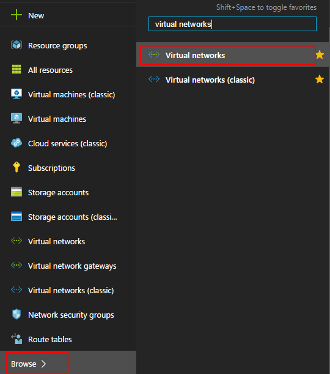
3. 在“虚拟网络”边栏选项卡中，选择“VNET1”，再依次单击“对等互连”和“添加”，如下图所示：

    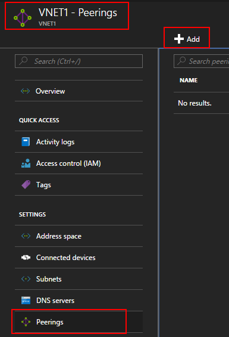
4. 在“添加对等互连”边栏选项卡中，在“名称”中输入 *LinkToVnet2*，选择订阅和对等**虚拟网络** *VNET2*，然后单击“确定”。

    
5. 创建 VNet 对等互连链接后，可看到链接状态，如下图中所示：

    
6. 创建 VNET2 到 VNET1 的 VNet 对等互连链接。 在“虚拟网络”边栏选项卡中，选择“VNET2”，再依次单击“对等互连”和“添加”，如下图所示：

    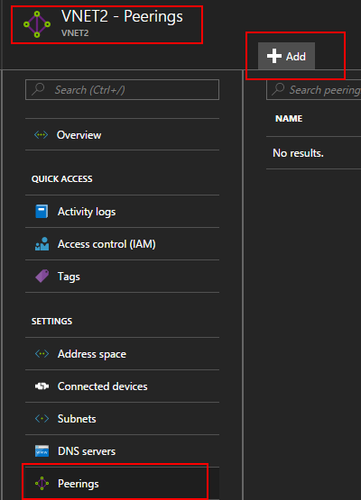
7. 在“添加对等互连”边栏选项卡中，在“名称”中输入 *LinkToVnet1*，选择订阅，为“虚拟网络”选择 *VNET1*，然后单击“确定”。

    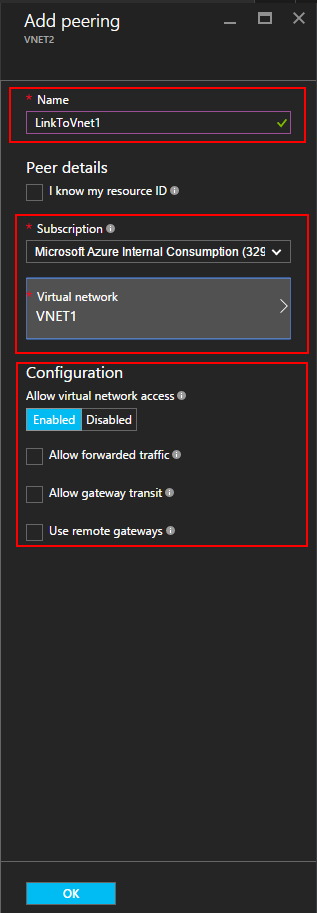
8. 创建 VNet 对等互连链接后，可看到链接状态，如下图中所示：

    
9. 检查 **LinkToVnet2** 的状态，该状态现也变为“已连接”。  

    

    > [!NOTE]
    > 仅当两个链接已连接在一起时，才会建立 VNET 对等互连。
    > 
    > 

每个链接有几个可配置属性：

| 选项 | 说明 | 默认 |
|:--- |:--- |:--- |
| 允许虚拟网络访问 |是否将对等 VNet 的地址空间包括为 Virtual_network 标记的一部分 |是 |
| 允许转发的流量 |是接受还是丢弃不是源自对等 VNet 的流量 |否 |
| 允许网关传输 |允许对等 VNet 使用你的 VNet 网关 |否 |
| 使用远程网关 |使用对等方的 VNet 网关。 对等 VNet 必须已配置网关并且已选择 AllowGatewayTransit。 如果你已配置了网关，则无法使用此选项。 |否 |

VNet 对等互连中的每个链接都有上述属性集。 从门户中，可以单击“VNet 对等互连”链接并更改任何可用的选项，单击“保存”以应用更改。

[!INCLUDE [virtual-networks-create-vnet-scenario-crosssub-include](../../includes/virtual-networks-create-vnetpeering-scenario-crosssub-include.md)]

1. 从浏览器导航到 http://portal.azure.cn，并在必要时用 Azure 帐户登录。
2. 在此示例中，用户 A 具有订阅 A 的管理权限，用户 B 具有订阅 B 的管理权限。 两个订阅均与同一 Azure Active Directory 租户关联。 无法在与不同 Azure Active Directory 租户关联的订阅之间创建对等互连。
3. 在门户中，单击“浏览”，然后选择“虚拟网络”。 单击要设置对等互连的 VNet。
4. 在所选 VNet 的边栏选项卡中，依次单击“访问控制”、“添加”，如下图所示：

    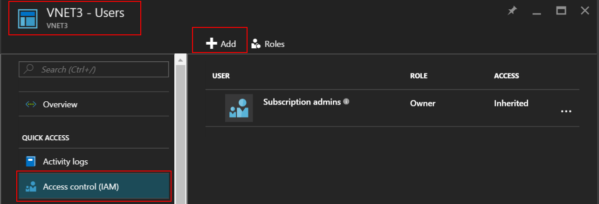
4. 在“添加访问权限”边栏选项卡上，单击一个角色并选择“网络参与者”，单击“添加用户”，键入用户 B 的登录名，然后单击“确定”。

    

5. 以用户 B 身份登录到 Azure 门户，该用户是订阅 B 的特权用户。 遵循上述步骤将用户 A 添加到“网络参与者”角色，如下图中所示：

    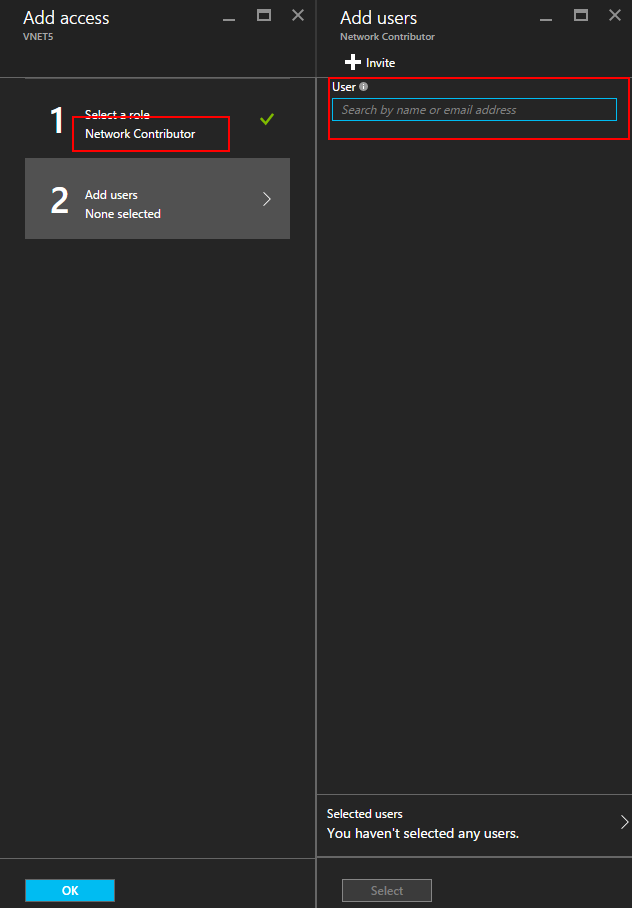

    > [!NOTE]
    > 可以在浏览器中同时注销和登录两个用户会话，确保成功启用授权。
    >
    >

    > [!IMPORTANT]
    > 如果要在通过 Azure Resource Manager 部署模型创建的两个 VNet 之间创建对等互连，请继续执行本部分中的余下步骤。 如果两个 VNet 是通过不同部署模型创建的，请跳过本部分的余下步骤并完成本文的 [将通过不同部署模型创建的虚拟网络对等互连](#x-model) 部分中所述的步骤。

6. 以用户 A 身份登录到门户、导航到 VNET3 边栏选项卡、单击“对等互连”、选中“我知道我的资源 ID”复选框，然后采用下例中的格式键入 VNET5 的资源 ID：

    /subscriptions/{SubscriptionID}/resourceGroups/{ResourceGroupName}/providers/Microsoft.Network/virtualNetworks/{VNETname}

    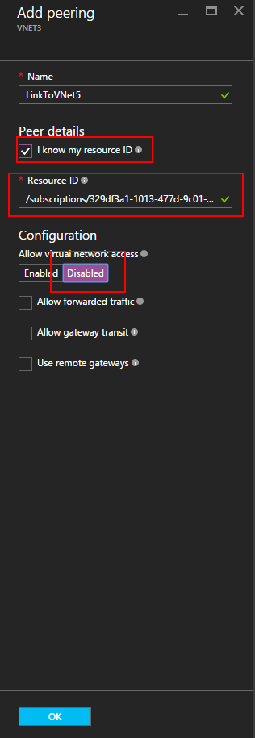
7. 以用户 B 的身份登录到门户，然后遵循前面的步骤创建从 VNET5 到 VNet3 的对等互连链接。

    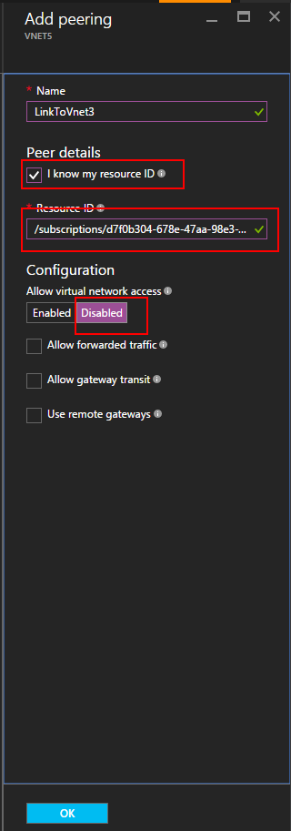
8. 将建立对等互连。 连接到 VNet3 的任何 VM 都应该能与连接到 VNet5 的任何 VM 通信。

[!INCLUDE [virtual-networks-create-vnet-scenario-transit-include](../../includes/virtual-networks-create-vnetpeering-scenario-transit-include.md)]

1. 第一步，建立从 HubVnet 到 VNET1 的 VNET 对等互连链接。 请注意，没有为该链接选择“允许转发的流量”选项。

    
2. 第二步，可以创建从 VNET1 到 HubVnet 的对等互连链接。 请注意，要选择“允许转发的流量”选项。

    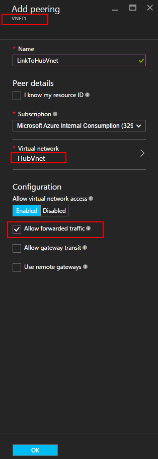
3. 对等互连建立后，可以参考此[文章](virtual-network-create-udr-arm-ps.md)，定义用户定义的路由 (UDR)，以便通过虚拟设备重定向 VNet1 流量以使用其功能。 在路由中指定下一个跃点地址时，可以在对等 VNet HubVNet 中将其设置为虚拟装置的 IP 地址。

[!INCLUDE [virtual-networks-create-vnet-scenario-asmtoarm-include](../../includes/virtual-networks-create-vnetpeering-scenario-asmtoarm-include.md)]

1. 从浏览器导航到 http://portal.azure.cn，并在必要时用 Azure 帐户登录。
2. 如果要在 *同一* 订阅中通过不同部署模型部署的 VNet 之间创建对等互连，请跳到步骤 3。 在 *预览版* 中，可在 **不同** 订阅中创建通过不同部署模型部署的 VNet 之间的对等互连。 预览版功能不提供与正式版功能相同级别的可靠性和服务级别协议。 如果要在不同订阅中通过不同部署模型部署的 VNet 之间创建对等互连，必须先完成以下任务：
    - 通过从 PowerShell 输入以下命令在 Azure 订阅中注册预览版功能：`Register-AzureRmProviderFeature -FeatureName AllowClassicCrossSubscriptionPeering -ProviderNamespace Microsoft.Network` 和 `Register-AzureRmResourceProvider -ProviderNamespace Microsoft.Network`此步骤无法在门户中完成。
    - 完成本文的 [跨订阅对等互连](#x-sub) 部分中的步骤 1-6。
3. 若要在此方案中建立 VNET 对等互连，只需创建一个链接，从 Azure Resource Manager 中的虚拟网络连接到经典部署模型中的另一个虚拟网络。 即，从 **VNET1** 到 **VNET2**。 在门户中，单击“浏览”>，然后选择“虚拟网络”
4. 在“虚拟网络”边栏选项卡中，选择“VNET1”。 单击“对等互连”，然后单击“添加”。
5. 在“添加对等互连”边栏选项卡中，为链接命名。 这里将它命名为 **LinkToVNet2**。 在“对等详细信息”下，选择“经典”。
6. 选择订阅和对等虚拟网络 **VNET2**。 然后，单击“确定”。

    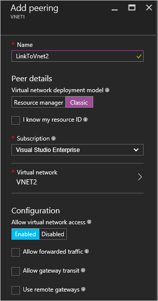
7. 创建此 VNet 对等链接后，两个虚拟网络将对等互连，随后会显示以下信息：

    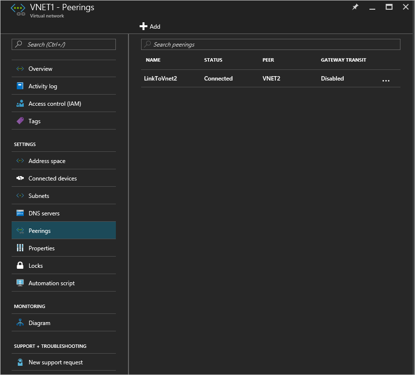

## 删除 VNet 对等互连
1. 从浏览器导航到 http://portal.azure.cn，并在必要时用 Azure 帐户登录。
2. 转到“虚拟网络”边栏选项卡，依次单击“对等互连”、要删除的链路、“删除”。

    
3. 删除 VNET 对等互连中的一个链路后，该对等链路状态将为“断开”。

    
4. 在此状态下，在对等链路状态更改为已启动之前无法重新创建链路。 建议先删除这两个链路，然后再重新创建 VNet 对等互连。