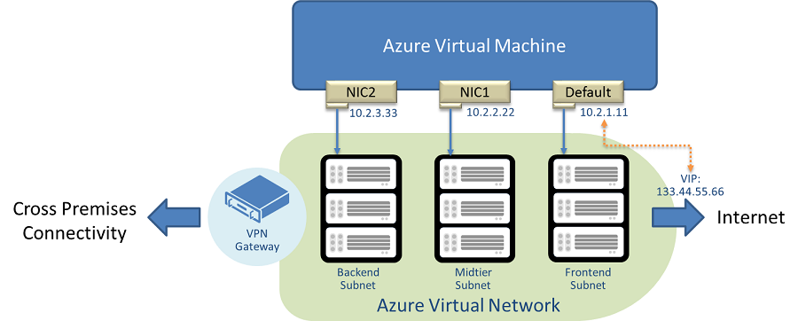

# <a name="create-a-vm-classic-with-multiple-nics"></a>创建具有多个 NIC 的 VM（经典）
你可以在 Azure 中创建虚拟机 (VM)，然后将多个网络接口 (NIC) 附加到每个 VM。 多个 NIC 是许多网络虚拟设备（例如应用程序传送和 WAN 优化解决方案）所必需的。 多个 NIC 还提供 NIC 之间的流量隔离。



该图显示了带三个 NIC 的 VM，每个 NIC 都连接到不同的子网。

> [!IMPORTANT]
> Azure 具有用于创建和处理资源的两个不同的部署模型：[Resource Manager 和经典](../resource-manager-deployment-model.md)。 本文介绍使用经典部署模型的情况。 Azure 建议大多数新部署使用 Resource Manager。

* 仅在“默认”NIC 上支持面向 Internet 的 VIP（经典部署）。 默认 NIC 的 IP 只有一个对应的 VIP。
* 多 NIC VM 目前不支持实例级公共 IP (LPIP) 地址（经典部署）。
* VM 内部 NIC 的顺序将是随机的，在 Azure 基础结构更新过程中也可能会更改。 不过，IP 地址和相应的以太网 MAC 地址将会保持不变。 例如，假定 **Eth1** 的 IP 地址为 10.1.0.100，MAC 地址为 00-0D-3A-B0-39-0D；在进行 Azure 基础结构更新并重新启动后，它可能会更改为 **Eth2**，但 IP 和 MAC 配对将保持不变。 如果是客户执行的重新启动，NIC 顺序将保持不变。
* 每个 VM 上的每个 NIC 的地址必须位于一个子网中，你可以向单个 VM 上的多个 NIC 分配同一子网中的地址。
* VM 大小决定了可以为 VM 创建的 NIC 的数目。 参考 [Windows Server](../virtual-machines/windows/sizes.md?toc=%2fvirtual-machines%2fwindows%2ftoc.json) 和 [Linux](../virtual-machines/linux/sizes.md?toc=%2fvirtual-machines%2flinux%2ftoc.json) VM 大小一文，以确定每个 VM 大小支持的 NIC 数。 

## <a name="network-security-groups-nsgs"></a>网络安全组 (NSG)
在 Resource Manager 部署中，VM 上的任何 NIC（包括启用了多 NIC 的 VM 上的任何 NIC）都可以与网络安全组 (NSG) 相关联。 如果向 NIC 分配了子网中的地址，且该子网与某个 NSG 相关联，则子网的 NSG 中的规则也适用于该 NIC。 除了将子网与 NSG 相关联，你还可以将 NIC 与 NSG 相关联。

如果子网与 NSG 相关联，且该子网中的 NIC 与 NSG 单独关联，则关联的 NSG 规则将按 **流顺序** （根据传入或传出 NIC 的流量的方向）进行应用：

* **传入流量** ：其目标为本文所讨论的 NIC，首先流经子网时，会触发子网的 NSG 规则，然后在传入到 NIC 中之前，会触发 NIC 的 NSG 规则。
* **传出流量** ：其源为本文所讨论的 NIC，首先从 NIC 中流出时，会触发 NIC 的 NSG 规则，然后在通过子网之前，会触发子网的 NSG 规则。

详细了解[网络安全组](virtual-networks-nsg.md)以及如何基于与子网、VM 和 NIC 的关联应用它们。

## <a name="how-to-configure-a-multi-nic-vm-in-a-classic-deployment"></a>如何在经典部署中配置多 NIC VM
下面的说明将指导你创建包含 3 个 NIC（1 个默认 NIC，2 个其他 NIC）的多 NIC VM。 这些配置步骤将会创建一个 VM，该 VM 将根据下面的服务配置文件片段进行配置：

    <VirtualNetworkSite name="MultiNIC-VNet" Location="China North">
    <AddressSpace>
      <AddressPrefix>10.1.0.0/16</AddressPrefix>
        </AddressSpace>
        <Subnets>
          <Subnet name="Frontend">
            <AddressPrefix>10.1.0.0/24</AddressPrefix>
          </Subnet>
          <Subnet name="Midtier">
            <AddressPrefix>10.1.1.0/24</AddressPrefix>
          </Subnet>
          <Subnet name="Backend">
            <AddressPrefix>10.1.2.0/23</AddressPrefix>
          </Subnet>
          <Subnet name="GatewaySubnet">
            <AddressPrefix>10.1.200.0/28</AddressPrefix>
          </Subnet>
        </Subnets>
    … Skip over the remainder section …
    </VirtualNetworkSite>

在尝试运行示例中的 PowerShell 命令之前，你需要满足以下先决条件。

* Azure 订阅。
* 已配置虚拟网络。 有关 VNet 的详细信息，请参阅[虚拟网络概述](virtual-networks-overview.md)。
* 已下载和安装最新版本的 Azure PowerShell。 请参阅[如何安装和配置 Azure PowerShell](https://docs.microsoft.com/powershell/azure/overview)。

若要创建具有多个 NIC 的 VM，请通过在单个 PowerShell 会话中输入每个命令来完成以下步骤：

1. 从 Azure VM 映像库中选择 VM 映像。 请注意，映像会经常更改，并按区域提供。 以下示例中指定的映像可能会更改，也可能不在你的区域提供，因此务必指定所需的映像。

    ```powershell
    $image = Get-AzureVMImage `
    -ImageName "a699494373c04fc0bc8f2bb1389d6106__Windows-Server-2012-R2-201410.01-en.us-127GB.vhd"
    ```

2. 创建 VM 配置。

    ```powershell
    $vm = New-AzureVMConfig -Name "MultiNicVM" -InstanceSize "ExtraLarge" `
    -Image $image.ImageName -AvailabilitySetName "MyAVSet"
    ```

3. 创建默认的管理员登录名。

    ```powershell
    Add-AzureProvisioningConfig -VM $vm -Windows -AdminUserName "<YourAdminUID>" `
    -Password "<YourAdminPassword>"
    ```

4. 将其他 NIC 添加到 VM 配置。

    ```powershell
    Add-AzureNetworkInterfaceConfig -Name "Ethernet1" `
    -SubnetName "Midtier" -StaticVNetIPAddress "10.1.1.111" -VM $vm
    Add-AzureNetworkInterfaceConfig -Name "Ethernet2" `
    -SubnetName "Backend" -StaticVNetIPAddress "10.1.2.222" -VM $vm
    ```

5. 指定默认 NIC 的子网和 IP 地址。

    ```powershell
    Set-AzureSubnet -SubnetNames "Frontend" -VM $vm
    Set-AzureStaticVNetIP -IPAddress "10.1.0.100" -VM $vm
    ```

6. 在虚拟网络中创建 VM。

    ```powershell
    New-AzureVM -ServiceName "MultiNIC-CS" -VNetName "MultiNIC-VNet" -VMs $vm
    ```

    > [!NOTE]
    > 此处指定的 VNet 必须已存在（如先决条件中所述）。 下述示例指定名为“MultiNIC-VNet”的虚拟网络 。
    >

## <a name="limitations"></a>限制
使用多个 NIC 时，以下限制适用：

* 必须在 Azure 虚拟网络 (VNet) 中创建具有多个 NIC 的 VM。 非 VNet VM 不能配置多个 NIC。
* 可用性集中的所有 VM 都需要使用多个 NIC 或单个 NIC。 可用性集中不能混合使用多个 NIC VM和单个 NIC VM。 相同的规则适用于云服务中的 VM。 对于多个 NIC 的 VM，它们不需要具有相同数量的 NIC，只要它们各自具有至少两个 NIC 即可。
* 配置后，只要不删除或重新创建，具有单个 NIC 的 VM 不能使用多个 NIC 配置（反之亦然）。

## <a name="secondary-nics-access-to-other-subnets"></a>辅助 NIC 对其他子网的访问
默认情况下，辅助 NIC 不会配置默认网关，因为辅助 NIC 上的通信流将限制在同一子网内。 如果用户要启用辅助 NIC，以在其自己的子网之外进行对话，则需要在路由表中添加一个条目来配置网关，如下所述。

> [!NOTE]
> 2015 年 7 月之前创建的 VM 可能会为所有 NIC 配置默认网关。 重新启动这些 VM 之前，不会删除辅助 NIC 的默认网关。 使用弱主机路由模型的操作系统（如 Linux）中，如果流入和出口流量使用不同 NIC，Internet 连接可能会中断。
> 

### <a name="configure-windows-vms"></a>配置 Windows VM
假设有一个包含两个 NIC 的 Windows VM，如下所示：

* 主 NIC IP 地址：192.168.1.4
* 辅助 NIC IP 地址：192.168.2.5

此 VM 的 IPv4 路由表将如下所示：

    IPv4 Route Table
    ===========================================================================
    Active Routes:
    Network Destination        Netmask          Gateway       Interface  Metric
              0.0.0.0          0.0.0.0      192.168.1.1      192.168.1.4      5
            127.0.0.0        255.0.0.0         On-link         127.0.0.1    306
            127.0.0.1  255.255.255.255         On-link         127.0.0.1    306
      127.255.255.255  255.255.255.255         On-link         127.0.0.1    306
        168.63.129.16  255.255.255.255      192.168.1.1      192.168.1.4      6
          192.168.1.0    255.255.255.0         On-link       192.168.1.4    261
          192.168.1.4  255.255.255.255         On-link       192.168.1.4    261
        192.168.1.255  255.255.255.255         On-link       192.168.1.4    261
          192.168.2.0    255.255.255.0         On-link       192.168.2.5    261
          192.168.2.5  255.255.255.255         On-link       192.168.2.5    261
        192.168.2.255  255.255.255.255         On-link       192.168.2.5    261
            224.0.0.0        240.0.0.0         On-link         127.0.0.1    306
            224.0.0.0        240.0.0.0         On-link       192.168.1.4    261
            224.0.0.0        240.0.0.0         On-link       192.168.2.5    261
      255.255.255.255  255.255.255.255         On-link         127.0.0.1    306
      255.255.255.255  255.255.255.255         On-link       192.168.1.4    261
      255.255.255.255  255.255.255.255         On-link       192.168.2.5    261
    ===========================================================================

请注意，默认路由 (0.0.0.0) 仅适用于主 NIC。 你将无法访问辅助 NIC 的子网外的资源，如下所示：

    C:\Users\Administrator>ping 192.168.1.7 -S 192.165.2.5

    Pinging 192.168.1.7 from 192.165.2.5 with 32 bytes of data:
    PING: transmit failed. General failure.
    PING: transmit failed. General failure.
    PING: transmit failed. General failure.
    PING: transmit failed. General failure.

若要在辅助 NIC 上添加默认路由，请执行以下步骤：

1. 在命令提示符下运行以下命令来标识辅助 NIC 的索引号：

        C:\Users\Administrator>route print
        ===========================================================================
        Interface List
         29...00 15 17 d9 b1 6d ......Microsoft Virtual Machine Bus Network Adapter #16
         27...00 15 17 d9 b1 41 ......Microsoft Virtual Machine Bus Network Adapter #14
          1...........................Software Loopback Interface 1
         14...00 00 00 00 00 00 00 e0 Teredo Tunneling Pseudo-Interface
         20...00 00 00 00 00 00 00 e0 Microsoft ISATAP Adapter #2
        ===========================================================================
2. 请注意，表中的第二个条目具有索引 27（在此示例中）。
3. 在命令提示符下运行 **route add** 命令，如下所示。 在此示例中，你将指定 192.168.2.1 作为辅助 NIC 的默认网关：

        route ADD -p 0.0.0.0 MASK 0.0.0.0 192.168.2.1 METRIC 5000 IF 27
4. 若要测试连接，请返回到命令提示符并尝试 ping 与辅助 NIC 不同的子网，如以下示例所示：

        C:\Users\Administrator>ping 192.168.1.7 -S 192.165.2.5

        Reply from 192.168.1.7: bytes=32 time<1ms TTL=128
        Reply from 192.168.1.7: bytes=32 time<1ms TTL=128
        Reply from 192.168.1.7: bytes=32 time=2ms TTL=128
        Reply from 192.168.1.7: bytes=32 time<1ms TTL=128
5. 你还可以查看路由表以检查新添加的路由，如下所示：

        C:\Users\Administrator>route print

        ...

        IPv4 Route Table
        ===========================================================================
        Active Routes:
        Network Destination        Netmask          Gateway       Interface  Metric
                  0.0.0.0          0.0.0.0      192.168.1.1      192.168.1.4      5
                  0.0.0.0          0.0.0.0      192.168.2.1      192.168.2.5   5005
                127.0.0.0        255.0.0.0         On-link         127.0.0.1    306

### <a name="configure-linux-vms"></a>配置 Linux VM
对于 Linux VM，由于默认行为使用弱主机路由，因此，建议将辅助 NIC 限制为仅同一子网内的通信流。 但是，在某些情况下，如果需要子网外的连接，用户应启用基于策略的路由，以确保流入和出口流量使用同一 NIC。

## <a name="next-steps"></a>后续步骤
* [在 Resource Manager 部署的 2 层应用程序方案中部署多 NIC VM](virtual-network-deploy-multinic-arm-template.md)。
* [在经典部署的 2 层应用程序方案中部署多 NIC VM](virtual-network-deploy-multinic-classic-ps.md)。
