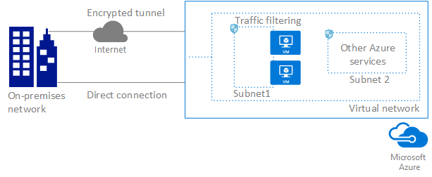

# Azure 虚拟网络

通过 Azure 虚拟网络服务可安全地将 Azure 资源连接到具有虚拟网络 (VNet) 的各个资源。 VNet 是你自己的网络在云中的表示形式。 VNet 是对专用于你的订阅的 Azure 云进行的逻辑隔离。 也可将 VNet 连接到本地网络。 下图显示了 Azure 虚拟网络服务的部分功能：

若要了解有关以下 Azure 虚拟网络功能的详细信息，请单击功能：
- **[隔离：](#isolation)**VNet 之间彼此隔离。 你可以为使用相同 CIDR 地址块的开发、测试和生产创建单独的 VNet。 相反地，你也可以创建使用不同 CIDR 地址的多个 VNet 并将网络连接在一起。 可将一个 VNet 分为多个子网。 Azure 为连接到 VNet 的 VM 和云服务角色实例提供内部名称解析。 可选择配置 VNet 来使用自己的 DNS 服务器，而不使用 Azure 内部名称解析。
- **[Internet 连接：](#internet)**默认情况下，所有 Azure 虚拟机 (VM) 和连接到 VNet 的云服务角色实例都具有 Internet 访问权限。 根据需要，还可对特定资源启用入站访问。
- **[Azure 资源连接：](#within-vnet)**云服务和 VM 等 Azure 资源可连接到同一 VNet。 即使资源在不同的子网中，也可使用专用 IP 地址连接彼此。 Azure 提供子网、VNet 和本地网络之间的默认路由，因此无需配置和管理路由。
- **[VNet 连接性：](#connect-vnets)**VNet 可相互之间进行连接，从而使连接到任何 VNet 的资源与任何其他 VNet 上的所有资源进行通信。
- **[本地连接性：](#connect-on-premises)**可通过网络和 Azure 间的专用网络连接或基于 Internet 的站点到站点 VPN 连接将 VNet 连接到本地网络。
- **[流量筛选：](#filtering)**按源 IP 地址和端口、目标 IP 地址和端口以及协议对 VM 和云服务角色实例网络流量进行入站和出站筛选。
- **[路由：](#routing)**可选择通过配置自己的路由或通过网关使用 BGP 路由来替代 Azure 默认路由。

## 网络隔离和细分

可在每个 Azure [订阅](../azure-glossary-cloud-terminology.md?toc=%2fvirtual-network%2ftoc.json#subscription)和 Azure 区域中实现多个 VNet。 每个 VNet 与其他 VNet 隔离。 对于每个 VNet，可执行以下操作：
- 使用公共和专用 (RFC 1918) 地址指定自定义专用 IP 地址空间。 Azure 从分配的地址空间中向连接到 VNet 的资源分配一个专用 IP 地址。
- 将 VNet 细分为一个或多个子网，并向每个子网分配一部分 VNet 地址空间。
- 使用 Azure 提供的名称解析或指定你自己的 DNS 服务器以供连接到 VNet 的资源使用。 若要了解 VNet 中名称解析的详细信息，请阅读 [VM 和云服务的名称解析](virtual-networks-name-resolution-for-vms-and-role-instances.md)一文。

## 连接到 Internet
默认情况下，连接到 VNet 的所有资源都具有 Internet 出站连接。 资源的专用 IP 地址是由 Azure 基础结构转换到公共 IP 地址中的源网络地址 (SNAT)。 若要了解出站网络连接的详细信息，请阅读[了解 Azure 中的出站连接](..\load-balancer\load-balancer-outbound-connections.md?toc=%2fvirtual-network%2ftoc.json#standalone-vm-with-no-instance-level-public-ip-address)一文。 可通过实现自定义路由和流量筛选更改默认连接。

若要从 Internet 入站通信到 Azure 资源或出站通信到不具 SNAT 的 Internet，则必须向资源分配一个公共 IP 地址。 若要详细了解公共 IP 地址，请阅读 [公共 IP 地址](virtual-network-public-ip-address.md)一文。

## 连接 Azure 资源
可将多个 Azure 资源连接到 VNet，例如虚拟机 (VM)、云服务、应用服务环境和虚拟机规模集。 VM 通过网络接口 (NIC) 连接到 VNet 中的子网。 若要了解有关 NIC 的详细信息，请阅读[网络接口](virtual-network-network-interface.md)一文。

## 连接虚拟网络

VNet 之间可相互连接，因此，连接到任意一个 VNet 的资源都可与 VNet 之间的每个资源进行通信。 可使用以下两个中任意一个选项或使用这两个选项相互连接 VNet：
- **对等互连：**使连接到相同 Azure 位置中不同 Azure VNet 的资源可相互进行通信。 如果资源连接到同一 VNet，则 VNet 之间的带宽和延迟相同。 若要了解对等互连的详细信息，请阅读[虚拟网络对等互连](virtual-network-peering-overview.md)一文。
- **VNet 到 VNet连接：**可使资源连接到相同或不同 Azure 位置中的不同 Azure VNet。 与对等互连不同，VNet 之间的带宽有一定限制，因为流量必须流经 Azure VPN 网关。 若要深入了解通过 VNet 到 VNet 连接进行 VNet 连接，请阅读[配置 VNet 到 VNet 连接](../vpn-gateway/vpn-gateway-howto-vnet-vnet-resource-manager-portal.md?toc=%2fvirtual-network%2ftoc.json)一文。

## 连接到本地网络

可组合使用以下任何选项将本地网络连接到 VNet：
- **点到站点虚拟网络 (VPN)：**在连接到网络的单台电脑和 VNet 之间建立连接。 这种连接类型适用于刚开始使用 Azure 的人员或开发人员，因为该连接类型仅需对现有网络作出极少更改或不做任何更改。 此连接使用 SSTP 协议在电脑和 VNet 之间通过 Internet 提供加密通信。 由于流量遍历 Internet，因此点到站点 VPN 的延迟不可预测且经过加密。
- **站点到站点 VPN：**在 VPN 设备和 Azure VPN 网关之间建立连接。 此连接类型可使授权的任何本地资源访问 VNet。 此连接是一个 IPSec/IKE VPN，该 VPN 通过 Internet 在本地设备和 Azure VPN 网关之间提供加密通信。 由于流量遍历 Internet，因此站点到站点连接的延迟不可预测。
- **Azure ExpressRoute：**通过 ExpressRoute 合作伙伴在网络和 Azure 之间建立连接。 此连接是专用连接。 流量不会遍历 Internet。 由于流量未遍历 Internet 且未加密，因此 ExpressRoute 连接的延迟不可预测。

若要了解有关所有以前连接选项的详细信息，请阅读[连接拓扑图](../vpn-gateway/vpn-gateway-about-vpngateways.md?toc=%2fvirtual-network%2ftoc.json#a-namediagramsaconnection-topology-diagrams)一文。

## 筛选网络流量
可使用以下两个选项中任意一个或同时使用这两个方案筛选子网之间的网络流量：
- **网络安全组 (NSG)：**每个 NSG 可包含多个入站和出站安全规则，通过这些规则可按源和目标 IP 地址、端口和协议筛选流量。 可将 NSG 应用到一个 VM 中的每个 NIC。 也可将 NSG 应用到 NIC 或其他 Azure 资源所连接的子网。 有关 NSG 的详细信息，请参阅[网络安全组](virtual-networks-nsg.md)一文。
- **网络虚拟设备 (NVA)：**NVA 是运行软件的 VM，软件可执行网络功能，例如防火墙。 查看 [Azure 应用商店](https://azuremarketplace.microsoft.com/marketplace/apps/category/networking?page=1&subcategories=appliances)中可用 NVA 列表。 NVA 也可用于提供 WAN 优化和其他网络流量功能。 NVA 通常与用户定义路由或 BGP 路由配合使用。 还可使用 NVA 筛选 VNet 之间的流量。

## 路由网络流量

默认情况下，Azure 会创建路由表，这些路由表可使连接到 VNet 中任何子网的资源相互进行通信。 可使用以下两个选项中任意一个或同时使用二者替代 Azure 创建的默认路由：
- **用户定义路由：**可创建自定义路由表，其中包含可对每个子网控制流量路由位置的路由。 若要详细了解用户定义的路由，请阅读[用户定义的路由](virtual-networks-udr-overview.md)一文。
- **BGP 路由：**如果使用 Azure VPN 网关或 ExpressRoute 连接将 VNet 连接到本地网络，则可将 BGP 路由传播到 VNet。

## 定价

虚拟网络、子网、路由表或网络安全组无收费。 出站 Internet 带宽使用、公共 IP 地址、虚拟网络对等互连、VPN 网关和 ExpressRoute 各有其定价结构。 相关详细信息，请查看[虚拟网络](https://www.azure.cn/pricing/details/networking/)、[VPN 网关](https://www.azure.cn/pricing/details/vpn-gateway/)和 [ExpressRoute](https://www.azure.cn/pricing/details/expressroute/) 定价页面。

## 后续步骤

- 完成[创建首个虚拟网络](virtual-network-get-started-vnet-subnet.md)一文中的步骤，创建自己的首个虚拟网络，并将几个 VM 连接到此网络。
- 完成[配置点到站点连接](../vpn-gateway/vpn-gateway-howto-point-to-site-resource-manager-portal.md?toc=%2fvirtual-network%2ftoc.json)一文中的步骤，为 VNet 创建一个点到站点连接。

