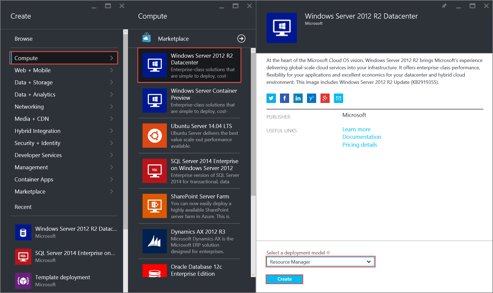
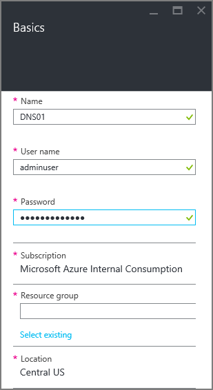
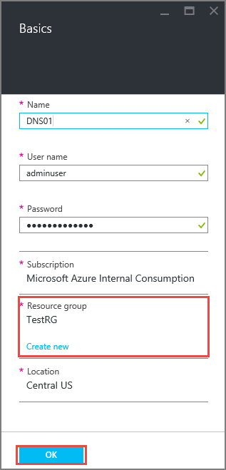
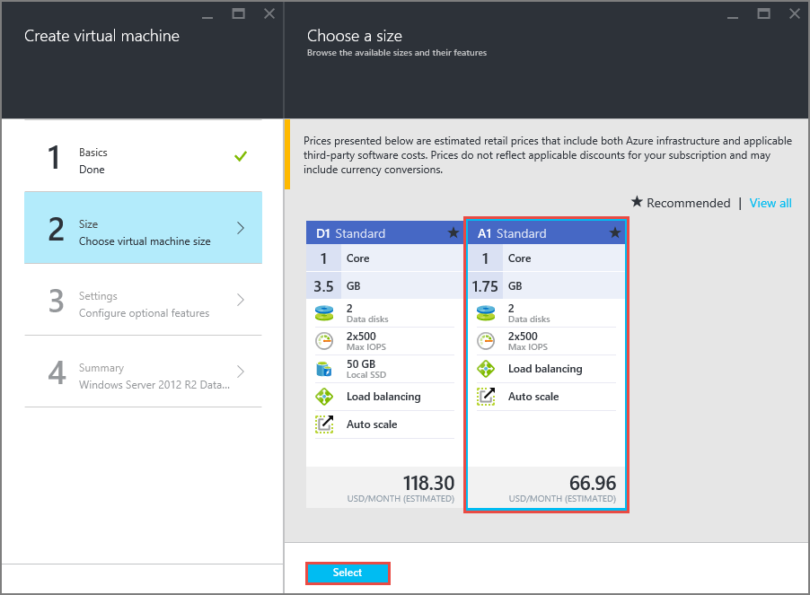
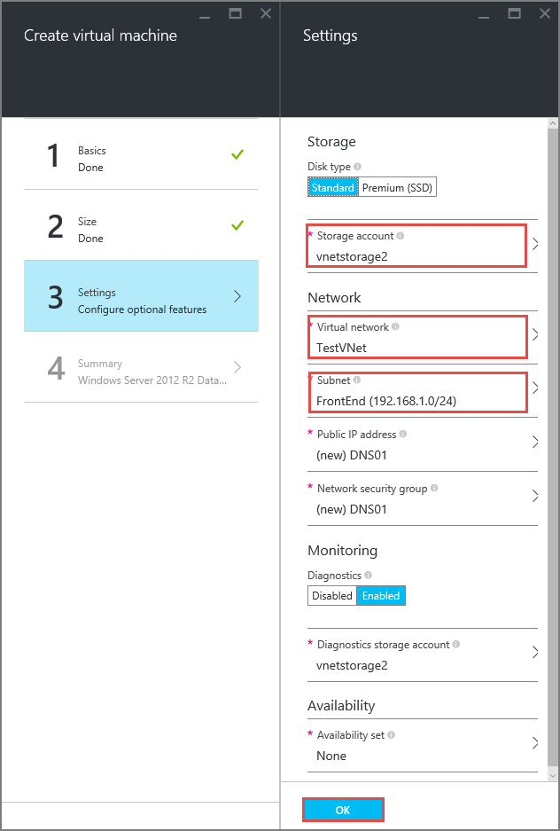
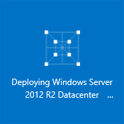
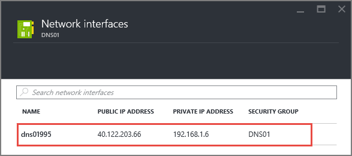
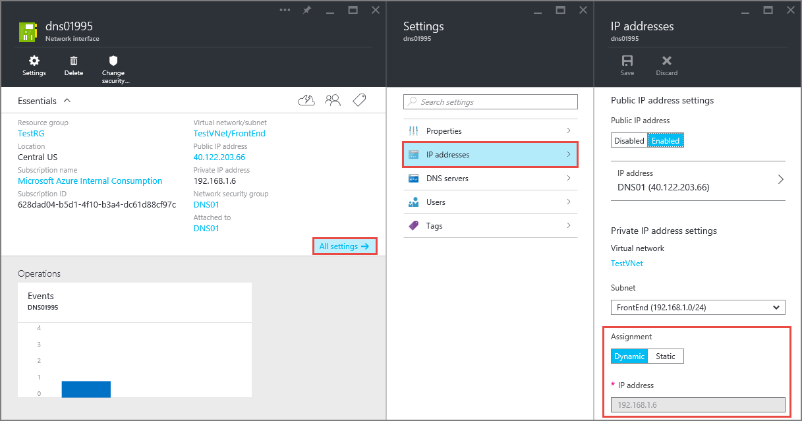
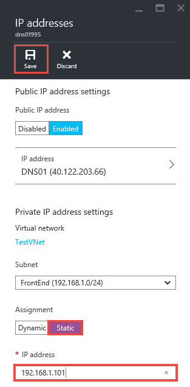

# 使用 Azure 门户为虚拟机配置专用 IP 地址

> [!div class="op_single_selector"]
> * [Azure 门户](virtual-networks-static-private-ip-arm-pportal.md)
> * [PowerShell](virtual-networks-static-private-ip-arm-ps.md)
> * [Azure CLI](virtual-networks-static-private-ip-arm-cli.md)
> * [Azure 门户（经典）](virtual-networks-static-private-ip-classic-pportal.md)
> * [PowerShell（经典）](virtual-networks-static-private-ip-classic-ps.md)
> * [Azure CLI（经典）](virtual-networks-static-private-ip-classic-cli.md)

[!INCLUDE [virtual-networks-static-private-ip-intro-include](../../includes/virtual-networks-static-private-ip-intro-include.md)]

[!INCLUDE [azure-arm-classic-important-include](../../includes/azure-arm-classic-important-include.md)]

本文介绍 Resource Manager 部署模型。 还可以[管理经典部署模型中的静态专用 IP 地址](virtual-networks-static-private-ip-classic-pportal.md)。

[!INCLUDE [virtual-networks-static-ip-scenario-include](../../includes/virtual-networks-static-ip-scenario-include.md)]

需要已创建一个简单的环境才能执行以下示例步骤。 如果想要运行本文档中所显示的步骤，首先需要生成[创建 Vnet](virtual-networks-create-vnet-arm-pportal.md) 中所述的测试环境。

## 如何创建用于测试静态专用 IP 地址的 VM
在 Resource Manager 部署模型中创建 VM 时，不能使用 Azure 门户设置静态专用 IP 地址。 必须先创建 VM，然后再将其专用 IP 设置为静态。

若要在名为 TestVNet 的 VNet 的前端子网中创建名为 DNS01 的 VM，请按以下步骤操作：

1. 从浏览器导航到 http://portal.azure.cn，并在必要时用 Azure 帐户登录。
2. 单击“创建资源” > “计算” > “Windows Server 2012 R2 数据中心”，确认“选择部署模型”列表已显示“资源管理器”，然后单击“创建”，如下图所示。

    
3. 在“基本信息”窗格中，输入要创建的 VM 的名称（在此方案中为DNS01）、本地管理员帐户和密码，如下图所示。

    
4. 请确保所选“位置”为“中国北部”，并在“资源组”下单击“选择现有项”，接着依次单击“资源组”、“TestRG”和“确定”。

    
5. 在“选择大小”窗格中，选择“A1 标准”，然后单击“选择”。

        
6. 在“设置”窗格中，确保属性设置为以下值，然后单击“确定”。

    -**存储帐户**：*vnetstorage*

   * **网络**：*TestVNet*
   * **子网**：*FrontEnd*

          
7. 在“摘要”窗格中，单击“确定”。 请注意，以下磁贴会显示在仪表板中。

    

## 如何检索 VM 的静态专用 IP 地址信息
若要查看使用以上步骤创建的 VM 的静态专用 IP 地址信息，请执行以下步骤。

1. 在 Azure 门户中，单击“全部浏览” > “虚拟机” > “DNS01” > “所有设置” > “网络接口”，然后单击所列出的唯一网络接口。

    
2. 在“网络接口”窗格中，单击“所有设置” > “IP 地址”并几下“分配”和“IP 地址”值。

    

## 如何将静态专用 IP 地址添加到现有 VM
要将静态专用 IP 地址添加到使用上面步骤创建的 VM 中，请按照以下步骤操作：

1. 从上面所示的“IP 地址”窗格中，单击“分配”下的“静态”。
2. 键入 *192.168.1.101* 作为“**IP 地址**”，并单击“**保存**”。

    

> [!NOTE]
> 单击“保存”后，如果注意到分配仍设置为“动态”，则表示你键入的 IP 地址已被使用。 请尝试其他 IP 地址。
> 
> 

## 如何从 VM 中删除静态专用 IP 地址
若要从上面创建的 VM 中删除静态专用 IP 地址，请完成以下步骤：

从上面所示的“IP 地址”窗格中，单击“分配”下的“动态”，然后单击“保存”。

## 后续步骤
* 了解[保留公共 IP](virtual-networks-reserved-public-ip.md) 地址。
* 了解[实例层级公共 IP (ILPIP) 地址](virtual-networks-instance-level-public-ip.md)。
* 查阅[保留 IP REST API](https://msdn.microsoft.com/library/azure/dn722420.aspx)。

<!-- Update_Description: update meta properties, wording update -->