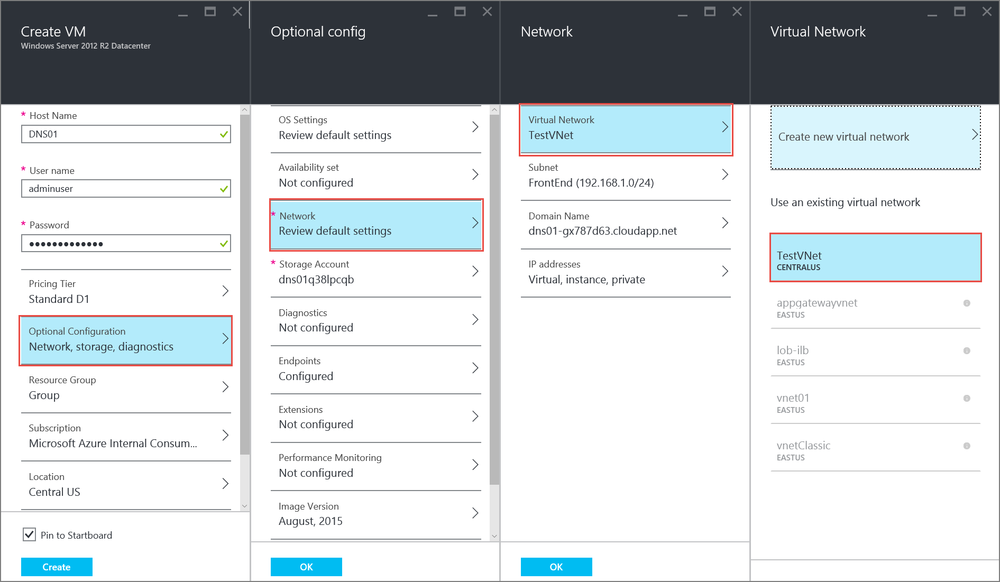
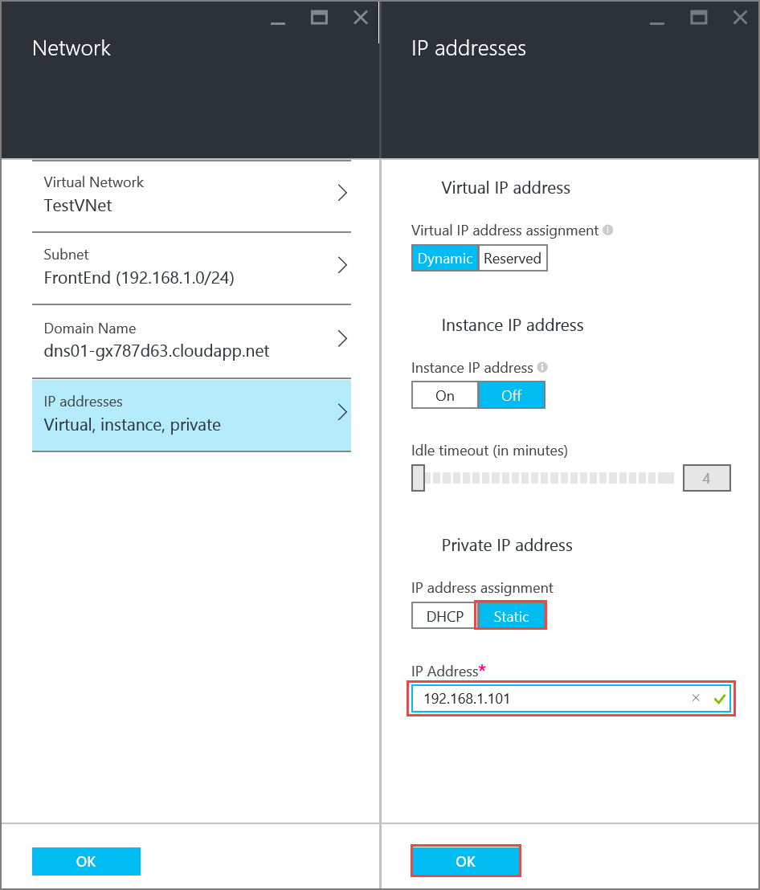
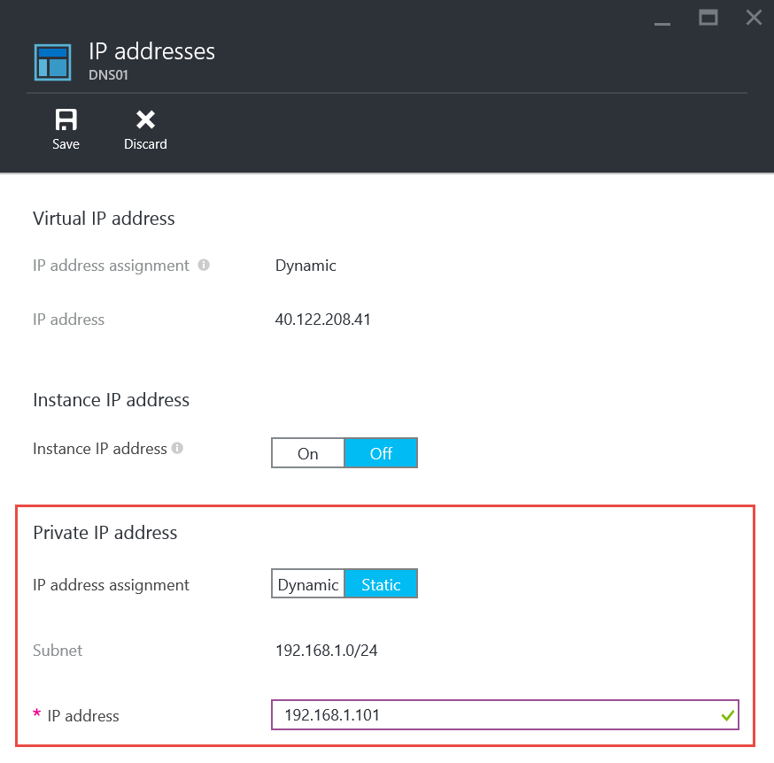

# 使用 Azure 门户为虚拟机（经典）配置专用 IP 地址

[!INCLUDE [virtual-networks-static-private-ip-selectors-classic-include](../../includes/virtual-networks-static-private-ip-selectors-classic-include.md)]

[!INCLUDE [virtual-networks-static-private-ip-intro-include](../../includes/virtual-networks-static-private-ip-intro-include.md)]

[!INCLUDE [azure-arm-classic-important-include](../../includes/azure-arm-classic-important-include.md)]

本文介绍经典部署模型。 还可以[在 Resource Manager 部署模型中管理静态专用 IP 地址](virtual-networks-static-private-ip-arm-pportal.md)。

[!INCLUDE [virtual-networks-static-ip-scenario-include](../../includes/virtual-networks-static-ip-scenario-include.md)]

后面的示例步骤需要一个已创建的简单环境。 如果想要运行本文档中所显示的步骤，首先需要生成[创建 Vnet](virtual-networks-create-vnet-classic-pportal.md) 中所述的测试环境。

## 如何在创建 VM 时指定静态专用 IP 地址
若要在名为 *TestVNet* 的 VNet 的 *FrontEnd* 子网中使用静态专用 IP *192.168.1.101* 创建名为 *DNS01* 的 VM，请完成以下步骤：

1. 在浏览器中导航到 https://portal.azure.cn，并在必要时使用 Azure 帐户登录。
2. 选择“新建” > “计算” > “Windows Server 2012 R2 Datacenter”（注意“选择部署模型”列表已显示“经典”），然后选择“创建”。

    
3. 在“创建 VM”下，输入要创建的 VM 的名称（在此方案中为 *DNS01*）、本地管理员帐户和密码。

    
4. 选择“可选配置” > “网络” > “虚拟网络”，然后选择“TestVNet”。 如果 **TestVNet** 不可用，请确保你使用的位置为“华北”，并已创建本文开头所述的测试环境。

    
5. 在“网络”下，确保当前选定的子网为“FrontEnd”，选择“IP 地址”，在“IP 地址分配”下选择“静态”，并输入 *192.168.1.101* 作为“IP 地址”，如下所示。

        
6. 在“IP 地址”下选择“确定”，在“网络”下选择“确定”，然后在“可选配置”下选择“确定”。
7. 在“创建 VM”下，选择“创建”。 注意，以下磁贴会显示在仪表板中：

    

## 如何检索 VM 的静态专用 IP 地址信息
若要查看使用以上步骤创建的 VM 的静态专用 IP 地址信息，请执行以下步骤。

1. 在 Azure 门户中，选择“浏览全部” > “虚拟机（经典）” > “DNS01” > “所有设置” > “IP 地址”，并请注意如下所示的 IP 地址分配和 IP 地址。

    

## 如何从 VM 中删除静态专用 IP 地址

在“IP 地址”下，在“IP 地址分配”右侧选择“动态”，选择“保存”，然后选择“是”，如下图中所示：

    

## 如何将静态专用 IP 地址添加到现有 VM

1. 在前面显示的“IP 地址”下，在“IP 地址分配”右侧选择“静态”。
2. 对于“IP 地址”，键入 *192.168.1.101*，选择“保存”，然后选择“是”。

## 在操作系统中设置 IP 地址

我们建议，除非有必要，否则不要以静态方式在 VM 的操作系统中分配已分配给 Azure 虚拟机的专用 IP。 如果确实需要在操作系统中手动设置该专用 IP 地址，请确保它是分配给 Azure VM 的同一专用 IP 地址，否则可能会丢失与虚拟机的连接。 切勿在虚拟机的操作系统中手动分配已分配给 Azure 虚拟机的公共 IP 地址。

## 后续步骤
* 了解[保留公共 IP](virtual-networks-reserved-public-ip.md) 地址。
* 了解[实例层级公共 IP (ILPIP) 地址](virtual-networks-instance-level-public-ip.md)。
* 查阅[保留 IP REST API](https://msdn.microsoft.com/library/azure/dn722420.aspx)。
<!--Update_Description: wording update, update reference link-->