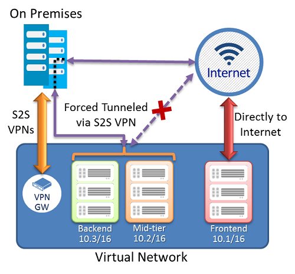

# <a name="configure-forced-tunneling-using-the-azure-resource-manager-deployment-model"></a>使用 Azure Resource Manager 部署模型配置强制隧道

借助强制隧道，可以通过站点到站点 VPN 隧道，将全部 Internet 绑定流量重定向或“强制”返回到本地位置，以进行检查和审核。 这是很多企业 IT 策略的关键安全要求。 没有强制隧道，来自 Azure 中 VM 的 Internet 绑定流量会始终通过 Azure 网络基础结构直接连接到 Internet。如果没有该选项，则无法对流量进行检查或审核。 未经授权的 Internet 访问可能会导致信息泄漏或其他类型的安全漏洞。

[!INCLUDE [vpn-gateway-clasic-rm](../../includes/vpn-gateway-classic-rm-include.md)] 

本文将演示如何配置使用资源管理器部署模型创建的虚拟网络的强制隧道。 强制隧道可以使用 PowerShell（不通过门户）来配置。 如果想要配置用于经典部署模型的强制隧道，请通过下面的下拉列表选择与经典模型相关的文章：

> [!div class="op_single_selector"]
> * [PowerShell - 经典](vpn-gateway-about-forced-tunneling.md)
> * [PowerShell - Resource Manager](vpn-gateway-forced-tunneling-rm.md)
> 
> 

## <a name="about-forced-tunneling"></a>关于强制隧道

下图说明了强制隧道的工作方式。 



在上面的示例中，前端子网没有使用强制隧道。 前端子网中的工作负载可以继续直接接受并响应来自 Internet 的客户请求。 中间层和后端子网会使用强制隧道。 任何从这两个子网到 Internet 的出站连接都会通过一个 S2S VPN 隧道重定向或强制返回到本地站点。

这样，在继续支持所需的多层服务体系结构的同时，可以限制并检查来自虚拟机或 Azure 云服务的 Internet 访问。 如果在虚拟网络中没有面向 Internet 的工作负荷，也能对整个虚拟网络应用强制隧道。

## <a name="requirements-and-considerations"></a>要求和注意事项

在 Azure 中，通过虚拟网络用户定义路由配置强制隧道。 将流量重定向到本地站点，这是 Azure VPN 网关的默认路由。 有关用户定义路由和虚拟网络的详细信息，请参阅[用户定义路由和 IP 转发](../virtual-network/virtual-networks-udr-overview.md)。

- 每个虚拟网络子网具有内置的系统路由表。 系统路由表具有以下三组路由：
  
  - 本地 VNet 路由：直接路由到同一个虚拟网络中的目标 VM。
  - 本地路由：路由到 Azure VPN 网关。
  - **默认路由：** 直接路由到 Internet。 如果要将数据包发送到不包含在前面两个路由中的专用 IP 地址，数据包会被删除。
- 此过程使用用户定义路由 (UDR) 来创建路由表以添加默认路由，并将路由表关联到 VNet 子网，在这些子网中启用强制隧道。
- 强制隧道必须关联到具有基于路由的 VPN 网关的 VNet。 需要在连接到虚拟网络的跨界本地站点中，设置一个“默认站点”。 此外，必须使用 0.0.0.0/0 作为流量选择器配置本地 VPN 设备。 
- ExpressRoute 强制隧道不是通过此机制配置的，而是通过 ExpressRoute BGP 对等会话播发默认路由来启用的。 有关详细信息，请参阅 [ExpressRoute 文档](https://www.azure.cn/home/features/expressroute/)。

## <a name="configuration-overview"></a>配置概述

以下过程可帮助创建资源组和 VNet。 然后，将创建 VPN 网关，并配置强制隧道。 在本过程中，虚拟网络“MultiTier-VNet”具有三个子网：“Frontend”、“Midtier”和“Backend”，并且具有四个跨界连接：一个“DefaultSiteHQ”和三个“Branches”。

以下过程步骤将“DefaultSiteHQ”设置为使用强制隧道的默认站点连接，并将“Midtier”和“Backend”子网配置为使用强制隧道。

## <a name="before"></a>准备工作

安装最新版本的 Azure Resource Manager PowerShell cmdlet。 有关安装 PowerShell cmdlet 的详细信息，请参阅 [如何安装和配置 Azure PowerShell](https://docs.microsoft.com/powershell/azure/overview) 。

> [!IMPORTANT]
> 需要安装 PowerShell cmdlet 的最新版本。 否则，运行某些 cmdlet 时可能会收到验证错误。
>
>

### <a name="to-log-in"></a>登录

[!INCLUDE [To log in](../../includes/vpn-gateway-ps-login-include.md)]

## <a name="configure-forced-tunneling"></a>配置强制隧道

> [!NOTE]
> 可能会看到警告“将在未来发布中修改此 cmdlet 的输出对象类型”。 这是预期行为，可以放心地忽略这些警告。
>
>


1. 创建资源组。

  ```powershell
  New-AzureRmResourceGroup -Name 'ForcedTunneling' -Location 'China North'
  ```
2. 创建虚拟网络并指定子网。

  ```powershell 
  $s1 = New-AzureRmVirtualNetworkSubnetConfig -Name "Frontend" -AddressPrefix "10.1.0.0/24"
  $s2 = New-AzureRmVirtualNetworkSubnetConfig -Name "Midtier" -AddressPrefix "10.1.1.0/24"
  $s3 = New-AzureRmVirtualNetworkSubnetConfig -Name "Backend" -AddressPrefix "10.1.2.0/24"
  $s4 = New-AzureRmVirtualNetworkSubnetConfig -Name "GatewaySubnet" -AddressPrefix "10.1.200.0/28"
  $vnet = New-AzureRmVirtualNetwork -Name "MultiTier-VNet" -Location "China North" -ResourceGroupName "ForcedTunneling" -AddressPrefix "10.1.0.0/16" -Subnet $s1,$s2,$s3,$s4
  ```
3. 创建本地网络网关。

  ```powershell
  $lng1 = New-AzureRmLocalNetworkGateway -Name "DefaultSiteHQ" -ResourceGroupName "ForcedTunneling" -Location "China North" -GatewayIpAddress "111.111.111.111" -AddressPrefix "192.168.1.0/24"
  $lng2 = New-AzureRmLocalNetworkGateway -Name "Branch1" -ResourceGroupName "ForcedTunneling" -Location "China North" -GatewayIpAddress "111.111.111.112" -AddressPrefix "192.168.2.0/24"
  $lng3 = New-AzureRmLocalNetworkGateway -Name "Branch2" -ResourceGroupName "ForcedTunneling" -Location "China North" -GatewayIpAddress "111.111.111.113" -AddressPrefix "192.168.3.0/24"
  $lng4 = New-AzureRmLocalNetworkGateway -Name "Branch3" -ResourceGroupName "ForcedTunneling" -Location "China North" -GatewayIpAddress "111.111.111.114" -AddressPrefix "192.168.4.0/24"
  ```
4. 创建路由表和路由规则。

  ```powershell
  New-AzureRmRouteTable -Name "MyRouteTable" -ResourceGroupName "ForcedTunneling" -Location "China North"
  $rt = Get-AzureRmRouteTable -Name "MyRouteTable" -ResourceGroupName "ForcedTunneling" 
  Add-AzureRmRouteConfig -Name "DefaultRoute" -AddressPrefix "0.0.0.0/0" -NextHopType VirtualNetworkGateway -RouteTable $rt
  Set-AzureRmRouteTable -RouteTable $rt
  ```
5. 将路由表与“中间层”子网和“后端”子网关联起来。

  ```powershell
  $vnet = Get-AzureRmVirtualNetwork -Name "MultiTier-Vnet" -ResourceGroupName "ForcedTunneling"
  Set-AzureRmVirtualNetworkSubnetConfig -Name "MidTier" -VirtualNetwork $vnet -AddressPrefix "10.1.1.0/24" -RouteTable $rt
  Set-AzureRmVirtualNetworkSubnetConfig -Name "Backend" -VirtualNetwork $vnet -AddressPrefix "10.1.2.0/24" -RouteTable $rt
  Set-AzureRmVirtualNetwork -VirtualNetwork $vnet
  ```
6. 创建虚拟网络网关。 此步骤需要一些时间才能完成，有时需要 45 分钟或更长时间，因为需要创建和配置网关。 如果看到与 GatewaySKU 值相关的 ValidateSet 问题，请验证是否已安装[最新版本的 PowerShell cmdlet](#before)。 最新版本的 PowerShell cmdlet 包含最新网关 SKU 的新验证值。

  ```powershell
  $pip = New-AzureRmPublicIpAddress -Name "GatewayIP" -ResourceGroupName "ForcedTunneling" -Location "China North" -AllocationMethod Dynamic
  $gwsubnet = Get-AzureRmVirtualNetworkSubnetConfig -Name "GatewaySubnet" -VirtualNetwork $vnet
  $ipconfig = New-AzureRmVirtualNetworkGatewayIpConfig -Name "gwIpConfig" -SubnetId $gwsubnet.Id -PublicIpAddressId $pip.Id
  New-AzureRmVirtualNetworkGateway -Name "Gateway1" -ResourceGroupName "ForcedTunneling" -Location "China North" -IpConfigurations $ipconfig -GatewayType Vpn -VpnType RouteBased -GatewaySku VpnGw1 -EnableBgp $false
  ```
7. 将默认站点分配到虚拟网络网关。 **-GatewayDefaultSite** 是允许强制路由配置进行工作的 cmdlet 参数，因此请注意正确配置此设置。 

  ```powershell
  $LocalGateway = Get-AzureRmLocalNetworkGateway -Name "DefaultSiteHQ" -ResourceGroupName "ForcedTunneling"
  $VirtualGateway = Get-AzureRmVirtualNetworkGateway -Name "Gateway1" -ResourceGroupName "ForcedTunneling"
  Set-AzureRmVirtualNetworkGatewayDefaultSite -GatewayDefaultSite $LocalGateway -VirtualNetworkGateway $VirtualGateway
  ```
8. 建立站点到站点 VPN 连接。

  ```powershell
  $gateway = Get-AzureRmVirtualNetworkGateway -Name "Gateway1" -ResourceGroupName "ForcedTunneling"
  $lng1 = Get-AzureRmLocalNetworkGateway -Name "DefaultSiteHQ" -ResourceGroupName "ForcedTunneling" 
  $lng2 = Get-AzureRmLocalNetworkGateway -Name "Branch1" -ResourceGroupName "ForcedTunneling" 
  $lng3 = Get-AzureRmLocalNetworkGateway -Name "Branch2" -ResourceGroupName "ForcedTunneling" 
  $lng4 = Get-AzureRmLocalNetworkGateway -Name "Branch3" -ResourceGroupName "ForcedTunneling" 
    
  New-AzureRmVirtualNetworkGatewayConnection -Name "Connection1" -ResourceGroupName "ForcedTunneling" -Location "China North" -VirtualNetworkGateway1 $gateway -LocalNetworkGateway2 $lng1 -ConnectionType IPsec -SharedKey "preSharedKey"
  New-AzureRmVirtualNetworkGatewayConnection -Name "Connection2" -ResourceGroupName "ForcedTunneling" -Location "China North" -VirtualNetworkGateway1 $gateway -LocalNetworkGateway2 $lng2 -ConnectionType IPsec -SharedKey "preSharedKey"
  New-AzureRmVirtualNetworkGatewayConnection -Name "Connection3" -ResourceGroupName "ForcedTunneling" -Location "China North" -VirtualNetworkGateway1 $gateway -LocalNetworkGateway2 $lng3 -ConnectionType IPsec -SharedKey "preSharedKey"
  New-AzureRmVirtualNetworkGatewayConnection -Name "Connection4" -ResourceGroupName "ForcedTunneling" -Location "China North" -VirtualNetworkGateway1 $gateway -LocalNetworkGateway2 $lng4 -ConnectionType IPsec -SharedKey "preSharedKey"
    
  Get-AzureRmVirtualNetworkGatewayConnection -Name "Connection1" -ResourceGroupName "ForcedTunneling"
  ```

<!--Update_Description: wording update --> 