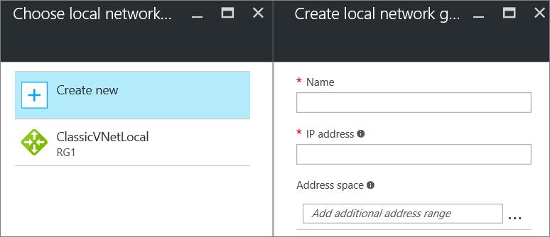

# 将站点到站点连接添加到包含现有 VPN 网关连接的 VNet

> [!div class="op_single_selector"]
> * [Azure 门户](vpn-gateway-howto-multi-site-to-site-resource-manager-portal.md)
> * [PowerShell（经典）](vpn-gateway-multi-site.md)
>
> 

本文可帮助你通过 Azure 门户将站点到站点 (S2S) 连接添加到现已具有连接的 VPN 网关。 这种类型的连接通常称为“多站点”配置。 可将 S2S 连接添加到已有 S2S 连接、点到站点连接或 VNet 到 VNet 连接的 VNet。 添加连接时，请注意一些限制。 在开始之前，请查看本文的 [开始之前](#before) 部分检查配置。 

本文适用于具有基于路由的 VPN 网关的资源管理器 VNet。 本文中的步骤不适用于 ExpressRoute/站点到站点共存连接配置。 有关共存连接的信息，请参阅 [ExpressRoute/S2S 共存连接](../expressroute/expressroute-howto-coexist-resource-manager.md)。

### 部署模型和方法
[!INCLUDE [vpn-gateway-classic-rm](../../includes/vpn-gateway-classic-rm-include.md)]

当我们发布有关此配置的新文章和其他可用工具时，会更新此表格。 有相关的文章发布时，我们会直接从此表格链接到该文章。

[!INCLUDE [vpn-gateway-table-multi-site](../../includes/vpn-gateway-table-multisite-include.md)]

## 准备工作
确认以下各项：

- 创建的不是 ExpressRoute/S2S 共存连接。
- 有一个使用 Resource Manager 部署模型创建的、包含现有连接的虚拟网络。
- VNet 的虚拟网络网关是 RouteBased 类型。 如果使用 PolicyBased VPN 网关，必须先删除虚拟网络网关，然后创建新的 RouteBased VPN 网关。
- 此 VNet 连接到的任何 VNet 都不存在地址范围重叠的情况。
- 有一台兼容的 VPN 设备，并且可对其进行配置。 请参阅 [关于 VPN 设备](vpn-gateway-about-vpn-devices.md)。 如果不熟悉 VPN 设备的配置，或者不熟悉本地网络配置中的 IP 地址范围，请咨询能够提供此类详细信息的人员。
- VPN 设备有一个面向外部的公共 IP 地址。 此 IP 地址不得位于 NAT 之后。

## 第 1 部分 - 配置连接
1. 从浏览器导航到 [Azure 门户](http://portal.azure.cn)，并在必要时用 Azure 帐户登录。
2. 单击“所有资源”，从资源列表中找到“虚拟网络网关”并单击它。
3. 在“虚拟网络网关”页面上，单击“连接”。
   
     
4. 在“连接”页面上，单击“+添加”。
   
     
5. 在“添加连接”页面上，填写以下字段：
   
   - **名称：** 想与其建立连接的站点的名称。
   - **连接类型：** 选择“站点到站点(IPsec)”。
     
      

## 第 2 部分 - 添加本地网络网关
1. 单击“本地网络网关”>“选择本地网络网关”。 这将打开“选择本地网络网关”页面。
   
     
2. 单击“新建”，打开“创建本地网络网关”页面。
   
     
3. 在“创建本地网络网关”页面上，填写以下字段：
   
   - **名称：** 要分配给本地网络网关资源的名称。
   - **IP 地址：** 站点上要连接到的 VPN 设备的公共 IP 地址。
   - **地址空间：** 要路由到新本地网络站点的地址空间。
4. 在“创建本地网络网关”页面上单击“确定”保存所做更改。

## 第 3 部分 - 添加共享密钥并创建连接
1. 在“添加连接”页面上，添加要用于创建连接的共享密钥。 可以从 VPN 设备获取共享密钥，或者在此边栏选项卡中创建一个共享密钥，并将 VPN 设备配置为使用这个共享密钥。 重要的一点是，这两个密钥必须完全相同。
   
     
2. 在页面底部，单击“确定”以创建连接。

## 第 4 部分 - 验证 VPN 连接

[!INCLUDE [vpn-gateway-verify-connection-ps-rm](../../includes/vpn-gateway-verify-connection-ps-rm-include.md)]

## 后续步骤

连接完成后，即可将虚拟机添加到虚拟网络。 有关详细信息，请参阅虚拟机 [学习路径](https://azure.microsoft.com/documentation/learning-paths/virtual-machines) 。

<!--Update_Description: wording update -->