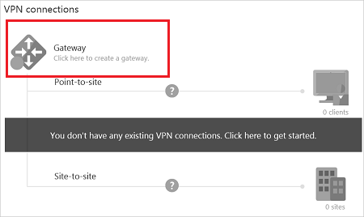
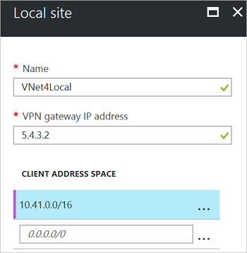
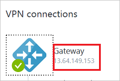
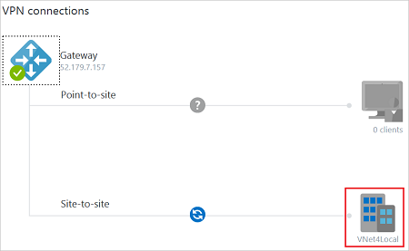
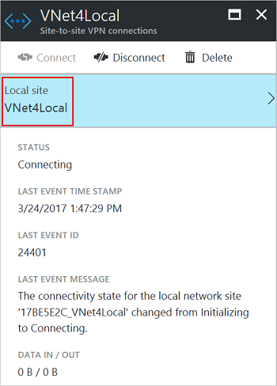
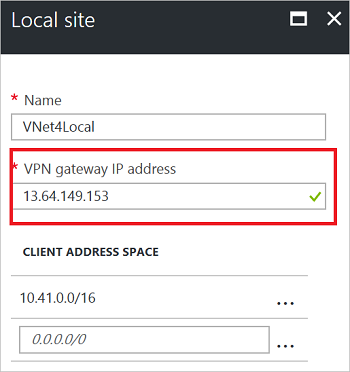

# <a name="configure-a-vnet-to-vnet-connection-classic"></a>配置 VNet 到 VNet 连接（经典）

[!INCLUDE [deployment models](../../includes/vpn-gateway-classic-deployment-model-include.md)]

本文介绍如何在虚拟网络之间创建 VPN 网关连接。 虚拟网络可以位于相同或不同的区域中。 本文中的步骤适用于经典部署模型和 Azure 门户。 也可使用不同的部署工具或部署模型创建此配置，方法是从以下列表中选择另一选项：

> [!div class="op_single_selector"]
> * [Azure 门户](vpn-gateway-howto-vnet-vnet-resource-manager-portal.md)
> * [PowerShell](vpn-gateway-vnet-vnet-rm-ps.md)
> * [Azure CLI](vpn-gateway-howto-vnet-vnet-cli.md)
> * [Azure 门户（经典）](vpn-gateway-howto-vnet-vnet-portal-classic.md)
> * [连接不同的部署模型 - Azure 门户](vpn-gateway-connect-different-deployment-models-portal.md)
> * [连接不同的部署模型 - PowerShell](vpn-gateway-connect-different-deployment-models-powershell.md)
>
>


[!INCLUDE [updated-for-az](../../includes/updated-for-az.md)]

## <a name="about-vnet-to-vnet-connections"></a>关于 VNet 到 VNet 的连接

在经典部署模型中使用 VPN 网关将一个虚拟网络连接到另一个虚拟网络（VNet 到 VNet）类似于将虚拟网络连接到本地站点位置。 这两种连接类型都使用 VPN 网关来提供使用 IPsec/IKE 的安全隧道。

连接的 VNet 可位于不同的区域中。 可以将 VNet 到 VNet 通信与多站点配置组合使用。 这样，便可以建立将跨界连接与虚拟网络间连接相结合的网络拓扑。


### <a name="why"></a>为什么连接虚拟网络？

你可能会出于以下原因而连接虚拟网络：

* **跨区域地域冗余和地域存在**

  * 可以使用安全连接设置自己的异地复制或同步，而无需借助于面向 Internet 的终结点。
  * 使用 Azure 负载均衡器和 Microsoft 或第三方群集技术，可以设置支持跨多个 Azure 区域实现地域冗余的高可用性工作负荷。 一个重要的示例就是对分布在多个 Azure 区域中的可用性组设置 SQL Always On。
* **具有强大隔离边界的区域多层应用程序**

  * 在同一区域中，可以设置具有多个 VNet 的多层应用程序，这些虚拟网络相互连接在一起，但同时又能保持强大的隔离性，而且还能进行安全的层间通信。

有关 VNet 到 VNet 连接的详细信息，请参阅本文末尾的 [VNet 到 VNet 注意事项](#faq)。

### <a name="before-you-begin"></a>准备阶段

开始本练习之前，请下载和安装最新版本的 Azure 服务管理 (SM) PowerShell cmdlet。 有关详细信息，请参阅[如何安装和配置 Azure PowerShell](https://docs.microsoft.com/powershell/azure/overview)。 使用门户即可执行大部分步骤，但必须使用 PowerShell 创建 VNet 之间的连接。 无法使用 Azure 门户创建此连接。

## <a name="plan"></a>步骤 1 - 规划 IP 地址范围

必须确定要用于配置虚拟网络的范围。 对于此配置，必须确保 VNet 的范围不互相重叠，也不与它们连接到的任何本地网络重叠。

下表显示有关如何定义 VNet 的示例。 其中的范围仅供参考。 请记下虚拟网络的范围。 后面的步骤需要用到此信息。

**示例**

| 虚拟网络 | 地址空间 | 区域 | 连接到本地网络站点 |
|:--- |:--- |:--- |:--- |
| TestVNet1 |TestVNet1<br>(10.11.0.0/16)<br>(10.12.0.0/16) |中国北部 |VNet4Local<br>(10.41.0.0/16)<br>(10.42.0.0/16) |
| TestVNet4 |TestVNet4<br>(10.41.0.0/16)<br>(10.42.0.0/16) |中国北部 |VNet1Local<br>(10.11.0.0/16)<br>(10.12.0.0/16) |

## <a name="vnetvalues"></a>步骤 2 - 创建虚拟网络

在 [Azure 门户](https://portal.azure.cn)中创建两个虚拟网络。 有关创建经典虚拟网络的步骤，请参阅[创建经典虚拟网络](../virtual-network/virtual-networks-create-vnet-classic-pportal.md)。 

使用门户创建经典虚拟网络时，必须通过执行以下步骤导航到“虚拟网络”页面，否则不会显示用于创建经典虚拟网络的选项：

1. 单击“+”打开“新建”页面。
2. 在“在市场中搜索”字段中，键入“虚拟网络”。 如果改为选择“网络”->“虚拟网络”，则不会显示用于创建经典 VNet 的选项。
3. 从返回的列表中找到“虚拟网络”，单击它打开“虚拟网络”页面。 
4. 在“虚拟网络”页面上，选择“经典”以创建经典 VNet。 

如果使用本文进行练习，可以使用以下示例值：

**用于 TestVNet1 的值**

姓名：TestVNet1<br>
地址空间：10.11.0.0/16, 10.12.0.0/16（可选）<br>
子网名称：默认值<br>
子网地址范围：10.11.0.1/24<br>
资源组：ClassicRG<br>
位置：中国北部<br>
GatewaySubnet：10.11.1.0/27

**用于 TestVNet4 的值**

姓名：TestVNet4<br>
地址空间：10.41.0.0/16, 10.42.0.0/16（可选）<br>
子网名称：默认值<br>
子网地址范围：10.41.0.1/24<br>
资源组：ClassicRG<br>
位置：中国北部<br>
GatewaySubnet：10.41.1.0/27

**创建 VNet 时，请注意以下设置：**

* **虚拟网络地址空间** - 在“虚拟网络地址空间”页上，指定要用于虚拟网络的地址范围。 这些都是动态 IP 地址，将分配给部署到此虚拟网络的 VM 和其他角色实例。<br>所选地址空间不能与任何其他 VNet 的地址空间重叠，也不能与此 VNet 要连接到的本地位置的地址空间重叠。

* **位置** - 创建虚拟网络时，请将其与某个 Azure 位置（区域）相关联。 例如，如果希望部署到虚拟网络的 VM 的物理位置位于中国北部，请选择该位置。 创建虚拟网络后，无法更改与该虚拟网络关联的位置。

**创建 VNet 后，可以添加以下设置：**

* **地址空间** - 此配置不需要额外的地址空间，但可以在创建 VNet 后添加额外的地址空间。

* **子网** - 此配置不需要额外的子网，但可能需要让 VM 位于不同于其他角色实例的子网中。

* **DNS 服务器** - 输入 DNS 服务器名称和 IP 地址。 此设置不创建 DNS 服务器。 此设置允许指定要用于对此虚拟网络进行名称解析的 DNS 服务器。

在本部分，你将配置连接类型、本地站点并创建网关。

## <a name="localsite"></a>步骤 3 - 配置本地站点

Azure 使用在每个本地网络站点中指定的设置来确定如何在 VNet 之间路由流量。 每个 VNet 都必须指向要将流量路由到的相应本地网络。 如果需要使用名称来引用每个本地网络站点，由你来决定该名称。 最好使用描述性文本。

例如，TestVNet1 连接到所创建的名为“VNet4Local”的本地网络站点。 VNet4Local 的设置包含 TestVNet4 的地址前缀。

每个 VNet 的本地站点是另一个 VNet。 配置使用以下示例值：

| 虚拟网络 | 地址空间 | 区域 | 连接到本地网络站点 |
|:--- |:--- |:--- |:--- |
| TestVNet1 |TestVNet1<br>(10.11.0.0/16)<br>(10.12.0.0/16) |中国北部 |VNet4Local<br>(10.41.0.0/16)<br>(10.42.0.0/16) |
| TestVNet4 |TestVNet4<br>(10.41.0.0/16)<br>(10.42.0.0/16) |中国北部 |VNet1Local<br>(10.11.0.0/16)<br>(10.12.0.0/16) |

1. 在 Azure 门户中找到 TestVNet1。 在页面的“VPN 连接”部分，单击“网关”。  

    
2. 在“新建 VPN 连接”页上，选择“站点到站点”。  
3. 单击“本地站点”，打开“本地站点”页并配置设置。 
4. 在“本地站点”页上，为本地站点命名。  在示例中，请将本地站点命名为“VNet4Local”。
5. 对于“VPN 网关 IP 地址”，可以使用所需的任何 IP 地址，只要它采用有效格式即可。  通常，应该使用 VPN 设备的实际外部 IP 地址。 但是，对于经典 VNet 到 VNet 配置，请使用分配给 VNet 的网关的公共 IP 地址。 考虑到尚未创建该虚拟网关，因此，可以指定任何有效的公共 IP 地址作为占位符。<br>请勿将此项留空 - 就此配置来说，此项不是可选项。 稍后将返回到这些设置，使用 Azure 生成的相应虚拟网络网关 IP 地址对其进行配置。
6. 对于“客户端地址空间”，使用另一 VNet 的地址空间。  请参考规划示例。 单击“确定”以保存设置并返回到“新建 VPN 连接”页面。  

    

## <a name="gw"></a>步骤 4 - 创建虚拟网关

每个虚拟网络都必须有一个虚拟网关。 虚拟网关对流量进行路由和加密。

1. 在“新建 VPN 连接”  页上，选中“立即创建网关”复选框  。
2. 单击“子网、大小和路由类型”。  在“网关配置”页上，单击“子网”。  
3. 网关子网名称自动以所需的名称“GatewaySubnet”进行填充。  “地址范围”包含分配给 VPN 网关服务的 IP 地址。 某些配置允许使用网关子网 /29，但最好使用 /28 或 /27 以适应将来可能需要为网关服务使用更多 IP 地址的配置。 在示例设置中，我们使用了 10.11.1.0/27。 调整地址空间，然后单击“确定”。 
4. 配置“网关大小”。  此设置指的是[网关 SKU](vpn-gateway-about-vpn-gateway-settings.md#gwsku)。
5. 配置“路由类型”。  此配置的路由类型必须为“动态”。  无法在以后更改路由类型，除非删除网关并创建一个新网关。
6. 单击 **“确定”** 。
7. 在“新建 VPN 连接”页上，单击“确定”，开始创建虚拟网络网关   。 创建网关通常需要 45 分钟或更长的时间，具体取决于所选网关 SKU。

## <a name="vnet4settings"></a>步骤 5 - 配置 TestVNet4 设置

重复[创建本地站点](#localsite)和[创建虚拟网关](#gw)中的步骤来配置 TestVNet4，并在必要时对值进行替换。 如果是作为练习执行此操作，请使用[示例值](#vnetvalues)。

## <a name="updatelocal"></a>步骤 6 - 更新本地站点

在为两个 VNet 创建虚拟网关后，必须调整本地站点的 **VPN 网关 IP 地址**值。

|VNet 名称|连接的站点|网关 IP 地址|
|:--- |:--- |:--- |
|TestVNet1|VNet4Local|TestVNet4 的 VPN 网关 IP 地址|
|TestVNet4|VNet1Local|TestVNet1 的 VPN 网关 IP 地址|

### <a name="part-1---get-the-virtual-network-gateway-public-ip-address"></a>第 1 部分 - 获取虚拟网络网关的公共 IP 地址

1. 在 Azure 门户中找到虚拟网络。
2. 单击以打开 VNet“概述”页。  在该页上，在“VPN 连接”中，可以查看虚拟网络网关的 IP 地址。 

   
3. 复制 IP 地址。 下一部分会使用它。
4. 针对 TestVNet4 重复上述步骤

### <a name="part-2---modify-the-local-sites"></a>第 2 部分 - 修改本地站点

1. 在 Azure 门户中找到虚拟网络。
2. 在 VNet“概述”页上，单击本地站点。 

   
3. 在“站点到站点 VPN 连接”页上，单击要修改的本地站点的名称。 

   
4. 单击要修改的**本地站点**。

   
5. 更新“VPN 网关 IP 地址”并单击“确定”以保存设置。  

   
6. 关闭其他页。
7. 针对 TestVNet4 重复上述步骤

## <a name="getvalues"></a>步骤 7 - 从网络配置文件中检索值

在 Azure 门户中创建经典 VNet 时，你看到的名称不是用于 PowerShell 的完整名称。 例如，在门户中命名为 **TestVNet1** 的 VNet 在网络配置文件中可能具有更长的名称。 名称的外观可能如下：**Group ClassicRG TestVNet1**。 在创建连接时，请务必使用在网络配置文件中看到的值。

在下面的步骤中，需连接到 Azure 帐户并下载和查看网络配置文件，以便获取连接所需的值。

1. 下载和安装最新版本的 Azure 服务管理 (SM) PowerShell cmdlet。 有关详细信息，请参阅[如何安装和配置 Azure PowerShell](https://docs.microsoft.com/powershell/azure/overview)。

2. 使用提升的权限打开 PowerShell 控制台，并连接到帐户。 使用下面的示例来帮助连接：

   ```powershell
   Connect-AzAccount -Environment AzureChinaCloud
   ```

   检查该帐户的订阅。

   ```powershell
   Get-AzSubscription
   ```

   如果有多个订阅，请选择要使用的订阅。

   ```powershell
   Select-AzSubscription -SubscriptionName "Replace_with_your_subscription_name"
   ```

   接下来，使用以下 cmdlet 将 Azure 订阅添加到经典部署模型的 PowerShell。

   ```powershell
   Add-AzureAccount -Environment AzureChinaCloud
   ```
3. 导出并查看网络配置文件。 在计算机上创建一个目录，并将网络配置文件导出到该目录。 在此示例中，网络配置文件导出到 **C:\AzureNet**。

   ```powershell
   Get-AzureVNetConfig -ExportToFile C:\AzureNet\NetworkConfig.xml
   ```
4. 使用文本编辑器打开该文件，并查看 VNet 和站点的名称。 会在创建连接时使用这些名称。<br>VNet 名称以 **VirtualNetworkSite name =** 形式列出<br>站点名称以 **LocalNetworkSiteRef name =** 形式列出

## <a name="createconnections"></a>步骤 8 - 创建 VPN 网关连接

完成前面的所有步骤后，即可设置 IPsec/IKE 预共享密钥并创建连接。 这组步骤使用 PowerShell。 无法在 Azure 门户中配置经典部署模型的 VNet 到 VNet 连接。

在示例中，可以看到共享密钥完全相同。 共享的密钥必须始终匹配。 请务必将这些示例中的值替换为 VNet 和本地网络站点的确切名称。

1. 创建 TestVNet1 到 TestVNet4 的连接。

   ```powershell
   Set-AzureVNetGatewayKey -VNetName 'Group ClassicRG TestVNet1' `
   -LocalNetworkSiteName '17BE5E2C_VNet4Local' -SharedKey A1b2C3D4
   ```
2. 创建 TestVNet4 到 TestVNet1 的连接。

   ```powershell
   Set-AzureVNetGatewayKey -VNetName 'Group ClassicRG TestVNet4' `
   -LocalNetworkSiteName 'F7F7BFC7_VNet1Local' -SharedKey A1b2C3D4
   ```
3. 等待连接初始化。 在网关初始化后，状态将变为“成功”。

   ```
   Error          :
   HttpStatusCode : OK
   Id             :
   Status         : Successful
   RequestId      :
   StatusCode     : OK
   ```

## <a name="faq"></a>经典 VNet 的 VNet 到 VNet 注意事项
* 虚拟网络可以在相同或不同的 Azure 区域（位置）中。
* 云服务或负载均衡终结点不能跨虚拟网络，即使它们连接在一起，也是如此。
* 将多个虚拟网络连接在一起不需要任何 VPN 设备。
* VNet 到 VNet 通信支持连接 Azure 虚拟网络。 它不支持连接未部署到虚拟网络的虚拟机或云服务。
* VNet 到 VNet 通信需要动态路由网关。 不支持 Azure 静态路由网关。
* 虚拟网络连接可与多站点 VPN 同时使用。 最多可以将一个虚拟网络 VPN 网关的 10 个 VPN 隧道连接到其他虚拟网络或本地站点。
* 虚拟网络和本地网络站点的地址空间不得重叠。 地址空间重叠将会导致创建虚拟网络或上传 netcfg 配置文件失败。
* 不支持一对虚拟网络之间存在冗余隧道。
* VNet 的所有 VPN 隧道（包括 P2S VPN）共享 VPN 网关上的可用带宽，以及 Azure 中的相同 VPN 网关运行时间 SLA。
* VNet 到 VNet 流量会流经 Azure 主干。

## <a name="next-steps"></a>后续步骤
验证连接。 请参阅[验证 VPN 网关连接](vpn-gateway-verify-connection-resource-manager.md)。

<!--Update_Description: code update --> 