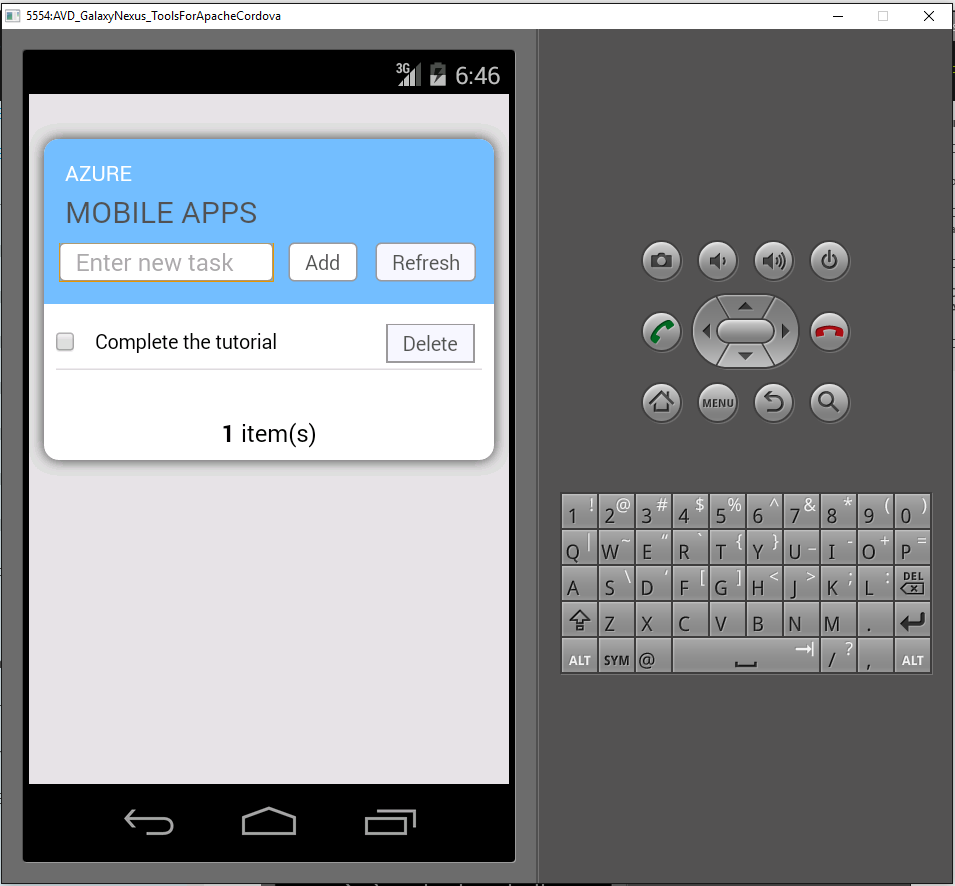

1. 访问 [Azure 门户]。
2. 依次单击“浏览全部”>“移动应用”> 刚创建的后端。
3. 在移动应用设置中，依次单击“快速启动”>“Cordova”。
4. 在“配置客户端应用程序”下，选择“创建新应用”，然后单击“下载”。
2. 将已下载的 ZIP 文件解压到硬盘上的目录，导航到解决方案文件 (.sln)，并使用 Visual Studio 打开。
3. 在 Visual Studio 中，在开始箭头旁边的下拉列表中选择解决方案平台（Android、iOS 或 Windows）。通过单击绿色箭头的下拉列表，选择特定的部署设备或仿真程序。可以使用默认 Android 平台和 Ripple 仿真程序。更高级的教程（例如，推送通知）会要求选择支持的设备或仿真程序。
4. 按 F5 或单击绿色箭头，可生成并运行 Cordova 应用。如果在仿真程序中看到要求访问网络的安全性对话，请接受。
5. 在设备或仿真程序上启动应用后，在“输入新文本”中键入有意义的文本，例如“完成教程”，然后单击“添加”按钮。

后端会将请求中的数据插入 SQL 数据库的 TodoItem 表中，并将新存储项的相关信息返回到移动应用。移动应用会在列表中显示此数据。

  

可以为其他平台重复步骤 3 至 5。

[Azure 门户]: https://portal.azure.cn/

<!---HONumber=Mooncake_0116_2017-->